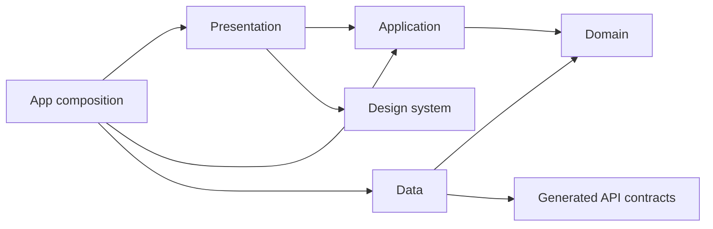
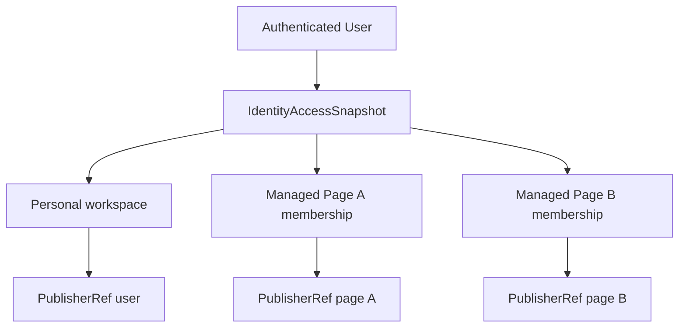
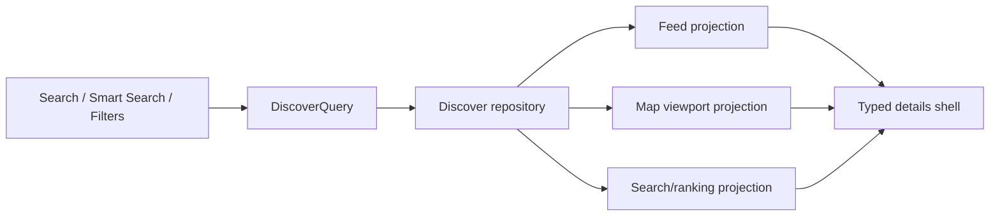
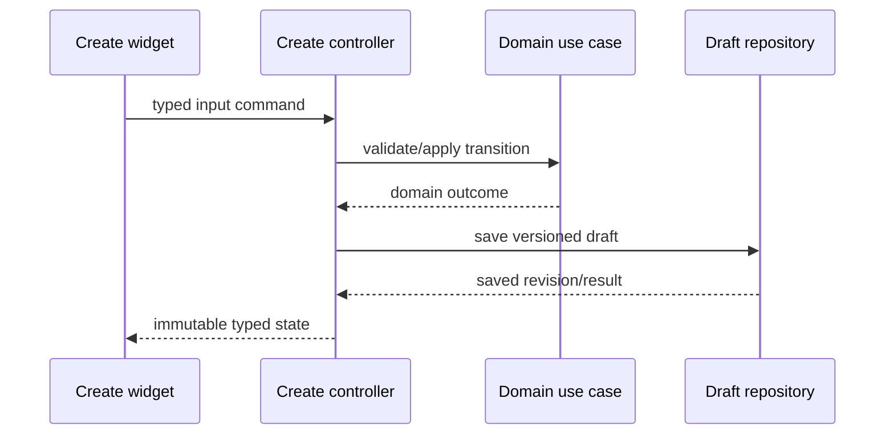
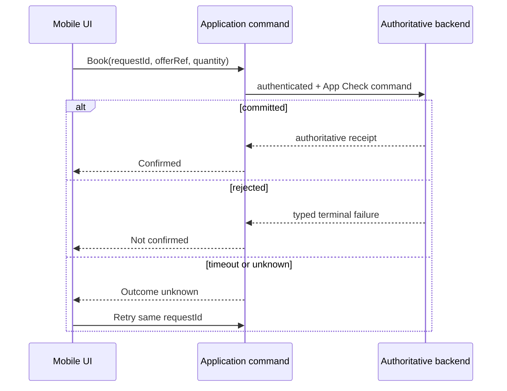

# Recharge Mobile Architecture v3.1

**ID:** MOB-ARCH-REC-01
**Версия:** 3.1
**Дата:** 2026-08-10
**Статус:** **Accepted — canonical mobile target supplement, documentation only**
**Утверждено:** 2026-08-10, Product owner
**Canonical integration:** linked from `ARCHITECTURE_BASELINE.md` on 2026-08-10
**Область:** Flutter-клиент Recharge и его границы с shared contracts/backend
**Runtime effect:** none — документ не меняет приложение, Firebase или production-инфраструктуру

## 0. Статус документа

Это Accepted supplement целевой mobile-архитектуры. Его принятие:

- не заменяет `ARCHITECTURE_BASELINE.md` и Accepted ADR;
- не изменяет `LAUNCH_STATUS.md`;
- не разрешает Firebase, production backend или массовый рефакторинг;
- не переводит планируемые возможности в Done;
- не отменяет обязательные slice-spec, migration, rollback и acceptance gates.

При конфликте действует приоритет: Accepted ADR → spec активного slice →
`LAUNCH_STATUS.md` → этот документ после принятия → product vision.

Эта лестница определяет приоритет mobile-решений. Backend использует собственную
иерархию из BCK-02/BCK-02-A1. Обе иерархии согласуются через Accepted ADR и
contract boundaries, но не объединяются механически в одну общую лестницу.

### 0.1 Review amendments v3.1

После verdict **Accepted with amendments** в revision 3.1 добавлены:

- единый revision/freshness contract для Discover projections;
- граница app-level и feature-level presentation/application;
- явные Library/Favorites/Visit History invariants;
- кроссплатформенный режим boundary gate;
- нейтральный typed outcome `cancelled`;
- обязательная зависимость Money migration M2 → M8;
- fail-closed cache policy для Create descriptors;
- пояснение независимых mobile/backend document hierarchies.

Нумерация acceptance criteria считается стабильным contract surface:
AC-01–AC-60 сохраняют значения revision 3.0, а требования revision 3.1
добавляются только как AC-61–AC-76. После публикации номер нельзя переназначить
другому смыслу; новый критерий добавляется в конец, а supersede/deprecation
фиксируется changelog с явной таблицей соответствия. Slice-spec и тесты должны
ссылаться одновременно на document version и AC ID.

Revision 3.1 финально принята владельцем продукта 2026-08-10. Принятие
фиксирует mobile target architecture, но не изменяет runtime-статусы и не
заменяет отдельный docs-only change для ссылки из frozen baseline.

## 1. Исправления относительно Architecture v2

| Область | Проблема v2 | Решение v3 |
|---|---|---|
| Путь | Несуществующий корень `app/` | Канонический Flutter root — `apps/mobile/` |
| Слои | Не было `application` | `presentation / application / domain / data` |
| DI/state | Riverpod заменял `get_it` | Riverpod — state; `get_it` — composition root |
| UI | Provider мог вызывать repository | UI вызывает controller/command |
| Core | Product domain предлагался в `core/domain` | `core` содержит только cross-cutting infrastructure |
| UI kit | Токены дублировались в app | Общие tokens/components — `packages/design_system` |
| Create | Только Event/Place | Единый engine всех 10 принятых Create-типов |
| Discover | Только Event/Place и одна projection | Общий query intent, разные map/feed/search projections |
| Identity | Ручной Creator mode | Только Personal ↔ Professional Page workspace |
| Publisher | Зависел от UI mode | Явный `PublisherRef {type, id}` |
| Cross-feature | Прямые импорты чужих widgets | App facade/adapter и typed command/query |
| Booking | Ключ на весь draft | `requestId` на конкретную mutation |
| Market | Закрытый enum LV/EE/LT | Versioned config и safe unknown handling |
| Contracts | `api_contracts` считался пустым | Учтены существующие Booking schemas/fixtures |
| ADR | Параллельная папка решений | Единственный каталог — `docs/adr/` |
| Truthfulness | Target выдавался за runtime | Current, Accepted target и gated future разделены |

Сильные идеи v2 сохранены: declarative UI, общий Discover intent, Money в minor
units, UTC + IANA timezone, capabilities, contract fixtures, controlled mock
binding и безопасная idempotent retry policy.

## 2. Цели и свойства

Mobile Recharge должен быть пригоден для локальной/offline-first beta, запуска
в Латвии и параллельного расширения на Эстонию/Литву без fork приложения.

Архитектурные свойства:

1. UI не владеет бизнес-правилами.
2. Каждый aggregate имеет один канонический доменный контракт.
3. Клиент не подменяет server authority.
4. Domain и presentation не знают о Firebase/transport.
5. Market, locale, currency и timezone конфигурируются независимо.
6. Неизвестные версии и результаты мутаций обрабатываются явно и fail-closed.
7. Каждый переход выполняется ограниченным обратимым slice, без big-bang rewrite.

## 3. Источники истины

- `docs/architecture/ARCHITECTURE_BASELINE.md`;
- `docs/architecture/LAUNCH_STATUS.md`;
- ADR 0012 — Riverpod, `get_it`, GoRouter и platform standards;
- ADR 0013/0015 — roles, identity, capabilities, Professional Page;
- ADR 0019 — authoritative Booking boundary;
- `docs/product/VISION.md`;
- `docs/product/EVENT_CLASSIFICATION_SPEC.md` v2.2.3;
- `docs/product/EVENT_CREATE_SPEC.md`;
- `docs/product/RECHARGE_BACKEND_DELIVERY_MAP.md` (BCK-02 v2.4);
- `docs/product/RECHARGE_BACKEND_LATVIA_IMPLEMENTATION_ROADMAP.md`;
- schemas и fixtures в `packages/api_contracts`.

Содержание канонического источника не копируется в параллельную модель. При
переименовании файла ссылка обновляется отдельным documentation change.

## 4. Фактическая точка старта

Состояние репозитория на дату документа:

| Область | Current |
|---|---|
| Flutter app | `apps/mobile` |
| State / DI / Router | Riverpod / `get_it` / GoRouter |
| HTTP | пакет `http`; замена transport — отдельный slice |
| Features | большинство уже имеет presentation/application/domain/data |
| Shared UI | `packages/design_system` |
| API contracts | `packages/api_contracts`, включая Booking v1 fixtures |
| Create Hub | config-driven local/mock runtime 10 типов |
| Event | EVT-CRT-01 subset + Accepted Classification v2.2.3 |
| Booking | shared contracts и pure mobile domain; network/runtime отсутствует |
| Auth/Identity | local/mock; production authority отсутствует |
| Localization | `lib/l10n` отсутствует |
| Market | локальный Riga config и legacy Rezekne seed |
| Backend | `apps/backend` — Accepted target, физически отсутствует |
| Money | отдельные normalized модели ещё используют `double`; migration debt |

Target-разделы ниже не являются доказательством реализации.

## 5. Каноническая структура monorepo

```text
Recharge/
├── apps/
│   ├── mobile/
│   │   ├── lib/
│   │   │   ├── app/
│   │   │   │   ├── adapters/
│   │   │   │   ├── application/{controllers,state}/
│   │   │   │   ├── config/
│   │   │   │   ├── di/
│   │   │   │   ├── observers/
│   │   │   │   ├── presentation/
│   │   │   │   └── router/
│   │   │   ├── core/{config,errors,geo,id,network,storage,telemetry,time}/
│   │   │   ├── shared/primitives/
│   │   │   └── features/<feature>/{presentation,application,domain,data}/
│   │   └── test/
│   └── backend/             # gated Accepted target; пока не runtime
├── packages/
│   ├── api_contracts/{schema,lib,test}/
│   └── design_system/
├── docs/{adr,architecture,product,runbooks}/
└── tools/scripts/
```

Карта определяет ownership, но не требует создавать пустые папки.

## 6. Направление зависимостей



Разрешено:

- `presentation -> application, domain, design_system`;
- `application -> domain`;
- `data -> domain, generated contracts, core infrastructure`;
- `app -> features` для composition, routing и cross-feature adapters;
- `domain -> shared/primitives` только для стабильных общих примитивов.

Запрещено:

- `domain -> Flutter/Riverpod/Firestore/HTTP/storage/presentation`;
- `presentation -> data/datasource/Firebase/transport DTO`;
- `application -> presentation`;
- `feature A -> feature B/presentation` или `feature B/data`;
- прямые UI-записи в Firestore/Storage;
- бизнес-правила в widget, provider factory, mapper или router;
- параллельный aggregate для существующей предметной сущности.

### 6.1 Cross-feature

Связь features выполняется через узкий facade/port в `app/adapters`, typed
command/query, стабильный primitive или navigation intent. Например, Discover
не импортирует Scenario repository для “Add to Scenario”: app adapter переводит
selection в Scenario command.

### 6.2 App-level и feature-level UI/application

`app/presentation` содержит только composition уровня приложения: root shell,
bottom navigation, workspace-aware shell, глобальные overlays и системные
fallback surfaces. Там запрещены самостоятельные product flows, feature forms,
domain validation и feature repositories.

`app/application` содержит только состояние и orchestration, действительно
пересекающие несколько features: active session/workspace/market, app lifecycle
и cross-feature commands. Правило, use case, controller или экран, принадлежащие
одному bounded context, остаются в `features/<feature>`. `app/*` не является
запасной папкой для кода с неясным владельцем.

## 7. Ответственность слоёв

### Presentation

Отображает immutable state, принимает ввод, вызывает controller, управляет
focus/animation/раскрытием, accessibility и loading/empty/error/stale states.
Не валидирует domain invariants, не вычисляет capacity/price и не решает
lifecycle transitions.

### Application

Оркестрирует use cases/repositories, содержит controllers и screen state,
обрабатывает cancel/stale response/double submit, переводит domain outcome в UI
state. Не содержит Firebase types и не подменяет domain validation.

### Domain

Содержит entities, aggregates, value objects, pure policies/validators, state
machines, repository ports, use cases и typed failures. Модель отражает смысл
продукта, а не форму Firestore document.

### Data

Содержит repository implementations, local/remote datasources, cache и
reconciliation, DTO mapping, version compatibility и technical observability.
Mapper не принимает продуктовых решений; несовместимые данные дают typed
failure, а не guessed entity.

## 8. Riverpod, `get_it`, router и transport

### 8.1 Riverpod

`Notifier`/`AsyncNotifier` — стандарт application/presentation state. Provider
создаёт или получает controller и наблюдает dependencies, но не содержит
repository workflow, не служит service locator и не запускает скрытые side
effects на rebuild. Асинхронные команды защищены от double submit, stale reply
и обновления disposed controller.

### 8.2 `get_it`

`get_it` остаётся composition root в `apps/mobile/lib/app/di`: выбирает
mock/local/remote implementations и собирает dependencies. Он не вызывается из
domain entity/use case/widget. Внутри feature применяется constructor injection.

### 8.3 GoRouter

Router парсит routes, redirects и shell composition, но не является authority.
Deep link не может выбрать недоступного publisher/page. UI guard дополняется
application check и authoritative backend check.

### 8.4 Transport

Текущий `http` скрывается за data port. Accepted ADR 0012 определяет `dio` как
целевой default; устранение текущего отклонения выполняется отдельным migration
slice и не должно менять domain/application contracts. Transport adapter:

- применяет bounded timeout и correlation id;
- различает retryable, terminal и unknown-outcome failures;
- не повторяет mutation с новым idempotency key;
- redaction-ит token, PII и payload;
- поддерживает min-client и contract-version negotiation.

## 9. Core, primitives и design system

`core` содержит clock, ID generator, config, telemetry, network/storage adapters
и error envelopes. Event, Booking, Scenario и Publisher workflow туда не
переносятся; универсальный `BaseRepository` не вводится.

Primitive переносится в `shared/primitives`, только если семантика одинакова в
нескольких contexts, invariants стабильны, ownership определён и есть migration
policy. Кандидаты: `Money`, `CurrencyCode`, `LocaleTag`, `MarketRef`, `GeoPoint`,
`UtcInstant`, `IanaTimeZone`, `PageToken`. Дубликат удаляется только после
перевода всех consumers.

Money хранится как integer minor units + ISO 4217 + currency exponent metadata.
`double` допустим только на input/render boundary. Момент — UTC instant;
локальное расписание сохраняет IANA timezone и DST semantics.

Глобальные color/typography/spacing/radius/elevation tokens и общие компоненты
принадлежат `packages/design_system`. Минимальные UI gates: 360 dp, 150% text
scale, semantic labels, touch targets и locale-aware formatting.

## 10. Identity, workspace и publisher



- Viewer — обязательно authenticated User.
- Creator — тот же личный UI с дополнительными verified capabilities.
- Google/Apple sign-in сам по себе не даёт Creator verification.
- Admin — отдельная gated surface, не workspace/publisher.
- Professional Page — `ManagedPage` с membership и page-scoped capabilities.
- Переключение существует только Personal profile ↔ конкретная Page.
- Ручного Viewer/Creator mode нет; `Pro generator` — legacy terminology.

`IdentityAccessSnapshot` — клиентское отражение server-owned grants с revision и
freshness. UI использует его для affordances, application проверяет capability,
backend остаётся authority.

Каждая publishable сущность содержит `PublisherRef {type: user|page, id}`.
Активный workspace задаёт default только новому draft. Смена workspace не
переписывает publisher существующего draft; смена publisher — отдельная
проверяемая команда с audit trail.

## 11. Market, localization и Baltic expansion

```text
MarketConfiguration
├── marketId            opaque/versioned identifier
├── countryCode         ISO 3166-1 alpha-2
├── supportedLocales    BCP 47
├── defaultLocale
├── supportedCurrencies ISO 4217
├── defaultCurrency
├── defaultTimeZone     IANA
├── geographicBounds
├── legalDocumentRefs
├── featurePolicyRefs
└── contentTaxonomyVersion
```

Правила:

- Latvia — launch market; Riga — стартовый content region, не domain constant;
- lv/en/ru обязательны для Latvia launch;
- et/lt добавляются market packs без fork приложения;
- locale не выводится автоматически из country/currency/timezone;
- unknown market/config version обрабатывается как unsupported/fail-closed;
- кеш содержит последнюю совместимую trusted configuration;
- server feature policy — authority, client flag — UX safeguard;
- legal texts versioned по market, locale и effective date.

Закрытый wire-enum `LV|EE|LT` запрещён. Известные fixture constants допустимы,
если неизвестные значения обрабатываются безопасно. Модель не ограничивает
продукт Прибалтикой: следующий рынок ЕС подключается тем же market-pack
механизмом, но получает собственные legal, privacy, provider и activation gates.

## 12. Discover



`DiscoverQuery` выражает общий intent: text, categories, time window,
geographic constraint, accessibility, price, availability confidence и sort.
Search, filters, map и feed редактируют согласованную query semantics.

Проекции специализированы:

- feed: cursor pagination, card summary, stable ordering;
- map: viewport/geohash, clusters, lightweight markers;
- search: ranked matches, highlights, correction metadata;
- details: typed projection по stable id.

### 12.1 Projection consistency contract

Разные формы не означают разные источники истины. Каждый projection response
несёт как минимум:

```text
DiscoverProjectionEnvelope<T>
├── queryRevision        revision локального DiscoverQuery
├── queryFingerprint     canonical normalized query identity
├── datasetRevision      source snapshot/revision
├── generatedAt
├── freshness            fresh | stale | mixed | unsupported
├── projectionScope      feed cursor | map viewport | search rank window
└── data
```

Feed, map и search для одной `queryRevision` строятся одним Discover repository
boundary из совместимого dataset snapshot. Они не могут молча использовать
независимые repositories или разные revisions.

Правила membership consistency:

- раскрытый map marker обязан принадлежать canonical result set того же query;
- соответствующий объект доступен в feed того же query по stable ID, даже если
  его cursor page ещё не загружена;
- map cluster представляет только элементы того же result set и snapshot;
- feed item с подходящей геометрией внутри текущего viewport представлен marker
  или cluster;
- допустимые исключения (privacy redaction, отсутствующая geometry, projection
  capability) имеют typed reason и не считаются скрытым расхождением;
- viewport, pagination и ranking меняют видимое окно, но не query membership;
- несовпавшие `queryRevision`/`datasetRevision` дают typed `stale` или `mixed`
  state и reconciliation/refresh, а не тихое отображение как согласованных;
- пока backend не умеет consistent snapshot, UI не заявляет точное равенство
  counts и явно показывает freshness.

Discover не ограничен Event/Place: поддерживает принятые discoverable Route,
Activity, public Scenario/template и Find People при разрешённой privacy policy.
Новый тип подключается descriptor/mapper/query capabilities/typed details
sections, а не растущим switch в monster widget.

Details — общий shell из header/media, facts/schedule, location, publisher/trust,
availability/admission, actions и type-specific sections. Availability всегда
показывает provenance/freshness; unknown/stale не изображается available.

## 13. Create Hub

Один config-driven form engine поддерживает 10 принятых типов:

1. Event;
2. Recharge Activity;
3. Route;
4. Place / Business;
5. Bookable Session;
6. Scenario;
7. Find People;
8. Class / Workshop / Experience;
9. Rental / Equipment;
10. Collection / Guide.

Quick Plan — отдельный personal/invited utility, не одиннадцатый Create-тип.
`quickPlan` читается только для legacy draft compatibility.

Authenticated User без Creator verification может получать только явно
разрешённый local/personal draft authoring. Submit, publish, publication от
имени Page и type-specific действия всегда требуют соответствующих grants.

```text
CreateTypeDescriptor
├── typeId + schemaVersion
├── sectionDescriptors[] + fieldDescriptors[]
├── visibilityRules
├── validationPolicyRef + readinessPolicyRef
├── draftMapperRef + previewDescriptor
└── capabilityRequirements
```

Backend config может выбирать только заранее поддержанные sections/constraints;
он не исполняет произвольный код. Неизвестный обязательный section означает
unsupported version.

Descriptor cache хранит `schemaVersion`, `configRevision`, `marketId`,
`fetchedAt` и compatibility outcome. Newer unsupported `schemaVersion` не
рендерится частично и не допускает edit/submit/publish. Разрешён только последний
полностью совместимый cached descriptor в пределах его freshness policy; если
его нет, Create type получает typed `unsupported`, то есть fail-closed.



`EventCreateBlock` остаётся presentation-компоновщиком. В нём запрещены
validation, inventory calculations, Booking lifecycle, provider sync,
migration и persistence. Он читает declarative config/typed state и вызывает
controller.

Draft имеет stable client ULID, schemaVersion, revision, PublisherRef и
lastModified. `loc_*` допустим только до сохранения. Autosave использует
debounce и serial revision; stale save не затирает новую revision. Migration
выполняется data/domain layer. Preview строится из validated normalized model.
Readiness не равна field validation, а publication — отдельная authority command.

Manage UI не импортирует Create widgets. Повторное редактирование открывает
editor session через app navigation/command contract. Lifecycle transitions
задаются domain policy и повторяются authoritative backend.

## 14. Event Classification

Единственный канонический Event contract —
`docs/product/EVENT_CLASSIFICATION_SPEC.md` v2.2.3: 34 архетипа и 43 acceptance
criteria. Event Create расширяет его и не создаёт собственную taxonomy.

- archetype/category semantics принадлежат domain/config;
- schedule, recurrence и timezone валидируются domain policies;
- admission и inventory — разные модели;
- provider availability не равна authoritative inventory;
- Event не владеет Booking/Hold/Payment lifecycle;
- external booking остаётся явным HTTPS handoff до принятого backend slice;
- published snapshot не переписывается silently новой taxonomy version;
- newer classification version fail-closed для edit/publish и может быть
  read-only только при безопасном renderer.

## 15. Route, Scenario и Quick Plan

| Aggregate | Назначение | Ключевая структура |
|---|---|---|
| Route | Непрерывный трек | anchors, segments, GPX, elevation, POI по дистанции |
| Scenario | city/day/weekend/trip план | stops, time blocks, logistics, totals |
| Quick Plan | Лёгкий план на несколько часов | personal/invited stops, без каталога |

Разрешён один явный `Quick Plan -> Expand to Scenario`: создаётся новый Scenario
ULID без live-link. Route не получает Scenario fields или `RouteMode`.
Transport snapshot в Scenario помечается planned/not-live до authoritative live
provider.

## 16. Booking и authoritative boundary

Booking — отдельный aggregate от Event. Mobile не подтверждает место по кешу,
client calculation или факту нажатия кнопки.



Правила:

- каждая mutation получает собственный `requestId`/idempotency key;
- повтор неизвестного результата использует тот же key и normalized payload;
- другой payload с тем же key даёт `idempotency_conflict`;
- новый пользовательский intent создаёт новый key;
- client preflight advisory и не резервирует capacity;
- offline confirmation невозможен;
- Booking/Hold/ledger/usage/audit/outbox меняются trusted transaction;
- Firestore Rules и IAM совместно запрещают прямые authoritative writes;
- Payment и provider sync остаются отдельными gated slices;
- kill switches разделены для booking/provider sync/payments.

До физической ECL-03C реализации доступен только approved external handoff либо
честный unavailable state.

## 17. API contracts и mapping

`packages/api_contracts` — единственный репозиторный источник wire schemas и
fixtures. Существующие Booking v1 schemas/fixtures — реализованный факт.

```text
JSON Schema + semantic contract
        ↓
valid / invalid / forward fixtures
        ↓
generated immutable DTOs
        ↓
data mapper
        ↓
domain entity/value objects
```

- generated outputs не редактируются вручную;
- schema change проходит backward/forward compatibility review;
- domain не re-export-ит wire DTO;
- unknown enum/value сохраняется как typed unknown либо даёт unsupported,
  согласно contract policy;
- mapper тестируется valid, boundary, invalid и newer fixtures;
- dates, Money, IDs, pagination и error envelope имеют единый wire contract;
- min-supported client проверяется до опасной mutation;
- для нового поля задаётся PII-classification.

## 18. Offline-first, cache и reconciliation

Read model различает `localOnly`, `fresh`, `cached`, `stale`, `refreshing`,
`unsupported` и `unavailable`. Cache entry содержит source, fetchedAt,
expiresAt, schemaVersion и marketId. Отсутствие сети не делает stale data fresh.

До реализации каждого local+remote repository фиксируется reconciliation
contract:

1. identity key;
2. revision/version ordering;
3. field ownership;
4. conflict detection;
5. merge/no-merge policy;
6. tombstone/delete semantics;
7. retry/idempotency;
8. unsupported-version behavior;
9. recovery/rollback;
10. privacy-safe telemetry.

Draft может использовать optimistic local save. Grants, booking, moderation,
quota и publication — server-owned и клиентом не merge-ятся.

Mock/local implementation выбирается только composition root. Production build
не содержит скрытого mock-authority switch, не seed-ит подтверждённые grants или
booking, не смешивает mock/remote namespaces и fail-closed без обязательной
remote capability.

### 18.1 Personal Library, Favorites и Visit History

Personal Library — application/read projection, а не новый aggregate и не
альтернативный источник данных. Она может объединять Created, Favorites и Visit
History по stable IDs, сохраняя ownership и freshness каждого источника.

- Favorite возникает только из явного save/remove intent и сам по себе не
  означает посещение или бронирование.
- Visit History — place-only self-report авторизованного пользователя.
- Запись создаётся только явной командой “Я посетил(а)” с today/past date.
- Идемпотентность — user + place + выбранная local calendar date; допускаются
  разные даты. Дата интерпретируется в IANA timezone самого Place, а не устройства,
  и timezone ID сохраняется как provenance. Если timezone Place нельзя надёжно
  определить, запись не сохраняется до явного разрешения typed validation state.
- Пользователь может удалить собственную запись; ownership проверяется на read
  и write boundaries.
- Просмотр карточки, favorite, CTA, Booking, GPS/geofence, маршрут или proximity
  никогда автоматически не создают Visit History.
- Legacy/неизвестная схема не seed-ит посещения и обрабатывается fail-closed.

## 19. Errors и UX outcomes

Минимальный typed failure vocabulary:

- `validation`;
- `unauthenticated`;
- `permissionDenied`;
- `verificationRequired`;
- `conflict`;
- `notFound`;
- `rateLimited`;
- `unavailable`;
- `timeoutUnknownOutcome`;
- `incompatibleClient`;
- `unsupportedContract`;
- `staleRevision`;
- `externalProviderRequired`.

Отмена пользователя — не failure и не success. Application command возвращает
typed neutral outcome `cancelled`; controller снимает submitting state без error
toast и без success side effects. Если remote mutation уже могла быть отправлена
и отмена transport не доказывает отсутствие commit, результат становится
`timeoutUnknownOutcome`, а не `cancelled`.

UI показывает возможное действие: исправить поле, войти, сменить workspace,
повторить с тем же requestId, обновить приложение или проверить у провайдера.
Unknown outcome нельзя показывать как success либо повторять новой mutation.

## 20. Security, privacy и observability

Mobile security — defense in depth, не authority:

- secrets/provider keys не находятся в клиенте;
- auth token хранится platform-secure способом;
- logs и telemetry проходят redaction;
- capabilities минимальны и page/publisher scoped;
- uploads валидируются клиентом и повторно backend;
- exact location и Find People visibility имеют отдельную privacy policy;
- age/minor/guardian policy задаётся по рынку и не выводится клиентом из одной
  даты рождения или универсального EU-порога;
- deletion/retention/audit и consent receipts принадлежат backend policy;
- App Check не заменяет Auth, Rules, IAM и rate limiting;
- moderation outcomes и grants не устанавливаются локально;
- compromised client считается возможным.

Операции получают correlation id. Для mutation он связан с requestId, но не
обязан совпадать. Telemetry versioned, не содержит tokens, free text или exact
location по умолчанию, включает market/app/contract version и различает client
validation, transport, backend rejection и unknown outcome. Analytics/crash
reporting требуют отдельного privacy-approved slice.

## 21. Testing strategy

Тесты организуются по риску, а не механически зеркалят `lib`.

### Domain

- value object boundaries и property tests;
- lifecycle transition tables;
- timezone/DST и Money cases;
- unknown enum/version;
- deterministic policies.

### Application

- controller state transitions;
- double-submit и stale-response protection;
- capability preflight;
- unknown outcome retry с тем же requestId;
- workspace switch не меняет существующий publisher.

### Data/contracts

- valid/invalid/forward fixtures;
- DTO ↔ domain mapping;
- TTL/freshness;
- migrations/tombstones/reconciliation;
- transport error mapping.

### Presentation

- critical widget flows;
- 360 dp / 150% text scale;
- loading/empty/error/stale/unsupported states;
- golden tests только для стабильных high-value surfaces.

После отдельного backend approval добавляются emulator integration, Rules
negative, IAM, transaction contention, idempotency, outbox recovery,
min-version и Latvia locale/timezone/legal tests.

Repo gates каждого mobile slice:

```text
flutter analyze
flutter test
pwsh -NoProfile -File tools/scripts/check-boundaries.ps1
git diff --check
```

`check-boundaries.ps1` — текущий канонический gate. Windows runner использует
Windows PowerShell или `pwsh`; Linux/macOS CI обязан установить и закрепить
PowerShell 7 либо использовать будущий Dart/shell runner, читающий тот же
allowlist и проходящий parity fixtures. Две независимо поддерживаемые копии
boundary-правил запрещены. Отсутствующий runtime, timeout или зависание проверки
— inconclusive, не pass.

## 22. Пошаговая миграция

Ни один этап не запускается автоматически принятием документа.

### M0 — Acceptance — Done (documentation only)

Revision 3.1 проверена против ADR/baseline, принята владельцем продукта и
связана из `ARCHITECTURE_BASELINE.md`. Runtime/status claims не изменялись.

### M1 — Boundary inventory — Review

Approved tooling/docs slice реализован по
[точному плану](MOBILE_ARCHITECTURE_M1_BOUNDARY_INVENTORY_PLAN.md): prohibited
imports автоматизированы одним Dart engine, 106 exact suppressions имеют owner
и remediation slice, inventory детерминирован, локальные gates зелёные.
Статус остаётся Review до первого успешного запуска обновлённого boundary job
на GitHub Actions Linux; product/runtime behavior не менялся.

### M2 — Primitive reconciliation

Инвентаризировать GeoPoint, Money, IDs, locale/time; выбрать owner; создать
adapters/deprecation path; мигрировать consumers; удалить duplicate только при
zero-reference proof. Money migration из normalized `double` в minor units
обязана завершиться до M8 и до подключения remote write contracts.

### M3 — Application consistency

Найти прямые presentation→data вызовы; перенести orchestration в controllers и
commands; сохранить UI contracts; добавить controller tests.

### M4 — Identity/workspace

Стабилизировать access snapshot; убрать legacy manual Creator mode из production
shell; перевести Create defaults на PublisherRef; не переписывать drafts;
проверить UI/application/backend capability chain.

### M5 — Create descriptors

Versioned descriptors всех 10 типов; field/readiness rules вне widgets;
совместимость drafts; Event только по ECL slices; Booking lifecycle исключён.

### M6 — Discover projections

Стабилизировать query semantics; разделить feed/map/search; типизировать details;
добавить freshness/provenance без поломки принятого filter flow.

### M7 — Localization/market pack

Отдельный approved l10n slice lv/en/ru; убрать Riga assumptions из domain;
compatible cached config; затем et/lt packs без branching app.

### M8 — Backend adapter preparation

Только после backend approvals: generated contracts, remote datasources за
существующими ports, Auth/App Check на transport/composition boundary, без
Firebase в presentation/domain. M8 заблокирован, пока Money-часть M2 не прошла
миграцию, fixtures, round-trip и boundary tests.

### M9 — Feature cutover

Local/mock→remote переключается по feature/domain, с dark launch/read comparison,
market/cohort rollout, метриками и rollback. Mock authority исключается prod.

### M10 — Cleanup

Legacy удаляется только после evidence; baseline/status обновляются фактом;
temporary adapters закрываются; architecture tests становятся постоянными.

## 23. Definition of Ready

Implementation slice готов, если определены:

- цель, scope и non-goals;
- Accepted ADR/spec и фактическая точка старта;
- точная карта файлов и ownership по слоям;
- contract/version impact;
- migration, rollback и feature cutover;
- privacy/security classification;
- acceptance criteria и test matrix;
- отдельное backend/Firebase разрешение, если требуется.

## 24. Definition of Done

- реализован только approved scope;
- нет новых boundary violations;
- domain независим от Flutter/backend SDK;
- UI не содержит business rules;
- schemas/fixtures/generated outputs согласованы;
- migrations tested и rollback исполним;
- accessibility/localization проверены в scope;
- analyze/test/boundary/diff gates зелёные;
- status-документы описывают факт;
- production claims имеют evidence;
- нет скрытых mock/unsafe fallbacks.

## 25. Архитектурные запреты

Без нового Accepted решения запрещено:

1. Создавать второй Event/Booking/Scenario/Route aggregate.
2. Добавлять Create-тип сверх принятых 10.
3. Считать Quick Plan одиннадцатым Create-типом.
4. Добавлять booking/inventory/persistence в `EventCreateBlock`.
5. Импортировать Firebase/HTTP/storage в domain или presentation.
6. Удалять `get_it` и превращать Riverpod в service locator.
7. Давать Creator через social sign-in без verification.
8. Добавлять ручной Viewer/Creator switch.
9. Считать Admin workspace или publisher.
10. Переписывать draft publisher при смене workspace.
11. Подтверждать Booking по client cache/preflight.
12. Повторять unknown mutation с новым key.
13. Хранить normalized Money в `double`.
14. Терять IANA semantics расписания.
15. Хардкодить Baltic enum на wire boundary.
16. Дублировать design tokens в feature.
17. Создавать ADR вне `docs/adr`.
18. Редактировать generated contracts вручную.
19. Делать big-bang migration без rollback.
20. Объявлять target реализованным без evidence.
21. Создавать Visit History из view/favorite/CTA/Booking/GPS/proximity.
22. Помещать product flow или single-feature controller в `app/*`.
23. Молча отображать Discover projections с несовместимыми revisions.
24. Частично рендерить newer unsupported Create descriptor.

## 26. Acceptance criteria

AC-01–AC-60 сохраняют исходную нумерацию revision 3.0. Новые требования v3.1
добавлены в конец как AC-61–AC-76.

### Stable criteria from v3.0

- **MOB-ARCH-AC-01:** Flutter root — `apps/mobile`.
- **MOB-ARCH-AC-02:** Четыре слоя имеют непересекающуюся ответственность.
- **MOB-ARCH-AC-03:** Направления imports проверяемы.
- **MOB-ARCH-AC-04:** Cross-feature flow не импортирует чужой UI/data.
- **MOB-ARCH-AC-05:** `core` не содержит product workflows.
- **MOB-ARCH-AC-06:** Shared primitive имеет criteria, owner и migration.
- **MOB-ARCH-AC-07:** UI tokens принадлежат design system.
- **MOB-ARCH-AC-08:** Riverpod и `get_it` имеют разные совместимые роли.
- **MOB-ARCH-AC-09:** Provider не содержит repository workflow.
- **MOB-ARCH-AC-10:** Router guard не является authority.
- **MOB-ARCH-AC-11:** Transport скрыт data boundary.
- **MOB-ARCH-AC-12:** Timeout mutation даёт unknown outcome.
- **MOB-ARCH-AC-13:** Viewer требует authentication.
- **MOB-ARCH-AC-14:** Creator требует отдельной verification.
- **MOB-ARCH-AC-15:** Admin не workspace/publisher.
- **MOB-ARCH-AC-16:** Переключаются personal/page workspaces.
- **MOB-ARCH-AC-17:** PublisherRef явный и ID-based.
- **MOB-ARCH-AC-18:** Workspace switch не меняет draft publisher.
- **MOB-ARCH-AC-19:** Client check повторяется backend authority.
- **MOB-ARCH-AC-20:** Latvia/Baltics используют одну market model.
- **MOB-ARCH-AC-21:** Country/locale/currency/timezone независимы.
- **MOB-ARCH-AC-22:** Unknown market version fail-closed.
- **MOB-ARCH-AC-23:** Latvia launch locales — lv/en/ru.
- **MOB-ARCH-AC-24:** et/lt добавляются packs, не forks.
- **MOB-ARCH-AC-25:** Discover имеет общую query semantics.
- **MOB-ARCH-AC-26:** Feed/map/search используют разные projections.
- **MOB-ARCH-AC-27:** Discover не ограничен Event/Place.
- **MOB-ARCH-AC-28:** Details собирается typed sections.
- **MOB-ARCH-AC-29:** Create Hub содержит ровно 10 slots.
- **MOB-ARCH-AC-30:** Quick Plan остаётся utility вне Create/catalog.
- **MOB-ARCH-AC-31:** Create-типы используют единый config engine.
- **MOB-ARCH-AC-32:** EventCreateBlock остаётся presentation composer.
- **MOB-ARCH-AC-33:** Validation/readiness/persistence вне widgets.
- **MOB-ARCH-AC-34:** Draft имеет stable ID/schemaVersion/revision.
- **MOB-ARCH-AC-35:** Stale autosave не затирает новую revision.
- **MOB-ARCH-AC-36:** Event расширяет Classification v2.2.3.
- **MOB-ARCH-AC-37:** Admission/inventory/Booking разделены.
- **MOB-ARCH-AC-38:** Route/Scenario/Quick Plan — разные aggregates.
- **MOB-ARCH-AC-39:** Expansion создаёт новый Scenario ULID.
- **MOB-ARCH-AC-40:** Client cache не подтверждает Booking.
- **MOB-ARCH-AC-41:** Key принадлежит конкретной mutation.
- **MOB-ARCH-AC-42:** Unknown retry использует тот же requestId/payload.
- **MOB-ARCH-AC-43:** Payment/provider sync этим документом не разрешены.
- **MOB-ARCH-AC-44:** Wire source of truth — `api_contracts`.
- **MOB-ARCH-AC-45:** Generated outputs не редактируются вручную.
- **MOB-ARCH-AC-46:** Valid/invalid/forward fixtures обязательны.
- **MOB-ARCH-AC-47:** Domain не re-export-ит DTO.
- **MOB-ARCH-AC-48:** Cache сообщает freshness/provenance.
- **MOB-ARCH-AC-49:** Server-owned state не merge-ится клиентом.
- **MOB-ARCH-AC-50:** Mock binding изолирован composition root.
- **MOB-ARCH-AC-51:** Production не имеет mock-authority fallback.
- **MOB-ARCH-AC-52:** Money использует minor units/metadata.
- **MOB-ARCH-AC-53:** Schedule сохраняет UTC + IANA semantics.
- **MOB-ARCH-AC-54:** Telemetry redaction обязательна.
- **MOB-ARCH-AC-55:** 360 dp и 150% входят в UI gates.
- **MOB-ARCH-AC-56:** Analyze/test/boundary/diff gates обязательны.
- **MOB-ARCH-AC-57:** Timeout проверки не является pass.
- **MOB-ARCH-AC-58:** Миграция разбита на обратимые slices.
- **MOB-ARCH-AC-59:** LAUNCH_STATUS обновляется только evidence.
- **MOB-ARCH-AC-60:** Draft не разрешает runtime/backend автоматически.

### Append-only criteria added in v3.1

- **MOB-ARCH-AC-61:** `app/presentation` содержит только app shell/global composition, не product flows.
- **MOB-ARCH-AC-62:** Single-feature controller/use case остаётся внутри feature, не в `app/application`.
- **MOB-ARCH-AC-63:** User cancellation возвращает neutral `cancelled`, не success/failure.
- **MOB-ARCH-AC-64:** Проекции одной query несут одинаковую `queryRevision` и совместимую `datasetRevision`.
- **MOB-ARCH-AC-65:** Map membership соответствует canonical feed result set с поправкой на viewport/clusters/pagination.
- **MOB-ARCH-AC-66:** Projection mismatch отображается typed `stale|mixed`, а не считается нормой.
- **MOB-ARCH-AC-67:** Допустимое projection exclusion имеет typed reason.
- **MOB-ARCH-AC-68:** Newer unsupported Create descriptor cache fail-closed.
- **MOB-ARCH-AC-69:** Personal Library остаётся read projection своих источников.
- **MOB-ARCH-AC-70:** Favorite возникает только из explicit save/remove и не означает visit.
- **MOB-ARCH-AC-71:** Visit History создаётся только explicit place self-report.
- **MOB-ARCH-AC-72:** View/favorite/CTA/Booking/GPS/route/proximity не создают auto-visit.
- **MOB-ARCH-AC-73:** Visit ownership, Place IANA timezone и place/day idempotency проверяются на boundaries.
- **MOB-ARCH-AC-74:** Money migration M2 завершена и проверена до M8 remote writes.
- **MOB-ARCH-AC-75:** Boundary gate работает в CI через pinned `pwsh` или parity runner.
- **MOB-ARCH-AC-76:** Mobile/backend document hierarchies не сливаются механически.

## 27. Решение review

Revision 3.0 получила verdict **Accepted with amendments**. Все поправки стали
normative prose, prohibitions и append-only AC-61–AC-76. Revision 3.1 получила
финальный статус **Accepted** 2026-08-10.

Accepted не запускает Firebase/backend или неограниченный рефакторинг.
Supplement связан с frozen baseline отдельным docs-only change без изменения
runtime claims. M1 boundary inventory был отдельно утверждён и реализован как
ограниченный tooling/docs slice; он остаётся Review до обязательного Linux CI
evidence. Следующий migration stage не запускается автоматически.

---

**Итог:** v3.1 связывает полезные решения исходного документа с фактическим
monorepo Recharge, Accepted ADR, 10-type Create Hub, Event Classification
v2.2.3 и staged Latvia/Baltics backend roadmap, не выдавая target за runtime.
