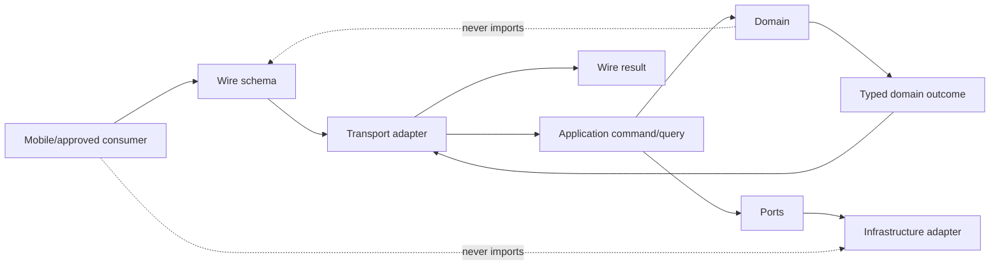

# Recharge Backend — API Contract Standard

- ID: **BCK-03**
- Version: **0.3.6**
- Date: **2026-08-28**
- Spec status: **Draft — review required**
- Runtime status: **Absent**
- Accountable owner: **API Platform owner**
- Parent architecture: [BCK-01 v0.4.48](RECHARGE_BACKEND_MASTER_SPEC.md)
- Coordination baseline: [BCK-02 v2.4.52](RECHARGE_BACKEND_DELIVERY_MAP.md)
- Canonical workflow: [API Contracts Workflow v1.1](../api/API_CONTRACTS_WORKFLOW.md)
- Runtime effect: **none**
- Canonical repository path: `docs/product/BACKEND_API_CONTRACT_STANDARD.md`
- Link base: relative links resolve from `docs/product/`

## 0. Changelog

### v0.3.6 — 2026-08-28

- promoted BCK09-API-PAR-01 v0.3 to Done after exact Node 22.23.2 hosted
  Ubuntu/Windows contract parity evidence passed;
- retained Draft/runtime Absent: callable raw-body feasibility,
  API-DEC-02/04/05, independent signatures, Firebase and runtime authority
  remain unresolved.

### v0.3.5 — 2026-08-28

- registered BCK09-API-PAR-01 v0.2 and `api_contracts` v0.3.0 as bounded
  Booking-v1 contracts/test-only parity evidence;
- recorded closed query/read/page/availability roots, Ajv Draft 2020-12
  validation and independent Dart/TypeScript JCS/SHA-256 goldens;
- retained Draft/runtime Absent: Node 22 confirmation, callable raw-body
  feasibility, API-DEC-02/04/05, independent signatures, Firebase and runtime
  authority remain unresolved.

### v0.3.4 — 2026-08-27

- accepted Booking-v1 scoped `API-DEC-01` and `API-DEC-03` through
  [BCK09-API-NAMED-DEC-01 v0.2](BACKEND_EVENT_BOOKING_NAMED_API_DECISION.md);
- froze the five callable surfaces, `europe-west1`, 10/15/30-second deadlines
  and amended JCS/SHA-256 projection including applicable revision fields;
- kept API-DEC-02/04/05, all specialist signatures, executable parity,
  Firebase and runtime authority unresolved; Draft/runtime Absent are unchanged.

### v0.3.3 — 2026-08-20

- recorded `RechargeN / Product owner` as the combined D1 API/Operations/
  Security/Mobile reviewer identity with verdicts still Pending;
- assignment is not treated as review completion, Approval or runtime authority;
- API semantics, 64 stable AC, Draft status and runtime Absent are unchanged.

### v0.3.2 — 2026-08-20

- removed the D1→D2 circularity: BCK-03 Review requires a named Mobile
  Platform review of the delegated boundary, not a pre-existing BCK-18 file;
- added explicit DoR current state and the D1 owner sign-off ledger;
- clarified disposition of API-DEC-01–05 and aligned current-version wording;
- semantics, 64 stable AC, Draft status and runtime Absent are unchanged.

### v0.3.1 — 2026-08-20

- linked the D1 OD-09 review evidence package with Booking compatibility and
  duplicate/gap/poison/replay matrices;
- the event/outbox proposal and 64 AC are unchanged; OD-09 remains Proposed
  pending cross-owner acceptance and no worker/runtime is authorized;
- parent/coordination traceability updated to BCK-01 v0.4.4/BCK-02 v2.4.8.

### v0.3 — 2026-08-20

- accepted D1-DEC-01/ECL03-D11 reconciles Booking v1 request correlation and
  logical idempotency identity without changing schema or fixtures;
- effective deduplication is now `(resolved actor, command type,
  idempotencyKey)`; retries may carry a new `requestId` only with the original
  key and semantic payload;
- BCK-09 v1.1, ECL-03 v1.2 and ECL-03C v1.1 now use the same split-key
  semantics; the former fixture contradiction is closed;
- OD-07/09/10/11 statuses remain unchanged and runtime remains Absent.

### v0.2.4 — 2026-08-20

- BCK-05 v0.1 and BCK-20 v0.1 are now present Draft inputs rather than planned
  placeholders; parent/coordination traceability updated to v0.4.2/v2.4.6;
- OD-10 LocalizedText proposal remains non-Accepted and API-DEC-05 still gates
  non-Booking language-neutral schemas;
- API semantics, 64 AC, Draft/Absent status and runtime effect are unchanged.

### v0.2.3 — 2026-08-20

- BCK-01 Review prerequisite is now satisfied and BCK-02 traceability is
  updated to v2.4.5;
- remaining idempotency/Booking and delegated-owner blockers are unchanged;
- API semantics, 64 AC, Draft/Absent status and runtime effect are unchanged.

### v0.2.2 — 2026-08-20

- documentation-only parent traceability updated to BCK-01 v0.4.1 and
  BCK-02 v2.4.4;
- API semantics, 64 AC, Draft/Absent status and runtime effect are unchanged.

### v0.2.1 — 2026-08-16

- documentation-only traceability updated to BCK-01 v0.4 and BCK-02 v2.4.3;
- API semantics, 64 AC, Draft/Absent status and runtime effect are unchanged.

### v0.2 — 2026-08-16

- добавлена компактная review-map из 12 ключевых contract-вопросов без
  создания параллельного decision registry;
- добавлена factual delta-таблица Booking v1 → BCK-03 target, сохраняющая
  Booking compatibility и отдельные authorization gates;
- fixture matrix сгруппирована по validity, compatibility, behavioral safety
  и delivery/effects evidence;
- normative semantics, 64 stable AC, Draft/Absent status и запрет на
  backend/mobile/Firebase/schema runtime не изменены.

### v0.1 — 2026-08-15

- определён единый logical API contract standard для всех backend domains;
- сохранён действующий `packages/api_contracts/schema/<domain>/vN` layout и
  существующий Booking v1 compatibility anchor;
- разделены wire contracts, transport adapters, application commands, domain
  models и persistence records;
- определены request/result/error envelopes, command/query semantics,
  idempotency, optimistic concurrency, pagination, timeout и retry contracts;
- определены schema/API/package/resource version axes и minimum-client policy;
- зафиксирован Proposed OD-09 event/outbox envelope без выбора production
  transport и без запуска workers;
- сформированы target artifact map, test/evidence matrix, rollout/rollback,
  Definition of Ready/Done и 64 acceptance criteria;
- backend/mobile/Firebase/schema runtime не создан.

## 1. Verdict

Recharge использует **один API contract standard** для mobile, trusted backend
entrypoints, internal events и будущих approved integrations. Domain modules
имеют собственные payload schemas и typed codes, но не создают параллельные
envelopes, version semantics, idempotency правила или raw-error форматы.

Каноническая цепочка:

```text
authorized canonical contract source + fixtures
  -> generated or fixture-verified Dart/TypeScript consumers
  -> transport adapter
  -> application command/query
  -> domain outcome
  -> typed wire result
```

Firestore documents, Firebase SDK objects, Dart domain entities и TypeScript
implementation classes не являются wire contract source.

На дату v0.3 ADR 0019 разрешает language-neutral JSON Schema source только для
Booking. Для остальных domains действующий API Contracts Workflow сохраняет
Dart-only source, пока отдельный Accepted architecture authorization явно не
расширит cross-language schema policy.

### 1.1. Ключевые review-вопросы

Это navigation aid для reviewer, а не второй decision package и не замена
OD/API-DEC registry из §40. Поскольку BCK-03 остаётся Draft, строка `Draft
rule` означает предлагаемое normative правило, а не Accepted authority.

| ID | Review question | Current disposition | Canonical sections |
|---|---|---|---|
| BCK03-RQ-01 | Как разделены command, query, webhook и internal event? | Draft rule: разные profiles, один common standard | §11, §15, §18, §24, §27 |
| BCK03-RQ-02 | Какие version axes независимы? | Draft rule: contract/API/schema/package/resource/policy/client не смешиваются | §6, §25–26 |
| BCK03-RQ-03 | Как связан idempotency key с request ID? | Accepted D1 rule: separate roles; equality optional | §12, §15–16, §34 |
| BCK03-RQ-04 | Как вычисляется canonical request hash? | Booking v1: Accepted JCS/SHA-256 semantic projection with revision-field amendment; other scopes require their own decision | §16, §40 |
| BCK03-RQ-05 | Что означает mutation timeout? | Draft rule: unknown outcome; retry exact same key/payload | §21 |
| BCK03-RQ-06 | Как различаются success, cancelled и failure? | Draft rule: three outcomes; error only for failure | §13–14 |
| BCK03-RQ-07 | Что additive, breaking, deprecated или retired? | Draft compatibility and migration rules | §25–26 |
| BCK03-RQ-08 | Как работает minimum supported client? | Behavior fixed in Draft; bootstrap/offline mechanism Open in API-DEC-04 | §26, §40 |
| BCK03-RQ-09 | Как доказывается Dart/TypeScript parity? | Required for ADR-authorized cross-language contracts; expansion gated by API-DEC-05 | §9, §35–37, §40 |
| BCK03-RQ-10 | Как выглядит cross-domain event/outbox contract? | Proposed OD-09; not Accepted and no runtime | §27, §40 |
| BCK03-RQ-11 | Какие payload/page/batch limits действуют? | Bounded Draft defaults/proposals; production tuning requires BCK-05/load evidence | §19–20, §38 |
| BCK03-RQ-12 | Как исключается resource enumeration? | Draft common boundary; exact resource mapping delegated to BCK-04/domain | §14, §22–23 |

## 2. Product outcome

После Approval BCK-03 каждая backend capability должна проектироваться так,
чтобы:

- mobile и backend одинаково интерпретировали payload и error semantics;
- retry не создавал duplicate mutation;
- timeout не превращался в ложный success/failure;
- старый client получал предсказуемый compatible result или typed upgrade gate;
- новый/newer schema не обходил authority, money, privacy, eligibility или
  capacity validation;
- domain API можно было заменить transport adapter без изменения product
  semantics;
- LV/EE/LT не получали разные скрытые wire-модели;
- contracts имели воспроизводимое evidence, а не только prose.

## 3. Источники истины и conflict resolution

При конфликте применяются scope-aware правила BCK-01 §3:

1. Accepted ADR.
2. Approved spec применимого domain/runtime slice.
3. [Architecture Baseline](../architecture/ARCHITECTURE_BASELINE.md) и
   cross-cutting policies.
4. [LAUNCH_STATUS](../architecture/LAUNCH_STATUS.md) для фактического runtime.
5. BCK-02 для registry, owners, waves, OD и gates.
6. BCK-01 для shared backend architecture/invariants.
7. Этот BCK-03 для wire/API/schema/event compatibility semantics.

Обязательные anchors:

| Область | Источник | Обязательство BCK-03 |
|---|---|---|
| Repository execution | [AGENTS.md](../../AGENTS.md) | Documentation не разрешает runtime; активный stabilization scope соблюдается |
| API workflow | [API Contracts Workflow](../api/API_CONTRACTS_WORKFLOW.md) | Не создавать второй source/codegen/change workflow |
| Identity | [ADR 0015](../adr/0015-authenticated-viewer-verified-creator-professional-page.md) | Client identity/capability claims не authoritative |
| AI boundary | [ADR 0018](../adr/0018-provider-neutral-ai-assistance-capability.md) | Provider payload не становится product-domain contract |
| Booking | [ADR 0019](../adr/0019-authoritative-internal-booking-ledger.md), [BCK-09 v1.1](EVENT_BOOKING_BACKEND_FIREBASE_FULL_SPEC.md) | Сохранить language-neutral Booking schemas, typed results и idempotency |
| Existing schema | `packages/api_contracts/schema/booking/v1/` | Единственный текущий ADR-authorized cross-language namespace; не переименовывать, не задваивать и не ломать fixtures |
| Reference data | BCK-20 v0.2.2 Draft, OD-10 Proposed | Не изобретать LocalizedText/market dataset semantics и не считать proposal Accepted |
| Security/privacy | BCK-04 v0.4.10 Draft | Envelope не заменяет AuthZ, Rules/IAM, retention и Legal decisions |
| Operations | BCK-05 v0.2.12 Draft | BCK-03 не выбирает projects, regions, deploy/event transport или SLO values |
| Mobile boundary | BCK-18 planned | Не импортировать Firebase schema/SDK в domain/presentation |

Booking v1 split-key compatibility decision принят в
[BCK-D1-DEC-01](BACKEND_PLATFORM_D1_DECISION_PACKAGE.md) и ECL03-D11;
Booking v1 не переписывается молча под новый common envelope.

### 3.1. BCK-02 section-completeness reconciliation

| BCK-02 §14 requirement | BCK-03 coverage | Applicability/result |
|---|---|---|
| 1. Metadata/status/owner | Header | Complete; Draft/Absent are separate |
| 2. Parents/anchors/priority | §3 | Complete |
| 3. Outcome/non-goals | §2, §5 | Complete; runtime effect remains zero |
| 4. Included/excluded scope | §5 | Complete |
| 5. Aggregate/writer/consumer ownership | §7–8, §33 | Complete at contract boundary; domain records are delegated |
| 6. Classification/projections | §23, §29 | Complete at API boundary |
| 7. Commands/queries/events/errors | §13–15, §18, §27 | Complete; OD-09 remains Proposed |
| 8. Versions/evolution/minimum client | §6, §25–26 | Complete |
| 9. Authorization/revocation | §22 | Complete at transport/application boundary; policy delegated to BCK-04/06 |
| 10. Persistence/index/transaction | §17, §33 | Boundary complete; physical topology not applicable to this docs-only wire standard |
| 11. IDs/time/reference data | §10, §30 | Complete; OD-10 values delegated to BCK-20 |
| 12. Idempotency/concurrency/retry/partial failure | §16–17, §20–21 | Complete |
| 13. Offline/cache/freshness/degraded | §21, §26, §29 | Complete |
| 14. Migration/import/compatibility | §25–26, §34 | Complete; import orchestration delegated to BCK-18 |
| 15. Outbox/replay/deduplication | §27 | Complete as Proposed contract; runtime not authorized |
| 16. Privacy/consent/retention/export/deletion | §23 | API minimization complete; policy/lifecycle delegated to BCK-04/domain |
| 17. Abuse/rate/App Check/fraud | §22, §31 | Contract signaling complete; controls delegated to BCK-04/22 |
| 18. Logs/SLO/analytics/cost | §32, §38 | Complete at contract requirements level; values delegated to BCK-05/21 |
| 19. Flags/rollout/rollback | §39 | Complete |
| 20. Exact file map | §35 | Complete and explicitly non-authorizing |
| 21. Test matrix | §36–37 | Complete, including docs-only not-applicable cases |
| 22. AC/DoR/DoD/unimplemented | §41–44 | Complete; 64 sequential AC |

Delegation means the named owner must define the physical or policy detail; it
does not make the boundary optional and does not convert an absent runtime into
evidence of completion.

## 4. Current-state audit

Дата снимка: **2026-08-15**.

| Area | Current evidence | Gap | Required response |
|---|---|---|---|
| Package | `packages/api_contracts` существует | Нет platform-wide contract registry | Определить target registry, не создавать runtime в v0.3 |
| Language-neutral schema | `schema/booking/v1/*.schema.json` | Только Booking namespace | Расширять `schema/<domain>/vN` по Approved domain specs |
| JSON Schema | Draft 2020-12, `$id`, `$defs`, bounded fields | Нет общего cross-domain convention | Зафиксировать в §9 |
| Fixtures | valid/invalid/forward Booking fixtures | Нет общей fixture taxonomy | Определить в §36–37 |
| Dart DTO | Immutable Booking DTOs и serializers | Нет общего envelope DTO | Target only; создаётся executable slice |
| TypeScript | Test-only Booking validator/hash consumer passes on exact Node 22.23.2; product backend remains absent | No runtime adapter, generated production consumer or callable export | Runtime remains Absent; adapter evidence gated |
| API standard | Booking-specific callable/error semantics в BCK-09 | Нет общего command/query contract | BCK-03 defines shared semantics |
| Events/outbox | ADR 0019 Booking outbox; OD-09 Proposed | Нет Accepted cross-domain envelope | Proposed envelope в §27; transport/retention ещё gated |
| Minimum client | Общего server policy нет | Silent incompatible clients possible | Определить contract в §26 |
| Direct data access | Mobile mock/local today | Production Firestore boundary отсутствует | Запретить direct authority writes/reads by schema coupling |

## 5. Scope

### 5.1. Входит

- contract ownership и canonical sources;
- JSON Schema conventions и common wire primitives;
- request, response, command, query, error и event envelopes;
- transport profile semantics;
- idempotency, optimistic concurrency, retry и timeout behavior;
- pagination, filtering, sorting, batching и size limits;
- API/schema/event/package/resource versioning;
- minimum supported client и deprecation;
- Auth/App Check context boundary без переопределения security policy;
- cache/freshness и honest degraded outcomes;
- privacy-safe payload/log/error rules;
- cross-language fixtures и compatibility gates;
- Proposed OD-09 envelope/delivery semantics;
- target artifact map, tests, rollout/rollback и AC.

### 5.2. Не входит

- создание или изменение JSON schemas, DTO, validators, generators или clients;
- создание `apps/backend`, Functions, Rules, indexes или Firebase resources;
- domain entities, lifecycle и use-case implementation;
- Firestore collection/document/index topology;
- exact Identity, capability, membership или verification lifecycle;
- exact retention/legal basis/DSR policy;
- deployment regions, projects, IAM, secrets, SLO и budgets;
- конкретные Discover, Content, Booking, Planning или Route endpoints;
- media upload protocol beyond common handoff constraints;
- provider/webhook/payment runtime;
- production activation или migration.

## 6. Terms and version axes

| Term | Meaning |
|---|---|
| Contract | Language-neutral wire shape and semantics |
| Schema | Machine-verifiable JSON representation of a contract version |
| Endpoint | Transport address bound to a command/query handler |
| Command | Intent to mutate authoritative state |
| Query | Read-only request for authorized projection/state |
| Result | Typed success/cancelled/failure response |
| Event | Immutable fact emitted after accepted authoritative transition |
| Resource revision | Optimistic concurrency version of one resource |
| Projection revision | Build/checkpoint revision of a derived read model |
| Policy revision | Immutable version of server-owned policy/reference input |
| API major | Breaking public behavior boundary |
| Schema version | Wire shape version within a namespace |
| Package version | SemVer version of `api_contracts`; not a resource revision |
| Client build | Platform build used by minimum-client policy |

Эти axes независимы. Запрещено использовать один `version` одновременно как
schema version, resource revision, app build и policy revision.

## 7. System and dependency boundary



Rules:

1. Wire DTO не является domain entity.
2. Transport выполняет decode/basic schema validation/context mapping, но не
   domain policy.
3. Application use case выполняет orchestration и вызывает domain policy.
4. Infrastructure exceptions map в typed failure внутри adapter/application.
5. Persistence shape не публикуется consumer.
6. Consumer не отправляет resolved roles/capabilities как trusted input.
7. Cross-domain command принадлежит target domain.
8. Event payload минимизирован и не заменяет query API.

## 8. Contract ownership and registry

### 8.1. Ownership

| Artifact | Writer/owner | Consumers |
|---|---|---|
| Platform envelope schemas | API Platform/BCK-03 | All domain contract owners |
| Domain payload schema | Owning domain BCK spec | Mobile/backend consumers |
| Booking v1 schemas | Booking owner/BCK-09 | Dart DTO and future TypeScript validator |
| Reference/localized values | Reference Data/BCK-20 | Domain schemas by stable ID/revision |
| Error code registry | API Platform + domain owner for extension | All transports/clients |
| Event type registry | Producer domain + API Platform envelope governance | Approved consumers |
| Minimum-client policy schema | API Platform; values operated by BCK-05 | Mobile bootstrap/transport |
| Generated output | Generator only | Compilers/runtime |

Один domain не меняет чужой payload schema. Shared platform schema меняется
через API owner review и compatibility evidence от затронутых consumers.

### 8.2. Target registry entry

Каждый registered contract содержит:

```text
contractId
kind: command | query | result | event | webhook
domain
majorVersion
schemaPath
owner
status: draft | review | approved | deprecated | retired
minimumClientPolicyRef?
dataClass
idempotencyProfile?
authProfile
introducedAt
deprecatedAt?
retireAfter?
```

Registry — documentation/schema governance artifact, не runtime service и не
способ динамически загрузить неизвестную business logic.

## 9. Repository and schema conventions

Канонический layout сохраняется:

```text
packages/api_contracts/
  schema/
    booking/
      v1/
        common.schema.json
        booking*.schema.json
        fixtures/
    platform/
      v1/                       # target, not created by this spec
        request_context.schema.json
        result_envelope.schema.json
        error.schema.json
        cursor_page.schema.json
        event_envelope.schema.json
        fixtures/
    <domain>/
      vN/
        *.schema.json
        fixtures/
  lib/src/
    contracts/
    dto/{request,response}/
    serializers/
    clients/
    generated/
  test/
```

Rules:

1. JSON Schema dialect: `https://json-schema.org/draft/2020-12/schema`.
2. Каждый root schema имеет stable HTTPS `$id`, title и explicit type.
3. `$ref` внутри version namespace не ссылается на mutable latest alias.
4. Command schemas используют `additionalProperties: false` и fail closed.
5. Required/optional/null различаются; optional field не равен explicit null.
6. Поля используют lower camelCase; enum values — lower camelCase, если
   existing approved contract не фиксирует другое.
7. Arrays имеют `maxItems`; strings имеют `maxLength`; numbers — bounds.
8. Dynamic arbitrary maps запрещены на authoritative boundary; bounded typed
   extension map допускается только с key/value/size schema.
9. Schema filenames lower snake_case; version directory `vN`.
10. Нельзя переименовывать `schema/` в `schemas/` или переносить Booking v1 без
    Approved migration plan.
11. Generated output не редактируется вручную.
12. Schema description не содержит secrets или real personal data examples.

## 10. Common wire primitives

### 10.1. Identifier

```text
type: string
minLength: 1
maxLength: 128
semantics: opaque immutable ULID/UUID-style ID
```

Consumer не парсит timestamp, owner или type из ID. `loc_*` не пересекает
authoritative API create/publish boundary, кроме explicit import source ID field.

### 10.2. UTC timestamp

- RFC 3339 string;
- normalized UTC with trailing `Z`;
- authoritative mutation timestamps создаёт backend;
- client time может быть presentation/input hint, но не eligibility authority.

### 10.3. IANA timezone and local date

- timezone — IANA name;
- local calendar date — `YYYY-MM-DD` без inferred device timezone;
- owning domain указывает timezone source (Place/Event/occurrence);
- offset alone не заменяет IANA zone.

### 10.4. Revision

- non-negative integer within JSON safe integer range;
- increment semantics принадлежат owning aggregate/projection;
- missing expected revision допустим только для explicit create или domain
  command, где concurrency не применима.

### 10.5. Money

```json
{
  "minorUnits": 1250,
  "currency": "EUR"
}
```

- `minorUnits` — integer, не float/double;
- `currency` — ISO 4217 uppercase;
- currency не выводится из market;
- rounding policy не выполняется transport layer.

### 10.6. Numeric safety

JSON integer на cross-language boundary ограничен safe integer range
`[-9007199254740991, 9007199254740991]`. Значения вне диапазона кодируются
bounded decimal string только по отдельному schema.

### 10.7. Market and locale

- `marketId` — stable reference, не country code;
- `countryCode`, `locale`, `currency`, `timezone`, `environment` различны;
- locale использует BCP 47;
- unknown market/policy revision на mutation fail closed.

## 11. API surface profiles

| Profile | Purpose | Authority | Initial status |
|---|---|---|---|
| Mobile command | Authenticated state mutation | Trusted backend handler | Target, disabled |
| Mobile query | Authorized read projection/state | Trusted backend handler | Target, disabled |
| Internal event | Cross-domain asynchronous fact | Producer outbox | Proposed OD-09 |
| Scheduled command | Expiry/reconciliation/cleanup | Least-privilege worker | Target, disabled |
| Admin command | Support/moderation/repair | Capability/case/two-person gates | Target, disabled |
| Provider webhook | External signed event ingress | Integration/payment owner | Gated by BCK-16/17 |
| Public API | Third-party developer access | Separate product/security decision | Out of current scope |

Logical contracts transport-neutral. Firebase callable/HTTPS/queue adapters не
меняют envelope semantics. Exact Functions generation, region, transport,
authentication middleware и task/event service выбираются BCK-05/executable
slice. Direct Firestore access не является альтернативным API profile для
authoritative records.

## 12. Request context envelope

Target platform context:

```json
{
  "contractVersion": 1,
  "requestId": "01...",
  "client": {
    "appId": "recharge-mobile",
    "platform": "android",
    "appVersion": "1.0.0",
    "buildNumber": 100
  },
  "locale": "lv-LV",
  "marketId": "lv",
  "payload": {}
}
```

Rules:

- `requestId` обязателен и client-generated для mobile command/query;
- каждый новый attempt использует свежий `requestId`; обнаруженное повторное
  использование одного request ID с другим logical key/semantic command даёт
  `invalid_argument` без mutation;
- `contractVersion` выбирает platform envelope major, не domain payload version;
- client metadata bounded и не используется как authorization grant;
- Auth UID, session, App Check result, capabilities, IP/risk signals и service
  identity добавляются server-side execution context, не доверяются payload;
- `marketId` required только когда operation market-scoped;
- locale presentation preference не меняет persisted content language;
- arbitrary headers/context maps запрещены.

## 13. Result envelope

Target logical result:

```json
{
  "contractVersion": 1,
  "outcome": "success",
  "requestId": "01...",
  "correlationId": "01...",
  "serverTime": "2026-08-15T10:00:00.000Z",
  "resourceRevision": 4,
  "result": {}
}
```

`outcome`:

```text
success | cancelled | failure
```

Invariants:

- `success` содержит `result` по schema и не содержит `error`;
- `failure` содержит `error` и не содержит success result;
- `cancelled` — terminal non-success product outcome, не infrastructure error;
- `requestId` echo позволяет match retry/result;
- `correlationId` server-generated/validated и используется в operations;
- `serverTime` authoritative;
- resource/projection revision передаётся только когда имеет semantics;
- warning — typed bounded code, не свободный текст и не замена failure.

## 14. Error envelope and vocabulary

Target error:

```json
{
  "code": "failed_precondition",
  "domainCode": "registration_closed",
  "messageKey": "booking.registrationClosed",
  "retryable": false,
  "fieldViolations": [],
  "details": {}
}
```

Common codes:

```text
invalid_argument
unauthenticated
permission_denied
not_found
conflict
idempotency_conflict
failed_precondition
rate_limited
unavailable
deadline_exceeded
unsupported_client
unsupported_contract
unsupported_schema
stale_revision
internal
```

Rules:

1. `cancelled` не является error code.
2. Domain code namespaced semantic registry и не переопределяет common code.
3. `messageKey` — optional localization hint; server text не является contract.
4. Field violations содержат schema-safe field path/code, без введённого
   sensitive value.
5. `details` bounded, schema-defined per code; arbitrary debug map запрещён.
6. Stack trace, SDK exception, collection path, query/index detail, secret,
   provider payload и existence чужого resource не возвращаются.
7. `permission_denied`/`not_found` mapping предотвращает enumeration по BCK-04.
8. `retryable` означает техническую допустимость повтора, не гарантию успеха.
9. `retryAfterSeconds` используется только bounded rate/unavailable policy.
10. Unknown internal exception map в `internal` с correlation ID; full detail
    остаётся в redacted operational log.

## 15. Command contract

Target logical command:

```json
{
  "contractVersion": 1,
  "commandType": "domain.commandName",
  "commandVersion": 1,
  "requestId": "01...",
  "idempotencyKey": "01...",
  "expectedRevision": 3,
  "payload": {}
}
```

Command является specialization общего request envelope из §12, а не вторым
вложенным envelope: common context и command fields сериализуются одним
registered schema без дублирования `requestId`/`payload`.

Rules:

- mutation только command, не query side effect;
- command type/version registered и owned одним domain;
- `requestId` коррелирует одну попытку, `idempotencyKey` идентифицирует одну
  logical mutation; equality допустима, но не обязательна;
- retry сохраняет исходный `idempotencyKey` и semantic payload, но может иметь
  новый свежий `requestId`;
- create имеет permanent client-generated ID, если domain contract это
  принимает, иначе server returns mapping; `loc_*` authority запрещена;
- update/delete/state transition несёт `expectedRevision`, если aggregate
  concurrent;
- backend revalidates auth, capability, market policy, lifecycle, payload,
  current revision и domain invariants;
- client preflight не authoritative;
- success возвращается только после durable authoritative commit;
- partial domain success не маскируется success envelope;
- offline confirmed mutation не создаётся.

## 16. Idempotency standard

### 16.1. Scope

Idempotency record logically scoped by:

```text
actor/service identity
+ command type/version
+ idempotency key
```

For provider webhook scope включает provider/account/event ID согласно owning
spec; client key не заменяет verified provider event identity.

### 16.2. Canonical request hash

- hash строится после schema normalization над command type/version, actor
  scope и canonical payload;
- map keys sorted, absent/null различимы, timestamps/money normalized;
- Auth token, volatile transport headers, correlation ID, `requestId` и retry
  count не входят в semantic hash;
- algorithm/version фиксируется executable API tooling plan.

### 16.3. Replay outcomes

| Existing key | Hash | Result |
|---|---|---|
| none | any valid | Execute once and persist typed result |
| same scope/key | same | Return original committed result |
| same scope/key | different | `idempotency_conflict`, no mutation |
| in progress | same | Bounded wait/poll or retryable in-progress result |
| expired record | any | Owning retention policy decides; unsafe ambiguity fails closed |

Idempotency retention belongs to domain/BCK-04/BCK-05. BCK-03 не задаёт
универсальный срок, но запрещает удалять evidence раньше maximum safe retry/
unknown-outcome window.

`Return original committed result` означает тот же semantic outcome, resource
identity и authoritative revision, но не повтор старого transport envelope:
response echo использует `requestId` текущей попытки, а attempt correlation
metadata может быть новой. Это сохраняет §13 request matching и не создаёт
вторую domain mutation.

## 17. Optimistic concurrency and revisions

- `expectedRevision` проверяется в той же authoritative transaction/write
  precondition;
- mismatch → `stale_revision` с current safe revision, если disclosure allowed;
- client reloads/reconciles, а не автоматически overwrites;
- last-write-wins запрещён для ownership, lifecycle, Booking capacity, money,
  membership/capability и moderation state;
- projection revision не используется как aggregate expected revision;
- policy/reference revision может быть отдельным precondition;
- merge semantics существуют только в owning domain spec и возвращают typed
  result, а не hidden transport merge.

## 18. Query contract

Target query:

```json
{
  "contractVersion": 1,
  "queryType": "domain.queryName",
  "queryVersion": 1,
  "requestId": "01...",
  "marketId": "lv",
  "filters": {},
  "sort": "default",
  "page": {"limit": 20, "cursor": null}
}
```

Rules:

- query read-only; metrics/logs are operational side effects, not domain writes;
- authorization filters server-side;
- filters and sort are registered enums/objects, not raw field/operator strings;
- response declares source/projection revision and freshness where material;
- query cannot expose Firestore path/index/cursor encoding;
- cursor opaque, tamper-evident or server-validatable and query-bound;
- cross-market query explicit; disabled market fail closed;
- query cost bounded independent of client-provided limit.

## 19. Pagination, sorting and filtering

Common v1 bounds:

- default page size: `20`;
- absolute platform maximum: `100`;
- domain may set lower maximum, never higher without BCK-03 revision/evidence;
- empty page may contain next cursor only if contract explains delayed filtering;
- cursor binds query type/version, actor visibility scope, market, normalized
  filters, sort and snapshot/projection revision where supported;
- stable tie-breaker includes immutable ID;
- client never constructs/decrements cursor;
- offset pagination запрещена для mutable large feeds;
- arbitrary full-text query remains BCK-08/OD-01, not common API feature.

Discover feed/map/search consistency additionally follows BCK-01 AC-11:
shared logical query revision/freshness, typed stale/inconsistent projection.

## 20. Batch and payload limits

Proposed v1 safety bounds until BCK-05 load/cost evidence и domain review их
принимают или задают stricter value:

| Item | Bound |
|---|---:|
| Command JSON payload excluding media | 256 KiB UTF-8 |
| Query JSON payload | 64 KiB UTF-8 |
| Single typed result | 1 MiB UTF-8; larger data paginated |
| Generic batch items | 50 |
| Page size | 100 maximum |
| Error field violations | 50 |
| Warning codes | 20 |

Media bytes never embed as base64 in ordinary API envelope; BCK-14 owns upload
session/finalize contracts. Batch mutation must define atomicity explicitly:
`allOrNothing` or per-item typed results. Default is no generic batch mutation.

## 21. Retry, timeout and unknown outcome

### 21.1. Queries

- safe automatic retry allowed for transport failures with bounded exponential
  backoff, jitter and total deadline;
- auth refresh at most through approved session flow;
- retry preserves logical query/request identity where tracing requires.

### 21.2. Commands

- retry reuses exact idempotency key and normalized payload;
- transport timeout after send produces `unknown outcome`, not local failure or
  success claim;
- client queries authoritative state or retries same command;
- new key после timeout запрещён до reconciliation;
- automatic retry limited by command/domain policy and user-visible state.

### 21.3. Server and workers

- retries bounded;
- poison/terminal failures leave auditable state;
- worker effects idempotent and lease/checkpoint protected;
- retry budget/queues/alerts belong to BCK-05.

## 22. Authentication and authorization context

### 22.1. Wire versus resolved context

Client may send Auth/App Check tokens through transport mechanism, but never a
trusted `role`, `creatorVerified`, `publisherCapabilities`, `isAdmin`,
`managedPageIds` or resolved actor ID field.

Server execution context target:

```text
principalType
actorUserId?
serviceIdentity?
sessionId?
authTime
appCheckState
accessSnapshotRevision
activeAccountState
```

Exact fields/storage/security принадлежат BCK-04/BCK-06.

### 22.2. Authorization matrix

| Surface | Auth context | Additional authority | Failure behavior |
|---|---|---|---|
| Mobile query | Valid active session | Actor/resource visibility | Anti-enumerating typed error |
| User command | Valid active session | Own-resource/domain capability | Fail closed |
| Creator command | Valid active session | Verified Creator + exact capability | Fail closed; client claim ignored |
| Page command | Valid active session | Active exact-page membership/capability | Cross-page denied |
| Admin/support | Dedicated principal | Case/reason/capability; repair approval | Fully audited |
| Worker | Service identity | Exact task IAM and server flag | No general domain access |
| Webhook | Provider verification | Provider/account/event scope | Reject before domain command |

Revocation checked for every new authoritative mutation. Cached mobile access
state improves UX only.

## 23. Data classification, privacy and redaction

Every contract field declares or inherits:

```text
public | protected | sensitive | operational | derived
```

Requirements:

- purpose and consumer documented;
- payload minimized;
- sensitive fields absent from IDs, URLs, error text, analytics and logs;
- examples/fixtures synthetic;
- `toJson` debug output not automatically logged;
- event payload carries reference instead of protected snapshot when possible;
- export/deletion behavior owned by BCK-04/domain;
- contract does not promise deletion of legally retained audit without policy;
- private location, Booking, verification, access code and support evidence never
  enter public projection envelope.

## 24. Transport mapping

Logical envelope is canonical; transport mapping must preserve it.

- HTTP/HTTPS transport uses JSON UTF-8 and appropriate status class plus typed
  body where response reaches application boundary;
- callable adapter maps platform errors into common typed envelope;
- authentication/transport rejection may occur before domain envelope but must
  map to stable client failure semantics;
- network/DNS/TLS timeout without response is transport unknown/unavailable,
  not server `failure` evidence;
- internal event transport carries accepted event envelope unchanged;
- no transport may convert `permission_denied` to `not_found` inconsistently
  outside approved anti-enumeration profile;
- transport-specific metadata stays outside domain payload.

## 25. Schema and API evolution

### 25.1. Change classes

| Change | Classification |
|---|---|
| Add optional response field with safe unknown handling | Non-breaking |
| Add new command/query type | Non-breaking for unrelated consumers |
| Tighten input bound for previously accepted valid value | Breaking unless security emergency policy |
| Add required field | Breaking |
| Remove/rename field | Breaking |
| Change field type/nullability/units/timezone semantics | Breaking |
| Change enum behavior for existing value | Breaking |
| Add enum value | Direction/profile-dependent; critical consumers may treat as breaking |
| Change error/outcome semantics | Breaking |

### 25.2. Directional unknown policy

- command input: unknown field/value fails schema validation;
- response presentation-only optional field: old consumer may ignore safely;
- critical response enum affecting authority/money/eligibility/capacity:
  unsupported typed state, no silent default;
- event consumer: unknown major/type not processed; quarantined/alerted;
- import/persisted round-trip: unknown data preserved where contract requires,
  never dropped silently.

### 25.3. Breaking release

Breaking change requires:

1. new API/schema major;
2. migration note and consumer owners;
3. dual-read/dual-endpoint or coordinated cutover window;
4. compatibility fixtures for old/new;
5. server flags and rollback;
6. minimum-client/sunset policy;
7. LAUNCH_STATUS evidence after implementation.

Package SemVer follows API Contracts Workflow and does not replace per-domain
schema version.

## 26. Minimum supported client and deprecation

Target policy projection:

```text
policyRevision
platform
minSupportedBuild
recommendedBuild
supportedContractMajors[]
hardBlockReasonCode?
sunsetAt?
updateTargetRef?
effectiveAt
```

Rules:

- policy server-owned, versioned, environment/market aware where required;
- hard block only for incompatible/security/legal boundary with approved owner;
- normal deprecation publishes announce/effective/sunset evidence;
- server returns `unsupported_client` or `unsupported_contract` before mutation;
- update URL/value comes from approved platform config, not arbitrary error text;
- historic read/export/safe cancellation paths remain available where required;
- telemetry measures affected builds without storing unnecessary identity;
- exact observation window and operational owner belong to BCK-05/BCK-18.

## 27. OD-09 — Proposed cross-domain event/outbox contract

- Decision ID: **OD-09**
- Status in BCK-03 v0.3.3: **Proposed — not Accepted**
- Accountable owner: **API Platform owner**
- Co-owners for acceptance: **Platform Operations, Notifications, Security/
  Privacy and producing domain owners**
- Runtime effect: **none**
- Blocks: D3 effects/workers until Accepted; does not authorize event transport.

### 27.1. Proposed envelope

```json
{
  "eventId": "01...",
  "eventType": "booking.confirmed",
  "eventVersion": 1,
  "producer": "booking",
  "aggregateType": "booking",
  "aggregateId": "01...",
  "aggregateRevision": 4,
  "occurredAt": "2026-08-15T10:00:00.000Z",
  "correlationId": "01...",
  "causationId": "01...",
  "marketId": "lv",
  "dataClass": "operational",
  "payload": {}
}
```

### 27.2. Proposed semantics

- event immutable and past tense;
- `causationId` optional для root event, required для event/effect chain;
- `marketId` optional только для truly global aggregate/effect;
- event/outbox record created atomically with authoritative transition where
  invariant requires;
- delivery at-least-once;
- consumer deduplicates by `eventId` and consumer name/version;
- no global ordering guarantee;
- per-aggregate ordering detected by `aggregateRevision`; gap/out-of-order
  triggers bounded retry/replay, not blind apply;
- consumer cannot mutate producer aggregate directly;
- payload minimized and schema-versioned;
- replay bounded by producer/type/time/checkpoint and audited;
- poison event quarantined after bounded attempts, alert emitted;
- stable causation/correlation prevent effect loops;
- handler outcome/checkpoint idempotent;
- deleted/redacted source references follow approved privacy policy.

### 27.3. Acceptance evidence still required

The review worksheet is
[BCK-D1-OD09-EV-01](BACKEND_OD_09_EVENT_DELIVERY_EVIDENCE.md). It reconciles
the proposal with Booking obligations and enumerates the required failure and
owner evidence; it does not accept OD-09.

- BCK-05 transport comparison, regions, retry/DLQ, cost and operations;
- BCK-04 data classes, retention, deletion and audit review;
- BCK-13 notification consumer/replay behavior;
- Booking outbox compatibility fixtures;
- failure, duplicate, gap, poison and replay emulator tests;
- exact event registry and owner approval.

Until Accepted, cross-domain production effects remain disabled.

## 28. Async operation contract

Long-running operation, если domain spec разрешает, возвращает:

```text
operationId
operationType
state: accepted | running | succeeded | failed | cancelled
submittedAt
updatedAt
resultRef?
error?
revision
```

- `accepted` не равен domain success;
- polling query bounded;
- cancellation capability/domain-specific;
- worker retries do not duplicate final effect;
- terminal state immutable except approved reconciliation annotation;
- progress percent запрещён без достоверного denominator;
- operation retention/privacy owned by BCK-04/domain.

## 29. Cache, freshness and degraded states

Read result where freshness matters contains:

```text
source: server | cache | local
fetchedAt
sourceRevision?
projectionRevision?
expiresAt?
freshness: fresh | stale | unknown
```

- cache никогда не становится mutation authority;
- stale result clearly typed/displayable;
- unavailable server не маскируется empty collection;
- newer unsupported projection не silently maps to old success;
- Discover feed/map/search share logical query revision reconciliation;
- Booking confirmation/inventory mutation requires online authoritative result;
- domain defines whether stale read is usable for browse, never transport alone.

## 30. Market, locale and reference-data boundary

- LV first; EE/LT independently disabled;
- market status checked server-side for market-scoped command;
- `homeMarketId` preference не authorization;
- locale controls response presentation/localized key selection only;
- content language stored explicitly;
- timezone belongs to Place/Event/occurrence semantics;
- Money always carries currency;
- taxonomy/region/policy values transmitted by stable ID + revision;
- LocalizedText wire/fallback belongs to BCK-20/OD-10;
- BCK-03 supplies generic version/error mechanics, not translation policy.

## 31. Rate limiting and abuse signaling

API response may use:

```text
code: rate_limited
domainCode: <registered policy code>
retryable: true | false
retryAfterSeconds?
```

- threshold and risk model not exposed;
- limit checked server-side and layered with Auth/App Check/domain abuse policy;
- App Check failure never grants bypass;
- retry-after bounded and not guaranteed reservation;
- user-facing explanation localizes by stable key;
- rate event logs minimized;
- exact limits, storage and sanctions belong to BCK-04/BCK-22/domain.

## 32. Observability and diagnostics

Every accepted request target signals:

```text
correlationId
requestId
contract/domain/type/version
outcome/commonCode/domainCode
latency class
retry/idempotency-hit flags
client platform/build (bounded)
environment
market where applicable
```

Prohibited in ordinary logs/metrics:

- tokens/secrets;
- raw payload;
- access codes;
- verification evidence;
- precise private location;
- named guest/application free text;
- provider/payment sensitive material;
- full stack trace returned to client.

Operational telemetry belongs to BCK-05; product analytics to BCK-21. Common
correlation does not merge their legal purpose or retention.

## 33. Persistence, transaction and index applicability

BCK-03 does **not** own Firestore collections, indexes or transaction
implementation. It fixes boundary behavior only:

- command success after durable commit;
- idempotency and expected revision semantics;
- event atomicity requirement where producer spec requires;
- persistence schema version distinct from API version;
- raw database error/path/index not exposed;
- query cursor not Firestore cursor contract.

Exact records/indexes/transactions belong to BCK-05 and owning domain spec.
Section is not otherwise applicable to BCK-03 because this is a wire standard.

## 34. Migration and Booking v1 reconciliation

Local-to-cloud import uses the same version/error/idempotency primitives, but
session/checkpoint/conflict/user-disclosure orchestration belongs to BCK-18 and
owning domains. BCK-03 does not authorize bulk upload or direct persistence.

Existing files remain compatibility anchor:

```text
packages/api_contracts/schema/booking/v1/
  common.schema.json
  booking.schema.json
  booking_command.schema.json
  booking_error.schema.json
  booking_hold.schema.json
  booking_policy.schema.json
  booking_result.schema.json
  fixtures/{valid,invalid,forward}.json
```

Factual compatibility delta:

| Booking v1 today | BCK-03 target | Required treatment |
|---|---|---|
| `booking_result.kind`: Booking-specific outcome union | Common `success/cancelled/failure` envelope | Preserve v1; use explicit adapter or a separately approved new major, never double-wrap silently |
| Booking-specific error names and result kinds | Common code plus namespaced `domainCode` | Maintain tested mapping; no in-place rename in this documentation slice |
| `common.schema.json` is inside `booking/v1` | Conditional future platform primitives | Do not move or duplicate it until API-DEC-05 closes through Accepted architecture authorization |
| `requestId` and `idempotencyKey` are separate required fields and valid fixtures use distinct values | Accepted D1-DEC-01/ECL03-D11 split-key semantics | Preserve both fields; request ID is attempt correlation, idempotency key is logical-mutation identity; equality remains valid but optional |
| Fixtures are `valid`, `invalid`, `forward` | Target adds broader compatibility/behavior evidence | Add only through an Approved executable contract change; missing fixture is a gap, not runtime failure |
| Dart DTO/validator evidence exists | Future Dart/TypeScript parity | TypeScript consumer remains target-only until backend/tooling authorization |
| `applicationFields` permits an open object | Production payloads must be bounded/classified | Define a bounded domain schema before production use; do not treat openness as authority |

Rules:

1. No rename/move in BCK-03 documentation slice.
2. Booking v1 `schemaVersion`, enums, requestId/idempotencyKey and field bounds
   remain authoritative for existing fixture tests.
3. Platform envelope adoption is staged via adapter/fixture reconciliation;
   Booking v1 is not wrapped twice on wire without explicit version.
4. Split-key reconciliation requires no Booking schema major or fixture rewrite;
   equal-value callers remain compatible.
5. Dart DTO tests remain green.
6. Future TypeScript validators consume same fixture semantics.
7. `applicationFields` requires bounded domain schema before production usage;
   existing open object is not permission for arbitrary sensitive payload.
8. BCK-09 v1.1 is reconciled through BCK-D1-DEC-01; executable parity evidence
   remains required before runtime.

## 35. Target artifact and file map

This is a **future executable plan input**, not file-creation authorization:

```text
docs/api/
  API_CONTRACT_CATALOG.md
  API_ERROR_CODE_REGISTRY.md
  API_VERSION_DEPRECATION_REGISTER.md

packages/api_contracts/
  schema/platform/v1/
    request_context.schema.json
    result_envelope.schema.json
    error.schema.json
    cursor_page.schema.json
    event_envelope.schema.json
    async_operation.schema.json
    fixtures/
      valid.json
      invalid.json
      forward.json
      backward.json
  schema/<domain>/vN/
    *.schema.json
    fixtures/
  lib/src/generated/
  test/
    platform_contract_fixture_test.dart
    contract_registry_test.dart
    compatibility_matrix_test.dart

apps/backend/functions/src/generated/    # only after backend authorization
apps/backend/functions/test/contract/    # only after backend authorization
```

No runtime/schema file in this map is created by BCK-03 v0.3.3; this revision
adds only Markdown specification/evidence artifacts.
Generator/tool version requires Approved tooling plan; generated files manual
editing prohibited.

`schema/platform/v1` and non-Booking `schema/<domain>/vN` are conditional target
paths. They remain prohibited until API-DEC-05 closes through an Accepted
architecture authorization that reconciles API Contracts Workflow. Booking v1
is the only currently authorized language-neutral namespace.

## 36. Fixture and compatibility matrix

Every contract version supplies applicable fixtures:

| Fixture | Purpose | Expected |
|---|---|---|
| valid-minimal | Required fields only | Accept |
| valid-full | All supported bounded fields | Accept |
| invalid-type | Wrong primitive/object shape | Reject |
| invalid-required | Missing required field | Reject |
| invalid-bound | Size/range/list overflow | Reject |
| invalid-unknown-command-field | Command extra field | Reject |
| forward-response | Safe optional future response field | Old consumer safe behavior |
| unknown-critical-enum | New authority/money/eligibility value | Typed unsupported/fail closed |
| same-idempotency-same-hash | Retry | Original result |
| same-idempotency-different-hash | Conflict | No mutation |
| stale-revision | Concurrent update | `stale_revision` |
| timeout-after-commit | Unknown transport outcome | Retry same key returns original |
| event-duplicate | At-least-once delivery | Single consumer effect |
| event-gap/out-of-order | Revision discontinuity | No blind apply; replay path |
| old-client | Below minimum | Typed rejection before mutation |

Synthetic fixture IDs/content only; no production data.

Evidence groups make fixture intent explicit:

| Group | Fixtures/evidence | What it proves |
|---|---|---|
| Validity | valid-minimal/full, invalid-type/required/bound/unknown-command-field | Schema accepts intended bounded input and rejects malformed or unsafe input |
| Temporal compatibility | forward-response, unknown-critical-enum, old-client | N/N-1 behavior is explicit; critical authority/money/eligibility drift fails closed |
| Behavioral safety | idempotency same/different hash, stale revision, timeout-after-commit | Retry and concurrency cannot duplicate or silently overwrite mutation |
| Delivery/effects | event duplicate, gap/out-of-order, replay/poison tests | At-least-once delivery cannot create duplicate or blind out-of-order effects |

For every authorized cross-language contract, Dart and TypeScript validators
consume the same committed fixture bytes and must produce the same verdict.
Compilation alone or language-specific replacement fixtures are inconclusive.

## 37. Test and evidence requirements

| Test family | Required evidence |
|---|---|
| Schema lint | Draft 2020-12 valid, stable `$id`, refs resolve |
| Contract unit | Canonical primitives/envelopes/error mapping |
| Fixture parity | Same fixtures in Dart and TypeScript validator |
| Serialization | Absent/null, enum, time, Money, revision round trips |
| Compatibility | Backward/forward matrix per change |
| Idempotency | Same/different payload, concurrency, timeout replay |
| Query | Cursor binding, bounds, stable ordering, stale metadata |
| Security negative | Actor/capability claims ignored, enumeration-safe errors |
| Privacy | Redaction, bounded details, synthetic fixtures |
| Event | Duplicate, out-of-order, gap, replay, poison handling |
| Minimum client | soft/hard/deprecation policy outcomes |
| Consumer inventory | All affected clients/handlers listed |

Mandatory backend-gate applicability:

| Gate family | BCK-03 applicability |
|---|---|
| Emulator | Required when a transport/idempotency/event executable slice exists; not applicable to docs-only v0.3 |
| Firestore/Storage Rules | Negative direct-access tests belong to BCK-04/domain runtime; BCK-03 verifies no Rules shape leaks into API |
| Security | Required for claims, enumeration, payload bounds, malformed schemas and rate outcomes |
| Load/soak | Required before production for validation, pagination, idempotency and event throughput; values owned by BCK-05 |
| Backup/DR | Contract artifacts must be reproducibly rebuilt; data restore belongs to BCK-05/domain and is not applicable to docs-only v0.3 |
| Reconciliation | Required for Booking v1 adoption, event gaps/replay and old/new consumer compatibility |

Timeout, skipped consumer, hand-checked JSON or successful compile alone is
`inconclusive`, not pass.

## 38. Operational, SLO and cost impact

BCK-03 requires BCK-05 to budget:

- validation latency;
- envelope/log size;
- idempotency storage/read cost;
- pagination/query ceilings;
- event delivery/retry/DLQ cost;
- old-client compatibility duration;
- contract registry/codegen CI duration.

BCK-03 does not set production SLO or vendor. API implementations emit signals
from §32 and must remain inside BCK-05 budgets before staging.

## 39. Server flags, rollout and rollback

Contract rollout:

1. schema/fixtures Approved;
2. consumers generated/verified;
3. old/new compatibility green;
4. server support deployed disabled;
5. client support observed;
6. bounded enablement by domain/market;
7. old major deprecation only after policy window;
8. retirement after consumer-zero evidence and rollback expiry.

Rollback:

- disable new command/contract major by server flag;
- keep previous compatible handler/artifacts for rollback window;
- never down-migrate persisted newer record silently;
- idempotency result remains readable across deployment rollback;
- event producer/consumer compatibility checked before rollback;
- contract/package rollback and data rollback are separate.

## 40. Decision register and owners

| ID | Status | Owner | Decision | Blocks |
|---|---|---|---|---|
| D1-DEC-01 / ECL03-D11 | Accepted | Product owner decision; API Platform + Booking affected owners | Separate request correlation from logical idempotency identity | Closed; executable parity remains gated |
| OD-09 | Proposed in §27 | API Platform + Operations | Event transport, ordering, dedupe, replay, poison, retention | D3 effects/workers |
| API-DEC-01 | Accepted — Booking v1 only | Combined owner; independent API Platform + BCK-05 evidence pending | `API01-BCK09-CALLABLE-V2-EU-10-15-30-v1` in BCK09-API-NAMED-DEC-01 v0.2 | Executable API scaffold remains blocked |
| API-DEC-02 | Open | API Platform | Generator versus fixture-verified consumers per language/contract | Codegen/tooling slice |
| API-DEC-03 | Accepted — Booking v1 only | Combined owner; independent API Platform + Security evidence pending | `API03-BCK09-JCS-SHA256-SEMANTIC-v1` with revision-field amendment in BCK09-API-NAMED-DEC-01 v0.2 | First mutation runtime remains blocked |
| API-DEC-04 | Open | API Platform + Mobile | Exact minimum-client policy bootstrap surface and offline behavior | Production client gate |
| API-DEC-05 | Open | Platform Architecture + API Platform | Accepted ADR/policy path for extending language-neutral schema beyond Booking | Any platform/non-Booking schema creation |

Safe defaults while Open:

- no runtime endpoint/resource;
- no new generator;
- Dart-only source remains canonical outside ADR-authorized Booking;
- no production mutation;
- no cross-domain event worker;
- unsupported critical version fails closed.

Each decision requires owner, options/evidence, decision date, migration and
rollback. `TBD` without these fields blocks Review/Approval.

## 41. Definition of Ready for BCK-03 Review

BCK-03 may enter Review only when:

- BCK-01 is at least Review and its shared invariants are unchanged or
  reconciled;
- BCK-02 v2.4.21 registry reflects BCK-01/BCK-03/BCK-04/BCK-05/BCK-20 actual statuses;
- API Contracts Workflow and Booking v1 read fully;
- BCK-09 compatibility decision and evidence listed;
- BCK-04 Security/Privacy, BCK-05 Operations and a named Mobile Platform owner
  review their delegated boundaries; this does not require the D2 BCK-18 file
  to exist before D1 completes;
- OD-09 remains explicitly Proposed with named acceptance owners;
- artifact map contains no runtime authorization;
- links, AC, version/status and unimplemented list pass audit.

Current v0.3.3 readiness: reviewer identity is assigned for the required
API/Operations/Security/Mobile perspectives in
[BCK-D1-SIG-01](BACKEND_PLATFORM_D1_OWNER_SIGNOFF_LEDGER.md), with an explicit
single-owner independence disclosure. Every verdict remains Pending, so the
delegated reviews are not complete and status remains **Draft**.

## 42. Definition of Done BCK-03

Approval requires:

- all sections required by BCK-02 §14 complete or explicitly not applicable;
- BCK-01 and BCK-02 reconciliation signed;
- common envelope/error/idempotency/query/version semantics accepted;
- Booking v1 compatibility report accepted;
- BCK-04 Security/Privacy boundary review has no blocker;
- BCK-05 Operations boundary review has no blocker;
- named Mobile Platform boundary review has no blocker; BCK-18 remains a D2
  specification and is not a circular D1 prerequisite;
- API-DEC-01–05 have an explicit disposition (`Accepted` or `Deferred` with
  owner, reason, review date and preserved gate); API-DEC-02/03 must be
  Accepted before their corresponding tooling/runtime activates;
- OD-09 at least Proposed for D1 exit and Accepted before D3 effects/workers;
- 64 AC reviewable and sequential;
- runtime remains Absent.

`Approved` BCK-03 means contract design ready for bounded executable planning;
it does not mean schemas/code/backend deployed.

## 43. Acceptance criteria

1. **BCK-03-AC-01:** one cross-domain API standard exists for Recharge.
2. **BCK-03-AC-02:** domain payloads do not create parallel common envelopes.
3. **BCK-03-AC-03:** wire, transport, application, domain and persistence
   models remain distinct.
4. **BCK-03-AC-04:** Firestore shape is not a mobile/public API contract.
5. **BCK-03-AC-05:** `packages/api_contracts` remains the canonical workflow.
6. **BCK-03-AC-06:** existing `schema/booking/v1` is preserved.
7. **BCK-03-AC-07:** new cross-language schemas, only after separate Accepted
   architecture authorization, use `schema/<domain>/vN` and JSON Schema Draft
   2020-12.
8. **BCK-03-AC-08:** every schema has stable `$id`, owner, version and bounds.
9. **BCK-03-AC-09:** command input rejects unknown fields fail-closed.
10. **BCK-03-AC-10:** absent and null have distinct documented semantics.
11. **BCK-03-AC-11:** IDs are opaque immutable strings; `loc_*` is not authority.
12. **BCK-03-AC-12:** authoritative time is UTC and local semantics use IANA.
13. **BCK-03-AC-13:** Money uses integer minor units plus ISO currency.
14. **BCK-03-AC-14:** JSON integers remain inside cross-language safe range.
15. **BCK-03-AC-15:** market, locale, country, currency, timezone and environment
    remain distinct.
16. **BCK-03-AC-16:** request context includes version, request ID and bounded
    client/locale/market metadata.
17. **BCK-03-AC-17:** client role/capability claims are never authoritative.
18. **BCK-03-AC-18:** result envelope distinguishes success, cancelled and failure.
19. **BCK-03-AC-19:** failure uses a stable typed error envelope.
20. **BCK-03-AC-20:** raw SDK/stack/database/secret details never cross boundary.
21. **BCK-03-AC-21:** domain errors extend but do not redefine common codes.
22. **BCK-03-AC-22:** security errors prevent resource enumeration.
23. **BCK-03-AC-23:** every mutation is a registered versioned command.
24. **BCK-03-AC-24:** command v1 keeps request-attempt correlation separate
    from logical idempotency identity; equal and distinct values are valid.
25. **BCK-03-AC-25:** same key/hash returns the original committed semantic
    outcome in a response envelope that echoes the current attempt request ID.
26. **BCK-03-AC-26:** same key/different hash returns idempotency conflict.
27. **BCK-03-AC-27:** command success follows durable commit only.
28. **BCK-03-AC-28:** concurrent update uses expected resource revision.
29. **BCK-03-AC-29:** stale revision never silently last-write-wins.
30. **BCK-03-AC-30:** query is read-only and typed.
31. **BCK-03-AC-31:** filter/sort values are registered, not arbitrary expressions.
32. **BCK-03-AC-32:** cursor is opaque, query-bound and server-validated.
33. **BCK-03-AC-33:** page size defaults to 20 and cannot exceed 100.
34. **BCK-03-AC-34:** derived reads expose applicable revision/freshness.
35. **BCK-03-AC-35:** unavailable is not mapped to empty success.
36. **BCK-03-AC-36:** mutation timeout produces unknown outcome semantics.
37. **BCK-03-AC-37:** timeout retry reuses exact idempotency key/payload.
38. **BCK-03-AC-38:** payload/page/batch/error limits are bounded.
39. **BCK-03-AC-39:** ordinary envelopes do not embed media bytes.
40. **BCK-03-AC-40:** schema/API/package/resource/policy/client versions are
    separate axes.
41. **BCK-03-AC-41:** breaking change requires new major and migration window.
42. **BCK-03-AC-42:** unknown critical enum/version fails closed.
43. **BCK-03-AC-43:** safe additive response fields have tested old-client behavior.
44. **BCK-03-AC-44:** minimum-client rejection occurs before mutation.
45. **BCK-03-AC-45:** deprecation has owner, dates, evidence and rollback.
46. **BCK-03-AC-46:** Auth/App Check transport does not replace authorization.
47. **BCK-03-AC-47:** current server grants/revocation are checked per mutation.
48. **BCK-03-AC-48:** contract fields are classified and privacy-minimized.
49. **BCK-03-AC-49:** fixtures contain no production personal data.
50. **BCK-03-AC-50:** logs/analytics do not capture raw payload by default.
51. **BCK-03-AC-51:** OD-09 envelope has stable ID/type/version/aggregate revision/
    time/correlation/causation/data class.
52. **BCK-03-AC-52:** event delivery is at-least-once and consumers deduplicate.
53. **BCK-03-AC-53:** event out-of-order/gap never blind-applies.
54. **BCK-03-AC-54:** event replay is bounded and poison handling auditable.
55. **BCK-03-AC-55:** OD-09 remains Proposed until required owners/evidence accept it.
56. **BCK-03-AC-56:** async accepted/running is not reported as domain success.
57. **BCK-03-AC-57:** LV/EE/LT share wire semantics and activate independently.
58. **BCK-03-AC-58:** Booking v1 compatibility is fixture-verified before adoption.
59. **BCK-03-AC-59:** generated outputs are never manually edited.
60. **BCK-03-AC-60:** schema/fixture Dart/TypeScript parity is required.
61. **BCK-03-AC-61:** timeout/skipped/manual validation is inconclusive, not pass.
62. **BCK-03-AC-62:** rollout supports server disable and previous compatible major.
63. **BCK-03-AC-63:** BCK-03 Approval does not authorize runtime/schema creation.
64. **BCK-03-AC-64:** v0.3.3 leaves backend/Firebase/mobile runtime unchanged.

AC numbers are stable. New criteria append; semantic removal/change requires a
new document version and reference migration note.

## 44. Explicitly unimplemented

At v0.3.3 the following remain absent:

- platform common schemas and registry files;
- generated common Dart/TypeScript DTOs/validators;
- API endpoints, callable/HTTP adapters and middleware;
- backend application and Firebase resources;
- idempotency persistence and canonical hash implementation;
- query cursors, server pagination and projection runtime;
- minimum-client server policy/runtime;
- event bus/task/queue/outbox consumers;
- OD-09 Accepted decision;
- BCK-04/05/06/18 implementations;
- production migration, deployment or data processing.

Existing Booking schemas/fixtures/Dart DTOs remain existing ECL-03B evidence;
BCK-03 does not claim them as general backend runtime.

## 45. Next documentation package

Before BCK-03 Review:

1. complete D1-SIG-API/OPS/SEC/MOBILE bounded reviews under the recorded
   combined-role disclosure without requiring the D2 BCK-18 artifact;
2. develop evidence proposals for API-DEC-02/04/05 and preserve the Accepted
   Booking-v1 API-DEC-01/03 controls;
3. verify the accepted split-key and semantic-hash contracts in a future
   Approved fixture/parity slice without creating runtime or changing current
   wire shape;
4. keep OD-09 Proposed and all effects disabled until acceptance.

Only an independent Approved executable slice may later create schemas,
generators, clients or backend runtime.

## 46. Final statement

BCK-03 v0.3.3 defines how Recharge API contracts must be designed, versioned,
validated and evolved across one backend platform. It creates no endpoint or
runtime. Its purpose is to prevent mobile/backend drift, duplicate mutations,
silent incompatibility and parallel domain-specific wire standards before any
physical backend implementation begins.
