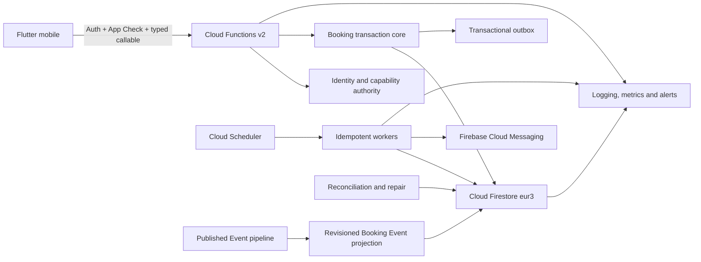

# Recharge Event Booking — полный Backend/Firebase contract

- ID: **BCK-09**
- Версия: **1.4**
- Дата: **2026-08-26**
- Spec status: **Review — documentation only; independent specialist approval pending**
- Runtime status: **Absent**
- Accountable owner: **Booking owner**
- Required reviewers: **API Platform, Security/Privacy, Operations, Identity,
  Content, Notifications, Mobile Platform, Admin Operations and Legal/Privacy**
- Область: authoritative internal free Event Booking, ECL-03C–H
- Канон: [Event Classification v2.2.3](EVENT_CLASSIFICATION_SPEC.md)
- Parent slice: [ECL-03 v1.2](EVENT_CLASSIFICATION_ECL_03_SLICE_SPEC.md)
- Architecture: [ADR 0019](../adr/0019-authoritative-internal-booking-ledger.md)
- Accepted decisions:
  [ECL-03 D01–D11](EVENT_CLASSIFICATION_ECL_03_DECISION_PACKAGE.md)
- Transaction-core plan:
  [ECL-03C v1.2](EVENT_CLASSIFICATION_ECL_03C_TRANSACTION_CORE_SLICE_SPEC.md)
- Coverage evidence:
  [BCK-09-PRE v1.2](BACKEND_EVENT_BOOKING_COVERAGE_MATRIX.md)
- Product decision:
  [BCK09-DEC-01 v0.2 — Accepted with controls](BACKEND_EVENT_BOOKING_OWNER_DECISION.md)
- Specialist review:
  [BCK09-REV-01 v0.2 — signatures Pending](BACKEND_EVENT_BOOKING_SPECIALIST_REVIEW_PACKAGE.md)
- Runtime effect: **none**

## 0. Changelog

### v1.4 — 2026-08-26

- resolved BCK09-TR-09 with a deterministic `bookingActiveKeys` transaction
  record and synchronized ECL-03C v1.2 without changing callable scope;
- resolved BCK09-TR-10 by attributing proposal/approval to BCK-19 and retaining
  only `ExecuteApprovedBookingRepair` as the BCK-09 mutation;
- resolved BCK09-TR-11 with immutable suppressed/required handoff disposition,
  preventing disabled pre-activation obligations from becoming late effects;
- reconciled one server-issued, callback-retry-stable Booking ID with ADR 0013,
  BCK-03 and the committed v1 command/fixture surface without a wire change;
- appended AC-76..79, kept Product baseline/Review status unchanged and added
  no backend, Firebase, contract, adapter, mobile or deployment runtime.

### v1.3 — 2026-08-26

- recorded Product acceptance of `BCK09-A1-STAGED-FREE-BOOKING-v1` with the
  mandatory controls in BCK09-DEC-01 v0.2;
- accepted BCK09-OD-04/05/06/08/09/10 only at their documented design
  boundaries and kept BCK09-OD-01/02/03/07 Deferred/Open;
- kept BCK-09 in Review pending independent specialist verdicts and preserved
  every ECL-03C, Firebase, production-data, deployment and activation gate;
- created no backend, Firebase, contract, adapter, mobile or deployment runtime.

### v1.2 — 2026-08-26

- reconciled all 22 mandatory BCK-02 categories and added named owner decisions;
- separated the first ECL-03C executable core from target ECL-03D–H behavior;
- preserved committed Booking v1 wire names and split request/idempotency identity;
- reconciled Booking outbox ownership with BCK-13 inbox/delivery single writers;
- aligned ECL-03C operational collection names and made later collections
  conditional on their own Approved slices;
- added explicit BCK-07 projection, BCK-08 availability, BCK-19 repair and
  OD-09/OD-11 fail-closed boundaries;
- did not add backend, Firebase, contracts, adapters, deployment or mobile runtime.

### v1.1 — 2026-08-20

- recorded ECL03-D11 split-key semantics and the full target Booking contract;
- remained documentation-only with runtime absent.

## 1. Назначение документа

Этот документ описывает целевой backend и Firebase-контур Event Booking для
Recharge целиком: от авторизации и публикации operational Event projection до
создания Booking, ручных заявок, waitlist/hold, reconfirmation, уведомлений,
retention, reconciliation, поддержки и безопасного production rollout.

Документ отвечает на четыре вопроса:

1. Что обязан делать наш backend-код.
2. Какие Firebase/GCP-сервисы используются и за что каждый отвечает.
3. Какие данные, API, транзакции, workers и security controls обязательны.
4. Какая документация и доказательная база нужны до включения продукта.

Он не создаёт параллельную Event/Booking-модель. При конфликте побеждают
Accepted ADR, затем parent ECL-03 spec. Изменение их инвариантов требует новой
ревизии или superseding ADR.

### 1.1. Status semantics

- **Review** означает, что полный target-контракт и его blockers готовы к
  проверке, но не приняты как executable authorization;
- **Approved** потребует owner/reviewer verdicts и закрытия применимых решений;
- **Runtime Absent** означает отсутствие authoritative Booking Functions,
  Firestore records, deployed workers, production data и mobile integration;
- ECL-03B schemas/fixtures/Dart domain являются contract evidence, но не runtime;
- ни этот документ, ни его Approval не разрешают автоматически создать
  Firebase resources, включить flags, обработать production data или слить
  изменения в `main`.

### 1.2. Backend parent contracts

BCK-09 расширяет, но не повышает статус следующих repository contracts:

- [BCK-01](RECHARGE_BACKEND_MASTER_SPEC.md) — modular backend и single writer;
- [BCK-02](RECHARGE_BACKEND_DELIVERY_MAP.md) — sequence, gates, OD-09/OD-11;
- [BCK-03](BACKEND_API_CONTRACT_STANDARD.md) — wire/version/error/idempotency;
- [BCK-04](BACKEND_SECURITY_PRIVACY_SPEC.md) — security, privacy, DSR, Legal;
- [BCK-05](BACKEND_DEPLOYMENT_OPERATIONS_SPEC.md) — environment, flags, SLO/DR;
- [BCK-06](IDENTITY_PUBLISHER_BACKEND_SPEC.md) — actor/capability authority;
- [BCK-07](CONTENT_PUBLICATION_BACKEND_SPEC.md) — published Event writer;
- [BCK-08](DISCOVER_SEARCH_CATALOG_BACKEND_SPEC.md) — public availability;
- [BCK-13](NOTIFICATIONS_BACKEND_SPEC.md) — inbox/channel delivery;
- [BCK-19](ADMIN_SUPPORT_BACKEND_SPEC.md) — staff case/repair approval.

Draft/Review parent rule остаётся proposal/blocker и не становится Accepted
только потому, что BCK-09 на него ссылается.

## 2. Итоговый продуктовый результат

После полного ECL-03H пользователь должен иметь возможность:

- увидеть честную authoritative availability конкретного occurrence;
- бесплатно зарегистрироваться при наличии мест;
- подать заявку, когда требуется ручное одобрение;
- встать в очередь, получить ограниченное по времени предложение и принять
  либо отклонить его;
- отменить собственную регистрацию;
- подтвердить участие после существенного изменения события;
- видеть свои актуальные Bookings и безопасно открывать их из уведомления.

Verified Creator/Professional Page должен иметь возможность:

- видеть только очередь своего PublisherRef/страницы;
- принимать и отклонять заявки;
- продвигать участника из разрешённой organizer-managed waitlist;
- отменять управляемый Booking с причиной;
- видеть агрегированные, но не публичные operational counts;
- не иметь возможности oversell, обходить общий лимит или редактировать
  Firestore-документы вручную.

Backend обязан гарантировать, что `confirmed` означает реально совершённую
authoritative транзакцию. Flutter, локальный cache, mock datasource, UI CTA и
внешняя ссылка никогда не создают подтверждённый Booking.

## 3. Граница системы

Полный scope ниже является staged target, а не одним executable slice.
ECL-03C может реализовать только instant finite/explicit unlimited create,
owner cancel и три read surfaces из своего exact Approved плана. Applications,
waitlist/holds, delivery workers, reconfirmation, Creator management, mobile
integration и production proof принадлежат отдельным ECL-03D–H slices. Ни один
следующий этап не наследует runtime authority только из Review/Approval BCK-09.

### 3.1. Входит

- Firebase Auth как проверенный identity input;
- server-owned account, PublisherRef, membership и capability checks;
- Cloud Functions v2 как единственная command/query boundary;
- Firestore как authoritative operational store;
- general-capacity finite pools и explicit unlimited RSVP;
- instant Booking, manual application, waitlist и expiring holds;
- uniform concurrency policy;
- cancellation, occurrence cancellation и material reschedule processing;
- reconfirmation;
- transactional outbox, in-app notification и FCM delivery attempt;
- scheduled workers, leases, retries и dead-letter handling;
- retention, deletion/pseudonymization workflow;
- reconciliation, incident containment и two-person support repair;
- dev/staging/prod environments, Emulator Suite, CI/CD and observability.

### 3.2. Не входит

- платные билеты, Payments, deposits, refunds и payment deadlines;
- provider-owned Booking/inventory sync;
- assigned seating, zones, tables, team slots, role-balanced slots;
- QR/check-in и verified Attendance;
- personal reliability/no-show scoring и индивидуальные лимиты;
- scraping;
- production Admin UI внутри мобильного приложения;
- локальное/offline подтверждение или очередь offline mutations;
- хранение Booking/участников внутри Event draft;
- автоматическое включение production после успешного emulator test.

Provider authority продолжает использовать честный external handoff. Наличие
`externalBookingUrl` не создаёт внутренний Booking.

## 4. Архитектура



Правила направления зависимостей:

- mobile знает только API contracts, но не Firestore schema;
- Functions orchestrate domain services; transport handler не содержит
  inventory/state-machine logic;
- Firestore adapters не решают продуктовую политику;
- Rules не заменяют server authorization, потому что Admin SDK их обходит;
- notifications реагируют на outbox после commit и не являются частью
  capacity transaction;
- Event publication даёт revisioned input, но Booking остаётся отдельным
  aggregate;
- provider/Payments не импортируются в internal-free Booking.

## 5. Firebase/GCP responsibility map

| Сервис | Что делает | Чего не делает |
|---|---|---|
| Firebase Auth | Проверяет Google/Apple sign-in token и выдаёт `uid` | Не выдаёт Creator/Page capability автоматически |
| App Check | Проверяет, что callable пришёл от допустимого приложения | Не заменяет Auth, idempotency или domain validation |
| Cloud Functions v2 | Выполняет queries, commands, workers и repair endpoints | Не хранит authoritative state в памяти instance |
| Cloud Firestore | Атомарно хранит Booking/ledger/usage/audit/outbox | Не разрешает mobile mutation напрямую |
| Firestore Rules | Запрещает client access к operational collections | Не контролирует Admin SDK; для него нужен IAM |
| Cloud Scheduler | Периодически запускает bounded workers | Не гарантирует exactly-once execution |
| FCM | Делает push delivery attempt | Не доказывает, что конкретный пользователь прочитал уведомление |
| Cloud Storage | Только будущие protected evidence/waiver refs по отдельному slice | Не хранит Booking state или public access secrets |
| Secret Manager | Runtime secrets/config, если они появятся | Не экспортирует secrets в Flutter/Git |
| Cloud Logging/Monitoring | Privacy-safe logs, metrics, dashboards, alerts | Не получает PII/free text/access codes |
| Cloud Build/Artifact Registry | Собирает и хранит deployment artifacts | Не является источником runtime config |

Firestore transactions применяют записи полностью либо не применяют их и
могут повторно запускать callback при contention. Поэтому callback обязан быть
детерминированным, а внешние side effects идут через outbox после commit:
[Firebase transactions](https://firebase.google.com/docs/firestore/manage-data/transactions).

## 6. Окружения и регионы

Обязательны физически раздельные проекты:

```text
recharge-dev
recharge-staging
recharge-prod
```

Нельзя использовать один проект с флагом `environment` как изоляцию.

```text
Firestore:          eur3
Cloud Functions v2: europe-west1
Cloud Scheduler:    europe-west1
Mobile endpoint:    explicit europe-west1
Runtime:            Node.js 22, strict TypeScript
```

Требования:

- local Emulator использует только synthetic `demo-*` project ID;
- dev содержит только тестовые/внутренние аккаунты до security proof;
- staging максимально повторяет prod policy, но не использует реальные
  production данные;
- prod создаётся и подключается последним;
- `.firebaserc` хранит aliases, но не credentials;
- service-account JSON запрещён в Git и developer Flutter config;
- deployment identity отдельна для каждого окружения;
- destructive migration требует backup/export plan и approval;
- Firestore location после создания считается практически необратимым
  инфраструктурным решением и проверяется до provisioning.

## 7. Identity и authorization

### 7.1. Server-owned identity snapshot

Каждая операция получает из доверенного server context:

```text
actorId
accountStatus
roles
verifiedCreatorStatus
activeMemberships
pageScopedCapabilities
adminCapabilities
authRevision
```

Body не может задавать или повышать эти значения.

### 7.2. Матрица полномочий

| Операция | Authority |
|---|---|
| Public-safe availability | Authenticated active Viewer |
| Create application/Booking | Actor создаёт только для себя |
| Read/cancel/reconfirm own Booking | Exact `booking.userId == actorId` |
| Read Creator queue | Publisher owner или exact-page `manage_bookings` |
| Approve/reject/promote/manage cancel | Exact publisher + occurrence scope |
| Configure Event admission | Verified Creator + publish/manage capability |
| Support read | Отдельная audited Admin capability |
| Support repair | Short-lived capability + two-person approval |
| Worker execution | Dedicated service identity only |

Page A никогда не даёт доступ к Page B. Revoked/disabled/unknown identity
fail closed. Deep link повторяет Auth и authorization.

## 8. Firestore data model

Все operational collections закрыты от прямого mobile read/write. Mobile
получает минимизированные projections через callable queries.

| Collection | Key | Назначение |
|---|---|---|
| `bookingEventProjections` | `occurrenceId` | Published revisioned Event/admission/inventory input |
| `bookings` | `bookingId` | Booking aggregate |
| `bookingHolds` | `holdId` | Future ECL-03D TTL offer/allocation |
| `bookingPoolLedgers` | occurrence/pool/channel hash | Capacity counters and revision |
| `bookingUserUsage` | `userId` | Uniform cap evidence and policy version |
| `bookingActiveKeys` | versioned actor/occurrence/admission-track hash | One non-terminal Booking lock per duplicate-active scope |
| `bookingIdempotency` | actor/command/key hash | Payload hash and stored result |
| `bookingAudit` | `auditId` | Append-only mutation facts |
| `bookingOutbox` | deterministic obligation ID | Booking-owned post-commit notification need |
| `bookingPlatformPolicies` | policy/version | Concurrency/reschedule/retention policy |
| `bookingFeatureFlags` | environment/flag | BCK-05-owned server flag input consumed by Booking |
| `bookingWorkerLeases` | worker/scope | Bounded overlapping-worker protection |
| `bookingReconciliationRuns` | `runId` | Drift findings and resolution state |
| `bookingRetentionJobs` | `jobId` | Deletion/pseudonymization checkpoint |

Только девять ECL-03C records (`bookingEventProjections`, `bookings`,
`bookingPoolLedgers`, `bookingUserUsage`, `bookingActiveKeys`,
`bookingIdempotency`, `bookingAudit`, `bookingOutbox`, `bookingFeatureFlags`)
нормативны для первого executable plan.
`bookingHolds` и остальные operational records выше являются conditional
target names: их physical schema/index/ownership фиксирует соответствующий
Approved ECL-03D–H/BCK-05 slice.

Repair proposal/case/approval records в эту таблицу намеренно не входят: ими
владеет BCK-19. BCK-09 владеет только валидируемой repair command, Booking
mutation и Booking audit result.

BCK-09 владеет только атомарным `bookingOutbox` fact. BCK-13 после Accepted
OD-09 handoff владеет inbox, preferences, push registration и channel delivery
attempts. Booking не создаёт второй notification-delivery source of truth.

Каждый immutable obligation фиксирует `effectDisposition` и policy revision:

- `suppressedPreActivation` — OD-09/BCK-13 effect gate был выключен при commit;
  запись является terminal suppressed evidence и никогда позднее не доставляется;
- `handoffRequired` — Accepted handoff был включён при commit; BCK-13 обязан
  создать собственный dedupe/terminal receipt либо quarantine/dead-letter.

BCK-09 не меняет inbox/delivery state. Старые suppressed records нельзя
`replay` после включения notifications, поэтому активация не создаёт запоздалые
или неожиданные сообщения.

### 8.1. Booking

```text
id, schemaVersion, revision
userId, eventId, occurrenceId
publisherRef
admissionMode, registrationMode
inventoryPoolId?, channel?, auxiliaryTrackId?
participantUnits
state: pending | confirmed | waitlisted | cancelled | expired
allocationKind: finite | unlimited | none
reconfirmationState
createdAt, updatedAt, confirmedAt?, cancelledAt?
cancelReason?, materialEventRevision
policyVersion, countingRuleRef
```

### 8.2. BookingHold

```text
id, bookingId, occurrenceId, poolId, channel
units, state
offeredAt, expiresAt, resolvedAt?
leaseRevision, policyVersion
```

Active hold резервирует capacity и один concurrency slot. Waitlist без hold
ничего не резервирует.

### 8.3. InventoryPoolLedger

```text
occurrenceId, poolId, channel
capacityMode: finite | unlimited
totalUnits?
confirmedUnits
activeHoldUnits
revision
blockedForDrift
updatedAt
```

Инварианты:

```text
confirmedUnits >= 0
activeHoldUnits >= 0
finite: confirmedUnits + activeHoldUnits <= totalUnits
remaining = totalUnits - confirmedUnits - activeHoldUnits
unlimited: no finite counters or user concurrency usage
unknown capacity != unlimited
```

### 8.4. UserBookingUsage

Policy `booking_concurrency_lv_v1`:

```text
maxConcurrentBookings: 5
count finite confirmed Booking: yes, once per Booking
count active hold: yes, once per Booking
count pending application/plain waitlist/unlimited RSVP: no
completion grace: 120 minutes
personal/publisher/category override: forbidden
```

### 8.5. Duplicate-active key

Для Accepted scope `(userId, occurrenceId, admission track)` BCK-09 вычисляет
opaque key по каноническому tuple:

```text
scopeVersion = booking_active_scope_v1
admissionTrackId = general для ECL-03C
encode(value) = uint32be(length(UTF8(value))) || UTF8(value)
activeKeyId = lowercaseHex(SHA-256(
  encode(scopeVersion) || encode(actorId) ||
  encode(occurrenceId) || encode(admissionTrackId)
))
```

Для Viewer `actorId` является authoritative `userId`. Length-prefix encoding
исключает ambiguous tuple; fixtures фиксируют exact UTF-8 bytes/hash.
Exact key record читается до любой write и создаётся/удаляется в той же
transaction, что Booking. Он содержит ссылку на один non-terminal Booking и
нужен для finite и explicit-unlimited paths. Existing valid key возвращает
`already_active`; dangling/mismatch/schema drift возвращает
`temporarily_unavailable`, блокирует scope для reconciliation и никогда не
разрешает второй Booking. Cancel terminal transition удаляет key атомарно;
rejoin после commit получает новый Booking ULID.

Booking v1 `createBooking` не принимает `bookingId` в payload. Поэтому
trusted handler до входа в Firestore callback выдаёт ровно один request-scoped
candidate Booking ULID и повторно использует его при каждом внутреннем retry.
ID становится authoritative и возвращается в typed result только после commit;
refusal/failure не сохраняет Booking или mapping. Это соответствует ADR 0013
и разрешённой BCK-03 ветке server-returned mapping, не связывает `bookingId` с
`requestId` или `idempotencyKey` и не требует несовместимого изменения Booking
v1 wire.

No document contains an unbounded participant array. Participant queries use
indexes and cursor pagination. Email, phone, access code and raw token are
never document IDs.

## 9. Event operational projection

Capacity transaction не читает mutable Create draft. Она читает только
published `bookingEventProjection`:

```text
eventId, occurrenceId, publisherRef
lifecycle, publicationRevision, materialRevision
start/end/timeZone, venueMode
registrationWindow, cancellationDeadline
admissionMode, registrationMode, confirmationMode
pricingMode, paymentCollectionMode
eligibilityPolicyRef, guestPolicy
waitlistPolicy, attendancePolicy
inventoryAuthority, inventoryShape
pools/channels
auxiliaryTracks
bookingCapabilityVersion
```

Writer projection:

- является BCK-07-owned handoff projection: BCK-07 пишет pinned published Event
  revision/config, а BCK-09 валидирует и потребляет её для Booking;
- работает только из trusted publication pipeline и не даёт Booking права
  менять Content/Event lifecycle;
- использует stable Event/occurrence/pool IDs;
- не активирует Booking без explicit enable/reconciliation;
- сохраняет previous material revision для change workflow;
- не переносит ECL-02 mock/currentParticipants в ledger;
- не создаёт synthetic historical Bookings;
- при provider-owned authority выключает internal mutations.

## 10. API v1

### 10.1. Viewer queries

```text
GetEventBookingReadiness(eventId, occurrenceId)
GetEventAvailability(eventId, occurrenceId, channel?)
GetMyBooking(bookingId)
ListMyBookings(cursor, stateFilter?, pageSize?)
```

### 10.2. Viewer commands

```text
CreateInternalBooking(requestId, idempotencyKey, occurrenceId, poolId?, guestPayload?)
SubmitInternalApplication(requestId, idempotencyKey, occurrenceId, fields)
JoinWaitlist(requestId, idempotencyKey, occurrenceId, poolId, participantUnits)
LeaveWaitlist(requestId, idempotencyKey, bookingId, expectedRevision)
CancelBooking(requestId, idempotencyKey, bookingId, expectedRevision)
ReconfirmBooking(requestId, idempotencyKey, bookingId, expectedRevision)
AcceptWaitlistOffer(requestId, idempotencyKey, bookingId, holdId, expectedRevision)
DeclineWaitlistOffer(requestId, idempotencyKey, bookingId, holdId, expectedRevision)
```

### 10.3. Creator commands/queries

```text
ListOccurrenceBookings(occurrenceId, cursor, stateFilter?, pageSize?)
ListApplications(occurrenceId, auxiliaryTrackId?, cursor, pageSize?)
ListWaitlist(occurrenceId, poolId, cursor, pageSize?)
ApproveApplication(requestId, idempotencyKey, bookingId, poolId?, expectedRevision)
RejectApplication(requestId, idempotencyKey, bookingId, reasonCode, expectedRevision)
PromoteWaitlist(requestId, idempotencyKey, bookingId, expectedRevision)
CancelManagedBooking(requestId, idempotencyKey, bookingId, reasonCode, expectedRevision)
```

### 10.4. Cross-service and internal operations

| Operation | Single owner | BCK-09 relationship / gate |
|---|---|---|
| `PublishBookingEventProjection` | BCK-07 | BCK-09 validates and consumes the pinned revision; it never publishes Event state |
| `ProcessOccurrenceMaterialChange` | BCK-09 | Conditional ECL-03E/F command after revision-safe BCK-07 handoff |
| `ProcessOccurrenceCancellation` | BCK-09 | Conditional bounded Booking mutation after BCK-07 fact |
| `ConsumeBookingOutbox` | BCK-13 | Conditional after Accepted OD-09; BCK-09 owns only immutable obligation creation |
| `ExpireBookingHolds` | BCK-09 | Conditional ECL-03D worker |
| `OpenReconfirmationWindows` | BCK-09 | Conditional ECL-03E worker |
| `SendReconfirmationReminders` | BCK-13 | Conditional BCK-13 effect from an Accepted handoff |
| `ReleaseMissedReconfirmations` | BCK-09 | Disabled until delivery/fairness approval |
| `ReconcileBookingLedgers` | BCK-09 | Detect/block only; cannot invent repair approval |
| `ApplyBookingRetention` | BCK-09 | Conditional on qualified policy and deletion workflow |
| `CreateBookingRepairProposal` | BCK-19 | BCK-09 exposes no proposal write surface |
| `ApproveBookingRepairProposal` | BCK-19 | Requires separate authorized approver; no Booking mutation yet |
| `ExecuteApprovedBookingRepair` | BCK-09 | Only owning-domain invariant-safe repair mutation after exact BCK-19 receipt |
| `EmergencyDisableBookingMutations` | BCK-05 | BCK-05 writes the flag; BCK-09 consumes it fail closed |

### 10.5. Booking v1 result and BCK-03 compatibility

```text
BookingCommandResultV1
  schemaVersion: 1
  kind: succeeded | rejected | retryableFailure | unsupportedContract
  requestId
  correlationId
  serverTime
  booking?
  hold?
  policy?
  error?
  unsupportedPayload?
```

Это существующий fixture-verified wire source в
`packages/api_contracts/schema/booking/v1`; BCK-09 не переименовывает его и не
оборачивает вторым envelope. Предлагаемый BCK-03 common result
`success | cancelled | failure` применяется только через явно проверенный
adapter либо отдельно Approved compatible major. При этом transport/user
abandonment `cancelled` остаётся terminal non-success outcome, а успешная
команда `CancelBooking` остаётся domain success с Booking state `cancelled`.

Responses никогда не содержат stack trace, другие participant identities,
raw eligibility evidence или внутренний policy document.

Stable error vocabulary:

```text
not_authenticated
not_authorized
feature_disabled
unsupported_flow
event_unavailable
occurrence_cancelled
registration_not_open
registration_closed
eligibility_not_satisfied
invalid_guest_count
pool_required
pool_unavailable
sold_out
already_active
concurrency_cap_reached
revision_conflict
hold_expired
cancellation_deadline_passed
idempotency_conflict
contention
temporarily_unavailable
forbidden
unsupported_schema
invalid_contract
```

`unsupported_flow` является target domain decision до его добавления в
machine-verified contract; ECL-03C до contract change использует существующий
fail-closed v1 result/error mapping и не изобретает wire value в handler.

Callable Functions v2 — выбранный ECL-03C target profile, но executable
transport/deadline/error mapping остаётся заблокирован BCK-03 API-DEC-01 и
BCK09-OD-02. Текст target API не является deployable endpoint registry.

Availability projection различает `available`, `limited`, `soldOut`,
`closed`, `stale`, `unknown` и `unsupported`. Только response, прочитанный из
authoritative projection/ledger, может быть помечен authoritative; он всё
равно ничего не резервирует и содержит `asOf`, ledger/material revision.

## 11. Command pipeline

Каждая mutation выполняет общий prelude:

1. validate schema and bounded payload;
2. verify Auth and active account;
3. verify App Check mode;
4. load server-owned feature flag;
5. bind actor/capability to resource;
6. calculate canonical payload hash;
7. resolve idempotency record;
8. run exact domain transaction;
9. return stored authoritative result after commit.

Client preflight улучшает UX, но не авторизует действие. Transaction повторяет
window, eligibility, revision, cap и capacity checks.

## 12. Основные транзакции

### 12.1. Instant finite Booking

До transaction callback trusted handler один раз генерирует
`candidateBookingId`. Callback получает его как immutable input и не вызывает
ID generator; каждый Firestore retry использует тот же candidate.

В одной Firestore transaction:

1. read idempotency;
2. read Event projection and exact ledger;
3. validate lifecycle/window/free/internal/generalCapacity;
4. validate guest units and eligibility;
5. derive/read the exact duplicate-active key and read user usage;
6. enforce duplicate-active and uniform cap;
7. enforce remaining capacity;
8. create Booking and its active key atomically;
9. increment ledger and user usage;
10. write audit, outbox and idempotency result.

Finite и unlimited create конфликтуют на одном deterministic active-key record
для `(actorId, occurrenceId, admissionTrackId)`. Different idempotency keys не
обходят uniqueness. Dangling/mismatched key fail closed и уходит в
reconciliation; transaction не пытается чинить его автоматически.

Create payload имеет explicit `onFull: reject | joinWaitlist`, default
`reject`. При `reject` sold out не создаёт Booking. При заранее подтверждённом
пользователем `joinWaitlist` и разрешённой policy та же transaction может
создать один waitlisted Booking без allocation/usage. Отдельная
`JoinWaitlist` поддерживает последующее явное действие после `sold_out`.
Backend никогда не ставит пользователя в очередь без explicit consent.

Это только ECL-03D target. В ECL-03C `onFull` всегда фактически `reject`:
`sold_out` не создаёт waitlisted Booking, даже если Event configuration уже
содержит waitlist policy.

### 12.2. Unlimited RSVP

Explicit unlimited occurrence создаёт confirmed Booking и участвует в той же
duplicate-active uniqueness policy, но не
создаёт finite ledger allocation и не увеличивает concurrency usage. Unknown
capacity или отсутствие ledger не интерпретируется как unlimited.

### 12.3. Manual application

`SubmitInternalApplication` создаёт `pending` Booking:

- capacity/usage не резервируются;
- application fields ограничены schema, размером и retention class;
- creator notification записывается в outbox;
- duplicate active application/Booking блокируется по принятому invariant.

Approve transaction повторно проверяет Event, eligibility, pool, cap и
capacity. Она подтверждает, переводит в waitlist либо возвращает typed refusal
по policy. Creator не может force oversell. Reject делает terminal transition
и сохраняет bounded reason code, но не private free text в analytics.

### 12.4. Cancellation

Owner/Creator cancellation:

- проверяет authority, revision и deadline;
- terminal transition выполняется ровно один раз;
- exact active key обязан ссылаться на этот Booking и удаляется в transaction;
- finite confirmed units/active hold/user usage освобождаются атомарно;
- terminal Booking перестаёт участвовать в active uniqueness evidence;
- audit/outbox/idempotency записываются в той же transaction;
- после commit запускается безопасная waitlist promotion obligation.

### 12.5. Waitlist and hold

Waitlist ordering: authoritative `(joinedAt, bookingId)` для FIFO.

Promotion transaction:

1. получает pool-scoped lease;
2. проверяет current candidate/state/eligibility;
3. проверяет capacity и uniform cap;
4. создаёт один active hold с server `expiresAt`;
5. увеличивает `activeHoldUnits` и user usage;
6. пишет audit/outbox/idempotency;
7. оставляет Booking в `waitlisted` до accept.

Accept переводит hold units в confirmed units без изменения общей занятости.
Decline/expiry освобождает hold/usage и создаёт next-promotion obligation.
Повторные/overlapping workers не могут создать два active hold.

### 12.6. Occurrence changes

Policy D07:

- same local date + shift under 2h: confirmation сохраняется, уведомление;
- date change, shift >=2h или material venue-mode change: reconfirmation;
- start менее чем через 24h: allocation сохраняется, urgent notice, без
  auto-release;
- occurrence cancellation: bounded idempotent cancel/release workflow;
- material reschedule разрешает user cancellation независимо от обычного
  free cancellation deadline;
- allocation никогда молча не превращается в waitlist.

Mass occurrence cancellation/reschedule не пытается изменить неограниченное
число Booking в одной transaction. Сначала projection атомарно получает
`mutationBarrier` (`cancelling` или `materialChangeProcessing`) и запрещает
новые allocation mutations. Затем idempotent worker обрабатывает bounded
страницы, используя deterministic operation key на каждый Booking. Barrier
снимается/переходит в terminal state только после reconciliation всех страниц,
ledger/usage и outbox obligations. Частично обработанный batch видим
операционно и безопасно продолжается после retry.

### 12.7. Reconfirmation

Открытие окна записывает authoritative state и outbox. User command отмечает
confirmed response. Missed deadline может auto-release только после отдельного
delivery/fairness approval; иначе allocation остаётся confirmed и оператор
получает alert. Notification acceptance by FCM не считается прочтением.

## 13. Idempotency

Effective key: `(resolvedActorOrServiceIdentity, commandType,
idempotencyKey)`.

Для client v1 `requestId` коррелирует одну попытку, а `idempotencyKey`
идентифицирует одну логическую mutation между retry. Значения могут совпадать,
но equality не обязательна. Retry может получить новый `requestId`, только
если сохраняет исходный `idempotencyKey` и semantic payload.

- same key + same canonical payload hash возвращает stored result;
- same key + different hash возвращает `idempotency_conflict`;
- deterministic workers используют operation key из resource/revision/action;
- outbox использует отдельный deterministic delivery key;
- unauthenticated/malformed/contention/internal failure не записывается как
  successful completion;
- retry не повторяет allocation, audit transition или notification obligation;
- новый idempotency key не обходит duplicate-active, capacity, policy или
  revision invariants;
- replay сохраняет domain outcome/resource revision, но response echo использует
  `requestId` текущей попытки; correlation metadata может быть новой;
- новый attempt использует свежий request ID; обнаруженный reuse одного
  request ID с другим logical key/semantic command invalid и не мутирует state;
- retention превышает максимальное поддерживаемое retry window.

## 14. Workers and scheduling

| Worker | Cadence/trigger | Обязанность |
|---|---|---|
| Hold expiry | every minute | Expire due holds, release, enqueue promotion |
| Promotion | outbox/task + sweep | Select eligible candidate once per pool |
| Reconfirmation open | every minute | Open due windows and notify |
| Reminder | every minute | Deterministic bounded reminders |
| Auto-release | gated, every minute | Release only after delivery-policy approval |
| Occurrence completion | every 5 minutes | Stop cap count after 120-minute grace |
| Outbox handoff | event + minute sweep | BCK-13 consumes only `handoffRequired` obligations after OD-09 Acceptance; suppressed records are never replayed |
| Reconciliation | frequent scoped + daily full | Detect ledger/usage/audit drift |
| Retention | daily | Delete/pseudonymize expired data |

Каждый worker:

- idempotent;
- lease-protected;
- bounded by page/batch/time;
- safe при overlapping execution;
- использует server time;
- имеет max attempts/backoff/dead-letter;
- пишет privacy-safe metrics;
- не делает внешние side effects внутри Firestore transaction.

Firebase предупреждает, что scheduled function может запуститься повторно и
перекрываться с предыдущим запуском:
[scheduled Functions](https://firebase.google.com/docs/functions/schedule-functions).

## 15. Notification system

Обязательные types:

```text
bookingConfirmed
applicationReceived
applicationApproved
applicationRejected
waitlistJoined
waitlistOfferAvailable
waitlistOfferExpiring
waitlistOfferExpired
reconfirmationOpened
reconfirmationReminder
bookingAutoReleased
bookingCancelled
occurrenceChanged
occurrenceCancelled
```

Порядок после отдельного BCK-13/OD-09 executable approval:

1. domain transaction создаёт outbox obligation;
2. BCK-13 consumer дедуплицирует Accepted handoff и создаёт authoritative
   in-app notification;
3. BCK-13 при разрешении пользователя выполняет FCM attempt;
4. BCK-13 записывает delivery result отдельно;
5. retry не создаёт вторую domain transition;
6. exhausted retry становится dead-letter и alert.

Push payload не содержит private Event location, access code, participant
name или application text. Deep link содержит opaque ID и повторно проходит
authorization. Device token имеет lifecycle регистрации, rotation, revoke и
user logout cleanup под BCK-13 authority. Пока OD-09 Proposed или BCK-13 не
Approved/runtime-ready, `bookingOutbox` записывается только с
`effectDisposition=suppressedPreActivation`: никакой cross-domain
dispatcher/FCM effect не включается и поздний replay запрещён.

## 16. Security

### 16.1. Firestore Rules

- deny direct app read/write для всех Booking operational collections;
- public Event data остаётся в отдельной public projection;
- Rules tests покрывают unauthenticated, wrong user, cross-page, revoked,
  forged claims и direct ledger/audit/outbox access;
- отсутствие Rules file в emulator считается test failure, а не open mode.

### 16.2. IAM/service identities

| Identity | Минимальные права |
|---|---|
| Booking command runtime | Exact Booking collections transaction access |
| Scheduler invoker | Invoke exact worker endpoints only |
| BCK-13 notification runtime | Consume accepted outbox handoff; own inbox/delivery + FCM |
| Reconciliation worker | Read aggregates/ledger; write findings, not repair |
| CI deploy | Environment-scoped deploy, no application-data read |
| Support repair | Disabled default, short-lived elevation |

### 16.3. App Check and abuse protection

- dev/staging сначала observe missing/invalid tokens;
- production mutation enforcement включается после legitimate traffic proof;
- high-risk replay protection включается только после latency test;
- App Check дополняет, но не заменяет Auth/domain/idempotency;
- per-actor/resource rate limits не создают hidden product discrimination;
- security errors не позволяют probe существование чужого Booking.

Age-sensitive eligibility, age-restricted Booking и guardian/consent evidence
server-disabled, пока OD-11 не Accepted для конкретного рынка и BCK-04/BCK-06
не предоставили qualified Legal/Privacy и identity controls. Unknown age
policy не заменяется guessed threshold или client checkbox.

Firebase Functions v2 поддерживает `enforceAppCheck`; неверифицированные
requests отклоняются после включения enforcement:
[App Check for Functions](https://firebase.google.com/docs/app-check/cloud-functions).

## 17. Retention and privacy

До production Privacy/Legal/Product утверждают legal basis, deletion,
anonymization, backup propagation и exceptional hold.

| Data | Terminal retention target | Action |
|---|---:|---|
| Booking core IDs/state | 90 days | Remove user linkage/anonymize if justified |
| Named guests | 30 days | Delete |
| Application fields | 30 days | Delete content, retain decision code |
| Eligibility evidence ref | 30 days | Delete/revoke protected ref |
| Resolved hold payload | 30 days | Delete; retain bounded audit |
| Idempotency result | 30 days | Delete after retry window |
| Notification payload/outbox | 30 days | Delete private/rendered arguments |
| Delivery metadata | 90 days | Aggregate/anonymize |
| Booking audit | 180 days | Pseudonymize/delete by approved policy |
| Security/support repair audit | 180 days | Restricted archive/delete |
| Operational logs | 30 days | Delete |
| Dead-letter payload | <=30 days | Delete after resolution |

Каждый документ получает versioned `retentionClass` и `expireAt`, но TTL —
только cleanup mechanism. Firebase TTL не удаляет мгновенно, обычно удаление
происходит в пределах 24 часов, не является транзакционным и тарифицируется как
delete operation. Поэтому user-deletion workflow обязан немедленно закрывать
доступ и отдельно отслеживать завершение:
[Firestore TTL](https://firebase.google.com/docs/firestore/ttl).

## 18. Observability, SLO and alerts

### 18.1. SLO

| Signal | Target |
|---|---:|
| Valid command availability | 99.9% monthly |
| Command latency | p95 <=1.5s; p99 <=3s |
| Authorized read latency | p95 <=750ms |
| Oversell | 0 |
| Duplicate allocation | 0 |
| Unresolved ledger/usage drift | 0 |
| Hold worker lag | p95 <=60s; p99 <=180s |
| Outbox dispatch start | p95 <=60s |
| Dead-letter alert | <=5min |

### 18.2. Allowed metrics

- command outcome/error/latency;
- transaction retry/contention;
- idempotency hit/conflict;
- allocation/cap rejection aggregates;
- hold/promotion/reconfirmation worker lag;
- outbox retry/dead-letter;
- security denial count;
- drift finding and affected pool;
- feature-flag state;
- cost/usage by environment and service.

Запрещены names, phones, emails, application free text, access codes,
allowlist membership, private location/join links и personal risk inference.

### 18.3. Automatic stop

Немедленно выключить create/approve/promote при:

- любом oversell или duplicate allocation;
- unauthorized read/write;
- unexplained ledger/usage drift;
- p95 >3s 15 минут;
- valid-command error rate >2% 10 минут;
- unbounded dead-letter growth.

Read, cancel и safe release сохраняются, если они не усугубляют incident.

## 19. Reconciliation and repair

Reconciliation проверяет:

```text
ledger.confirmedUnits == sum(active finite confirmed allocations)
ledger.activeHoldUnits == sum(active holds)
user usage == policy-counted Booking/hold evidence
one active-key record == exactly one referenced non-terminal Booking per active scope
every state mutation has audit
suppressedPreActivation obligation has no delivery and is never replayed
handoffRequired obligation has BCK-13 terminal receipt or quarantine/dead-letter
```

При drift:

1. affected pool получает `blockedForDrift=true`;
2. новые capacity mutations fail closed;
3. alert содержит только opaque IDs/correlation;
4. reconciliation создаёт finding, но не чинит автоматически;
5. BCK-19 создаёт repair proposal с ticket/reason/dry-run, не меняя Booking;
6. второй уполномоченный сотрудник утверждает exact proposal в BCK-19;
7. BCK-19 вызывает versioned BCK-09 domain repair command, а BCK-09 повторяет
   invariants, выполняет idempotent repair и append-only audit;
8. повторная reconciliation закрывает incident.

Firestore Console editing не является поддерживаемым repair-процессом.

## 20. API contracts and compatibility

- JSON Schema Draft 2020-12 в `packages/api_contracts` — wire source;
- Dart и TypeScript consumers проходят одни valid/invalid/forward fixtures;
- unknown schema/enum возвращает `unsupportedContract` и не мутирует state;
- additive optional fields допустимы только с fixture proof;
- breaking change создаёт API/schema v2, не меняет v1 молча;
- stored Booking schema version отделена от API version;
- migration идемпотентна, restartable и observable;
- deprecated data сначала читается совместимо, затем перестаёт писаться;
- rollback не понижает уже сохранённый новый schema без explicit migration.

## 21. Failure and offline behavior

- Booking mutation требует online authority;
- timeout не означает failure и не означает success: клиент повторяет тот же
  idempotency key или запрашивает Booking state;
- offline UI показывает unavailable/pending retry, но не confirmed;
- stale availability отображается как stale/unknown;
- contention возвращает typed retryable failure;
- backend outage не переключает на local/mock ledger;
- provider handoff остаётся отдельным honest flow;
- cancellation retry использует тот же key и не освобождает allocation дважды.

## 22. Feature flags and rollout

```text
event_internal_booking_read
event_internal_booking_create
event_internal_booking_creator_actions
event_internal_booking_waitlist
event_internal_booking_reconfirmation
event_internal_booking_auto_release
event_internal_booking_auxiliary_tracks
event_internal_booking_app_check_enforcement
```

Все flags server-owned, environment-scoped, default-off и fail closed.
BCK-05 владеет registry/configuration/change audit этих flags; BCK-09 только
проверяет актуальный resolved value в каждой mutation. Mobile, Booking document
и Event draft не могут включать flag.

Rollout:

1. local contract/unit tests;
2. Emulator transaction/Rules/worker tests;
3. dev backend, mutations off;
4. production Identity/capability authority;
5. staging with staff accounts and one Event;
6. read-only projections;
7. instant finite/unlimited create + cancel;
8. manual application;
9. waitlist/holds;
10. reconfirmation manual;
11. auto-release only after delivery/fairness approval;
12. auxiliary general-capacity tracks;
13. bounded Latvia cohort;
14. general availability after operations review.

Successful emulator/staging test не включает следующий flag автоматически.

## 23. Cost controls

- Blaze pay-as-you-go с billing account обязателен для Functions deployment;
- `minInstances=0` по умолчанию до доказанной latency need;
- per-function `maxInstances`, timeout, memory и concurrency заданы в code;
- Firestore queries всегда indexed, paginated и bounded;
- transaction не делает broad collection scans;
- logs sampled/bounded, debug payload production-disabled;
- FCM/send retry bounded;
- workers объединяют bounded work и не создают job на каждый Booking;
- TTL fields освобождены от ненужных indexes;
- бюджеты и alerts настроены отдельно для dev/staging/prod;
- daily service usage dashboard обязателен перед cohort rollout;
- cost anomaly останавливает расширение cohort, но не удаляет state.

Cloud Scheduler может запускать первые три jobs бесплатно на billing account,
после чего текущая официальная цена составляет $0.10/job/month; стоимость
Functions/Firestore зависит от фактического использования. Значения перед
production проверяются по [Firebase pricing](https://firebase.google.com/pricing)
и [scheduled Functions](https://firebase.google.com/docs/functions/schedule-functions).

## 24. Disaster recovery

Production включает отдельно оплачиваемый и проверенный recovery policy:

- Firestore multi-region replication не заменяет защиту от ошибочной записи;
- PITR включается после Privacy/Cost review и позволяет восстановить состояние
  из окна до семи дней;
- daily/weekly scheduled backups и срок хранения выбираются из RPO/RTO и
  retention policy, максимум backup retention у Firebase — 14 недель;
- backup restore выполняется сначала в новую database/environment;
- восстановленные operational records не становятся active автоматически;
- перед reopening mutations запускаются schema validation, reconciliation и
  security review;
- restore drill проводится в staging по расписанию;
- backup/PITR access имеет отдельные IAM roles и audit;
- backup не используется как бессрочный обход deletion policy;
- RPO, RTO, last successful backup и last restore drill видимы операционно.

Firebase рекомендует scheduled backups и PITR для защиты от accidental
deletion/modification; restore из backup создаёт новую Firestore database:
[Firestore disaster recovery](https://firebase.google.com/docs/firestore/disaster-recovery)
и [backups](https://firebase.google.com/docs/firestore/backups).

## 25. Target file map (conditional)

Эта карта показывает конечное распределение ответственности, но не разрешает
создать все paths одним slice. Первый executable этап обязан использовать
exact ECL-03C §10 map. Каждый ECL-03D–H этап перед кодом фиксирует собственный
bounded add/modify/must-not-change plan; отсутствие такого Approved плана
означает запрет на соответствующие files/runtime.

### 25.1. Backend root

```text
apps/backend/
  .firebaserc
  firebase.json
  firestore.rules
  firestore.indexes.json
  package.json
  package-lock.json
  README.md
  functions/
    package.json
    package-lock.json
    tsconfig.json
    src/
    test/
```

### 25.2. Functions source ownership

```text
src/index.ts
src/contracts/booking_v1.ts
src/shared/{auth_context,feature_flags,server_clock,failures,logging}.ts
src/booking/{domain,state_machine,idempotency,transactions,queries}.ts
src/booking/commands/{create,cancel,submit_application,reconfirm}.ts
src/booking/commands/{accept_hold,decline_hold}.ts
src/booking/management/{approve,reject,promote,managed_cancel}.ts
src/inventory/{ledger,active_key}.ts
src/policy/{concurrency,reschedule,retention}.ts
src/audit/booking_audit.ts
src/booking/outbox.ts
src/workers/{leases,hold_expiry,promotion,reconfirmation}.ts
src/workers/{occurrence_change,completion,retention}.ts
src/reconciliation/{scan,findings}.ts
src/booking/{repair_execution,emergency_disable}.ts
```

### 25.3. Test ownership

```text
test/unit/             # pure policy/state/idempotency/contracts
test/emulator/         # Auth, Rules, Functions, Firestore transactions
test/concurrency/      # oversell, cap, duplicate, competing transitions
test/workers/          # duplicate/overlap/lease/retry/dead-letter
test/security/         # cross-user/page/admin/service identity
test/reconciliation/   # intentional drift and repair proof
test/support/          # fake clock, fixtures, emulator isolation
```

### 25.4. Обязательная документация реализации

```text
docs/api/BOOKING_API_V1.md
docs/architecture/BOOKING_SECURITY_MATRIX.md
docs/architecture/BOOKING_DATA_DICTIONARY.md
docs/architecture/BOOKING_ENVIRONMENT_BOOTSTRAP.md
docs/architecture/BOOKING_OBSERVABILITY_SLO.md
docs/architecture/BOOKING_COST_CONTROLS.md
docs/architecture/BOOKING_DISASTER_RECOVERY.md
docs/runbooks/booking-incident.md
docs/runbooks/booking-rollback.md
docs/runbooks/booking-reconciliation.md
docs/runbooks/booking-support-repair.md
docs/runbooks/booking-privacy-deletion.md
```

Каждый runbook содержит owner, prerequisites, exact commands, dry-run,
verification, rollback, audit evidence и escalation contact role. Secrets и
реальные project IDs не копируются в продуктовые документы.

## 26. Test matrix

Минимально обязательны:

- schema valid/invalid/forward fixtures в Dart и TypeScript;
- all state transitions и forbidden transitions;
- finite/unlimited/unknown capacity;
- guest units и one-slot concurrency counting;
- duplicate-active deterministic key;
- forced transaction callback retry сохраняет один server candidate Booking ID;
- 100 parallel distinct-idempotency creates для одного actor/scope: ровно один
  Booking/key в finite и explicit-unlimited paths;
- same idempotency key 100 раз;
- 100 parallel requests за последнее место;
- parallel allocations на границе cap=5;
- approve-vs-cancel;
- promote-vs-promote;
- accept-hold-vs-expiry;
- cancel-vs-reconfirm;
- duplicate scheduled worker and lease expiry;
- function failure injection после каждого planned write;
- no partial Booking/active-key/ledger/usage/audit/outbox state;
- cross-user and cross-page denial;
- revoked account and forged claims;
- App Check observe/enforce modes;
- stable pagination without leak/duplicate/omission;
- occurrence shift threshold/time-zone/DST boundaries;
- outbox retry/dead-letter/deep-link authorization;
- TTL/access-block/deletion completion workflow;
- intentional ledger/usage/audit drift;
- repair two-person separation and idempotency;
- kill switch during in-flight operations;
- load/SLO/cost budget in staging;
- backup/PITR restore drill into isolated staging database;
- full Flutter analyze/test regression without Firestore imports in UI/domain;
- repository boundary and diff/secret scan.

## 27. Acceptance criteria

1. Backend/Booking расширяет Accepted Event Classification и ADR 0019.
2. Booking, hold, ledger, usage, audit, outbox и Event остаются отдельными.
3. Все relationships используют stable ULID/UUID IDs.
4. Mobile не читает и не пишет operational Firestore напрямую.
5. Каждая capacity mutation проходит trusted Function.
6. Actor/capability берётся только из verified server context.
7. Cross-user и cross-page access fail closed.
8. App Check не заменяет Auth/domain/idempotency.
9. Internal runtime принимает только free/no-payment flows.
10. Provider/paid/unsupported shape fail closed без internal Booking.
11. Finite confirmation атомарно обновляет Booking/ledger/usage/audit/outbox/idempotency.
12. Explicit unlimited confirmation не создаёт finite allocation/usage.
13. Unknown capacity никогда не считается unlimited.
14. Parallel create не oversell pool.
15. Duplicate active Booking предотвращён deterministic key.
16. Uniform cap=5 применяется одинаково и transactionally.
17. Guest units расходуют capacity, но Booking считается одним cap slot.
18. Pending application не расходует capacity/cap.
19. Plain waitlist не расходует capacity/cap.
20. Active hold расходует capacity и один cap slot.
21. Approve повторяет все проверки и не позволяет Creator override.
22. Cancel освобождает ровно собственную allocation один раз.
23. Hold accept сохраняет total occupied units без drift.
24. Hold decline/expiry освобождает allocation и безопасно предлагает следующему.
25. FIFO ordering стабилен по server time + Booking ID.
26. Waitlist требует explicit user consent и никогда не создаётся молча.
27. Organizer promotion полностью audited и не обходит eligibility/cap.
28. Same idempotency key/hash возвращает исходный result.
29. Same key/different payload возвращает conflict.
30. Timeout/retry не создаёт второй transition/outbox.
31. Server time решает windows, deadlines, expiry и completion.
32. Material reschedule следует D07 и сохраняет allocation безопасно.
33. Mass occurrence mutation использует barrier, bounded pages и reconciliation.
34. Auto-release выключен до delivery/fairness approval.
35. FCM delivery attempt не считается доказанным прочтением.
36. Deep link повторно проходит authorization.
37. Scheduled workers idempotent, bounded и lease-protected.
38. Reconciliation блокирует drifted pool до audited resolution.
39. Repair требует ticket, dry-run, second approver и post-check.
40. Direct Firestore console editing не является repair-процессом.
41. Retention classes versioned и одобрены Privacy/Legal до production.
42. User deletion немедленно блокирует доступ и отслеживает cleanup.
43. Logs/metrics не содержат PII, free text, codes или secrets.
44. Dev/staging/prod физически разделены.
45. Runtime находится в `europe-west1`, Firestore в `eur3`.
46. Secrets/service-account JSON отсутствуют в Git и Flutter.
47. All feature flags default off и server-owned.
48. Rollback сохраняет read/cancel/safe-release, когда это безопасно.
49. Backend outage не включает local/mock confirmation.
50. API/schema evolution fixture-verified и fail closed.
51. Every required query paginated/indexed/bounded.
52. Oversell, duplicate allocation и unauthorized access имеют zero tolerance.
53. Staging SLO и automatic stop conditions доказаны.
54. Cost controls и environment budgets настроены до cohort rollout.
55. Incident, rollback, reconciliation, repair и deletion runbooks проверены.
56. Full backend/emulator/security/concurrency suites зелёные.
57. Flutter analyze/test и repository boundary gates зелёные.
58. ECL-03H Done объявляется только после production evidence, не после code merge.
59. Production имеет утверждённые RPO/RTO, backup/PITR и least-privilege access.
60. Restore проверяется в изолированной staging database до reopening mutations.
61. Backup retention не обходит Privacy deletion/retention policy.
62. ECL-03C sold out не создаёт waitlist; `onFull=joinWaitlist` начинается не
    раньше отдельного Approved ECL-03D slice.
63. Existing Booking v1 schema/fixtures остаются wire source без silent rename,
    double envelope или несуществующего enum.
64. BCK-03 common envelope применяется только через fixture-verified adapter
    либо отдельно Approved compatible major.
65. `requestId` коррелирует попытку, `idempotencyKey` идентифицирует mutation;
    retry сохраняет key/payload и использует fresh request ID.
66. ECL-03C использует exact нормативные имена девяти operational records.
67. Later holds/workers/repair records conditional до exact ECL-03D–H plans.
68. BCK-07 остаётся единственным writer published Event lifecycle/config;
    BCK-09 только потребляет pinned operational input.
69. BCK-08 владеет public composed availability; BCK-09 владеет только
    ledger-derived internal source и authoritative mutation decision.
70. BCK-09 владеет Booking outbox obligation; BCK-13 владеет inbox,
    preferences, device registrations и delivery attempts.
71. Пока OD-09 не Accepted, cross-domain Booking notification effects disabled.
72. BCK-05 владеет server feature-flag registry/change authority; BCK-09
    fail-closed потребляет resolved value.
73. BCK-19 владеет staff case/proposal/approval flow, но repair выполняется
    только BCK-09 owning-domain command с повторной проверкой invariants.
74. OD-11-sensitive Booking paths disabled per market до Accepted policy и
    qualified Legal/Privacy/Identity evidence.
75. BCK-09 Review/Approval не создаёт Firebase/runtime/deployment/main authority.
76. Duplicate-active scope имеет versioned canonical tuple и один deterministic
    key record для finite и explicit-unlimited Booking.
77. Create/cancel атомарно создаёт/удаляет active key; dangling/mismatch fail
    closed и не чинится внутри пользовательской transaction.
78. BCK-19 один владеет repair proposal/approval; BCK-09 предоставляет только
    `ExecuteApprovedBookingRepair` owning-domain mutation.
79. Suppressed pre-activation outbox никогда не replay; только
    `handoffRequired` obligation требует BCK-13 terminal receipt/dead-letter.

## 28. Definition of Ready для начала реализации

- этот master-spec и exact ECL-03C plan явно Approved;
- отдельный post-stabilization backend stage разрешён;
- production Identity/account/capability authority имеет Approved contract и
  verified dependency plan;
- Platform подтвердил проекты, регионы, billing, IAM и deploy ownership;
- Privacy/Legal зафиксировали путь утверждения retention до activation;
- BCK-07 projection writer, BCK-13 effect handoff и BCK-19 repair seam имеют
  Approved contracts для реально включаемого этапа;
- OD-09 Accepted до cross-domain effects, OD-11 Accepted до применимых
  age-sensitive Booking paths;
- implementation разбит на ECL-03C–H без попытки сделать всё одним PR;
- exact file plan каждого executable slice повторно подтверждён.

## 29. Definition of Done

### Документ Done

- все ссылки, headings, code fences, таблицы и AC проверены;
- документ не противоречит ADR 0019, D01–D11 и parent ECL-03;
- runtime/app/backend не изменён;
- product owner явно принял документ.

### Backend platform Done

Backend нельзя назвать Done, пока одновременно не завершены:

- ECL-03C transaction core;
- ECL-03D applications/waitlist/holds;
- ECL-03E notifications/reconfirmation;
- ECL-03F concurrency/auxiliary policy;
- ECL-03G mobile integration and staged rollout;
- ECL-03H production security/load/operations proof;
- Identity, Privacy/Legal и Platform activation gates.

До этого Recharge честно показывает external handoff, unavailable или
internal-coming-later state и никогда не выдаёт local/mock результат за
подтверждённый Booking.

## 30. Current implementation inventory and stage ledger

| Stage | Current evidence | Status | Runtime authority |
|---|---|---|---|
| ECL-03A | ADR 0019, parent v1.2, D01–D11 | Accepted/Approved docs | None |
| ECL-03B | Booking v1 schemas, fixtures, immutable Dart DTO/domain | Done | None |
| ECL-03C | Exact transaction-core plan v1.2 | Review | Not authorized |
| ECL-03D | Applications, waitlist, holds, Creator actions | Target only | None |
| ECL-03E | Notifications/reconfirmation | Target only | None |
| ECL-03F | Auxiliary/concurrency extensions | Target only | None |
| ECL-03G | Mobile remote integration/cutover | Target only | None |
| ECL-03H | Production security/load/operations proof | Target only | None |
| Firebase/product backend | No provisioned product runtime/evidence | Absent | None |

Current ECL-02 local/mock availability and external handoff are compatibility
evidence only. They are never imported as confirmed Booking, ledger counters,
usage, idempotency, audit or delivery history. Production cutover starts empty
unless a later Approved migration proves exact stable IDs and authoritative
source evidence; `currentParticipants` is never migrated into capacity.

## 31. Owner decisions and blockers

| ID | Status | Owner(s) | Decision required | Fail-closed default |
|---|---|---|---|---|
| BCK09-OD-01 | Deferred/Open | Booking + Architecture | ECL-03C v1.2 is the only first executable candidate; grant separate executable authorization | No backend/product runtime |
| BCK09-OD-02 | Deferred/Open | API Platform + Booking | Preserve Booking v1/D11; close API-DEC-01/03 and prove transport/hash fixture parity | No mutation endpoint |
| BCK09-OD-03 | Deferred/Open | Identity + Security | Server-owned actor/capability boundary selected; prove production authority/revocation readiness | Deny all production commands |
| BCK09-OD-04 | Accepted — design boundary | Content + Booking | BCK-07 alone writes the pinned published Event input | No production projection; mutations off until revision-safe handoff evidence |
| BCK09-OD-05 | Accepted — ownership boundary; effects deferred | Notifications + API + Operations | BCK-09 owns the obligation; BCK-13 owns inbox/delivery | Outbox retained; no delivery effect until OD-09/BCK-13 executable approval |
| BCK09-OD-06 | Accepted — D04 design baseline; Legal gate retained | Legal/Privacy + Security + Booking | Retention classes/targets are the design baseline | No production personal data before qualified per-market Legal/Privacy validation |
| BCK09-OD-07 | Deferred/Open | Security/Privacy + Identity + Legal | Preserve OD-11 ownership and market versioning | Applicable paths server-disabled |
| BCK09-OD-08 | Accepted — thresholds; proof deferred | Operations + Booking | SLO/zero-tolerance/automatic-stop values are test targets | No cohort/GA before cost, DR, load and restore evidence |
| BCK09-OD-09 | Accepted — repair seam; runtime deferred | Admin Operations + Booking + Security | BCK-19 owns case/proposal/approval; BCK-09 executes an invariant-safe command | Drifted pool blocked; no console/manual repair |
| BCK09-OD-10 | Accepted — staged sequence | Booking + Product + Mobile | ECL-03C → D → E → F → G → H; every stage remains bounded | No stage inherits executable authority |

Accepted ECL03-D01–D11 are not reopened by this table. BCK09-DEC-01 v0.2
records the Product disposition: six decisions are Accepted only at their
stated design boundaries and four remain Deferred/Open. It supplies neither
independent specialist verdicts nor executable integration, ECL-03C runtime or
activation authority; every remaining closure requires a versioned verdict and
evidence link.
