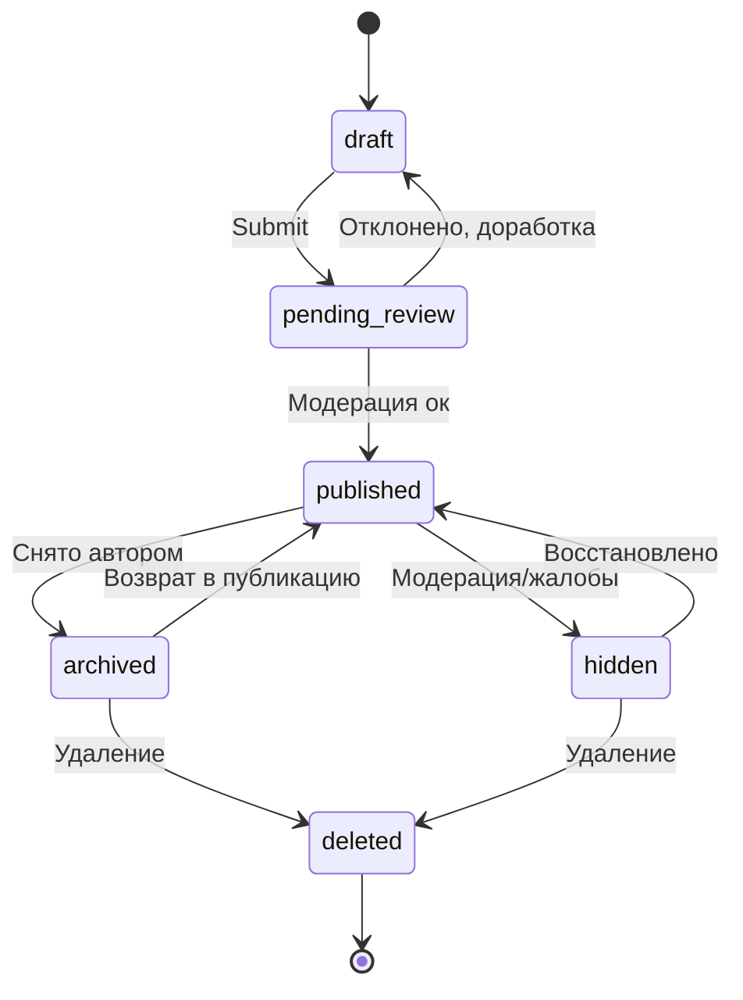
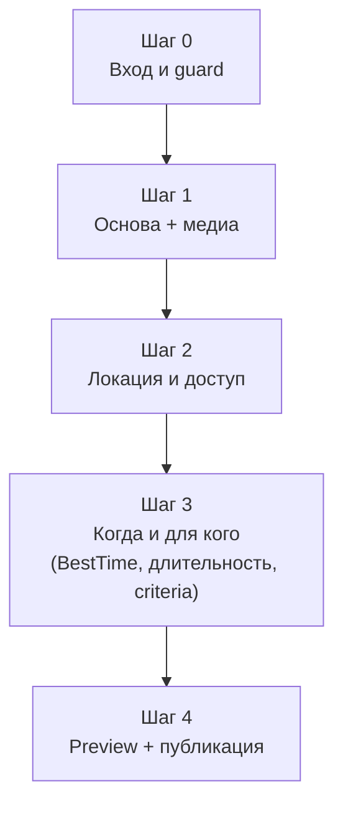

# RECHARGE — Recharge Activity Create Block Spec

- Статус: **Approved slice spec** (утверждено владельцем продукта
  2026-08-17 в чате; slice `ACT-CRT-01`, зарегистрировано в
  `docs/architecture/LAUNCH_STATUS.md` и `AGENTS.md`). Не Accepted ADR —
  этот термин в репозитории зарезервирован за `docs/adr/`.
- Версия: **1.3** (см. §21 Changelog — что и почему изменено против v1.2/v1.1/v1.0)
- Дата: 2026-08-17
- Тип контента: `activity` (`CreateObjectType.activity`, `ContentType.activity`)
- Фактическая реализация на дату документа: тип `Recharge Activity` работает
  только на общем config-driven Create runtime, причём его текущий
  `CreateBlockConfig` **противоречит** целевой модели этого документа:
  `requiresStartDateTime = true` и `priceLabel = 'Expected spend'`
  ([create_taxonomy.dart:85-94](../../apps/mobile/lib/features/create/application/create_taxonomy.dart))
  — то есть форма сейчас ведёт себя как облегчённый Event (требует дату,
  показывает поле цены), а не как evergreen-подсказка без даты и без цены.
  Типо-специфичных секций и доменной модели под `activity` не существует.
  Этот документ фиксирует целевую логику до кодирования, чтобы у Recharge
  Activity появился собственный контракт — по прецеденту, уже пройденному
  для Rental / Equipment (`RENTAL_EQUIPMENT_CREATE_BLOCK_SPEC.md`).

Этот документ утверждён владельцем продукта и **разрешает кодирование**
slice `ACT-CRT-01` по описанной здесь целевой продуктовой и доменной модели
раздела Create → Recharge Activity. Реализация обязана пройти собственные
acceptance criteria (§18), `flutter analyze`/`flutter test` и
boundary-проверки — Approved-статус спеки не заменяет эти гейты, а задаёт,
против чего их проверять.

Важно: по правилу 4 `AGENTS.md`, реализация специализированных секций для
уже утверждённых 10 типов Create Hub (Recharge Activity — один из них)
«является завершением принятого Create Hub scope и не считается новой
фичей» — то есть подготовка и последующая реализация этого документа не
конфликтует с текущим slice «Стабилизация», в отличие от действительно
новых фич.

Связанные источники истины:

- [VISION.md](VISION.md) — тип `2. Recharge Activity` (строка 337);
- [CATEGORY_SYSTEM.md](CATEGORY_SYSTEM.md) — §3 (ContentType↔Create-блоки),
  §6 (criteria-профили `outdoor_activity`, `wellness_session`,
  `physical_activity`, `water_activity`, `adrenaline_activity`), §7.11
  `sport`, §7.13 `outdoor_nature_walking`, §7.14 `water_activities`, §7.15
  `winter_seasonal`, §7.22 `wellness_recharge`;
- [S3_CRT_01_CREATE_SPEC.md](S3_CRT_01_CREATE_SPEC.md) — общий Create flow,
  черновики, автосохранение, публикация;
- [RENTAL_EQUIPMENT_CREATE_BLOCK_SPEC.md](RENTAL_EQUIPMENT_CREATE_BLOCK_SPEC.md) —
  структурный прецедент: как уже утверждённый, но нереализованный тип
  фиксирует целевую логику отдельным документом до кодирования;
- [RECHARGE_ACTIVITY_CREATE_BLOCK_OPEN_QUESTIONS.md](RECHARGE_ACTIVITY_CREATE_BLOCK_OPEN_QUESTIONS.md) —
  6 вопросов §20 этого документа, развёрнутые до вариантов ответа и
  рекомендации, по формату, принятому для Collection/Guide;
- [CLASS_WORKSHOP_EXPERIENCE_CREATE_SPEC.md](CLASS_WORKSHOP_EXPERIENCE_CREATE_SPEC.md) §2.3–2.4 —
  источник формата таблицы «что не является этим типом» и порядка
  разрешения спорных случаев, применённого в §6 этого документа;
- `AGENTS.md` — правило 4 (Create Hub, «не считается новой фичей»), правило
  2 (`loc_*` → ULID при публикации);
- [ADR 0013](../adr/0013-domain-policy-baseline.md) — lifecycle, ownership,
  permissions, moderation, ID, geo, offline, audit;
- [ADR 0015](../adr/0015-authenticated-viewer-verified-creator-professional-page.md) —
  роли, Publisher, Professional Page.

При конфликте действуют приоритеты `AGENTS.md`: Accepted ADR → spec активного
slice → `LAUNCH_STATUS.md` → `VISION.md`. С момента Approved-статуса (v1.3)
этот документ и есть spec активного slice для `ACT-CRT-01` — то есть для
кода, реализующего `CreateObjectType.activity`, он приоритетнее
`LAUNCH_STATUS.md` и `VISION.md`, но по-прежнему уступает Accepted ADR.

## Оглавление

1. [Назначение документа](#1-назначение-документа)
2. [Главный продуктовый инвариант](#2-главный-продуктовый-инвариант)
3. [Зафиксированные решения](#3-зафиксированные-решения)
4. [Референс из индустрии](#4-референс-из-индустрии)
5. [Термины](#5-термины)
6. [Что НЕ является этим типом](#6-что-не-является-этим-типом)
7. [Связь с каноническими решениями](#7-связь-с-каноническими-решениями)
8. [Категории и criteria-профили](#8-категории-и-criteria-профили)
9. [Роли, capabilities и доступ](#9-роли-capabilities-и-доступ)
10. [Жизненный цикл](#10-жизненный-цикл)
11. [Create flow — пошагово](#11-create-flow--пошагово)
12. [Сквозная validation matrix](#12-сквозная-validation-matrix)
13. [Сохранение черновика](#13-сохранение-черновика)
14. [Publish pipeline](#14-publish-pipeline)
15. [Доменная модель](#15-доменная-модель)
16. [Интеграция с Discover](#16-интеграция-с-discover)
17. [Представление в интерфейсе](#17-представление-в-интерфейсе)
18. [MVP scope и acceptance criteria](#18-mvp-scope-и-acceptance-criteria-для-implementation-slice-act-crt-01)
19. [Известные ограничения](#19-известные-ограничения-честно-зафиксированы-не-скрыты)
20. [Открытые вопросы](#20-открытые-вопросы-решает-владелец-продукта)
21. [Changelog](#21-changelog)

## На один экран

| | |
|---|---|
| Что это | Форма создания самостоятельной, evergreen-подсказки «что можно сделать рядом за 30 мин – 4 ч»: без даты, без брони, без организатора, без цены |
| Ключевое отличие от Event/Session | Нет полей даты/времени начала и нет секции Pricing — не UX-упрощение, а структурное ограничение типа (§2) |
| Локация | Может стоять сама по себе (координаты + текст доступа), без обязательной ссылки на Place (§11 Шаг 2) |
| Шагов в форме | 4: вход/guard + 3 содержательных шага (§11) — самая короткая форма из 10 типов Create Hub, что соответствует позиционированию «лёгкая активность» |
| Группа | 1–10 человек — рекомендованный диапазон, не лимит записи (нет учёта участников) |
| Длительность | 30 мин – 4 ч — подсказка диапазона для UI/Discover, не жёсткий валидатор |
| Whitelist категорий | Общий каталог CATEGORY_SYSTEM.md, фильтр по `applicableTypes ∋ activity` (не собственный whitelist, в отличие от Rental) |
| Деньги (v1.1) | Формально бесплатно; допускается необязательный `optionalContribution` — подсказка «здесь принято взять кофе / оставить донат», не тариф (§3.1) |
| Статус документа | **Approved slice spec** (`ACT-CRT-01`) — кодирование разрешено |

## 1. Назначение документа

Зафиксировать для Recharge Activity то же, что уже есть или готовится для
остальных типов Create Hub (Event, Place, Find People, Route, Class/Workshop,
Scenario, Rental): единый источник истины о том, какие данные собирает форма
создания, в каком порядке, с какими правилами валидации и с какой доменной
моделью. До этого документа существовала только одна строка в `VISION.md` и
общий generic runtime, скопированный с конфигурации Event — без учёта того,
что Recharge Activity продуктово устроена принципиально иначе (нет даты, нет
цены, необязательна привязка к Place).

Документ написан по итогам продуктового разбора: границы типа были размыты
(его легко спутать с Event, Place, Route, Session и Quick Plan одновременно),
и первым шагом стало не описание формы, а чёткое определение самого типа —
см. §2 и §6.

## 2. Главный продуктовый инвариант

**Recharge Activity — это самостоятельная, evergreen-подсказка о лёгком
занятии (30 мин – 4 ч, ориентировочно 1–10 человек), не привязанная к
конкретному моменту времени, не требующая организатора, брони и оплаты.
Пользователь не «записывается» и не «идёт на мероприятие» — он просто
использует появившееся окно времени, чтобы сделать что-то рядом.**

Следствия:

- у Activity **нет даты/времени начала** — она не «происходит», она
  постоянно доступна как рекомендация (в отличие от Event, где момент
  начала — обязательный атрибут);
- у Activity **нет секции Pricing** в смысле Event/Session/Rental — нет
  тарифов, нет обязательной оплаты за доступ, нет Booking. Если по факту есть
  цена входа или обязательный платёж — это уже Event, Session или Rental, а
  не Activity. Единственное допустимое денежное упоминание —
  необязательный `optionalContribution` (v1.1, §3.1): мягкая подсказка
  «здесь принято взять кофе или оставить донат», не тариф и не условие
  доступа;
- Activity **не обязана ссылаться на существующий Place** — она может нести
  собственные координаты и текстовое описание доступа. Это специально
  снимает проблему «спорных» неофициальных точек (например — природная
  смотровая площадка без инфраструктуры, частично проходящая по границе
  частной территории): создавать под них сомнительный постоянный Place не
  нужно, но предупредить пользователя о характере доступа необходимо (см.
  `accessCaution` в §11 Шаг 2 и §15);
- Activity не имеет организатора-ведущего и не управляет составом участников
  — это отличает её от Class/Workshop (обучающая программа с инструктором) и
  от Find People (публичный запрос собрать конкретных людей);
- Activity не является физическим треком с GPX/км-отметками — если ценность
  именно в самом маршруте как объекте (тропа, дистанция, elevation), это
  Route, а не Activity, даже если оба «про прогулку».

## 3. Зафиксированные решения

Три развилки, определяющие тип, обсуждены и закрыты владельцем продукта до
написания этого документа:

| # | Развилка | Решение | Почему |
|---|---|---|---|
| 1 | Может ли Activity иметь дату/время начала? | **Нет.** Только evergreen, без привязки к моменту | Даёт чёткую механическую границу с Event: не текстовая конвенция, а отсутствие полей в форме и модели |
| 2 | Обязана ли Activity ссылаться на Place? | **Нет.** Может нести координаты/access-описание сама | Снимает блокировку для неофициальных, но ценных точек без готового Place-объекта; не плодит сомнительные постоянные Place-карточки |
| 3 | Нужно ли поле цены (Pricing)? | **Нет, поля нет вообще** | Тип по определению бесплатный/самостоятельный; наличие поля само по себе размыло бы границу с дешёвым Event |

Эти решения — не рекомендации, а зафиксированная основа документа: все
разделы ниже (домен, форма, валидация) написаны в их предположении.

### 3.1 Пересмотр v1.1: необязательный взнос

Решение №3 уточнено (не отменено): «нет Pricing» остаётся в силе в смысле
Event/Session — нет тарифов, нет обязательной оплаты, нет Booking. Но
практика показала пробел: часть активностей физически находится на закрытой
или частной территории, куда доступ держится не на формальном билете, а на
неформальном обычае — «загляни, возьми кофе» или благотворительный взнос.
Запрещать это поле означало бы либо заставлять Creator врать («Free», хотя
по факту ожидается покупка), либо создавать такую точку как Event с
формальной ценой, что искажает её природу (доступ всё ещё не забронирован,
не ограничен по времени, не имеет билета).

Решение: добавляется одно необязательное поле `optionalContribution`
(§11 Шаг 2, §15) — свободный текст + опциональная сумма-подсказка, не
структурированный Money-тариф. Поле:

- не блокирует publish, если не заполнено;
- не создаёт Booking, CTA оплаты или проверку доступа;
- существует независимо от `accessCaution` — «закрытая зона» и
  «здесь просят взнос» разные по смыслу флаги, которые могут встречаться
  по отдельности (открытый парк с донат-боксом; закрытая территория без
  всякого взноса) или вместе.

## 4. Референс из индустрии

Recharge Activity не имеет прямого peer-to-peer аналога (это не листинг
предложения от одного пользователя другому, как Turo/Fat Llama для Rental).
Ближе всего два паттерна:

- **AllTrails, слой «Nearby»/пользовательские POI** — точки интереса, у
  которых зачастую нет официальной инфраструктуры: только координаты,
  community-описание доступа и предупреждения («частная земля рядом»,
  «грунтовая дорога», «сезонно труднопроходимо»). Recharge заимствует именно
  этот принцип для `Location` (§11 Шаг 2): точка может существовать без
  формального объекта-владельца, но обязана нести честный access-контекст.
- **Google Maps «Things to do nearby» / короткие городские гиды (Time Out
  «free things to do»)** — карточки формата «что сделать рядом прямо
  сейчас», сгруппированные по времени/бюджету, без даты и без брони. Оттуда
  взят сам принцип evergreen-карточки: ценность не в «когда», а в «что и где
  можно сделать в ближайшие часы».

Из обоих источников Recharge берёт **честный access-контекст без обязательной
инфраструктуры** и **evergreen-подачу без даты**, но не берёт социальный слой
(отзывы троп, фото-ленты сообщества) — это остаётся зоной Route/Place, не
дублируется здесь.

## 5. Термины

| Термин | Значение |
|---|---|
| `RechargeActivity` | Объект Create: одна карточка-подсказка («Coffee walk у канала») |
| Evergreen | Свойство карточки: доступна в любой день/час, не привязана к конкретной дате |
| `accessNotes` | Текстовое описание, как физически добраться и что учитывать (тип дороги, обозначения, сезонность) |
| `accessCaution` | Явный флаг + заметка о нестандартном статусе доступа точки (не официальный объект, частично частная территория, животные/собаки и т.п.) |
| `bestTime` | Рекомендация по времени суток/сезону, когда активность наиболее ценна (например, sunset walk → вечер) — переиспользует целевое поле `BestTimeToVisit`, уже заявленное в `VISION.md` и `ROUTE_BUILDER_SPEC.md`, но пока нигде не реализованное в коде |
| `suggestedGroupSize` | Рекомендованный диапазон участников (по умолчанию 1–10) — подсказка, не лимит записи |
| `typicalDuration` | Диапазон длительности (по умолчанию 30–240 мин) — подсказка для UI/фильтра, не технический потолок |
| `linkedPlaceId` | Опциональная ссылка на существующий Place, если активность физически происходит в уже описанном месте (кафе, парк) |
| `optionalContribution` (v1.1) | Необязательная мягкая подсказка о принятом на месте взносе — покупка (кофе на кассе) или донат/благотворительность. Не тариф, не условие доступа, не Booking; независим от `accessCaution` |

## 6. Что НЕ является этим типом

По образцу `CLASS_WORKSHOP_EXPERIENCE_CREATE_SPEC.md` §2.3–2.4.

| Случай | Канонический тип |
|---|---|
| Есть конкретная дата/время начала, к которому нужно подойти | Event |
| Нужно забронировать слот/место заранее | Bookable Session |
| Есть организатор, который ведёт занятие по программе | Class / Workshop / Experience |
| Ценность — сама точка на карте (кафе, парк, музей как объект), а не действие в ней | Place / Business |
| Это непрерывный трек с GPX, км-отметками, точками по дистанции | Route |
| Публичный запрос собрать конкретных людей под занятие | Find People |
| Набор из нескольких точек с логистикой между ними | Quick Plan / Scenario |
| Курируемая подборка нескольких мест/активностей на тему («Recharge после работы: Резекне») | Collection / Guide |
| Есть цена входа, аренды инвентаря на месте или другая оплата | Event, Session или Rental — в зависимости от природы платежа |

### 6.1 Разрешение спорных случаев

Контроллер применяет решение в таком порядке:

1. Есть обязательная дата/время начала — `Event`.
2. Нужна бронь конкретного слота — `Bookable Session`.
3. Есть учебная программа с инструктором — `classWorkshop`.
4. Ценность в самой точке, а не в действии, и точка не нуждается в
   access-предупреждениях (официальная, с инфраструктурой) — `Place`.
5. Есть трек/дистанция с km-отметками — `Route`.
6. Ничего из вышеперечисленного — `activity`.

## 7. Связь с каноническими решениями

1. Canonical type id — `activity` (`ContentType.activity` в
   `CATEGORY_SYSTEM.md`, `CreateObjectType.activity` в
   [create_draft_entity.dart:10](../../apps/mobile/lib/features/create/domain/entities/create_draft_entity.dart)).
   Отдельного legacy alias нет.
2. Категория **не** имеет собственного whitelist (в отличие от Rental) — по
   `CATEGORY_SYSTEM.md` §3 п.1 общий `applicableTypes`-реестр применяется
   ко всем шести перечисляемым типам, включая `activity` (`да (A)`, строка
   102). §8 этого документа перечисляет, какие категории и подкатегории
   фактически несут флаг `A`.
3. ID — ULID, генерируются на клиенте; `loc_*` — только для несохранённого
   локального черновика, заменяется на постоянный ULID при публикации
   (правило 2 `AGENTS.md`).
4. Publisher — общий contract `{type: user | page, id}` (ADR 0015). Activity
   обычно публикуется от личного профиля Creator, но не запрещена и от
   Professional Page (например, спортшкола делится бесплатной подсказкой).
5. Lifecycle — общий 6-статусный `draft → pending_review → published →
   archived/hidden → deleted` по ADR 0013, без изменений (§10).
6. `BestTimeToVisitSection`/`bestTime` — переиспользуется тот же целевой
   концепт, что заявлен для Place/Route в `VISION.md`, но физически ещё не
   реализован ни в одном типе; этот документ не изобретает параллельную
   модель, а описывает целевое поле в ожидании общей реализации.

## 8. Категории и criteria-профили

В отличие от Rental, у `activity` нет собственного whitelist — доступность
определяется общим флагом `A` в `applicableTypes` категории/подкатегории
`CATEGORY_SYSTEM.md`. Флаг `A` встречается в пяти категориях (не только в
`wellness_recharge`, как можно было бы предположить из позиционирования):

| Категория | §CATEGORY_SYSTEM | applicableTypes | Criteria-профиль (default) | Примеры подкатегорий с `A` |
|---|---|---|---|---|
| `wellness_recharge` | §7.22 | `[E, A, S]` | `wellness_session`; walk-подмножество → `outdoor_activity` | `nature_reset`, `digital_detox`, `slow_morning`, `evening_reset`, `couple_recharge`, `solo_recharge`, `friends_recharge`, `recharge_walk`, `calm_walk`, `mindful_walk`, `coffee_walk`, `tea_walk` |
| `outdoor_nature_walking` | §7.13 | `[E, A, R]` | `outdoor_activity` (distance_km, difficulty*, terrain, weather_dependent) | `hiking`, `nature_walk`, `city_walk`, `sunset_walk`, `sunrise_walk`, `park_walk`, `beach_walk`, `slow_walk`, `birdwatching`, `stargazing` |
| `sport` | §7.11 | `[E, A, S]` | `physical_activity` (skill_level*, equipment_provided, venue_type, pace) | `running`, `cycling`, `swimming`, `climbing`, `bouldering`, `nordic_walking`, `skating`, `golf` (без командных `[E]`-only — `football`/`basketball`/`volleyball`/`frisbee` — и соревновательных исключений) |
| `water_activities` | §7.14 | `[E, A, S]` | `water_activity` (equipment_provided*, swimming_required*, difficulty, weather_dependent) | `sup`, `kayak`, `canoe`, `rowing`, `snorkeling`, `surfing`; `beach_activity`/`beach_day` явно помечены `[E, A]` |
| `winter_seasonal` | §7.15 | `[E, A]` | `outdoor_activity` | `winter_walk`, `winter_hiking`, `sledding`, `autumn_leaf_walk`, `spring_blossom_walk`, `seasonal_walk`, `snow_activity` |

Плюс единичное исключение: `parkour` (`adrenaline_entertainment`, §7.23)
явно помечен `[E, A, C]`, профиль `adrenaline_activity`.

Практический вывод: Recharge Activity — не только «прогулки после работы»
(хотя это и есть основной мотивирующий сценарий, см. §4), а весь класс
самостоятельных, evergreen, бесплатных занятий — включая, например, соло-
пробежку, самостоятельный SUP-выход или лёгкую зимнюю прогулку. Выбор
`categoryId`/`subcategoryId` на шаге 1 (§11) автоматически подтягивает
`profileId` подкатегории (или дефолт категории) → `dynamic_criteria_section`
рендерит поля профиля, без отдельной Activity-специфичной логики (правило
§5 `CATEGORY_SYSTEM.md`: «Профили вместо пер-категорийных форм»).

`defaultCategoryId = 'wellness_recharge'`, `defaultSubcategoryId =
'recharge_walk'` уже зафиксировано в `create_taxonomy.dart` и остаётся
дефолтом первого шага.

**Governance расширения флага `A` (v1.2, решён открытый вопрос №3 §20.1):**
добавление флага `A` дополнительным категориям/подкатегориям каталога — не
предмет ревизии этого документа, а обычный процесс `CATEGORY_SYSTEM.md`
§11 («добавление подкатегории — свободно, данные»). Activity намеренно не
повторяет модель Rental с собственным закрытым whitelist (§7 п.2) — два
источника истины для одного и того же решения не заводятся.

## 9. Роли, capabilities и доступ

- Публикация (Submit/Publish) Recharge Activity — Creator (как у всех 10
  типов; `VISION.md`: «Доступ: Creator (все типы)»).
- **Viewer-исключение (v1.2, решён открытый вопрос №1 §20.1):**
  Viewer без Creator-статуса может создать и сохранить **локальный
  pre-verification draft** Activity — по тому же общему правилу VISION, что
  и для личного Scenario («Viewer может получить разрешённое локальное
  personal/pre-verification authoring без Submit/Publish»). Activity ближе по
  природе к личному Scenario (самостоятельное, не коммерческое), чем к
  Rental, где такого исключения нет. Submit и Publish остаются заблокированы
  до получения Creator capability — исключение касается только локального
  черновика.
- Publisher — `user` или `page` (§7 п.4); отдельная capability `create.activity`
  не нужна сверх общей Creator capability.

## 10. Жизненный цикл

Стандартный 6-статусный lifecycle по ADR 0013, без отклонений (нет
occurrence-состояний, в отличие от Event):



`published` не зависит от даты (её просто нет) — карточка остаётся видимой в
Discover до тех пор, пока автор или модерация её не снимут. Это отличие от
Event, где `published` дополнительно фильтруется по актуальности occurrence.

## 11. Create flow — пошагово

Recharge Activity использует общий config-driven form engine Create Hub
(правило 4 `AGENTS.md`) — отдельного визарда не создаётся. Форма — самая
короткая из 10 типов: **3 содержательных шага**, что само по себе
сигнализирует Creator'у «лёгкая» природу типа ещё до заполнения.



### Шаг 0. Вход и guard

1. Пользователь выбирает `Recharge Activity` в Create Hub.
2. Guest проходит Auth и возвращается в intended route.
3. Creator capability не блокирует вход в форму (§9): без неё пользователь
   создаёт и сохраняет локальный draft как Viewer; кнопки Submit/Publish
   на шаге 4 показывают explicit gate «нужен Creator-статус», только когда
   пользователь пытается отправить черновик дальше draft.
4. При незавершённом черновике — предложение Continue / Start new.
5. Новый локальный draft получает `loc_*`; сохранённый — постоянный ULID.

### Шаг 1. Основа и медиа (`NameDescription` + `Media`)

| Поле | Обязательное | Правило |
|---|---:|---|
| `title` | Да | 5–80 символов («Coffee walk у канала») |
| `categoryId` | Да | Только категории/подкатегории с флагом `A` в `applicableTypes` (§8) |
| `subcategoryId` | Да | Активная подкатегория выбранной категории |
| `shortDescription` | Да | 20–180 символов |
| `fullDescription` | Нет | До 1000 символов — короче, чем у Event/Rental: тип по определению лёгкий |
| `coverImage` | Да | Минимум одно фото места/атмосферы |
| `gallery` | Нет | До лимита media policy |

### Шаг 2. Локация и доступ (облегчённый `Location`)

Ключевое структурное отличие от остальных типов: нет обязательной ссылки на
Place, зато обязателен честный access-контекст.

| Поле | Обязательное | Правило |
|---|---:|---|
| `geo {lat, lng}` | Да | Подтверждённый pin |
| `addressLine` | Нет | Свободный текст, если есть формальный адрес |
| `accessNotes` | Да | 10–300 символов: как добраться, тип дороги/тропы, ориентиры. Обязательно даже для «обычных» точек — задаёт культуру честного описания доступа |
| `accessCaution.isInformal` | Нет | `true`, если точка не является официальным объектом (нет инфраструктуры, возможна частная земля рядом, сезонная проходимость) |
| `accessCaution.note` | Условно | Обязательна при `isInformal = true`; до 200 символов, конкретно что учитывать (например: «часть склона — огороженная частная территория, не заходить за забор»; «возможны собаки») |
| `linkedPlaceId` | Нет | Опциональная ссылка на существующий Place, если активность происходит в уже описанном объекте (парк, кафе); не заменяет `geo`/`accessNotes` |
| `optionalContribution.kind` | Нет | `purchase \| donation \| other`; поле появляется, только если Creator явно включает блок «Здесь принято оставить взнос» — по умолчанию блок свёрнут и пуст |
| `optionalContribution.note` | Условно | Обязательна, если `kind` задан; 10–140 символов, свободный текст («Кофе на кассе, необязательно»; «Донат на уборку парка») |
| `optionalContribution.amountHint` | Нет | Опциональная `Money`-подсказка ориентировочной суммы (например «~3 €») в minor units + currency активного market, как и везде в репозитории (Riga → EUR); не тариф, не проверяется как обязательный платёж |

Поле независимо от `accessCaution`: обе пары флагов могут быть заданы по
отдельности или вместе (§3.1).

Правило модерации: `accessCaution.isInformal = true` не блокирует публикацию
и не требует создания Place — это ровно тот случай, ради которого §2 и §3
зафиксировали независимость Activity от Place. Модерация проверяет, что
заметка не поощряет прямое нарушение (нет вроде «перелезайте через забор»),
а честно предупреждает.

### Шаг 3. Когда и для кого

Заменяет отсутствующие дату/цену/бронирование: даёт пользователю понимание
контекста без обязательств.

| Поле | Обязательное | Правило |
|---|---:|---|
| `bestTime.timeOfDay` | Нет | `morning \| afternoon \| evening \| night \| any`; предзаполняется из `impliedFacets` подкатегории, если есть (например `sunset_walk` → `evening`, `slow_morning` → `morning`, см. `CATEGORY_SYSTEM.md` §9) |
| `bestTime.season` | Нет | `winter \| spring \| summer \| autumn \| any`; аналогично из `seasonality` подкатегории (например `autumn_leaf_walk`) |
| `typicalDurationMinutes {min, max}` | Да | По умолчанию `30–240` — подсказка диапазона, не жёсткий валидатор; Creator может сузить или расширить |
| `suggestedGroupSize {min, max}` | Нет | По умолчанию `1–10` — рекомендация, не лимит записи (никакого учёта фактических участников, в отличие от `Capacity` у Event/Session) |
| Criteria (`dynamic_criteria_section`) | По профилю | Поля профиля подкатегории (§8): например для `outdoor_activity` — `distance_km`, `difficulty*`, `terrain`, `weather_dependent` |

### Шаг 4. Превью и публикация

- Preview повторяет public Details карточку целиком, включая
  `accessCaution`-предупреждение, если оно есть.
- Validation summary ведёт к конкретному полю/шагу.
- Publish не показывает и не запрашивает никаких данных о цене — поля нет в
  принципе (§2).
- Автор может опубликовать сразу или как `pending_review`/`draft` — по общей
  moderation policy типа.
- Двойное нажатие Publish использует один idempotency key (общий паттерн
  Create Hub).

## 12. Сквозная validation matrix

| Условие | Обязательное поведение |
|---|---|
| `categoryId`/`subcategoryId` вне множества с флагом `A` | Publish заблокирован, предложена смена категории |
| `accessNotes` пуст | Publish заблокирован |
| `accessCaution.isInformal = true` без `accessCaution.note` | Publish заблокирован, подсказка на шаге 2 |
| 4-я и последующая активная карточка с `accessCaution.isInformal = true` от одного Creator (v1.2, решён открытый вопрос №2 §20.1) | Publish **не блокируется** — `entityStatus = published` как обычно, `moderationStatus = flagged_for_review`, модератор получает приоритетное уведомление; первые 3 такие карточки публикуются без задержки |
| `optionalContribution.kind` задан без `optionalContribution.note` | Publish заблокирован, подсказка на шаге 2 |
| `optionalContribution.amountHint` задан без `kind`/`note` | Publish заблокирован — сумма не может существовать без пояснения, что это за взнос |
| `optionalContribution` не заполнен вовсе | Не блокирует ничего — поле полностью необязательно (§3.1) |
| `typicalDurationMinutes.min > typicalDurationMinutes.max` | Publish заблокирован |
| `suggestedGroupSize.min > suggestedGroupSize.max` (если оба заданы) | Publish заблокирован |
| Обязательное поле профиля (например `difficulty*` у `outdoor_activity`) не заполнено | Publish заблокирован, подсказка на шаге 3 |
| Попытка задать формальную цену/тариф/дату (`Pricing`, `startDateTimeUtc`) через API/старый draft-формат | Значение игнорируется и не сохраняется — этих полей в целевой модели `activity` нет и не будет (§15.1). Не путать с допустимым `optionalContribution` — это разные структуры |
| `coverImage` отсутствует | Publish заблокирован |

Cross-field validator работает одинаково в preview, publish и update; UI
validation — подсказка, authoritative validation повторяется в
domain/backend boundary (общий принцип репозитория).

## 13. Сохранение черновика

Полностью переиспользует общий контракт Create Hub
(`S3_CRT_01_CREATE_SPEC.md`):

1. Autosave локально после debounce и при выходе со шага.
2. Черновик хранит `schemaVersion`, `updatedAtUtc`, dirty state.
3. Offline draft разрешён; публикация offline — нет.
4. Конфликт синхронизации — last-write-wins с предупреждением (ADR 0013).
5. При публикации `loc_*` ID активности заменяется на ULID.

## 14. Publish pipeline

Тот же общий порядок, что у остальных типов Create Hub:

1. Auth/session validation.
2. Capability validation.
3. Schema migration до актуальной версии.
4. Нормализация строк и координат (денег в pipeline нет — у типа их не
   существует).
5. Полная domain validation (§12).
6. Проверка запрещённого контента (например, `accessCaution.note`,
   поощряющая нарушение доступа, — блокирует publish, не только предупреждает).
7. Rate limit / duplicate check.
8. Замена временного ID на ULID.
9. Создание immutable publisher reference.
10. Запись объекта с idempotency key.
11. Выбор `pending_review` или `published` по moderation policy.
12. Обновление локального draft после подтверждённого результата.
13. Analytics и audit event.

## 15. Доменная модель

Целевой domain contract. Имена нормативны по смыслу; точный Dart API
утверждается implementation slice без изменения семантики.

```text
RechargeActivity {
  id: ULID
  publisherRef: { type: user | page, id: ULID }

  title: String
  categoryId: String
  subcategoryId: String
  shortDescription: String
  fullDescription: String?
  mediaRefs: List<MediaRef>

  geo: GeoPoint
  addressLine: String?
  accessNotes: String
  accessCaution: AccessCaution?
  linkedPlaceId: ULID?
  optionalContribution: OptionalContribution?

  bestTime: BestTime?
  typicalDurationMinutes: { min: int, max: int }
  suggestedGroupSize: { min: int, max: int }?
  criteria: Map<String, dynamic>   // поля criteria-профиля подкатегории

  entityStatus: draft | pending_review | published | archived | hidden | deleted
  moderationStatus: none | pending | flagged_for_review | approved | rejected
  visibility: public | unlisted

  createdAtUtc: Instant
  updatedAtUtc: Instant
  publishedAtUtc: Instant?
  schemaVersion: int
}

AccessCaution {
  isInformal: bool
  note: String?
}

OptionalContribution {
  kind: purchase | donation | other
  note: String
  amountHint: Money?
}

BestTime {
  timeOfDay: morning | afternoon | evening | night | any
  season: winter | spring | summer | autumn | any
}
```

### 15.1 Инварианты модели

- В модели **намеренно отсутствуют** любые поля даты/времени начала,
  повторяемости (`RecurrenceScheduleSection`) и формальной секции цены/оплаты
  (`Pricing`, тарифы, Booking) — это не временный пробел MVP, а определяющее
  свойство типа (§2). Миграция/импорт из других типов не должна тихо
  подставлять эти поля пустыми значениями по умолчанию — они должны
  отсутствовать структурно.
- `optionalContribution` (v1.1) — единственное допустимое денежное поле, и
  оно принципиально не `Pricing`: нет тарифных единиц, нет обязательности,
  `amountHint` не участвует в проверке доступа и не может использоваться как
  условие CTA. `note` обязателен, если `kind` задан; `amountHint` без `kind`/
  `note` невалиден (§12).
- `accessCaution.isInformal = true`-карточки сверх третьей активной у одного
  Creator (v1.2) публикуются с `entityStatus = published` как обычно, но
  `moderationStatus = flagged_for_review` вместо `approved` — модерация
  проверяет постфактум, видимость в Discover не блокируется, публикация не
  гейтуется (§12).
- `accessCaution.isInformal = true` требует непустой `note`; `false` или
  `null` не требует.
- `linkedPlaceId`, если задан, не заменяет `geo`/`accessNotes` — они
  остаются источником истины для отображения на карте (Activity не
  наследует местоположение Place динамически, чтобы не создавать скрытую
  зависимость от чужого жизненного цикла).
- `typicalDurationMinutes.min ≤ typicalDurationMinutes.max`;
  `suggestedGroupSize.min ≤ suggestedGroupSize.max`, если оба заданы.
- `suggestedGroupSize` и `typicalDurationMinutes` — read-only подсказки для
  UI/фильтров, не источник для какого-либо учёта участников или брони: у
  типа нет Booking-сущности и не должно быть.
- `criteria` — тот же generic-контракт `Map<fieldId, value>`, что и у
  остальных типов, по `CATEGORY_SYSTEM.md` §5, без Activity-специфичного
  отклонения.

## 16. Интеграция с Discover

`activity` — content type, участвует в общем `search → filters → map → feed
→ details` (ADR 0013). Специфичные для типа фильтры:

| Discover filter | Activity semantics |
|---|---|
| Text | title, description, category/subcategory |
| Category | Только категории/подкатегории с флагом `A` (§8) |
| Distance | До `geo` |
| Time available | По `typicalDurationMinutes` — пересекается с быстрыми сценариями Search «30 мин / 1 час / 2–3 часа» из `VISION.md` |
| Mood/Time of day | По `bestTime.timeOfDay`, если задан |
| Season | По `bestTime.season`, ранжирование понижает несезонные карточки, не скрывает (тот же принцип `seasonality`, что у категорий) |
| Budget | Формального тарифа нет; в фильтре «Бесплатно» Activity участвует всегда, включая карточки с `optionalContribution` — взнос необязателен по определению (§3.1), поэтому не исключает объект из «бесплатных» |
| Suggested contribution (опциональный badge-фильтр) | По наличию `optionalContribution` — для пользователей, которые сознательно ищут «места, где принято оставить донат» |

Ranking не использует `amountHint` как сигнал цены и не смешивает Activity с
Event-occurrence логикой (нет понятия «предстоящая/прошедшая» — карточка
всегда актуальна, пока не архивирована).

### 16.1 Отдельный слой обнаружения (v1.2, решён открытый вопрос №6 §20.1)

Изначальное позиционирование типа («после работы, показать людям места
рядом для быстрой перезагрузки») требует не только категорийного фильтра
внутри общего Search, а выделенной, всегда живой поверхности именно для
`activity`-объектов. Это отдельный механизм от Collection/Guide: Collection
остаётся ручной editorial-курацией («гид по городу от редакции», §6 этого
документа), новый слой — алгоритмический и live, не требует ручной сборки.
Оба механизма не взаимоисключающие и могут сосуществовать для одного города.

Конкретная реализация в рамках уже принятых паттернов VISION.md (без
изобретения нового UI-примитива):

1. **Search — новый quick-сценарий «Recharge now»**, наравне с уже
   принятыми «Near me now», «For two», «Low budget», «1 hour», «Calm
   evening» (`VISION.md`, Search). Чип сразу фильтрует по
   `ContentType.activity` и ранжирует по близости `bestTime.timeOfDay` к
   текущему времени суток (вечерний запрос поднимает `evening`-помеченные
   карточки).
2. **Home — кандидат-рейл «Recharge nearby»**, по аналогии с уже
   существующими лентами Nearby/Popular/For you/New/Quick events. В отличие
   от п.1, это расширяет список лент на главном экране, который явно
   регулируется правилом `VISION.md` «Home не перегружаем» — поэтому это
   **не финализируется этим документом**, а выносится отдельным пунктом
   решения для владельца продукта при следующей ревизии Home (см. §20 новый
   открытый пункт).
3. Map/Feed изменений не требуют — обычный категорийный фильтр
   `ContentType.activity` уже покрывает пункт 1, слой обнаружения — это
   способ *подсветить* фильтр, а не новая модель данных.

Минимальное следствие для `VISION.md`: строка Search «Быстрые сценарии»
дополняется пунктом «Recharge now» — правка внесена этим же изменением
(см. ниже, правка VISION.md).

## 17. Представление в интерфейсе

### 17.1 Карточка Results/Feed

- badge `Recharge Activity`;
- title, category/subcategory;
- обложка;
- расстояние до `geo`;
- `typicalDurationMinutes` как диапазон («30–60 мин»);
- `bestTime.timeOfDay`, если задан, — иконкой (например, закат для evening);
- badge `Free` — по умолчанию; если задан `optionalContribution`, badge
  меняется на `Free · Coffee/donation welcome` (текст зависит от `kind`) —
  честно показывает норму места, не скрывая её за общим «Free», но и не
  выдавая взнос за обязательный платёж.

### 17.2 Details

Порядок блоков:

1. Hero, badge `Recharge Activity`, title, save/share.
2. Описание.
3. Мини-карта с `geo`, `accessNotes` и явным предупреждением, если
   `accessCaution.isInformal = true` (визуально отделено от обычного
   описания — не спрятано в общий текст).
4. Когда лучше идти (`bestTime`) и рекомендованная длительность/размер
   компании — оба явно подписаны как рекомендации, не как факты записи.
5. `optionalContribution`, если задан, — отдельным ненавязчивым блоком
   рядом с access-информацией («Здесь принято: Кофе на кассе, необязательно
   · ~3 €»), визуально отличным от гипотетической цены/тарифа — без иконки
   «Book»/«Pay», только информационная плашка.
6. Criteria-бейджи (сложность, дистанция, экипировка — по профилю).
7. Издатель: publisher profile, report/block (§17.3 — единственный путь
   репорта, отдельной CTA нет).
8. Ссылка на `linkedPlace`, если задана — переход в Place Details.

Нет CTA «Записаться»/«Забронировать» — у типа нет объекта для брони; вместо
этого — `Save`/`Share`/`Get directions`.

### 17.3 Report/CTA policy (v1.2, решён открытый вопрос №4 §20.1)

Отдельной CTA «Report a problem with this spot» нет — используется общий
report/block механизм платформы (пункт 7 списка §17.2 выше), тот же, что и
у остальных 9 типов Create Hub. Решение пересматривается, если после
запуска жалобы конкретно по `accessCaution`-точкам покажут паттерн, не
покрываемый общим механизмом (например, отдельная категория повода жалобы
«доступ закрыт/опасен»).

## 18. MVP scope и acceptance criteria для implementation slice `ACT-CRT-01`

Утверждённый набор AC для slice `ACT-CRT-01` (Approved v1.3):

1. `activity` получает собственный `RechargeActivityDraftData`, отдельный от
   общего `sectionData`-заглушки, по образцу `PlaceDraftData`.
2. `CreateBlockConfig` для `activity` в `create_taxonomy.dart` приводится в
   соответствие §2/§11: `requiresStartDateTime = false`, `priceLabel`
   удаляется или помечается неприменимым, `locationLabel` меняется на
   формулировку, отражающую самостоятельный визит, а не встречу («Where to
   go», не «Meeting place»).
3. Реализован облегчённый `Location`-вариант с `accessNotes`/`accessCaution`
   (§11 Шаг 2) — без принудительной привязки к Place.
4. Реализовано целевое поле `bestTime` (§15) — если к моменту slice общий
   `BestTimeToVisitSection` уже реализован для Place/Route, Activity его
   переиспользует; если нет — slice не блокируется и заводит поле локально
   с последующей унификацией.
5. Целиком реализованы шаги 0–4 из §11 с валидацией §12.
6. Category picker на шаге 1 фильтрует по флагу `A` в `applicableTypes`
   (§8), не по общему нефильтрованному каталогу.
7. Discover-фильтры включают `Time available` и не показывают Activity в
   любых price-based фильтрах, кроме «Бесплатно».
8. `flutter analyze` — 0 ошибок; целевые unit/widget тесты по
   `RechargeActivityDraftData`, validation matrix и publish pipeline —
   зелёные; полный `flutter test` не регрессирует.
9. Boundary/diff checks проходят без новых нарушений.
10. `LAUNCH_STATUS.md` и таблица статусов `AGENTS.md` обновляются синхронно.

## 19. Известные ограничения (честно зафиксированы, не скрыты)

- `accessCaution` — декларативное текстовое поле, не юридическая проверка
  прав доступа к территории; Recharge не верифицирует статус земли и
  полагается на добросовестность Creator и последующую модерацию/жалобы.
- `bestTime`/`typicalDurationMinutes`/`suggestedGroupSize` — все три поля
  являются подсказками, не проверяемыми фактами; Recharge не может
  зафиксировать, что пользователь действительно провёл там именно столько
  времени или именно в такой компании.
- Отсутствие Booking/Capacity означает, что Recharge принципиально не знает,
  сколько людей воспользовались подсказкой — это осознанный компромисс
  самого типа (§2), не технический пробел.
- До реализации общего `BestTimeToVisitSection` (используемого также Place
  и Route) поле `bestTime` в Activity может временно жить как локальный
  дубль — унификация обязательна при первой совместной реализации (см. AC
  §18.4).
- `optionalContribution` (v1.1) — декларативная подсказка, не платёжный
  инструмент: Recharge не принимает, не проверяет и не подтверждает
  фактический взнос. Формулировка в UI должна исключать любой намёк на
  обязательность («здесь принято», не «требуется оплатить»), иначе граница
  с Event/Session по цене (§2) размывается на практике, даже если формально
  сохраняется в модели.
- **Moderator playbook по `optionalContribution.kind = donation` (v1.2,
  решён открытый вопрос №5 §20.1):** автоматического
  числового порога на `amountHint` нет — вводить его без статистики по
  реальным заявкам преждевременно. Вместо этого зафиксирован критерий
  ручной проверки по report: если заявленный `donation.amountHint` заметно
  выше типичного доната по региону/категории, модератор трактует это как
  вероятный скрытый тариф и вправе отклонить публикацию или запросить у
  Creator уточнение/понижение суммы, либо предложить пересоздать объект как
  Event/Session с честной ценой. Технический механизм не меняется —
  критерий применяется в рамках уже существующего report/moderate потока.

Governance расширения флага `A` и решение по Report CTA — не ограничения, а
закрытые решения; вынесены в §8 и §17.3 соответственно, рядом с логикой,
которую они определяют.

## 20. Открытые вопросы (решает владелец продукта)

### 20.1 Отвечено (v1.2)

Все шесть вопросов v1.1 отвечены владельцем продукта; развёрнутые варианты,
рекомендации и итоговые ответы — в
[RECHARGE_ACTIVITY_CREATE_BLOCK_OPEN_QUESTIONS.md](RECHARGE_ACTIVITY_CREATE_BLOCK_OPEN_QUESTIONS.md).
Сводка и раздел применения:

| # | Вопрос | Ответ | Применено в |
|---|---|---|---|
| 1 | Viewer-доступ | A — локальный draft разрешён, Submit/Publish только Creator | §9 |
| 2 | Лимит informal-точек | B, порог = 3 — 4-я+ карточка помечается для ручной проверки, не блокируется | §12, §15.1 |
| 3 | Governance флага `A` | A — решает Category System §11, без отдельного whitelist | §8 |
| 4 | Report CTA | A — общий report/block механизм, отдельной CTA нет | §17.3 |
| 5 | Эскалация по donation | C — moderator playbook без автоматического числового порога | §19 |
| 6 | Связь с Collection/city-гидами | Третий вариант — собственный отдельный слой обнаружения, параллельно Collection, не вместо неё | §16.1 |

### 20.2 Новый открытый вопрос (возник из ответа на №6)

1. Добавляется ли Activity-специфичный рейл «Recharge nearby» на Home
   (наравне с Nearby/Popular/For you/New/Quick events), или слой обнаружения
   §16.1 на первом этапе ограничивается только quick-сценарием «Recharge
   now» в Search? Home регулируется отдельным правилом `VISION.md` («Home не
   перегружаем»), общим для всех 10 типов Create Hub — решение здесь
   создаёт прецедент, а не только частный случай Activity, поэтому не
   закрывается этим документом по умолчанию.

## 21. Changelog

- `v1.3` (2026-08-17) — владелец продукта утвердил документ как **Approved
  slice spec** для `ACT-CRT-01` (в чате, явным сообщением). Изменений
  логики нет — только статус: заголовок, вступительный абзац, приоритетная
  оговорка и §18 обновлены с «не разрешение на реализацию» на «разрешает
  кодирование». Slice зарегистрирован в `docs/architecture/LAUNCH_STATUS.md`
  (строка `ACT-CRT-SPEC-01`) и в таблице статусов `AGENTS.md`. Содержание
  §2–§20 (продуктовая модель, форма, домен, валидация) не менялось.
- `v1.2` (2026-08-17) — владелец продукта ответил на все 6 открытых вопросов
  v1.1 (см. §20.1 и
  `RECHARGE_ACTIVITY_CREATE_BLOCK_OPEN_QUESTIONS.md`). Применено: Viewer
  локальный pre-verification draft разрешён (§9); soft-порог 3 карточки на
  `accessCaution.isInformal` до пометки `flagged_for_review` на ручную
  проверку (§12, §15); governance флага `A` закреплена за
  `CATEGORY_SYSTEM.md` §11, без отдельного whitelist (§8); отдельной
  «Report a problem» CTA нет, общий report/block механизм (§17.3);
  зафиксирован moderator playbook по завышенным `donation.amountHint` без
  автоматического числового порога (§19); добавлен §16.1 — Recharge
  Activity получает собственный отдельный слой обнаружения (quick-сценарий
  «Recharge now» в Search), параллельный, не альтернативный
  Collection/Guide-курации. Открыт новый вопрос §20.2 — нужен ли также
  отдельный Home-рейл (шире по объёму, чем эта спека, влияет на правило
  Home для всех 10 типов). Минимальная правка `VISION.md` — добавлен
  quick-сценарий «Recharge now» в список Search.
  Отдельным ревью-проходом по документу исправлены: несогласованный
  `moderationStatus` enum (не хватало `flagged_for_review`), устаревшая
  формулировка Шага 0 (всё ещё описывала Creator-гейт как блокирующий вход
  для Viewer), фактическая ошибка в §8 (`frisbee` ошибочно в примерах с
  флагом `A`, хотя относится к `team_game`-исключению без `A`), нестандартная
  нумерация `4a.` в §17.2, разночтения «старой нумерации» в перекрёстных
  ссылках на §20, и вынесены governance/Report CTA заметки из §19 в §8/§17.3
  как решения, а не ограничения.
- `v1.1` (2026-08-17) — уточнено (не отменено) решение №3 из §3: добавлено
  единственное допустимое денежное поле `optionalContribution` (§3.1, §11
  Шаг 2, §15) — свободный текст + опциональная сумма-подсказка о принятом на
  месте взносе (покупка/донат), независимое от `accessCaution`, никогда не
  блокирующее publish и не создающее Booking/оплату. Обновлены validation
  matrix (§12), Discover budget filter (§16), Free-badge и Details (§17),
  известные ограничения (§19) и добавлен открытый вопрос про abuse-риск
  (§20.5). Мотивирующий кейс — закрытые/частные точки, где доступ держится
  на неформальном обычае «возьми кофе» или благотворительности.
- `v1.0` (2026-08-17) — первая версия документа. Зафиксирован продуктовый
  инвариант (evergreen, без даты, без цены, без обязательного Place),
  разграничение с Event/Session/Place/Route/Class-Workshop/Find
  People/Collection, категории и criteria-профили, пошаговый create flow (4
  шага — самый короткий из 10 типов), доменная модель, validation matrix,
  Discover/UI контракт и предложенные AC для будущей implementation slice.
  Явно зафиксировано расхождение с текущим generic-конфигом в
  `create_taxonomy.dart` (`requiresStartDateTime = true`, `priceLabel`
  присутствует). Реализации ещё нет; статус — Draft for review.
