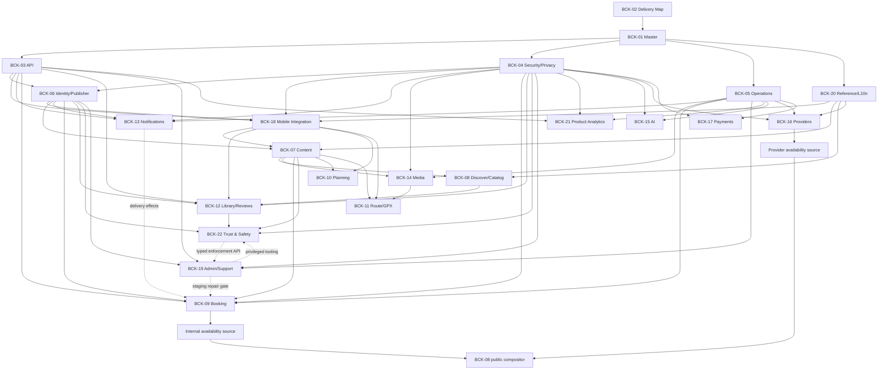

# Recharge Backend — единая карта документов и дальнейшей реализации

- ID: BCK-02
- Версия: 2.4.29
- Дата: 2026-08-24
- Статус: **Approved — canonical coordination baseline, documentation only**
- Утверждено: 2026-08-10, Product owner
- Registry amendments: **2026-08-15, 2026-08-16, 2026-08-20, 2026-08-21 and 2026-08-24, Product owner
  instructions; documentation traceability only, semantics/gates/checksum
  unchanged**
- Назначение: единая распределительная карта backend-работ Recharge
- Заменяет в плане отдельный `BACKEND_CAPABILITY_OWNERSHIP_MATRIX.md`
- Runtime effect: **none**

## 0. Changelog

**v2.4.29.** BCK05-OD-02 decision-readiness reconciliation without changing
the Approved v2.4 coordination semantics:

- `BCK05-OD02-IAM-01 v0.2` selects `BCK05-IAM-A1-ENV-WIF-v1` and
  `BCK05-OD02-DEC-01 v0.1` supplies the unsigned exact-verdict contract;
- BCK05-OD-02 remains Proposed until that verdict is recorded; D1/G1/R1,
  executable claims/permissions/bindings and every cloud/product gate remain
  independent;
- BCK-01/BCK-04/BCK-05 traceability advances to v0.4.25/v0.4.13/v0.2.20;
  no GitHub/GCP mutation, runtime effect or `main` merge authority exists.

**v2.4.28.** OD-07 owner-verdict reconciliation without changing the Approved
v2.4 coordination semantics:

- exact `OD07-DEC-01 v0.2` records Acceptance of
  `OD07-A1-EU-MR-v1` with controls and evidence v0.6;
- BCK-04/BCK-05 remain Draft; qualified production Legal/Privacy, complete
  D1/G1, exact R1 approval and all cloud/product gates remain independent;
- BCK-01/BCK-04/BCK-05 traceability advances to v0.4.24/v0.4.12/v0.2.19;
  no cloud resource, runtime effect or `main` merge authority exists.

**v2.4.27.** OD-07 decision-readiness reconciliation without changing the
Approved v2.4 coordination semantics:

- `BCK-D1-OD07-EV-01 v0.5` selects the exact review candidate
  `OD07-A1-EU-MR-v1` and `OD07-DEC-01 v0.1` supplies the unsigned verdict
  contract;
- OD-07 remains Proposed until the exact owner phrase; qualified production
  Legal/Privacy, D1/G1/R1 and cloud/product gates remain independent;
- BCK-01/BCK-04/BCK-05 traceability advances to v0.4.23/v0.4.11/v0.2.18;
  no cloud resource or runtime effect exists.

**v2.4.26.** BCK05-OD-01 owner-decision reconciliation without changing the
Approved v2.4 coordination semantics:

- exact `BCK05-OD01-DEC-01 v0.2` records Acceptance of baseline v0.3.3 with
  controls;
- BCK-05 remains Draft, all other listed operations decisions remain Proposed,
  and complete D1/G1 plus R1 execution remain blocked;
- BCK-01/BCK-05 traceability advances to v0.4.22/v0.2.17; product/cloud runtime
  remains Absent.

**v2.4.25.** Post-R0 D1 evidence reconciliation without changing the Approved
v2.4 coordination semantics:

- current D1 review/workbook/sign-off records now reflect bounded R0 Pass
  instead of the historical pre-execution state;
- `BCK05-OD01-DEC-01` is added as a Review owner-decision candidate; OD-01
  remains Proposed and G1/R1 remain blocked;
- BCK-01/BCK-05 traceability advances to v0.4.21/v0.2.16; product/cloud runtime
  remains Absent.

**v2.4.24.** Bounded R0 advisory-disposition reconciliation without changing
the Approved v2.4 coordination semantics:

- Product owner explicitly accepted `BCK-R0-TCH-ADV-01` for the two root
  Moderate advisories under expiring demo-only/no-cloud controls;
- R0 advances to Pass for bounded tooling feasibility only, while
  `BCK05-OD-01`, BCK-05, R1/G1 and every cloud/product gate remain unapproved;
- BCK-01/BCK-05 traceability advances to v0.4.20/v0.2.15; product/cloud runtime
  remains Absent.

**v2.4.23.** Hosted R0 evidence reconciliation without changing the Approved
v2.4 coordination semantics:

- hosted `ubuntu-24.04` and `windows-2025` matrices passed in draft PR #7,
  run `32684234236`;
- the hosted-parity blocker is closed while the Moderate-advisory disposition
  remains open and R0 remains Amendments Required;
- BCK-01/BCK-05 traceability advances to v0.4.19/v0.2.14; product/cloud runtime
  remains Absent.

**v2.4.22.** Approved R0 execution traceability amendment without changing the
Approved v2.4 coordination semantics:

- bounded R0 v0.2 was Approved and implemented locally under its exhaustive
  file map;
- exact local build/emulator/default-deny Rules/Terraform/reproducibility
  evidence is Present, while hosted parity and the Moderate-advisory
  disposition remain open;
- BCK05-OD-01 remains Proposed, product/cloud runtime remains Absent and
  BCK-01/BCK-05 traceability advances to v0.4.18/v0.2.13.

**v2.4.21.** R0 supply-chain and decision-record traceability amendment without
changing the Approved v2.4 coordination semantics:

- three permitted Actions now have exact verified full SHAs and secure inputs;
- the unsigned reviewed Terraform Action is rejected in favor of signed,
  checksummed Terraform 1.15.9 archives;
- BCK-R0-TCH-DEC-01 provides the exact owner/security/architecture decision
  record, but all verdicts remain Pending and R0 remains not Approved;
- BCK-01/BCK-05 traceability is v0.4.17/v0.2.12 and runtime remains Absent.

**v2.4.20.** Runtime/toolchain technical-review and R0-plan traceability
amendment without changing the Approved v2.4 coordination semantics:

- BCK05-OD01-TCH-REV-01 records Pass with blocking evidence, not an owner or
  security sign-off;
- BCK-R0-TCH-01 defines the exact local-only file map, commands, rollback and
  52 AC but remains Review/not Approved;
- BCK05-OD-01 remains Proposed; BCK-01/BCK-05 traceability is
  v0.4.16/v0.2.11 and runtime remains Absent.

**v2.4.19.** Runtime/toolchain evidence traceability amendment without
changing the Approved v2.4 coordination semantics:

- BCK05-OD01-TCH-01 selects a dated Node.js 22, TypeScript/npm, Firebase CLI
  and Terraform candidate with deterministic build, emulator and IaC contracts;
- BCK05-OD-01 advances from Open to Proposed, while exact remaining pins,
  compatibility, owner/security and executable R0 evidence remain blocked;
- BCK-01/BCK-05 traceability is v0.4.15/v0.2.10; checksum/gates/runtime unchanged.

**v2.4.18.** IAM and trusted-release evidence traceability amendment without
changing the Approved v2.4 coordination semantics:

- BCK05-OD02-IAM-01 defines keyless OIDC/WIF trust, environment/task identity
  isolation, permission review, approvals, lifecycle and break-glass;
- BCK05-OD07-REL-01 defines immutable manifests, verified provenance, honest
  Functions/container enforcement boundaries, promotion and rollback;
- BCK05-OD-02/07 advance from Open to Proposed, while exact specialist and
  executable evidence remains blocked;
- BCK-01/BCK-05 traceability is v0.4.14/v0.2.9; checksum/gates/runtime unchanged.

**v2.4.17.** Bounded numerical Product-owner disposition traceability
amendment without changing the Approved v2.4 coordination semantics:

- SLO v0.1, Cost v0.2 and Recovery v0.1 are accepted only as non-production
  stage-validation/recovery-drill baselines;
- Operations/Security remain evidence-conditioned and Finance/Legal remain
  Inconclusive; no broader specialist sign-off is inferred;
- OD-03/04/05 remain Proposed, BCK-05 remains Draft and runtime remains Absent;
- BCK-01/BCK-05 traceability is v0.4.13/v0.2.8; checksum/gates unchanged.

**v2.4.16.** Operations numerical owner-review traceability amendment without
changing the Approved v2.4 coordination semantics:

- BCK05-NUM-REV-01 reviews exact SLO v0.1, corrected cost v0.2 and recovery
  v0.1 baselines and records ten cross-model findings;
- retained-backup cost now matches 14 daily + 12 weekly prod copies; L3 budget,
  same-project compromise, stage RTO and Legal/Finance evidence remain explicit;
- OD-03/04/05 remain Proposed, BCK-05 remains Draft and no verdict/runtime is
  inferred from the technical recommendation;
- BCK-01/BCK-05 traceability is v0.4.12/v0.2.7; checksum/gates unchanged.

**v2.4.15.** Reliability/recovery evidence traceability amendment without
changing the Approved v2.4 coordination semantics:

- BCK05-OD03-SLO-01 and BCK05-OD05-REC-01 are Present with numerical
  journey-scoped SLO/error budgets and record-family RPO/RTO/isolated-restore
  proposals;
- BCK05-OD-03 and BCK05-OD-05 advance from Open to Proposed, while owner
  verdicts, stage/restore proof, executable controls, OD-07 and runtime remain
  blocked;
- BCK-01/BCK-05 traceability is v0.4.11/v0.2.6;
- registry checksum, D/R waves, G1–G7 and runtime authority are unchanged.

**v2.4.14.** Infrastructure/cost evidence traceability amendment without
changing the Approved v2.4 coordination semantics:

- BCK05-OD04-COST-01 is Present with five workload envelopes, reproducible
  formulas, directional provider estimates and proposed EUR budget controls;
- BCK05-OD-04 advances from Open to Proposed, while owner/Finance/Operations
  verdict, actual EUR SKU/stage evidence, OD-07, provisioning and runtime remain
  blocked;
- BCK-01/BCK-05 traceability is v0.4.10/v0.2.5;
- registry checksum, D/R waves, G1–G7 and runtime authority are unchanged.

**v2.4.13.** Tabletop-preparation traceability amendment without changing the
Approved v2.4 coordination semantics:

- BCK04-OD09-TTX-01 is Present as a ready-but-unexecuted exercise package with
  scenario injects, evaluator key, blank execution record and 30 AC;
- BCK04-OD-09/BCK05-OD-08 remain Proposed; preparation is not an executed
  exercise, owner/Legal verdict, runtime route or operational proof;
- BCK-01/BCK-04/BCK-05 traceability is v0.4.9/v0.4.10/v0.2.4;
- all checksums, gates and runtime authority remain unchanged.

**v2.4.12.** Incident-response evidence traceability amendment without changing
the Approved v2.4 coordination semantics:

- BCK04-OD09-IR-01 is Present as a Draft incident-response proposal preserving
  the canonical `SEV-1`/`SEV-2`/`SEV-3` vocabulary and separating operational
  severity from the GDPR personal-data-breach risk assessment;
- BCK04-OD-09 and BCK05-OD-08 advance from Open to Proposed, while owner,
  qualified Legal/Privacy, tabletop and executable-route evidence remains
  Pending;
- BCK-01/BCK-04/BCK-05 traceability is v0.4.8/v0.4.9/v0.2.3;
- all other statuses, checksums, gates and runtime authority are unchanged.

**v2.4.11.** Threat-model evidence traceability amendment without changing the
Approved v2.4 coordination semantics:

- BCK04-OD01-TM-01 is Present as a complete Draft threat-model proposal;
- BCK04-OD-01 advances from Open to Proposed, but owner verdict, independent
  security review, BCK-04 Approval and runtime remain blocked;
- BCK-01/BCK-04 traceability is v0.4.7/v0.4.8;
- all other statuses, checksums, gates and runtime authority are unchanged.

**v2.4.10.** Combined-owner assignment traceability amendment without changing
the Approved v2.4 coordination semantics:

- `RechargeN / Product owner` is assigned to every D1 review role with explicit
  self-review/concentration disclosure;
- all verdicts remain Pending and qualified Legal/Privacy evidence remains a
  separate prerequisite where professional legal judgment is required;
- BCK-01/03/04/05/20 traceability is
  v0.4.6/v0.3.3/v0.4.7/v0.2.2/v0.2.2;
- no BCK/OD status, checksum, gate or runtime authority changes.

**v2.4.9.** D1-C technical pre-review traceability amendment without changing
the Approved v2.4 coordination semantics:

- BCK-D1-SIG-01 records every required named reviewer as Unassigned/Pending;
- BCK-03 no longer depends on the future D2 BCK-18 document for D1 review;
- OD-07 separates pre-decision published/modelled evidence and thresholds from
  post-provision synthetic validation before traffic;
- BCK-01/03/04/05/20 traceability is
  v0.4.5/v0.3.2/v0.4.6/v0.2.1/v0.2.1;
- statuses, 22-spec/6-runbook checksum, D/R waves, G1–G7 and runtime authority
  are unchanged.

**v2.4.8.** D1 evidence-package traceability amendment without changing the
Approved v2.4 coordination semantics:

- BCK-D1-REV-01 and separate OD-07/09/10/11 evidence artifacts are Present;
- BCK-01/03/04/05/20 traceability is v0.4.4/v0.3.1/v0.4.5/v0.2/v0.2;
- OD-07/09/10 remain Proposed and OD-11 remains Open; evidence presence is not
  decision acceptance;
- BCK-03/04/05/20 remain Draft, D1 exit/G1–G7/runtime remain blocked and the
  checksum stays 22 BCK specs and 6 runbooks.

**v2.4.7.** D1 reconciliation amendment without changing Approved v2.4
coordination semantics:

- BCK-D1-DEC-01/ECL03-D11 accepts split request/idempotency identity and
  reconciles committed Booking v1 fixtures without wire/runtime changes;
- BCK-01/03/04/05/20 traceability is v0.4.3/v0.3/v0.4.4/v0.1.1/v0.1.1;
- BCK-03/04/05/20 remain Draft, BCK-01 and BCK-09 remain Review;
- OD-07/09/10 remain Proposed, OD-11 remains Open, D1 exit and G1–G7 remain
  blocked; checksum remains 22 BCK specs and 6 runbooks.

**v2.4.6.** D1 document-presence amendment without changing Approved v2.4
coordination semantics:

- BCK-05 Operations v0.1 and BCK-20 Reference Data v0.1 plus their coverage
  matrices are now `Draft — Present`, runtime `Absent`;
- BCK-01/03/04 traceability revisions are v0.4.2/v0.2.4/v0.4.3;
- OD-07 and OD-10 now have explicit `Proposed` contracts in BCK-05/BCK-20;
  existing OD-09 proposal is reconciled from BCK-03; none is Accepted and all
  continue to block their Accepted-required gates;
- checksum remains 22 BCK specs and 6 runbooks; no G1/runtime authorization.

**v2.4.5.** BCK-01 Review-entry status amendment without changing the
Approved v2.4 coordination semantics:

- `RechargeN / Product owner` recorded as interim combined BCK-01 review
  coordinator by explicit Product owner instruction dated 2026-08-20;
- BCK-01 moved to `Review v0.4.1 — Present`; runtime remains `Absent`;
- BCK-03/BCK-04 traceability patches are v0.2.3/v0.4.2; both remain Draft
  with runtime `Absent`;
- combined Review evidence does not replace independent Security/Privacy,
  Legal or Operations approvals before BCK-01 Approval/G1;
- registry checksum, dependencies, ODs, risks, gates and runtime authority are
  unchanged.

**v2.4.4.** BCK-01 Review-readiness traceability amendment without changing
the Approved v2.4 coordination semantics:

- BCK-01 advanced to `Draft v0.4.1 — Present` and gained a formal
  reconciliation report; named review-owner evidence remains the only direct
  BCK-01 Review blocker;
- BCK-03/BCK-04 received documentation-only parent-traceability patch
  revisions v0.2.2/v0.4.1; their runtime remains `Absent`;
- registry checksum, owners, dependency graph, OD/risks and G0–G7 are
  unchanged; G1–G7 and all runtime/provisioning remain unauthorized.

**v2.4.3.** Documentation registry and traceability reconciliation without
changing v2.4 coordination semantics:

- BCK-01 advanced to `Draft v0.4 — Present`; runtime remains `Absent`;
- BCK-03 received documentation-only traceability revision `Draft v0.2.1`;
- BCK-04 and its preparatory coverage matrix are now physically present as
  `Draft v0.4` and `Draft v0.3`; BCK-04 runtime remains `Absent`;
- BCK-04 remains blocked from Review by the blockers recorded in its coverage
  matrix; G1–G7 and all runtime/provisioning remain unauthorized;
- registry checksum remains 22 BCK-specs and 6 runbooks.

**v2.4.2.** Factual registry reconciliation without changing v2.4 semantics:

- BCK-03 advanced from `Draft v0.1 — Present` to `Draft v0.2 — Present` after
  incorporating review-navigation, Booking reconciliation and fixture-evidence
  clarity; runtime remains `Absent`;
- BCK-01 remains `Draft v0.3 — Present`, runtime `Absent`;
- registry checksum remains 22 BCK-specs and 6 runbooks; G0 remains Passed,
  G1–G7 and any runtime remain unauthorized;
- downstream semantic references to v2.4 remain valid because v2.4.2 is a
  status-only registry amendment.

**v2.4.1.** Factual registry reconciliation без изменения v2.4 semantics:

- BCK-01 обновлён с `Planned` до `Draft v0.3 — Present`; runtime остаётся
  `Absent`;
- BCK-03 создан как `Draft v0.1 — Present`; runtime остаётся `Absent`, переход
  в Review заблокирован до Review BCK-01 и выполнения собственного DoR;
- реестр по-прежнему содержит 22 BCK-specs и 6 runbooks; G0 остаётся Passed,
  G1–G7 и любой runtime не разрешены;
- downstream semantic references to v2.4 остаются валидными: v2.4.1 изменяет
  только factual registry и не меняет coordination semantics/checksum.

**v2.4.** Финальный reconciliation-аудит v2.3:

- Product owner утвердил ревизию как canonical backend coordination baseline;
  G0 пройден, G1–G7 и любой runtime остаются отдельными gates;
- устранён version drift: текущая ревизия одинаково указана в metadata,
  registry checksum, documentation waves, acceptance criteria и review package;
- OD-11 проведён через BCK-04/06/07/09/22, documentation/runtime waves и
  G1–G6 с feature-scoped fail-closed gates;
- production account creation, Find People, age-restricted publication и
  применимые Booking paths запрещены до `Accepted` OD-11, но базовый disabled
  Booking Emulator core не получает ложной глобальной блокировки;
- для всех OD добавлен явный current status; OD-11 включён в следующий review
  package с owner и initial proposal;
- уточнено, что minors/age policy требует Legal/Privacy validation для каждого
  поддерживаемого региона и не выводится из одной ссылки на GDPR Article 8.

**v2.3.** Аудит-исправления v2.2 с расширением governance без изменения
существующих Accepted domain invariants:

- устранён конфликт волн для OD-09: D1 требует минимум `Proposed` envelope в
  BCK-03, `Accepted` обязателен до D3 effects/workers (закрывающий документ
  BCK-13 принадлежит D3 и не может быть условием exit D1);
- зафиксированы переименования файлов BCK-18/21/22 относительно v2.1 с
  требованием атомарного обновления ссылок (AC-61);
- добавлено недостающее ребро `BCK-20 -> BCK-16` в dependency graph
  (реестр уже содержал эту зависимость);
- entry D3 уточнён с `stable` до проверяемого `Approved`;
- добавлены OD-11 (minors/age-eligibility policy) и RSK-13: возраст аккаунта,
  consent age по регионам, age-restricted классификация, eligibility Booking и
  Find People.

**v2.2.** Ревизия завершает полный аудит v2.0–v2.1:

- сохранён реестр из 22 BCK-документов и 6 production runbooks;
- каждому документу назначен один accountable owner и отдельный runtime status;
- устранена циклическая зависимость `BCK-19 <-> RUN-03`;
- Trust & Safety отделён от Admin/Support и от ownership контента/отзывов;
- internal, provider и public availability закреплены за тремя разными writers;
- disabled Emulator transaction core отделён от persistent staging gate;
- product analytics отделена от operational monitoring;
- BCK-03/05/20/21 привязаны к уже действующим API, environment, Category и
  Analytics policies, а не создают параллельные стандарты;
- добавлены governance открытых решений, Firebase resource-location gate,
  account-migration и cross-domain event/outbox decisions;
- добавлены risk register, G7 General Availability и проверяемые entry/exit
  criteria документационных и runtime-волн.

Документ не создаёт `apps/backend`, Firebase resources, schema, secrets,
mobile adapters или production data processing.

## 1. Цель и область действия

Карта управляет проектированием и последовательной реализацией единого backend
Recharge. Она определяет:

- versioned registry backend-specs и runbooks;
- accountable owner каждого документа;
- единственного writer каждого authoritative record type;
- зависимости, открытые решения и риски;
- порядок документационных и runtime-волн;
- gates перед Emulator, staging, production cohort и General Availability;
- доказательства, отличающие proposal от работающего runtime.

Карта не заменяет Accepted ADR или domain-spec. Она распределяет работу между
ними и запрещает скрытые параллельные модели.

После утверждения v2.4 и documentation amendments v2.4.1–v2.4.16 этот файл является
канонической coordination-основой
для реестра BCK/RUN, ownership, sequencing, open decisions, risks и gates.
Нижестоящие документы обязаны ссылаться на BCK-02 и проходить reconciliation,
но при конфликте по-прежнему применяется приоритет §3.

## 2. Что означает «единый backend»

Единый backend — не монолитный документ и не одна Cloud Function. Это одна
платформа с общими правилами и изолированными bounded domains:

```text
one identity and capability authority
one PublisherRef model
one API/versioning/error/idempotency standard
one environment/security/IAM model
one reference-data/localization distribution standard
one writer per authoritative record type
one migration and mobile compatibility standard
one operations/observability/cost model
many isolated domain modules
```

Связи проходят через stable IDs, typed contracts, domain commands/events,
facades и explicit projections. Составная read projection может объединять
данные нескольких source owners, но сама имеет одного writer и не получает
authority над источниками.

Непересматриваемые границы:

- Booking, hold, ledger, usage, audit и outbox не хранятся внутри Event;
- Route, Scenario и Quick Plan — разные aggregates;
- Creator — User с дополнительными verified capabilities;
- Professional Page — отдельный publisher/workspace context;
- Admin tools — capability-gated surface, не role switch, workspace или
  publisher;
- client/mock/cache не становится production authority;
- provider Booking, internal Booking и Payments не смешиваются;
- UI/domain не знают Firestore и не исполняют backend business rules;
- public availability — freshness-labelled read projection, не источник
  решения Booking transaction;
- offline mutation никогда не создаёт локально подтверждённый Booking.

## 3. Источники истины и reconciliation anchors

При конфликте действует следующий приоритет:

1. Accepted ADR.
2. Approved spec конкретного domain/runtime slice.
3. Frozen Architecture Baseline и принятые cross-cutting policies.
4. Эта delivery map.
5. Product vision и Draft/Review proposals.

### 3.1. Обязательные anchors

| Область | Канонический источник | Что новый BCK обязан сделать |
|---|---|---|
| Architecture/runtime authorization | [Architecture Baseline](../architecture/ARCHITECTURE_BASELINE.md), [ADR 0019](../adr/0019-authoritative-internal-booking-ledger.md) | Расширять принятый target; не считать target разрешением на runtime |
| Identity/Publisher | [ADR 0015](../adr/0015-authenticated-viewer-verified-creator-professional-page.md) | Сохранить mandatory auth, verified Creator, page-scoped capabilities и PublisherRef |
| Domain/security baseline | [ADR 0013](../adr/0013-domain-policy-baseline.md) | Сохранить lifecycle, moderation, UTC/IANA, IDs, privacy, abuse и audit; учитывать superseding ADR |
| API contracts | [API Contracts Workflow](../api/API_CONTRACTS_WORKFLOW.md) | Расширять source/codegen/fixture policy; не создавать второй workflow |
| Category/reference data | [Category System v1.4.3](CATEGORY_SYSTEM.md) | Распространять versioned canonical IDs; не переименовывать и не дублировать taxonomy |
| Event classification | [Event Classification v2.2.3](EVENT_CLASSIFICATION_SPEC.md) | Расширять принятые 34 archetypes и aggregate boundaries |
| Booking | [Booking full spec](EVENT_BOOKING_BACKEND_FIREBASE_FULL_SPEC.md), ADR 0019 | Сохранять authoritative ledger, online mutation и staged activation |
| Scenario | [Scenario Builder spec](SCENARIO_BUILDER_SPEC.md) | Не превращать Scenario в Route или Quick Plan |
| Route | [Route Builder spec](ROUTE_BUILDER_SPEC.md) | Сохранять Route-only track/GPX semantics |
| Analytics naming/catalog | [Analytics Taxonomy](../analytics/ANALYTICS_TAXONOMY.md), [Event Catalog](../analytics/EVENT_CATALOG.md) | BCK-21 добавляет backend transport/governance, но не переизобретает event names |
| Environments/secrets | [Env, Flavors and Secrets](../architecture/ENV_FLAVORS_SECRETS.md) | BCK-05 уточняет backend topology и не дублирует secret policy |

Уже принятые baseline-решения не являются open decisions:

- entity IDs — immutable ULID/UUID; `loc_*` допустим только для несохранённых
  local drafts и заменяется permanent ID при authoritative create/import;
- authoritative timestamps — UTC instant, локальная occurrence/place semantics
  — IANA timezone;
- связи выполняются по ID, не по display name;
- Category IDs и aliases подчиняются Category System v1.4.3.

## 4. Статусы и evidence

Статус документа и статус реализации ведутся независимо.

### 4.1. Spec status

```text
Planned -> Draft -> Review -> Approved -> Superseded
```

### 4.2. Runtime status

```text
Absent -> Doing -> Review -> Done -> Enabled -> Disabled/Retired
```

Правила:

- `Approved` не означает `Done` или `Enabled`;
- `Done` требует tests/evidence, но может оставаться disabled;
- Emulator/staging evidence не доказывает production readiness;
- status меняется только с датой, owner и ссылкой на evidence;
- timeout, незапущенная проверка или proposal не являются pass;
- документационный BCK-02 имеет runtime status `N/A`.

## 5. Реестр проектных документов — 22 (v2.4.29)

| ID | Файл | Accountable owner | Уникальная область | Основные зависимости | Spec | Runtime |
|---|---|---|---|---|---|---|
| BCK-01 | `RECHARGE_BACKEND_MASTER_SPEC.md` | Platform Architecture | Target architecture, module boundaries, shared invariants | Accepted ADR, BCK-02, §3 anchors | Review v0.4.25 — Present | Local R0 tooling scaffold only; product/cloud Absent |
| BCK-02 | `RECHARGE_BACKEND_DELIVERY_MAP.md` | Architecture owner | Registry, ownership, dependencies, waves, risks and gates | Current repository facts | Approved v2.4.29 | N/A |
| BCK-03 | `BACKEND_API_CONTRACT_STANDARD.md` | API Platform | Envelopes, typed errors, versioning, pagination, idempotency, event envelope, schema evolution, minimum client | BCK-01, API Contracts Workflow, OD-09 | Draft v0.3.3 — Present | Absent |
| BCK-04 | `BACKEND_SECURITY_PRIVACY_SPEC.md` | Security/Privacy owner | AuthN/Z controls, App Check, Rules/IAM, data classes, consent, retention/deletion, rate limits | BCK-01, ADR 0013, ADR 0015, environment policy, OD-07, OD-11 | Draft v0.4.13 — Present; OD-07 Accepted with controls; BCK05-OD-02 IAM boundary decision-ready/Proposed; qualified production Legal/Privacy and OD-01/09 remain unresolved | Absent |
| BCK-05 | `BACKEND_DEPLOYMENT_OPERATIONS_SPEC.md` | Platform Operations owner | Environments, projects/resources, CI/CD, server flags, SLO, operational monitoring, cost, backup/DR | BCK-01, BCK-04, environment policy, OD-07, OD-09 | Draft v0.2.20 — Present; BCK05-OD-01 and cross-domain OD-07 Accepted; BCK05-OD-02 decision-ready/Proposed; BCK05-OD-03/04/05/07/08 Proposed; bounded R0 Pass | Local R0 tooling scaffold only; product/cloud Absent |
| BCK-06 | `IDENTITY_PUBLISHER_BACKEND_SPEC.md` | Identity owner | User, sessions, Creator verification, Page/membership/capabilities, PublisherRef, Find People consent | ADR 0015, BCK-03, BCK-04, OD-08, OD-11 | Planned | Absent |
| BCK-07 | `CONTENT_PUBLICATION_BACKEND_SPEC.md` | Content Platform owner | 10 Create types, drafts/import, publish lifecycle, PublisherRef, moderation handoff, seeded provenance | BCK-03, BCK-04, BCK-06, BCK-18, BCK-20, domain specs, OD-03, OD-10, OD-11 | Planned | Absent |
| BCK-08 | `DISCOVER_SEARCH_CATALOG_BACKEND_SPEC.md` | Discover owner | Catalog, search/filter/geo, ranking, freshness and composed availability projection | BCK-03, BCK-04, BCK-07, BCK-20, OD-01, OD-03 | Planned | Absent |
| BCK-09 | `EVENT_BOOKING_BACKEND_FIREBASE_FULL_SPEC.md` | Booking owner | Internal free Booking, holds, inventory ledger, usage, audit, outbox and internal availability source | Hard: ADR 0019, ECL-03, BCK-03, BCK-04, BCK-05, BCK-06, BCK-07; policy gate: OD-11; gated effect peer: BCK-13 | Review v1.1 | Absent |
| BCK-10 | `PLANNING_SCENARIO_QUICK_PLAN_BACKEND_SPEC.md` | Planning owner | Scenario sync/publish and separate private/invited Quick Plan collaboration | BCK-03, BCK-04, BCK-06, BCK-07, BCK-18, BCK-20, Scenario spec | Planned | Absent |
| BCK-11 | `ROUTE_GPX_BACKEND_SPEC.md` | Route owner | Route aggregate, GPX/media, privacy, sync and publication | BCK-03, BCK-04, BCK-06, BCK-07, BCK-14, BCK-18, BCK-20, Route spec | Planned | Absent |
| BCK-12 | `USER_LIBRARY_REVIEWS_BACKEND_SPEC.md` | User Platform owner | Two bounded aggregates: favorites/visits and reviews/ratings; report cases excluded | BCK-03, BCK-04, BCK-06, BCK-08, BCK-18 | Planned | Absent |
| BCK-13 | `NOTIFICATIONS_BACKEND_SPEC.md` | Notifications owner | Inbox, push tokens/FCM, preferences, deep links, outbox consumers and optional email | BCK-03, BCK-04, BCK-05, BCK-06, OD-02, OD-09 | Planned | Absent |
| BCK-14 | `MEDIA_STORAGE_BACKEND_SPEC.md` | Media Platform owner | Upload/finalize, metadata, ownership, transforms, protected access, deletion/orphan cleanup | BCK-03, BCK-04, BCK-05, BCK-06, BCK-07 | Planned | Absent |
| BCK-15 | `AI_BACKEND_SPEC.md` | AI Platform owner | Provider-neutral server proxy, quota, redaction, prompts/evals and kill switches | ADR 0018, BCK-03, BCK-04, BCK-05, BCK-06 | Planned, gated | Absent |
| BCK-16 | `PROVIDER_INTEGRATION_BACKEND_SPEC.md` | Integrations owner | Provider adapters, provider availability source, provenance/freshness, cache, live-check/handoff | BCK-03, BCK-04, BCK-05, BCK-08, BCK-20 | Planned, gated | Absent |
| BCK-17 | `PAYMENTS_BACKEND_SPEC.md` | Payments owner | Payment authority, ledger, webhooks, refunds, disputes and compliance | Hard: new Accepted ADR, BCK-03, BCK-04, BCK-05, BCK-06; integration peer: BCK-13 | Planned, gated | Absent |
| BCK-18 | `MOBILE_BACKEND_INTEGRATION_STANDARD.md` | Mobile Platform owner | Typed ports/adapters, shared fixtures, local/cache/server states, compatibility and import orchestration | BCK-03, BCK-04, BCK-06, BCK-20, API workflow, OD-04, OD-08, OD-10 | Planned | Absent |
| BCK-19 | `ADMIN_SUPPORT_BACKEND_SPEC.md` | Admin Operations owner | Privileged staff surface, cases, read audit, repair proposal/approval, emergency disable | BCK-03, BCK-04, BCK-05, BCK-06 | Planned | Absent |
| BCK-20 | `REFERENCE_DATA_LOCALIZATION_SPEC.md` | Reference Data owner | Versioned distribution/governance for taxonomy, regions, currencies, languages and localized wire values | BCK-01, BCK-03, Category System v1.4.3, OD-10 | Draft v0.2.2 — Present | Absent |
| BCK-21 | `ANALYTICS_TELEMETRY_BACKEND_SPEC.md` | Data Platform owner | Privacy-safe product-event ingestion, governed datasets, aggregation and retention | BCK-03, BCK-04, BCK-05, existing analytics taxonomy/catalog, OD-05 | Planned | Absent |
| BCK-22 | `TRUST_SAFETY_MODERATION_BACKEND_SPEC.md` | Trust & Safety owner | UGC reports, block/mute, spam controls, sanctions, appeals and enforcement audit | Hard: BCK-03, BCK-04, BCK-06, BCK-07, BCK-12, OD-06; policy gate: OD-11; integration peer: BCK-19 | Planned | Absent |

BCK-09 уже существует как Review-документ:
[Event Booking Backend/Firebase full spec](EVENT_BOOKING_BACKEND_FIREBASE_FULL_SPEC.md).
Перед `Approved` он проходит reconciliation с BCK-01, BCK-03, BCK-04, BCK-05,
BCK-06 и BCK-07, но его
принятые Event/Booking инварианты не переписываются этой картой.

Число 22 — checksum текущей ревизии, не вечный invariant. Новый BCK требует
уникального ID, одного accountable owner, непересекающегося scope, dependencies,
wave, migration impact и новой ревизии BCK-02.

Переименования файлов относительно v2.1 фиксируются здесь и обновляются во
всех ссылках атомарно в той же ревизии (AC-61):
`MOBILE_COMPANION_CONTRACT_SPEC.md` → `MOBILE_BACKEND_INTEGRATION_STANDARD.md`
(BCK-18); `ANALYTICS_TELEMETRY_SPEC.md` → `ANALYTICS_TELEMETRY_BACKEND_SPEC.md`
(BCK-21); `TRUST_SAFETY_BACKEND_SPEC.md` →
`TRUST_SAFETY_MODERATION_BACKEND_SPEC.md` (BCK-22).

## 6. Production runbooks — 6 (v2.4.16)

| ID | Файл | Accountable owner | Основан на | Обязателен и проверяется |
|---|---|---|---|---|
| RUN-01 | `docs/runbooks/backend-incident.md` | Incident Commander | BCK-05, active domain topology | До production cohort; tabletop ежеквартально и после major topology change |
| RUN-02 | `docs/runbooks/backend-rollback.md` | Release Operations owner | BCK-05, deployed artifacts and flags | До первого deployment каждого типа; dry-run при изменении deployment path |
| RUN-03 | `docs/runbooks/backend-reconciliation-repair.md` | Admin Operations owner | BCK-19 и фактические domain repair commands | До persistent staging mutations; после изменения invariant/repair command |
| RUN-04 | `docs/runbooks/backend-privacy-deletion.md` | Privacy owner | BCK-04, BCK-06, BCK-14 и полный data inventory | До production personal data; тест DSR/deletion минимум раз в полгода |
| RUN-05 | `docs/runbooks/backend-disaster-recovery.md` | Platform Operations owner | BCK-05, фактические backup/PITR/export facts | До production source of truth; restore drill минимум ежеквартально |
| RUN-06 | `docs/runbooks/backend-security-abuse.md` | Security owner | BCK-04, BCK-19, BCK-22, RUN-01, existing secret runbooks | До production credentials/personal data/UGC; quarterly security/abuse tabletop |

RUN-06 не дублирует существующие
[secrets-rotation.md](../runbooks/secrets-rotation.md),
[secret-leak-response.md](../runbooks/secret-leak-response.md) и общий
[incident.md](../runbooks/incident.md); он связывает их с backend IAM,
personal-data breach triage и abuse containment. Уведомление supervisory
authority в течение 72 часов применяется только при условиях
[Article 33 GDPR](https://eur-lex.europa.eu/legal-content/EN/TXT/?uri=CELEX%3A02016R0679-20160504),
поэтому runbook требует documented risk assessment и Legal/DPO escalation.

Текущий комплект: **22 specs + 6 runbooks = 28 документов**, включая BCK-02.

## 7. Capability и authoritative data ownership

| Capability / record type | Единственный writer | Owning spec | Что могут делать consumers | Current/target |
|---|---|---|---|---|
| Account/session/access snapshot | Identity | BCK-06 | Читать bounded access result | Mock -> production gate |
| Creator verification | Identity | BCK-06 | Проверять capability; не выдавать grant | Production gate |
| ManagedPage/membership/capabilities | Identity | BCK-06 | Exact-page authorization queries | Local/mock today |
| Find People consent/profile projection | Identity | BCK-06 | Discover выполняет privacy-filtered query | Privacy gate |
| Reference datasets/revisions | Reference Data | BCK-20 | Domains хранят stable IDs и читают versioned datasets | Static/local today |
| Localized wire/fallback policy | Reference Data | BCK-20 | Content хранит значения по принятому contract | Not configured end-to-end |
| Personal Create drafts | Content Publication | BCK-07 | Mobile хранит local revision через port | Local-first today |
| Published 10 Create types | Content Publication | BCK-07 | Catalog строит projection; Booking читает Event config | Backend after Identity |
| Publication lifecycle/moderation state | Content Publication | BCK-07 | Trust & Safety может применить sanctioned visibility command | Gated |
| Catalog/feed projection | Discover | BCK-08 | Mobile выполняет bounded queries | Mock/local today |
| Search/filter/geo index | Discover | BCK-08 | Consumers не пишут индекс напрямую | OD-01 |
| Published Event classification fields | Content Publication | BCK-07 | Event domain contract валидирует; Discover читает | Local config today |
| Internal availability source | Booking | BCK-09 | BCK-08 compositor читает ledger-derived source | Gated |
| Provider availability source | Provider Integration | BCK-16 | BCK-08 compositor читает provenance/freshness | External handoff beta |
| Public availability projection | Discover | BCK-08 | UI показывает source/freshness; Booking не доверяет | Mock/external today |
| Internal Booking/hold/ledger/usage/audit/outbox | Booking | BCK-09 | Только trusted commands и authorized projections | Absent/gated |
| External booking reference/provenance | Provider Integration | BCK-16 | UI выполняет honest handoff/live-check | External handoff beta |
| Scenario aggregate | Planning | BCK-10 | Catalog читает только published projection | Local-first today |
| Quick Plan aggregate | Planning utility | BCK-10 | Явный one-way expand создаёт новый Scenario | Partial local today |
| Route/GPX aggregate and track refs | Route | BCK-11 | Media хранит blobs; Catalog читает projection | Local-first today |
| Favorites and explicit Visit History | User Library | BCK-12 | Actor-bound reads/writes | Local-first today |
| Reviews and rating aggregates | Reviews | BCK-12 | Catalog читает aggregate projection | Planned MVP |
| Report cases, block/mute, sanctions, appeals | Trust & Safety | BCK-22 | Content/Reviews подают stable references; Admin renders tools | Required before UGC production |
| Notification inbox/preferences/delivery state | Notifications | BCK-13 | Domains пишут outbox, но не delivery state | Local foundation today |
| Media metadata/blob ownership | Media | BCK-14 | Domains хранят protected media refs | Gated |
| Import session/checkpoint/mapping | Mobile Integration | BCK-18 | Каждый domain command валидирует и пишет свой aggregate | Must precede migration |
| Product analytics ingestion/datasets | Analytics | BCK-21 | Domains emit catalogued, minimized events | Optional until enabled |
| Operational logs/metrics/alerts | Operations | BCK-05 | Domains emit structured signals по shared standard | Required before staging |
| Privacy request/deletion orchestration | Privacy Orchestration | BCK-04 | Domain-owned deletion handlers исполняют scoped work | Production gate |
| Server feature flags/kill switches | Operations | BCK-05 | Domains проверяют server flag before mutation | Default off |
| AI requests/quota/eval metadata | AI Platform | BCK-15 | Product domains consume provider-neutral facade | Gated |
| Payment intent/ledger/webhook state | Payments | BCK-17 | Booking/Content используют typed payment result only | New ADR/post-MVP |
| Admin case/repair proposal/approval/audit refs | Admin Operations | BCK-19 | Domain-owned trusted command исполняет approved repair | Staging gate |

Правила ownership:

1. Один authoritative record type имеет одного writer.
2. Import orchestration не пишет domain aggregate в обход domain command.
3. Admin/Support предлагает и утверждает repair, но не меняет чужую коллекцию
   прямой записью.
4. Analytics и operational logs никогда не становятся domain authority.
5. Booking transaction проверяет собственный ledger в atomic transaction и
   никогда не принимает решение по public projection, cache или provider hint.

## 8. Firebase/GCP target map

| Capability | Platform owner | Consumers / ограничения |
|---|---|---|
| Firebase Auth | Identity | Identity input; capability grants остаются server-owned |
| App Check | Security | Дополняет Auth/rate limits/Rules, но не заменяет их |
| Cloud Functions v2 | Backend Platform | Trusted domain commands/workers; exact service identities |
| Firestore | Domain owners | Отдельные domain-owned collections; direct client writes только явно разрешённым actor records |
| Cloud Storage | Media | Blob storage; ownership и access решаются по protected metadata |
| FCM | Notifications | Delivery channel, не lifecycle authority |
| Cloud Scheduler / task mechanism | Operations | Только idempotent bounded workers; конкретный transport решает BCK-05/OD-09 |
| Secret Manager | Security | Provider/AI/Payments/search credentials; никогда не Flutter |
| Cloud Logging/Monitoring | Operations | Operational SLO/alerts, не product analytics warehouse |
| Product analytics pipeline | Analytics | Опциональный transport после OD-05; no automatic BigQuery assumption |
| CI/CD and Artifact Registry | Deployment | Environment-scoped identities, approvals and rollback artifacts |
| Search/geo engine | Discover | Выбирается OD-01 совместно с BCK-05 cost/operations; внешний платный vendor не предполагается автоматически |

Firebase — принятый target, но эта карта не разрешает provisioning. Locations
задаются по resource, а location default Firestore нельзя изменить после
provisioning; поэтому OD-07 закрывается до R1 по актуальным
[Firebase resource-location rules](https://firebase.google.com/docs/projects/locations)
и [Firestore locations](https://firebase.google.com/docs/firestore/locations).

App Check — один слой защиты, а не доказательство отсутствия abuse; Firebase
прямо указывает, что он дополняет Authentication и не гарантирует устранение
всех злоупотреблений ([Firebase App Check](https://firebase.google.com/docs/app-check)).

Remote Config/client flags могут управлять presentation hints. Authoritative
mutation flags проверяются server-side и default-off.

## 9. Dependency graph



Dashed arrows — integration/gate, не ownership и не обязательная compile-time
dependency. `BCK-19` не блокирует disabled Emulator core; он обязателен до
persistent staging repair access. RUN-03 зависит от BCK-19 и фактических
domain commands, но BCK-19 не зависит от runbook.

## 10. Волны документации

| Wave | Entry | Документы / допустимый параллелизм | Exit evidence |
|---|---|---|---|
| D0 Coordination | Current repo facts and Accepted anchors read fully | BCK-02 only | v2.4.16 registry/ownership/dependencies/risks accepted; runtime none |
| D1 Platform | D0 accepted | BCK-01 first; затем BCK-03, BCK-04, BCK-05 и BCK-20 parallel | Approved platform set; OD-07 и OD-10 Accepted; OD-09 и OD-11 минимум Proposed; conflicts logged |
| D2 Authority/client/content | D1 Approved | BCK-06, затем BCK-18; BCK-07 и BCK-08 после applicable contracts | Approved authority/import/content/catalog specs; OD-01, OD-03, OD-04 и OD-08 Accepted; OD-11-gated functions явно disabled до решения |
| D3 User actions/safety | Applicable D1/D2 contracts Approved | BCK-13, BCK-14, BCK-19 и BCK-21 parallel; BCK-09 reconciliation; BCK-12; затем BCK-22 integration | Каждый spec Approved независимо; OD-02, OD-05, OD-06 и OD-09 Accepted перед соответствующим runtime; OD-11 Accepted перед age-sensitive paths |
| D4 Planning | BCK-06, BCK-07, BCK-18 и BCK-20 Approved | BCK-10 and BCK-11 parallel without shared aggregate | Separate Scenario/Quick Plan/Route sync, privacy and rollback contracts Approved |
| D5 Gated integrations | Platform standards Approved | BCK-15 и BCK-16 contracts parallel; BCK-17 only after new Accepted ADR | Provider-neutral contracts; no production enablement claim |
| D6 Operations readiness | Actual APIs/IAM/topology exist in authorized runtime | RUN-01–06 derived from facts | Named owners, commands, dry-runs, evidence and exercise dates |

Booking transaction-core documentation может быть reconciled в D3 без
Approved BCK-19. Notification-dependent workers остаются disabled до BCK-13;
persistent staff repair access — до BCK-19 и RUN-03 proof.

## 11. Волны runtime-реализации

Ни одна wave не начинается только потому, что документ написан.

| Wave | Scope | Mandatory entry | Exit evidence |
|---|---|---|---|
| R0 | Toolchain/Emulator feasibility | Explicit post-stabilization backend authorization; Approved bounded slice | Reproducible local toolchain proof; no cloud resource/data |
| R1 | Environment scaffold, all mutations off | R0 complete; G1, OD-07, exact file plan and rollback | Environment isolation, IAM/secret/flag tests; no production traffic |
| R2 | Production Identity/capability authority | R1 complete; G2, OD-08, OD-11, privacy/session migration | Auth/account/age-eligibility/capability/revocation tests; mock grants excluded |
| R3 | Typed mobile adapters, content publication, read catalog | R2 complete; G3, BCK-18 import contract; OD-11 for enabled age-sensitive surfaces | Contract/mock/emulator parity; provenance, age-policy enforcement, freshness and rollback proof |
| R4 | Library, notifications and media foundations | R2 complete; BCK-12, BCK-13 и BCK-14 Approved; relevant ODs closed | Actor ownership, delivery idempotency, storage access/deletion tests |
| R5 | Disabled Event Booking Emulator core | G4 and explicit ECL-03C authorization | Contention/idempotency/Rules/invariant suites green; flags off |
| R6 | Persistent staging mutations and Booking extensions | R5 complete; G5; BCK-19 and RUN-03; BCK-13 for enabled effects; OD-11 for age-sensitive paths | Staff-only cohort, eligibility/repair/reconciliation/load/alert evidence |
| R7 | Scenario/Route sync and publication | R3 complete; BCK-10 and BCK-11 Approved; BCK-18/domain migrations | Conflict/import/privacy/rollback evidence per aggregate |
| R8 | Reviews and Trust & Safety | R4 complete; BCK-12 and BCK-22, OD-06, OD-11 where minors or age-restricted content are in scope, applicable store/legal policy | Report/block/filter/enforcement/appeal, age-policy and abuse tests |
| R9 | Bounded provider/AI integrations | R1 complete; BCK-15 and BCK-16 plus vendor/security/cost approval | Honest provenance/fallback/kill-switch/cost evidence |
| R10 | Payments | New Accepted ADR and BCK-17 | Financial/legal/security/reconciliation evidence; separate rollout |
| R11 | Production cohort | G6 | Bounded cohort metrics, drills, rollback readiness and review |
| R12 | General Availability | G7 | Sustained SLO/error-budget/cost/support evidence |

Каждый runtime slice имеет собственные scope, exact files, AC, migration,
rollback, tests, owner и evidence links.

## 12. Разрешённый параллелизм

После Approved BCK-01:

- BCK-03, BCK-04, BCK-05 и BCK-20;
- canonical-anchor inventory и risk analysis;
- vendor-neutral research без provisioning/credentials.

После стабильных BCK-03 и BCK-04 и Approved BCK-06:

- BCK-18 и BCK-19 base privileged contract;
- Notifications и Media;
- Planning/Route authority mapping;
- Analytics backend transport design с сохранением существующей taxonomy.

После Approved BCK-07:

- Discover projections;
- Booking operational Event reconciliation;
- Trust & Safety content-reference integration;
- Media publication integration.

Параллелизм допустим только при одном shared contract owner и обязательном
reconciliation перед Approved.

## 13. Запрещённые параллельные модели

- domains не создают собственные User/Role/PublisherRef;
- domains не создают альтернативные ULID/UUID, timezone, locale, category или
  currency standards;
- Content и Booking не создают разные Event/Occurrence IDs;
- Discover и Content не владеют двумя published catalog records;
- Booking не доверяет public availability и не принимает offline mutation;
- Booking/Provider не пишут composed public projection напрямую;
- Scenario, Quick Plan и Route не используют один aggregate;
- Notifications не определяет lifecycle исходного domain;
- Admin/Support не пишет domain collections в обход trusted commands;
- Trust & Safety не становится owner Content или Review aggregate;
- Product Analytics не заменяет operational monitoring и domain audit;
- Media не определяет publication authority;
- AI/provider/payment adapter не становится domain truth;
- client Remote Config не включает server mutation;
- Firestore schema не проектируется отдельно от API, retention, indexes,
  migration и Rules;
- BCK-20 не меняет Category System IDs без новой принятой ревизии;
- BCK-21 не создаёт второй event catalog;
- mobile adapter не импортирует Firebase в presentation/domain и не выдаёт
  local/cache/mock state за server confirmation.

## 14. Обязательная структура каждого BCK-spec

1. ID, version, date, spec status, runtime status and accountable owner.
2. Parent ADR/specs, canonical anchors and conflict priority.
3. Product outcome and measurable non-goals.
4. Included/excluded scope.
5. Aggregate, record writer and consumer ownership.
6. Data classification and public/protected/private projections.
7. Commands, queries, events and typed error envelope.
8. Schema/API/event versions, evolution and minimum supported client.
9. Authorization/capability matrix and revocation behavior.
10. Persistence, indexes, source/projection and transaction boundaries.
11. IDs, references, UTC/IANA and reference-data semantics.
12. Idempotency, concurrency, retries and partial-failure behavior.
13. Offline/cache/freshness and honest degraded states.
14. Migration, local-to-cloud import, backward/forward compatibility.
15. Outbox/event delivery and replay/deduplication where applicable.
16. Privacy, consent, retention, export/deletion and Legal review points.
17. Abuse, rate limiting, App Check limitations and fraud controls.
18. Operational logs/SLO/alerts, product analytics separation and cost budget.
19. Server flags, rollout, rollback and emergency-disable behavior.
20. Exact implementation file map without generated-file manual edits.
21. Unit/contract/fixture/emulator/Rules/security/load/DR test matrix.
22. Sequential AC, Definition of Ready/Done and explicit unimplemented list.

Неприменимый раздел содержит `not applicable` с причиной. Placeholder,
`TBD` без owner/decision date или ссылка на несуществующий документ блокирует
`Approved`.

## 15. Cross-document reconciliation contract

Перед `Approved` проверяется:

- все BCK/RUN/OD references существуют и имеют owner;
- Accepted ADR/domain invariants не переписаны нижестоящим документом;
- API/schema/event rules расширяют API Contracts Workflow;
- IDs/references и UTC/IANA semantics едины;
- Category IDs/aliases совпадают с Category System v1.4.3;
- Identity/Publisher authority совпадает с ADR 0015;
- каждый authoritative record type имеет одного writer;
- source facts и composed projections разделены;
- public/protected/private projections не смешаны;
- Event/Booking/Scenario/Quick Plan/Route boundaries сохранены;
- local/cache/server states различимы, а import проходит domain command;
- schema evolution имеет backward/forward tests и minimum client policy;
- unknown/newer contract fail-closed без silent downgrade;
- retention/deletion class существует для каждой коллекции, blob, log, audit,
  idempotency и analytics record;
- Security учитывает Auth, App Check, Rules/IAM, rate limits и abuse вместе;
- operational monitoring принадлежит BCK-05, product analytics — BCK-21;
- analytics events существуют в canonical Event Catalog и минимизированы;
- environment/project/resource location, secrets, flags и IAM соответствуют
  BCK-05/OD-07;
- cross-domain effects используют accepted event/outbox semantics OD-09;
- account creation, Find People, age-restricted publication, Booking eligibility
  и Trust & Safety enforcement используют одну Accepted minors/age policy OD-11;
- неразрешённый age-policy scope fail-closed и не маскируется client-side gate;
- Trust & Safety изменяет visibility/sanction через typed domain command;
- Admin repair использует propose/approve/execute и immutable audit;
- provider/payment/AI claims остаются честно gated;
- LAUNCH_STATUS отражает evidence, а не намерение.

Конфликт authority, privacy, aggregate, migration, compatibility или
irreversible infrastructure блокирует `Approved` до принятого решения.

## 16. Open decision governance

Decision status:

```text
Open -> Proposed -> Accepted | Deferred | Superseded
```

`Deferred` содержит owner, причину, срок пересмотра и запрещённый runtime.
Перенос не позволяет обойти указанный gate.

| ID | Current status | Accountable owner | Решение и обязательное evidence | Закрывается в | Блокирует |
|---|---|---|---|---|---|
| OD-01 | Open | Discover owner | Firestore Standard geohash/query, Firestore Enterprise text/geo или внешний index; quality/latency/cost/privacy comparison | BCK-08, BCK-05 | G3 / search runtime |
| OD-02 | Open | Notifications owner | Transactional email include/exclude, provider, templates, consent, bounce/suppression and retention | BCK-13 | Email channel enablement |
| OD-03 | Open | Content owner | Cold-start catalog source, license, provenance, refresh, correction and removal | BCK-07, BCK-08 | G3 catalog population |
| OD-04 | Open | Mobile Platform owner | Import identity mapping, conflict policy, checkpoint, retry, dedupe, rollback and user disclosure | BCK-18 + domain specs | Any local-to-cloud migration |
| OD-05 | Open | Data Platform owner | Product analytics transport/destination, consent classes, residency, access, retention and deletion | BCK-21 | Product analytics enablement |
| OD-06 | Open | Trust & Safety owner | Enforcement levels, auto-hide reconciliation with ADR 0013, response targets, appeal and evidence retention | BCK-22 | Production UGC cohort |
| OD-07 | Accepted — `OD07-A1-EU-MR-v1` with controls | Platform owner | exact verdict in [OD07-DEC-01 v0.2](BACKEND_OD_07_INFRASTRUCTURE_OWNER_DECISION.md) with [evidence v0.6](BACKEND_OD_07_INFRASTRUCTURE_EVIDENCE.md); no runtime authority | BCK-04, BCK-05 | revalidation plus G1 and exact R1 approval before provisioning |
| OD-08 | Open | Identity owner | Provider account linking, recovery, deletion, duplicate accounts and local/mock-to-production identity mapping | BCK-06, BCK-18 | R2 production Identity |
| OD-09 | Proposed | API Platform owner | Cross-domain event/outbox envelope, ordering, delivery, dedupe, replay, poison message and retention | BCK-03, BCK-05, BCK-13 | D3 effects/workers |
| OD-10 | Proposed | Reference Data owner | LocalizedText wire format, locale fallback, revisioning, missing translation and content-language policy | BCK-20, BCK-03 | BCK-07 Approval |
| OD-11 | Open | Security/Privacy owner | Region-versioned minors/age-eligibility policy: minimum account age, applicable consent basis/age, age-restricted classification, Booking and Find People eligibility, guardian/verification/disclosure requirements, evidence of Legal/Privacy review per enabled region | BCK-04, BCK-06, BCK-07, BCK-09, BCK-22 | R2 production account creation; Find People; age-restricted publication/discovery; applicable Booking paths; G6 |

OD-11 не устанавливает юридический возраст непосредственно этой картой и не
сводится к GDPR Article 8: owner обязан зафиксировать применимую правовую базу,
регион, продуктовый scope, способ подтверждения и дату Legal/Privacy review.
До `Accepted` соответствующие функции остаются server-disabled и fail-closed.

Search/geo comparison использует актуальные официальные возможности:
[Firestore text search](https://firebase.google.com/docs/firestore/solutions/search)
и [Firestore geoqueries](https://firebase.google.com/docs/firestore/solutions/geoqueries).

## 17. Risk register

| ID | Risk | Accountable owner | Preventive control | Gate/evidence |
|---|---|---|---|---|
| RSK-01 | Client or mock becomes authority | Security owner | Trusted commands, Rules, typed source states | G2/G4 authorization tests |
| RSK-02 | Irreversible wrong region/edition or vendor lock-in | Platform owner | OD-07 decision, cost/data-residency review, export plan | G1 before R1 |
| RSK-03 | Booking oversell/duplicate/partial write | Booking owner | Atomic ledger, active key, idempotency, contention tests | G4 |
| RSK-04 | Stale/misleading availability | Discover owner | Separate sources, provenance, freshness, public projection only | G3 + contract tests |
| RSK-05 | Import loss, duplication or wrong owner | Mobile Platform owner | Checkpoint/dedupe/domain command/dry-run/rollback | OD-04, G2, per-domain migration |
| RSK-06 | Personal data leaks through logs/analytics | Privacy owner | Data classes, redaction, allowlist schemas, access/retention | G5/G6 |
| RSK-07 | UGC abuse or unsafe users | Trust & Safety owner | Filter/report/block/contact/enforcement/appeal | OD-06, G6 when UGC enabled |
| RSK-08 | Privileged repair misuse | Admin Operations owner | Least privilege, two-person approval, immutable audit | G5, RUN-03 drill |
| RSK-09 | Provider/AI/email outage or retry storm | Platform Operations owner | Circuit breaker, bounded retry, idempotency, fallback/kill switch | Domain staging proof |
| RSK-10 | Cost runaway | Platform Operations owner | Budgets/alerts/quotas/cardinality limits/bounded workers | G5/G6 |
| RSK-11 | Contract or client-version drift | API Platform owner | Shared fixtures, compatibility window, minimum client, rollback artifacts | G2/G3 |
| RSK-12 | Runbook describes imaginary topology | Platform Operations owner | Generate from deployed facts and exercise it | D6/G6 |
| RSK-13 | Minor exposure to age-restricted content or unlawful minor data processing | Security/Privacy owner | Region-versioned OD-11, server-side age/eligibility policy, restricted classification, Booking/Find People enforcement, Legal/Privacy review | R2/G2, G3, G5 and G6 as applicable |

Для UGC BCK-22 трассирует filtering, reporting, blocking и contact/response
flow из [Apple App Review Guideline 1.2](https://developer.apple.com/app-store/review/guidelines/#user-generated-content).

## 18. Gates

### G0 — Map accepted

- BCK-01–22, RUN-01–06, OD-01–11 и RSK-01–13 согласованы;
- у каждого документа/решения/риска есть accountable owner;
- ownership map не содержит двойных writers;
- следующий documentation package выбран явно;
- runtime effect остаётся none.

**Состояние gate:** `Passed — 2026-08-10`. Это разрешает следующий
documentation package из §20, но не G1, runtime wave или provisioning.

### G1 — Platform design accepted

- BCK-01, BCK-03, BCK-04, BCK-05 и BCK-20 Approved и reconciled с §3 anchors;
- OD-07 и OD-10 Accepted; OD-09 и OD-11 минимум Proposed;
- API evolution, environments, IAM, data classes, resource locations, cost,
  backup/export и rollback согласованы;
- BCK-04 фиксирует fail-closed границы всех функций, зависящих от OD-11;
- отдельный executable slice и post-stabilization authorization всё ещё
  обязательны.

### G2 — Identity and mobile boundary ready

- BCK-06 и BCK-18 Approved;
- OD-04 и OD-08 Accepted для применимого migration scope;
- OD-11 Accepted до production account creation и включения Find People;
- mandatory Auth, verification, page membership, revocation и cross-page tests
  определены;
- mock/local state не выдаёт production grants;
- mobile не зависит от Firestore schema и не пишет domain authority в обход
  command API.

### G3 — Content/catalog contract ready

- BCK-07 и BCK-08 Approved, BCK-20 datasets compatible;
- OD-01 и OD-03 Accepted, OD-10 реализован в contracts;
- OD-11 Accepted до публикации, поиска или рекомендаций age-restricted
  content; до этого соответствующий scope server-disabled и fail-closed;
- published content имеет stable ID/revision/PublisherRef/provenance;
- search/geo/freshness/zero-result behavior и cost budget доказуемы;
- availability compositor сохраняет source/freshness и не является Booking
  transaction authority;
- seed/mock data не становится production authority автоматически.

### G4 — Disabled Booking Emulator core ready

- BCK-09 Approved после platform/Identity reconciliation;
- ECL-03C exact plan принят и получено отдельное post-stabilization backend
  authorization, требуемое ADR 0019/Architecture Baseline;
- transaction/idempotency/Rules/contention/invariant suites зелёные;
- Booking использует ledger и backend time, offline mutation отсутствует;
- OD-11 не блокирует общий transaction core, пока age-sensitive paths
  отсутствуют или server-disabled и это покрыто negative tests;
- все mutation/effect flags default-off, cloud production data отсутствует;
- BCK-19 и RUN-03 не блокируют этот disabled Emulator gate.

### G5 — Persistent staging mutations ready

- production Identity/capability prerequisites работают в staging;
- BCK-19 Approved; least-privilege staff access и two-person repair определены;
- RUN-03 проверен на фактических commands/topology;
- BCK-05 operational logs, alerts, budgets, backup/export и emergency disable
  работают;
- BCK-13 Approved до включения notification-dependent effects;
- BCK-22 и OD-06 обязательны, если staging cohort включает UGC;
- OD-11 Accepted до persistent age-sensitive Booking, Find People или
  age-restricted content paths; enforcement подтверждён server-side tests;
- load/retry/reconciliation/rollback/security evidence зелёные.

### G6 — Production cohort ready

- все specs, затрагиваемые cohort, Approved и runtime Done, но ещё могут быть
  disabled;
- applicable RUN-01–06 прошли drills/tabletops с датой и evidence;
- Privacy/Legal/Platform/store gates закрыты для включённых функций;
- OD-11 Accepted до любого end-user account creation и для всех включённых
  minors/age-sensitive функций и регионов;
- retention/deletion/DSR, restore, abuse, support, SLO, load и cost доказаны;
- cohort bounded, flags server-owned, automatic stop и rollback доступны;
- LAUNCH_STATUS обновлён фактическим evidence.

### G7 — General Availability ready

- production cohort прошёл заранее установленное observation window;
- SLO/error budget, latency, invariant drift, abuse, support load и cost находятся
  в принятых пределах;
- нет unresolved SEV-1/SEV-2 или privacy/security blocker;
- backup/restore, rollback, on-call/support ownership и capacity plan актуальны;
- go/no-go подписан Product, Engineering, Security/Privacy и Operations owners;
- GA status и rollback window зафиксированы evidence.

## 19. Acceptance criteria этой карты

1. Ревизия v2.4.16 содержит 22 BCK-specs и 6 runbooks.
2. Count является versioned checksum, а не вечным fixed-count invariant.
3. Каждый BCK/RUN/OD/RSK имеет уникальный ID и accountable owner.
4. Spec status отделён от runtime status.
5. Planned/Review document не называется implemented/deployed/enabled.
6. Все локальные ссылки и referenced IDs существуют.
7. BCK-09 остаётся Review с runtime Absent до отдельного runtime evidence.
8. BCK-02 не создаёт backend/Firebase/mobile runtime.
9. Каждый authoritative record type имеет одного writer.
10. Personal drafts и published content распределены через BCK-07 без UI authority.
11. BCK-20 распространяет Category System v1.4.3 и не переизобретает taxonomy.
12. BCK-21 расширяет существующие Analytics Taxonomy/Event Catalog, а не
    создаёт второй event catalog.
13. Operational monitoring принадлежит BCK-05, product analytics — BCK-21.
14. Internal availability source принадлежит Booking.
15. Provider availability source принадлежит Provider Integration.
16. Public composed availability принадлежит Discover.
17. Booking transaction проверяет internal ledger, а не public/cache/provider hint.
18. Find People consent/profile projection принадлежит Identity; Discover — consumer.
19. User Library и Reviews остаются разными aggregates внутри BCK-12.
20. Report/block/mute/sanction/appeal принадлежат BCK-22, не Reviews/Admin.
21. Admin/Support proposal/approval не пишет domain collections напрямую.
22. BCK-19 не зависит от RUN-03; RUN-03 строится по BCK-19 и domain commands.
23. Import orchestration BCK-18 не становится writer импортируемого aggregate.
24. Local-to-cloud import проходит idempotent domain command с dry-run/rollback.
25. Booking не поддерживает offline confirmation или capacity mutation queue.
26. Identity authority предшествует authoritative user/content mutations.
27. Mobile presentation/domain не импортируют Firestore contracts.
28. API standard определяет schema evolution и minimum supported client.
29. Unknown/newer contract fail-closed без silent downgrade.
30. IDs остаются ULID/UUID без неутверждённых type prefixes.
31. Time хранится UTC instant с IANA zone для локальной семантики.
32. OD-01 закрывает search/geo quality, latency, cost и privacy до G3.
33. OD-03 закрывает license/provenance/refresh/removal cold-start content.
34. Transactional email явно включён или исключён OD-02; GDPR не используется
    как автоматическое обоснование канала.
35. OD-07 закрыт до irreversible Firebase provisioning.
36. OD-08 закрывает account linking/recovery/deletion и identity mapping.
37. OD-09 задаёт event/outbox delivery/replay/dedupe contract.
38. OD-10 задаёт LocalizedText/fallback/revision policy до Content Approval.
39. Analytics имеет consent/data-class/residency/access/retention policy.
40. Auth, App Check, Rules/IAM, rate limits и abuse controls применяются слоями.
41. Каждая collection/blob/log/audit/idempotency/analytics запись имеет retention.
42. RUN-06 использует conditional Article 33 assessment и существующие secret runbooks.
43. BCK-22 покрывает применимые UGC filtering/report/block/contact obligations.
44. Notifications не владеет lifecycle исходного domain.
45. Provider handoff не называется internal confirmation или live inventory без proof.
46. Server mutation flags server-owned и default-off.
47. Route, Scenario и Quick Plan не объединены.
48. AI, Provider и Payments остаются gated; Payments требует новый Accepted ADR.
49. Каждая documentation wave имеет entry и exit evidence.
50. Каждый runtime slice имеет exact files, owner, migration, rollback, tests и evidence.
51. G4 требует explicit ECL-03C/backend authorization, но не BCK-19/RUN-03.
52. G5 требует BCK-19/RUN-03 и фактический operational monitoring.
53. UGC gate применяется только когда UGC входит в cohort, без ложного global blocker.
54. Production cohort отделён от General Availability.
55. Runbooks создаются по фактическому runtime и регулярно проверяются.
56. Cost budgets/alerts/quotas и bounded workers проверяются до production.
57. Risk register имеет preventive control и gate evidence для каждого риска.
58. LAUNCH_STATUS меняется только по фактическому evidence.
59. Current repository state сверяется перед каждым Done/Enabled claim.
60. Финальный exported artifact byte-identical проверенной canonical версии.
61. Переименования файлов реестра фиксируются в changelog, и все внутренние
    ссылки обновляются атомарно в той же ревизии.
62. OD-09 имеет минимум Proposed envelope на exit D1 и Accepted до D3
    effects/workers; закрывающий документ D3 не является условием exit D1.
63. Каждый OD имеет явный current status из разрешённого lifecycle.
64. OD-11 reconciled с BCK-04, BCK-06, BCK-07, BCK-09 и BCK-22 и имеет одного
    accountable owner.
65. OD-11 Accepted до production account creation, Find People,
    age-restricted publication/discovery и применимых Booking paths.
66. Нерешённый OD-11 fail-closed для age-sensitive функций, но не создаёт
    ложный global blocker для disabled general Booking transaction core.

## 20. Следующий шаг после утверждения

Формальный prerequisite выполнен: `RECHARGE_BACKEND_MASTER_SPEC.md` v0.4.25
находится в Review с recorded interim coordinator evidence. Следующий D1-шаг —
закрытие Review/Approval blockers уже существующих BCK-03, BCK-04, BCK-05 и
BCK-20 без обхода specialist approvals.

```text
BCK-01 Review
  -> BCK-03 / BCK-04 / BCK-05 / BCK-20 Review preparation
```

BCK-01 фиксирует target contracts и reconciliation anchors, не дублируя domain
flows. После его Review BCK-03, BCK-04, BCK-05 и BCK-20 готовятся параллельно.
До G1 и отдельного Approved executable slice не создаются `apps/backend`,
Firebase projects,
Firestore/Storage resources, production schemas, credentials или deployments.

Следующий review package содержит только documentation evidence:

1. BCK-01 v0.4.25 Review с traceability/reconciliation к §3 и
   [`BCK-01-REV-01`](BACKEND_MASTER_RECONCILIATION_REPORT.md) owner evidence;
2. BCK-02 v2.4.29 traceability/checksum;
3. BCK-03 v0.3.3, BCK-04 v0.4.13, BCK-05 v0.2.20 и BCK-20 v0.2.2
   coverage/blocker evidence без ложного повышения статуса;
4. linked review evidence for
   [OD-07](BACKEND_OD_07_INFRASTRUCTURE_EVIDENCE.md),
   [OD-09](BACKEND_OD_09_EVENT_DELIVERY_EVIDENCE.md),
   [OD-10](BACKEND_OD_10_LOCALIZATION_EVIDENCE.md) and
   [OD-11](BACKEND_OD_11_AGE_POLICY_LEGAL_BRIEF.md), without decision promotion;
5. [BCK04-OD09-IR-01](BACKEND_SECURITY_INCIDENT_RESPONSE_MODEL.md) as a
   proposal only; owner/Legal verdict and tabletop evidence remain Pending;
6. [BCK04-OD09-TTX-01](BACKEND_SECURITY_INCIDENT_TABLETOP_EXERCISE.md) as a
   ready package only; execution and result remain absent;
7. [BCK05-OD04-COST-01](BACKEND_INFRASTRUCTURE_COST_MODEL.md) as a numerical
   proposal only; owner/Finance/Operations verdict and actual EUR evidence
   remain Pending;
8. [BCK05-OD03-SLO-01](BACKEND_SERVICE_RELIABILITY_SLO_MODEL.md) and
   [BCK05-OD05-REC-01](BACKEND_BACKUP_RECOVERY_MODEL.md) as numerical
   reliability/recovery proposals only; owner/stage/restore verdict evidence
   remains Pending;
9. [BCK05-NUM-REV-01 v0.2](BACKEND_OPERATIONS_NUMERIC_OWNER_REVIEW.md) with
   the bounded Product-owner baseline recorded; specialist evidence remains
   Pending and no decision/runtime status is promoted;
10. [BCK05-OD01-TCH-01](BACKEND_RUNTIME_TOOLCHAIN_STANDARD.md),
    [BCK05-OD01-TCH-REV-01](BACKEND_RUNTIME_TOOLCHAIN_TECHNICAL_REVIEW.md),
    [BCK-R0-TCH-01](BACKEND_R0_TOOLCHAIN_EMULATOR_SLICE_SPEC.md),
    [BCK-R0-TCH-DEC-01](BACKEND_R0_APPROVAL_DECISION_RECORD.md),
    [BCK05-OD01-DEC-01](BACKEND_RUNTIME_TOOLCHAIN_OWNER_DECISION.md),
    [BCK05-OD02-IAM-01](BACKEND_IAM_WORKLOAD_IDENTITY_MODEL.md),
    [BCK05-OD02-DEC-01](BACKEND_IAM_WORKLOAD_IDENTITY_OWNER_DECISION.md) and
    [BCK05-OD07-REL-01](BACKEND_RELEASE_PROVENANCE_PROMOTION_MODEL.md): bounded
    R0 is Pass and OD-01 is Accepted; OD-02 is decision-ready/unsigned,
    BCK05-OD-07 remains Proposed and R1 evidence remains absent;
11. accepted BCK-D1-DEC-01 plus
   [BCK-D1-REV-01](BACKEND_PLATFORM_D1_REVIEW_EVIDENCE_PACKAGE.md), whose
   current verdict remains `D1 exit blocked`;
12. [BCK-D1-SIG-01 v1.9](BACKEND_PLATFORM_D1_OWNER_SIGNOFF_LEDGER.md) and
    [BCK-D1-OWN-REV-01 v1.7](BACKEND_PLATFORM_D1_COMBINED_OWNER_REVIEW_WORKBOOK.md)
    with the OD-01/OD-07 verdicts, OD-02 decision-ready state and incomplete
    broader D1 specialist sign-offs;
13. доказательство отсутствия product/cloud runtime changes.
