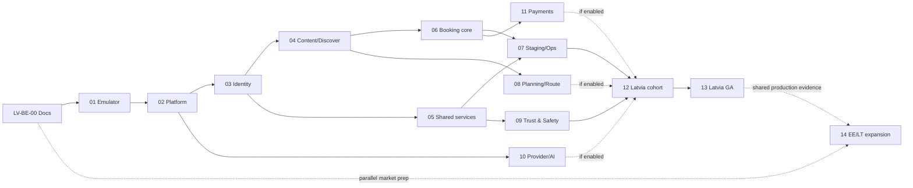

# Recharge Backend — Latvia Launch и Baltic Expansion Roadmap

- ID: BCK-02-A1
- Версия: 1.0
- Дата: 2026-08-10
- Статус: **Draft — review required, documentation only**
- Accountable owner: Platform Architecture
- Parent: [BCK-02 v2.4](RECHARGE_BACKEND_DELIVERY_MAP.md)
- Primary launch market: Latvia (`LV`)
- Parallel expansion markets: Estonia (`EE`), Lithuania (`LT`)
- Runtime effect: **none**

`BCK-02-A1` — execution annex к BCK-02, а не новый BCK-spec. Он не увеличивает
checksum реестра `22 BCK + 6 RUN`, не заменяет документы BCK-01–22 и не
разрешает создание `apps/backend`, Firebase resources, credentials, deployment
или production data processing.

## 0. Решение и ожидаемый результат

Backend проектируется как одна Baltics-ready платформа. Latvia является первым
production cohort и первым General Availability market. Estonia и Lithuania
готовятся параллельно с первого этапа, но получают независимые activation gates.

Это означает:

- одна identity и capability authority для трёх рынков;
- один `PublisherRef` contract и один account на пользователя;
- одна кодовая база и единые API/schema/event contracts;
- versioned market configuration вместо country forks;
- независимые content, provider, legal-policy и rollout revisions для `LV`,
  `EE`, `LT`;
- market-level server flags: готовность одного рынка не включает другой;
- Latvia launch не блокируется незавершённой локализацией или legal review
  Estonia/Lithuania;
- Estonia/Lithuania не требуют миграции схемы или переписывания backend после
  Latvia launch.

Целевой результат — production backend, который обслуживает полный продуктовый
контур Recharge: Identity, Publisher, 10 Create types, Discover, Search/Map,
Media, Notifications, Library, Reviews, Trust & Safety, Event Booking,
Scenario, Quick Plan, Route, Admin/Support, analytics и optional gated
Provider/AI/Payments integrations.

## 1. Приоритет и границы

При конфликте действует приоритет BCK-02 §3:

1. Accepted ADR.
2. Approved domain/runtime slice spec.
3. Frozen Architecture Baseline и принятые cross-cutting policies.
4. BCK-02 v2.4.
5. Этот execution annex.

Непересматриваемые границы:

- mobile presentation/domain не знают Firestore;
- каждый authoritative record type имеет одного writer;
- Booking/hold/ledger/outbox отделены от Event;
- internal Booking, provider handoff и Payments не смешиваются;
- Route, Scenario и Quick Plan остаются разными aggregates;
- Creator — тот же User с verified capabilities;
- Professional Page — page-scoped publisher/workspace;
- Admin tools не являются role switch, workspace или publisher;
- local/mock/cache не являются production authority;
- offline mutation не создаёт подтверждённый Booking;
- public availability — read projection с source/freshness, не transaction
  authority;
- Payments требуют отдельный Accepted ADR;
- runtime начинается только отдельным Approved executable slice.

## 2. Модель Baltic expansion

### 2.1. Market не равен language, country или environment

```text
environment: dev | staging | production
market: LV | EE | LT
locale: lv-LV | et-EE | lt-LT | en-* | ru-*
currency: ISO 4217 value, initially EUR
timezone: IANA zone carried by place/occurrence
```

Нельзя создавать `latvia backend`, `estonia backend` и `lithuania backend` как
три расходящихся приложения. Environment изолирует operational risk; market
определяет product availability и policy. Отдельный country project допустим
только после Accepted OD-07/revision, если этого потребует право, residency,
масштаб или blast-radius analysis.

### 2.2. Начальная market matrix

| Market | Country code | Currency | Primary locale | Required product locales | Default IANA zone | Initial state |
|---|---|---|---|---|---|---|
| Latvia | `LV` | `EUR` | `lv-LV` | `lv-LV`, `en`, `ru` | `Europe/Riga` | First production cohort |
| Estonia | `EE` | `EUR` | `et-EE` | `et-EE`, `en`; `ru` only by approved product policy | `Europe/Tallinn` | Parallel preparation, server-disabled |
| Lithuania | `LT` | `EUR` | `lt-LT` | `lt-LT`, `en`; additional locales only by approved policy | `Europe/Vilnius` | Parallel preparation, server-disabled |

Это launch configuration, а не разрешение хардкодить значения. BCK-20 хранит
их как versioned reference data. Все три страны используют EUR, но API всё
равно передаёт ISO currency и minor units; currency нельзя выводить из market.

Primary locale не определяет язык пользователя. Пользователь выбирает locale,
может путешествовать между рынками и видеть content на нескольких языках.
Юридически значимый текст публикуется только после market-specific Legal review;
английский или русский перевод не заменяет обязательную локальную версию.

### 2.3. Target `MarketConfig`

Каждая published revision содержит минимум:

```text
marketId
countryCode
status: disabled | internal | invited | cohort | enabled | suspended
supportedLocales[]
fallbackLocaleOrder[]
currencyCodes[]
ianaZones[]
serviceAreaRevision
categoryDatasetRevision
contentPolicyRevision
privacyPolicyRevision
minorsPolicyRevision
trustSafetyPolicyRevision
providerRegistryRevision
supportPolicyRevision
featureFlagsRevision
effectiveAt
supersedesRevision
```

Market configuration:

- versioned и immutable после publication;
- изменяется trusted command, не Flutter Remote Config;
- имеет audit trail и rollback на предыдущую revision;
- не содержит secrets;
- не переписывает исторические Booking/payment facts;
- применяется server-side ко всем authoritative commands;
- неизвестная/newer revision обрабатывается fail-closed.

### 2.4. Cross-market semantics

- Account, identity verification и PublisherRef глобальны в рамках платформы.
- User может иметь `homeMarketId`, но это preference, не authorization boundary.
- ManagedPage может иметь несколько разрешённых markets; membership и
  capabilities проверяются отдельно от market publication eligibility.
- Place/Event физически связаны с country/geo reference; язык описания хранится
  отдельно.
- Scenario и Route могут пересекать границы стран без смены aggregate.
- Quick Plan остаётся private/invited utility и не становится market catalog.
- Favorite/Visit History принадлежат User и могут ссылаться на объекты любого
  доступного market.
- Discover query явно несёт market/service-area context и не смешивает
  disabled market в публичную выдачу.
- Booking применяет policy market события, а не home market пользователя.

## 3. Launch profiles

### 3.1. Latvia GA required

До Latvia GA обязательны:

- production Auth и server-owned capabilities;
- Personal/Page PublisherRef authority;
- публикация и moderation lifecycle принятых 10 Create types;
- Discover catalog, filter, geo и honest availability;
- protected Media pipeline;
- Favorites и explicit Visit History sync;
- Reviews с Trust & Safety controls;
- Notification inbox и обязательные transactional effects;
- Admin/Support, audit и repair workflow;
- privacy export/deletion orchestration;
- operational monitoring, budgets, backup, restore и rollback;
- Latvia `lv/en/ru` product localization и approved legal copy;
- external HTTPS booking handoff как обязательный fallback;
- internal free Booking только если R5/R6 и G4–G6 полностью пройдены.

### 3.2. Optional at Latvia GA

Могут оставаться server-disabled без ложного claims:

- internal paid Booking и Payments;
- live provider inventory/sync;
- production AI provider;
- email channel, если OD-02 исключает его;
- advanced recommendation/ranking;
- Estonia/Lithuania public catalog.

Optional capability не может быть скрытой зависимостью required flow. При её
отключении существует рабочий fallback или функция полностью отсутствует в UI.

### 3.3. Baltic expansion readiness

EE/LT готовятся параллельно по shared contracts. Для каждого рынка отдельно
проходят:

```text
Market Design Review
Market Staging Ready
Market Legal/Privacy Ready
Market Content/Provider Ready
Market Production Cohort
Market General Availability
```

Ни один market status не наследуется автоматически от Latvia.

### 3.4. Независимые market gates

| Gate | Требование | Разрешает |
|---|---|---|
| M0 Market registered | MarketConfig Draft, owner, service area и disabled flags | Документацию и fixtures |
| M1 Technical staging | Locales/reference data/search/provider fixtures и market-isolation tests | Market staging data |
| M2 Legal/Privacy ready | Approved notices, national addenda, OD-11 revision, DSR/retention и store review | Реальные personal data в bounded cohort |
| M3 Operations ready | Support/moderation routing, alerts, budgets, rollback и incident ownership | Production cohort start |
| M4 Cohort proven | Predetermined observation window и thresholds пройдены | Market GA review |
| M5 Market GA | Signed go/no-go и audited server revision | Public enablement рынка |

Для Latvia `M0–M5` проходят первыми. Estonia и Lithuania могут достичь M0–M3
параллельно, но ни один их gate не считается пройденным по Latvia evidence.

## 4. Target platform и будущая файловая карта

Физические файлы ниже — target, а не существующий runtime:

```text
apps/backend/
  firebase.json
  .firebaserc.example
  firestore.rules
  firestore.indexes.json
  storage.rules
  package.json
  tsconfig.json
  functions/
    src/
      bootstrap/
      shared/{api,auth,errors,ids,time,idempotency,events,flags,telemetry}/
      markets/
      identity/
      content/
      discover/
      booking/
      library/
      notifications/
      media/
      planning/
      route/
      trust_safety/
      admin/
      providers/
      ai/
      payments/
    test/
      unit/
      contract/
      fixtures/
      emulator/
      rules/
      security/
      migration/
      load/
      reconciliation/
packages/api_contracts/
  schema/
  fixtures/
  lib/src/dto/
docs/runbooks/
  backend-incident.md
  backend-rollback.md
  backend-reconciliation-repair.md
  backend-privacy-deletion.md
  backend-disaster-recovery.md
  backend-security-abuse.md
```

Каждый executable slice получает собственный exact file plan. Имена могут быть
уточнены BCK-01/BCK-05, но domain boundaries не могут быть объединены ради
удобства одной Function.

## 5. Общие требования для каждого этапа

Каждый `LV-BE-*` slice до начала содержит:

1. Approved scope и accountable owner.
2. Точные создаваемые/изменяемые файлы.
3. Parent BCK/ADR и reconciliation report.
4. Included/excluded behavior.
5. Data classification и authoritative writer.
6. API/schema/event versions и fixtures.
7. Authorization/capability matrix.
8. Idempotency, concurrency и retry model.
9. Migration/import и compatibility plan.
10. Market impact `LV/EE/LT`.
11. Unit/contract/emulator/Rules/security/load test matrix.
12. Server flags и initial default-off state.
13. Rollback и data-reconciliation plan.
14. Cost/SLO/alert impact.
15. Evidence links и LAUNCH_STATUS update.

Timeout, skipped gate, manual happy-path или существование файла не являются
pass. `Done` не означает `Enabled`.

### 5.1. Critical path и допустимый параллелизм



Пунктир означает optional/parallel gate, а не authority dependency. Planning,
Provider/AI и Payments блокируют Latvia cohort только если соответствующая
capability входит в заявленный launch profile.

### 5.2. Контрольные точки подключения Flutter-приложения

Backend считается пригодным для приложения только при выполнении BCK-18:

1. Source JSON Schema и fixtures находятся в `packages/api_contracts`.
2. Generated outputs не редактируются вручную.
3. Mobile data adapters реализуют domain/application ports; presentation и
   domain не импортируют Firebase SDK/schema.
4. Каждый read state типизирован как local/cache/server/stale/unsupported.
5. Client preflight не считается authoritative validation.
6. Auth ID token и App Check token передаются transport layer, но capability
   decision остаётся backend-owned.
7. Local drafts импортируются через explicit user action и import command.
8. Minimum supported client и compatibility window опубликованы до cutover.
9. Server/newer schema fail-closed без потери unknown data.
10. Network timeout для mutation возвращает recoverable unknown outcome;
    повтор использует тот же idempotency key.
11. Booking никогда не показывает confirmation до authoritative result.
12. Market/feature flags с сервера управляют доступностью действия; UI flag
    только отображает полученное состояние.
13. Mock datasource остаётся только demo/test dependency и исключается из
    production authority path.
14. Cutover выполняется по feature/domain, имеет rollback на прежний adapter и
    не требует одновременной миграции всех aggregates.
15. Contract, fixture, integration и widget tests подтверждают одинаковую
    пользовательскую семантику local и server flows там, где это допустимо.

## 6. LV-BE-00 — Documentation foundation

### Цель

Довести D1–D5 contracts до состояния, при котором физический backend можно
реализовывать без параллельных моделей и необратимых предположений.

### Порядок

1. BCK-01 `RECHARGE_BACKEND_MASTER_SPEC.md`.
2. Параллельно после BCK-01 Review: BCK-03 API, BCK-04 Security/Privacy,
   BCK-05 Operations, BCK-20 Reference/Localization.
3. После Approved platform set: BCK-06 Identity, BCK-18 Mobile Integration,
   BCK-07 Content, BCK-08 Discover.
4. Затем BCK-09/12/13/14/19/21/22.
5. BCK-10/11 Planning/Route и gated BCK-15/16.
6. BCK-17 только после отдельного Accepted Payments ADR.
7. RUN-01–06 создаются по фактическому runtime, не по воображаемой topology.

### Baltic requirements

- BCK-01 определяет одну platform boundary для `LV/EE/LT`.
- BCK-20 определяет `MarketConfig`, locale fallback и dataset revisions.
- BCK-04 определяет EU common baseline и national policy addenda.
- OD-07 сравнивает EU resource locations по latency, availability, cost,
  residency и co-location до provisioning.
- OD-10 закрывает `lv/et/lt/en/ru` wire/fallback semantics.
- OD-11 получает market-versioned Legal/Privacy evidence.
- BCK-08 доказывает multilingual/diacritics/geo search strategy.

### Exit

- G1 пройден;
- BCK-01/03/04/05/20 Approved;
- OD-07 и OD-10 Accepted;
- OD-09 и OD-11 минимум Proposed с запрещённым runtime;
- BCK-02 и этот annex reconciled;
- runtime остаётся Absent.

### Rollback

Документационная ревизия superseded новой версией; runtime/data rollback не
требуется.

## 7. LV-BE-01 — Local toolchain и Emulator feasibility (R0)

### Цель

Доказать воспроизводимый backend toolchain локально без создания cloud project
или обработки реальных данных.

### Scope

- pinned Node/TypeScript/Firebase CLI/Java versions;
- workspace package и lint/test commands;
- Firebase Emulator Suite для Auth, Functions, Firestore и Storage;
- минимальный health callable без product mutations;
- deterministic environment loader с fake local values;
- contract fixture runner из `packages/api_contracts`;
- CI smoke job без secrets и network-dependent production resources;
- local structured logs с redaction test.

### Не входит

- Firebase console project;
- production/staging credentials;
- domain collections;
- mobile adapter;
- real Auth provider;
- provisioning или deployment.

### Required tests

- clean checkout bootstrap;
- Windows и CI-compatible commands;
- emulator start/stop without orphan process;
- no outbound production call;
- fixture compatibility;
- secret scan;
- failure when environment is unknown.

### Exit

- reproducible local proof;
- exact dependency lock;
- no cloud resource/data;
- rollback удаляет только bounded R0 scaffold;
- отдельное разрешение R1 всё ещё требуется.

## 8. LV-BE-02 — Platform scaffold и environments (R1)

### Цель

Создать безопасный backend skeleton с раздельными environments и всеми
authoritative mutations default-off.

### Scope

- `dev`, `staging`, `production` project/resource inventory;
- environment-scoped service identities и least privilege IAM;
- Firestore/Functions/Storage location decision по OD-07;
- CI/CD с build artifact, approval и rollback identity;
- Secret Manager references без secret values в repo;
- server-owned feature/market flags;
- common request envelope, requestId, traceId и typed errors;
- App Check verification hook, rate-limit port и abuse telemetry;
- structured logging без raw tokens, secrets и unrestricted PII;
- budgets, alerts и per-environment cost attribution;
- backup/export design и restore target;
- `LV/EE/LT` configs существуют, но все production markets disabled.

### Location gate

Firestore location выбирается до provisioning: существующую instance location
нельзя затем изменить. Сравниваются минимум European multi-region `eur3` и
подходящие European regional options; Functions, Storage, Scheduler/tasks,
logging и backup co-location проверяются по каждому resource. Решение не
выводится из близости одного региона и включает latency/load/cost/DR evidence.

### Security gates

- deny-by-default Rules;
- no broad production admin SDK identity;
- separate deploy and runtime identities;
- no wildcard secret access;
- App Check не заменяет Auth, capability и rate limits;
- production project creation требует named approver;
- all mutation flags remain off.

### Exit

- G1 и R0 evidence подтверждены;
- isolation/IAM/flags/budget/rollback tests зелёные;
- production traffic и personal data отсутствуют;
- topology inventory создан;
- RUN-02/05 могут быть drafted только по фактической topology.

## 9. LV-BE-03 — Identity, Publisher и capabilities (R2)

### Цель

Заменить mock authority на production Identity boundary, не меняя consumer UX
Viewer/Creator и не создавая country-specific accounts.

### Scope

- Firebase Auth Google/Apple provider configuration;
- mandatory authenticated Viewer;
- account/session/access snapshot commands and queries;
- verified Creator state отдельно от social sign-in;
- ManagedPage, membership, page-scoped capabilities;
- global PublisherRef `{type: user|page, id}`;
- Personal/Page workspace authorization;
- exact-page and cross-page negative checks;
- revocation, suspended account и emergency deny;
- account linking/recovery/deletion по OD-08;
- age/account eligibility по Accepted OD-11;
- user market/locale preferences без authority semantics;
- privacy export/deletion handlers и immutable security audit;
- local/mock identity import only through approved idempotent mapping.

### Baltic behavior

- один account работает в LV/EE/LT;
- market publication eligibility отделена от identity verification;
- page может получить eligibility нескольких markets независимо;
- locale preference не выдаёт доступ и не меняет legal policy;
- minors/account policy проверяется по применимой market/legal revision;
- EE/LT production account creation остаётся disabled до market gate.

### Required tests

- Auth/App Check/capability layering;
- forged UID/custom claims rejected;
- revoked membership fails immediately within accepted propagation bound;
- exact-page isolation;
- duplicate provider linking and recovery;
- deletion/export completeness;
- local mock cannot grant production role;
- cross-market account and publisher tests;
- minors fail-closed tests;
- Rules/IAM emulator suite.

### Exit

- G2 passed;
- BCK-06/BCK-18 Approved;
- OD-04/08 Accepted, OD-11 Accepted for enabled Identity scope;
- production grants are server-owned;
- Identity can remain disabled for public users until R11.

## 10. LV-BE-04 — Content publication, reference data и Discover (R3)

### Цель

Создать authoritative publication pipeline и scalable read catalog для всех
принятых 10 Create types.

### Scope

- local draft import session/checkpoint/dry-run;
- idempotent create/submit/review/publish/unpublish/archive commands;
- stable entity/revision/PublisherRef/provenance;
- Event v2.2.3 classification and occurrence contracts;
- Content-owned publication/moderation lifecycle;
- Discover-owned catalog/search/geo/freshness projections;
- versioned Category and MarketConfig distribution;
- multilingual fields и deterministic locale fallback;
- externalBookingUrl validation and honest external handoff;
- public/protected/private projection separation;
- projection rebuild/replay и zero-downtime version migration;
- seed/content-pack license, provenance, correction and removal;
- market, service-area и feature-flag filters applied server-side.

### Search/scale

OD-01 выбирает Firestore query/geohash, Enterprise capability или внешний
index на основе quality, multilingual relevance, diacritics, geo, latency,
privacy, operations и cost. Firestore нельзя выдавать за full-text engine без
доказательства. Search index является projection и не получает Content
authority.

### Baltic behavior

- LV catalog может быть enabled при disabled EE/LT;
- published object хранит canonical content language и localized variants;
- market visibility не выводится только из языка;
- cross-border Route/Scenario remains discoverable only under explicit query;
- Latvian, Estonian и Lithuanian diacritics входят в fixtures;
- missing official locale blocks market legal/publication copy, но не портит
  записи другого market.

### Required tests

- all 10 Create types contract fixtures;
- unknown/newer schema fail-closed round-trip;
- publisher/capability/market negative matrix;
- import retry/dedupe/rollback;
- projection replay consistency;
- geo boundary and pagination stability;
- multilingual ranking/fallback fixtures;
- stale availability disclosure;
- seed provenance/removal;
- load test at least 2x approved peak forecast without hotspot regression.

### Exit

- G3 passed;
- LV publication/catalog can enter staging;
- EE/LT projections remain disabled but use identical contracts;
- no client direct write to published collections.

## 11. LV-BE-05 — Media, Notifications, Library и Reviews (R4)

### Цель

Завершить общие пользовательские сервисы без передачи им authority исходных
domains.

### Media

- initiate/finalize upload contract;
- owner/content reference checks;
- MIME/size/dimension and malware policy;
- transform/thumbnail pipeline;
- protected metadata and signed/bounded access;
- orphan cleanup, retention and deletion propagation;
- no public bucket-by-default.

### Notifications

- inbox/preferences/device token ownership;
- FCM delivery, dedupe and invalid-token cleanup;
- outbox consumer with Accepted OD-09 envelope;
- localized templates by market/locale revision;
- deep links reference stable IDs;
- email only after OD-02;
- notification failure never rolls back committed domain fact.

### Library/Reviews

- Favorites и explicit Visit History as actor-owned records;
- no automatic visit from view, GPS, favorite or Booking;
- Reviews/rating separate from Library;
- rating projection rebuildable;
- review publication remains disabled until R8 Trust & Safety;
- report case is BCK-22 record, not Review field.

### Required tests

- upload ownership and malicious metadata;
- deletion/orphan reconciliation;
- notification idempotency/replay/localization;
- token isolation;
- Visit History explicit evidence invariant;
- review/rating consistency;
- privacy export/deletion across all three services;
- EE/LT template fallback remains disabled when unapproved.

### Exit

- BCK-12/13/14 Approved;
- foundations Done and default-off where safety dependency is absent;
- operational and product telemetry remain separated.

## 12. LV-BE-06 — Authoritative Event Booking core (R5)

### Цель

Реализовать принятый ECL-03C transaction core в Emulator без production
traffic, Payments или provider inventory.

### Scope

- пять authenticated callable surfaces из Approved ECL-03C plan;
- Booking, Hold, ledger, usage, audit, outbox, idempotency records;
- backend time и trusted transaction;
- finite general capacity и explicit unlimited instant-free path;
- owner-only queries и protected projections;
- requestId/idempotency conflict behavior;
- authorization and market eligibility hooks;
- notification effects остаются disabled до BCK-13;
- all production flags off.

### Scale and contention

- zero oversell и zero duplicate confirmation являются invariants;
- тестируются concurrent create/cancel/expire/retry races;
- workload включает normal, peak и approved flash-burst profile;
- single hot document/ledger bottleneck измеряется, не предполагается;
- если 2x forecast нарушает latency/error budget, до staging принимается
  отдельная sharding/admission-control/queue revision;
- public/provider availability не участвует в transaction decision.

### Baltic behavior

- market policy события определяет eligibility;
- timezone occurrence не заменяет UTC transaction time;
- internal free Booking может быть enabled market-by-market;
- paid/provider paths остаются отдельными;
- unresolved age-sensitive path fail-closed без блокировки общего disabled core.

### Exit

- G4 passed;
- contract/fixture/emulator/Rules/contention/invariant suites green;
- no production data or cloud enablement;
- rollback disables flags and restores compatible code, не удаляя audit facts.

## 13. LV-BE-07 — Persistent staging, Admin и Operations (R6)

### Цель

Перенести proven domains в persistent staging, создать управляемую поддержку и
доказать operational readiness до любого public cohort.

### Scope

- staging Identity/capabilities;
- synthetic/pseudonymous staging datasets;
- BCK-19 Admin cases and read audit;
- propose/approve/execute repair, two-person approval;
- domain-owned repair commands;
- reconciliation dashboards and bounded jobs;
- metrics/logs/traces/alerts/SLO/error budget;
- budget alerts and kill switches;
- backup/export and restore drill;
- deployment rollback drill;
- security/abuse tabletop;
- privacy deletion/export test;
- load/retry/poison-message exercises;
- RUN-01–06 derived from actual topology.

### Prohibitions

- Admin cannot write domain collection directly;
- staging staff token cannot work in production;
- raw production data is not copied to staging;
- repair does not erase immutable audit;
- no alert may contain unrestricted PII or secrets.

### Exit

- G5 passed;
- BCK-19 and applicable BCK-22/BCK-13 Approved;
- RUN-03 exercised on actual commands;
- RTO/RPO/SLO/cost thresholds have accepted numeric values in BCK-05;
- Latvia staff-only cohort evidence green.

## 14. LV-BE-08 — Scenario, Quick Plan и Route backend (R7)

### Цель

Добавить sync/publication для planning products без смешивания aggregates.

### Scenario

- personal/unlisted/public lifecycle;
- version/revision conflict and idempotent sync;
- catalog/custom/time-block/planned-transport semantics;
- transport snapshots remain `not live` unless provider proof exists;
- template publication and moderation handoff.

### Quick Plan

- private/invited utility;
- owner/invite authorization;
- no catalog publication;
- explicit one-way Expand creates new Scenario ULID;
- no live reverse relation.

### Route

- continuous track/anchors/segments/GPX/elevation/POI semantics;
- protected raw GPS and privacy-trimmed publication;
- media refs through BCK-14;
- GPX import/export audit and size limits;
- no Scenario fields in Route.

### Baltic behavior

- cross-border routes/scenarios retain one aggregate;
- each stop/segment keeps actual geo/timezone references;
- public visibility is evaluated for every involved market;
- disabled market content is not leaked by cross-border projection;
- transit/provider snapshot has market source and freshness.

### Exit

- BCK-10/BCK-11 Approved;
- sync/conflict/import/privacy/rollback suites green;
- cross-border fixtures cover LV–EE, LV–LT and EE–LT paths;
- public publication remains flag-controlled.

## 15. LV-BE-09 — Trust & Safety и UGC production (R8)

### Цель

Разрешить Reviews, Find People и другой UGC только после полного safety
lifecycle и market-appropriate response process.

### Scope

- report illegal/unsafe content with stable target reference;
- block/mute and interaction suppression;
- spam/rate/fraud controls;
- evidence retention and restricted access;
- sanction levels and typed visibility commands;
- user notification with reason category;
- complaint and appeal lifecycle;
- contact point and response tracking;
- repeat-abuse and emergency escalation;
- minors safeguards under OD-11;
- moderator language routing for `lv/et/lt/en/ru` as enabled;
- transparency metrics without exposing victims/reporters.

### DSA/market gate

Applicable DSA obligations and national Digital Services Coordinator contacts
are validated by Legal for each operating entity/market. Roadmap не делает
юридический вывод о классификации сервиса. Unresolved requirement blocks only
the affected UGC surface/market and fails closed.

### Required tests

- reporter identity confidentiality;
- blocked-user graph enforcement;
- sanctioned content disappears from all projections;
- appeal cannot bypass sanction;
- admin cannot self-approve prohibited repair;
- multilingual notice templates;
- emergency disable and audit integrity;
- deletion/retention conflict reviewed by Privacy/Legal.

### Exit

- BCK-22 and OD-06 Approved/Accepted;
- OD-11 Accepted for enabled scope;
- R8 evidence supports market-specific UGC flag;
- Reviews/Find People remain disabled in markets without completed gate.

## 16. LV-BE-10 — Provider и AI integrations (R9)

### Provider integration

- versioned provider registry per market;
- adapter contract independent of vendor;
- provenance, fetchedAt, expiresAt and source status;
- cache/retry/circuit breaker/kill switch;
- live-check and external handoff distinction;
- provider result never confirms internal Booking;
- credential only in Secret Manager;
- licensing, terms, rate and cost review per provider/market.

### AI integration

- server-only provider-neutral proxy;
- prompt registry, schema validation and eval fixtures;
- input redaction before provider gateway;
- quota, cost ledger and abuse controls;
- no training/retention claim without contract evidence;
- deterministic fallback to local/non-AI flow;
- AI output is proposal, never automatic publication or authority.

### Baltic behavior

- adapters enable independently for LV/EE/LT;
- unsupported language/market uses explicit fallback;
- provider coverage is measured, not inferred from country name;
- production AI is not required for Latvia GA.

### Exit

- BCK-15/16 Approved for enabled adapter;
- vendor/security/privacy/cost review complete;
- outage and retry-storm tests green;
- market and global kill switches proven.

## 17. LV-BE-11 — Payments (R10, separately gated)

### Цель

Добавить платёжную authority без помещения financial state в Event или Booking.

### Mandatory entry

- новый Accepted Payments ADR;
- BCK-17 Approved;
- payment service provider and operating entity decision;
- Legal/Tax/Accounting/Security review for each enabled market;
- reconciliation, refund, dispute and incident ownership;
- production Identity and Booking prerequisites.

### Scope

- payment intent/attempt/ledger/webhook records;
- signed webhook verification and replay protection;
- idempotent capture/refund/cancel;
- minor-unit currency contract;
- Booking consumes typed payment result only;
- payout/merchant model explicitly chosen;
- financial audit and reconciliation;
- dispute/refund/support lifecycle;
- provider outage and duplicate webhook handling;
- market-by-market enablement.

### Latvia/Baltics launch rule

Payments не являются скрытым blocker первоначального Latvia launch: платные
события используют approved external handoff, пока R10 не завершён. Нельзя
называть external flow внутренней оплатой Recharge.

### Exit

- financial/security/reconciliation suites green;
- zero unresolved money mismatch in staging proof;
- independent rollback/disable path;
- Payments enablement never follows automatically from Booking enablement.

## 18. LV-BE-12 — Latvia production cohort (R11)

### Цель

Безопасно включить реальных пользователей и production data в ограниченном LV
cohort до General Availability.

### Entry

- G6 passed for exact enabled feature set;
- all affected specs Approved and runtime Done;
- LV MarketConfig revision Approved;
- `lv/en/ru` product and legal copy reviewed;
- DSR, retention, restore, rollback, abuse and support proofs current;
- App Store/Google Play/privacy disclosures reconciled;
- on-call and incident commander named;
- budgets and automatic stop thresholds accepted;
- EE/LT production flags remain disabled independently.

### Rollout sequence

1. Internal production smoke with synthetic accounts.
2. Named invited cohort with bounded data and support channel.
3. Expanded Latvia cohort after observation checkpoint.
4. Go/no-go review for Latvia GA.

Размеры cohort, observation duration и thresholds фиксируются до deployment в
release evidence; их нельзя менять задним числом ради pass.

### Automatic stop conditions

- authorization or cross-page/market leak;
- Booking invariant breach;
- unexplained data loss/duplication;
- privacy/security incident;
- SLO/error-budget threshold breach;
- runaway cost or retry storm;
- moderation/support capacity exceeded;
- restore/rollback unavailable.

### Exit

- bounded cohort metrics within accepted thresholds;
- no unresolved SEV-1/SEV-2 or privacy blocker;
- rollback and support evidence current;
- Latvia GA decision prepared, not assumed.

## 19. LV-BE-13 — Latvia General Availability (R12)

### Entry

- G7 passed;
- production cohort completed predetermined observation window;
- SLO, latency, invariant drift, abuse, support load and cost accepted;
- backup/restore and rollback windows current;
- capacity forecast and 2x peak proof current;
- Product, Engineering, Security/Privacy and Operations sign go/no-go;
- LAUNCH_STATUS and public disclosures match actual feature flags.

### GA behavior

- only evidence-backed functions are visible;
- external/provider/internal availability are labelled honestly;
- disabled market/feature has no reachable mutation endpoint;
- support and privacy requests have measured response workflow;
- migrations remain reversible within declared compatibility window;
- post-GA changes follow the same bounded slice process.

### Exit

Latvia market status becomes `enabled` only by audited server-side revision.
GA does not automatically enable Estonia, Lithuania, Payments, AI or providers.

## 20. LV-BE-14 — Estonia/Lithuania parallel expansion

Этот этап начинается организационно с LV-BE-00 и может выполняться параллельно
с Latvia implementation. Public activation каждого рынка происходит только
после его независимого G6/G7-equivalent evidence.

### Shared work выполняется один раз

- MarketConfig and reference-data engine;
- multi-locale API contracts;
- global Identity/PublisherRef;
- environment/IAM/observability platform;
- domain modules and migration framework;
- cross-market authorization tests;
- privacy/DSA workflows;
- provider registry abstraction;
- support and analytics market dimension.

### Estonia checklist

- `et-EE` product/legal localization;
- Estonia service areas and content provenance;
- national Privacy/consumer/ePrivacy/DSA review;
- OD-11 Estonia policy revision;
- local moderation/support routing;
- search/diacritics/geo fixtures;
- provider and external booking coverage;
- EE staging, cohort, observation and GA decision.

### Lithuania checklist

- `lt-LT` product/legal localization;
- Lithuania service areas and content provenance;
- national Privacy/consumer/ePrivacy/DSA review;
- OD-11 Lithuania policy revision;
- local moderation/support routing;
- search/diacritics/geo fixtures;
- provider and external booking coverage;
- LT staging, cohort, observation and GA decision.

### Independence rules

- EE failure does not roll back LV or LT unless shared-platform invariant fails;
- LT legal blocker disables only affected LT capability when isolation is safe;
- shared security/privacy defect triggers platform-wide stop;
- no market receives copied production data from another market;
- shared account remains usable for enabled markets;
- country expansion uses config/data revisions, not branch forks;
- each market has separate cost, abuse, support and content-quality evidence.

## 21. Security and privacy baseline

### Layered control

```text
Firebase Auth
  + App Check
  + API validation
  + capability/ownership/market authorization
  + Firestore Rules and IAM
  + rate limits/abuse controls
  + immutable audit
```

Ни один слой не заменяет остальные. Admin SDK bypass Rules учитывается в IAM и
service code tests. Client claims, Remote Config и UI visibility не являются
authority.

### Data classes

Каждая collection/blob/log/event получает:

- owner and purpose;
- public/protected/private/restricted classification;
- lawful-basis and notice reference where applicable;
- retention and deletion behavior;
- export/DSR behavior;
- log/analytics allowlist;
- encryption/access requirements;
- market/legal-policy revision;
- processor/subprocessor inventory link.

### Baltic legal governance

EU baseline применяется ко всем трём рынкам, но national addenda и operating
entity facts проверяются отдельно. Legal conclusion не кодируется из
roadmap-текста. Для production evidence используются актуальные guidance и
контакты надзорных органов Latvia DVI, Estonia AKI и Lithuania VDAI, а для DSA
— актуальный список national Digital Services Coordinators.

## 22. Reliability, scale и cost baseline

До R1 BCK-05 назначает численные SLO, RTO, RPO, budget и capacity targets.
Этот annex фиксирует обязательные измерения, но не выдумывает значения без
traffic forecast и cost decision.

Обязательные workload classes:

- normal weekday;
- weekend/event peak;
- notification burst;
- catalog reindex/rebuild;
- media upload burst;
- Booking contention peak;
- provider outage/retry storm;
- market launch ramp;
- privacy deletion batch;
- restore/reconciliation workload.

Scale rules:

- stable non-monotonic IDs;
- no global hot counter/document;
- index fanout measured;
- cursor pagination, bounded query and bounded worker;
- traffic ramp follows tested gradual strategy;
- retries bounded and idempotent;
- outbox replay and poison-message isolation;
- load proof at least 2x approved peak forecast;
- cost per active user, published object, media GB, notification and Booking
  operation observable by market without storing unnecessary personal data.

Zero-tolerance invariants:

- unauthorized cross-user/page/market access;
- Booking oversell or duplicate confirmation;
- silent schema downgrade;
- secret/credential in client or repository;
- untracked authoritative write;
- production mutation enabled by client-only flag;
- deletion marked complete while required handler failed.

## 23. Migration from current local/mock application

Migration выполняется domain-by-domain, а не массовым Firestore upload.

1. Inventory local schemas and owner namespaces.
2. Classify records: importable, local-only, stale, demo seed, corrupt.
3. Dry-run validates identity mapping, permanent IDs and compatibility.
4. User sees scope and consequences before import where required.
5. Import session has checkpoint, idempotency key and source revision.
6. Each record passes owning domain command.
7. Duplicate/conflict produces typed result, not silent overwrite.
8. Partial failure is resumable.
9. Rollback removes/reverts only imported mutable state where lawful and safe;
   immutable audit remains.
10. Seed/demo records never become user claims or production authority.
11. Market/locale defaults are captured only for new/imported records and do
    not rewrite existing valid publisher/content facts silently.

## 24. Test and evidence matrix

| Test family | Required from | Purpose |
|---|---|---|
| Unit | R0 | Pure invariant/error/idempotency logic |
| Schema/contract | R0 | Backward/forward compatibility and unknown values |
| Shared fixtures | R0 | Mobile/backend parity |
| Emulator integration | R1 | Functions/Firestore/Auth/Storage behavior |
| Rules/IAM negative | R1 | Deny unauthorized/direct/cross-scope access |
| App Check/rate abuse | R2 | Layered request protection |
| Migration/dry-run | R2/R3 | No loss, duplication or wrong owner |
| Projection replay | R3 | Rebuildable catalog/rating/availability |
| Media security | R4 | Ownership, malicious input, deletion |
| Booking contention | R5 | Zero oversell/duplicate/partial write |
| Reconciliation/repair | R6 | Detect and safely correct drift |
| Load/soak/fault | R6 | SLO, retry, cost and degradation behavior |
| Privacy DSR/deletion | R6 | Complete export/deletion with evidence |
| Backup/restore/DR | R6 | Accepted RTO/RPO proof |
| Trust & Safety | R8 | Report/block/sanction/appeal end-to-end |
| Provider/AI failure | R9 | Fallback, kill switch, quota, redaction |
| Payments reconciliation | R10 | Money/webhook/refund/dispute integrity |
| Market isolation | R2–R14 | LV/EE/LT flags, policy and data boundaries |
| Production cohort | R11 | Real operational readiness within bounds |

Каждый evidence artifact содержит date, commit/build ID, environment, command,
result, owner и ограничения. Timeout или interrupted run записывается как
inconclusive.

## 25. Latvia launch readiness matrix

| Area | Required gate | Latvia GA | Estonia/Lithuania parallel state |
|---|---|---|---|
| Platform/IAM/locations | G1/R1 | Required | Shared, market disabled |
| Identity/Publisher | G2/R2 | Required | Shared account; activation gated |
| Content/Discover | G3/R3 | Required | Contracts/data preparation parallel |
| Media/Notifications | R4 | Required for enabled flows | Templates/providers gated |
| Library | R4 | Required | Shared contracts |
| Reviews | R8 | Required if visible | Disabled until market T&S gate |
| Internal free Booking | G4–G6 | Optional only if fully proven | Disabled independently |
| External booking handoff | R3 | Required fallback where applicable | Provider coverage per market |
| Scenario/Route cloud sync | R7 | Required only if advertised as cloud feature | Parallel fixtures |
| Trust & Safety | R8 | Required for UGC | National process/localization gated |
| Admin/Support | G5/R6 | Required | Shared tools, market queues |
| Privacy/DSR | G6 | Required | National addenda before cohort |
| Provider live integration | R9 | Optional | Market-specific |
| Production AI | R9 | Optional | Language/market-specific |
| Payments | R10 | Optional, separate ADR | Market-specific Legal/PSP gate |
| Cohort/GA | G6/G7 | LV first | EE/LT independent |

## 26. Definition of Done всей Latvia backend programme

Программа не считается завершённой только потому, что `apps/backend` создан.
Для Latvia production-ready состояния:

- required BCK specs Approved;
- required runtime modules Done и enabled только по server flags;
- G1–G7 пройдены для exact Latvia feature profile;
- production Identity and Publisher authority proven;
- all 10 Create types publish through trusted commands;
- Discover projections rebuildable and freshness-honest;
- required user services, moderation and support operational;
- privacy export/deletion and incident workflows exercised;
- backup restore and rollback exercised;
- accepted SLO/cost/capacity evidence sustained;
- `lv/en/ru` UI and applicable legal copy approved;
- no unresolved critical security/privacy/Booking invariant;
- LAUNCH_STATUS matches deployed facts;
- EE/LT expansion artifacts exist without enabling unfinished markets;
- disabled optional capability is labelled honestly and has no reachable
  authoritative mutation.

## 27. Acceptance criteria

1. Документ является annex BCK-02 и не создаёт новый BCK registry item.
2. Runtime effect Draft v1.0 равен none.
3. Latvia — first cohort, Estonia/Lithuania — parallel independent markets.
4. Одна codebase/platform обслуживает LV/EE/LT без country forks.
5. Environment и market являются разными axes.
6. Account/Identity/PublisherRef едины для Baltic platform.
7. MarketConfig versioned, audited, server-owned и rollback-capable.
8. MarketConfig не содержит secrets.
9. Country, market, locale, currency и timezone не выводятся друг из друга.
10. Currency передаётся ISO 4217/minor units даже при общем EUR.
11. IANA timezone сохраняется для локальной семантики.
12. Primary locale не является authorization или content-market proof.
13. LV поддерживает product locales `lv/en/ru` до launch.
14. EE/LT добавляют `et/lt` без изменения API model.
15. Legal copy проходит отдельный review по market.
16. Market enablement выполняется server-side revision и default-off flags.
17. Latvia readiness не включает EE/LT автоматически.
18. EE/LT blocker не задерживает LV, если shared invariant не затронут.
19. Shared security/privacy defect может остановить все markets.
20. BCK-01 создаётся первым после BCK-02.
21. D1 platform set предшествует R0/R1 provisioning.
22. OD-07 Accepted до создания location-bound resources.
23. OD-10 задаёт locale wire/fallback policy.
24. OD-11 versioned и validated для каждого enabled market.
25. OD-01 доказывает multilingual/geo search choice.
26. R0 не создаёт cloud project или production data.
27. R1 создаёт isolated environments и default-off mutations.
28. Deploy и runtime identities разделены least privilege.
29. Secrets отсутствуют в repo/mobile/logs.
30. Auth/App Check/Rules/IAM/rate limits применяются слоями.
31. App Check не считается единственной защитой.
32. Production grants всегда server-owned.
33. Exact-page and cross-market authorization имеют negative tests.
34. Local/mock identity не выдаёт production role.
35. Local-to-cloud import идемпотентен, resumable и проходит domain command.
36. Demo/seed data не становится production authority.
37. Все 10 Create types используют один publication engine/contracts.
38. Content writer и Discover projection writer разделены.
39. Search index не получает Content authority.
40. Unknown/newer contracts fail-closed без silent downgrade.
41. Public/protected/private projections разделены.
42. Availability содержит source и freshness.
43. Public availability не участвует в Booking transaction decision.
44. Media access основан на protected metadata и ownership.
45. Notification delivery не владеет domain lifecycle.
46. Notification failure не откатывает committed domain fact.
47. Visit History создаётся только explicit user action.
48. Reviews/rating и report cases являются разными aggregates.
49. Reviews/Find People не включаются без Trust & Safety gate.
50. Booking/hold/ledger/outbox отделены от Event.
51. Booking использует backend time и atomic trusted transaction.
52. Offline Booking confirmation отсутствует.
53. Oversell и duplicate confirmation — zero-tolerance invariants.
54. Booking contention proof использует минимум 2x approved peak forecast.
55. Failed Booking scale proof требует отдельного sharding/admission decision.
56. Admin repair использует propose/approve/execute.
57. Admin не пишет domain collection напрямую.
58. Operational monitoring и product analytics разделены.
59. Runbooks строятся по фактической topology.
60. Restore, rollback, privacy deletion и security tabletop проверены до G6.
61. Route, Scenario и Quick Plan остаются разными aggregates.
62. Cross-border planning не раскрывает disabled market content.
63. Provider result не подтверждает internal Booking.
64. AI output не публикуется автоматически и не становится authority.
65. Provider/AI имеют quota, fallback и kill switch.
66. Payments требуют отдельный Accepted ADR и BCK-17.
67. Payment state не хранится в Event или Booking aggregate.
68. External payment/booking handoff называется внешним честно.
69. R11 использует bounded Latvia cohort и заранее заданные thresholds.
70. Stop conditions включают auth leak, Booking invariant, privacy и cost.
71. Latvia GA требует G7 и observation window.
72. GA включает только evidence-backed features.
73. EE и LT проходят собственные cohort/GA decisions.
74. Market cost, abuse, support and content quality измеряются отдельно.
75. Data class/retention/deletion существует для каждой persisted record type.
76. Logs/analytics не содержат unrestricted PII.
77. Every executable slice has exact files, tests, migration and rollback.
78. Timeout/skipped/inconclusive verification не является pass.
79. LAUNCH_STATUS обновляется только фактическим evidence.
80. Финальный Approved/exported artifact byte-identical canonical version.
81. Каждый market проходит M0–M5 самостоятельно, без наследования Latvia pass.
82. Mobile подключается через BCK-18 ports/adapters и shared contracts, не через
    Firestore imports в presentation/domain.
83. Неизвестный outcome network mutation повторяется только с тем же
    idempotency key и не превращается в локальный success.
84. Mock datasource исключён из production authority path.
85. Optional stage блокирует cohort только когда его capability входит в
    объявленный launch profile.

## 28. Open work и следующий пакет

До approval этого annex:

- проверить traceability всех LV-BE stages к BCK-01–22;
- согласовать Latvia required/optional launch profile;
- подтвердить parallel EE/LT scope и locale policy;
- проверить, что новые Baltic requirements не требуют нового ADR;
- исправить найденные conflicts, не создавая runtime.

После approval следующий пакет остаётся документационным:

1. BCK-01 Draft с Baltic platform boundary.
2. BCK-03/04/05/20 exact outlines.
3. OD-07/09/10/11 initial proposals с Baltic evidence requirements.
4. R0 exact file plan, но без реализации до отдельного разрешения.
5. Reconciliation report с BCK-02, Architecture Baseline и LAUNCH_STATUS.

## 29. Официальные reference points

Источники проверены 2026-08-10; перед irreversible decision выполняется новая
проверка актуальности:

- [Firebase resource locations](https://firebase.google.com/docs/projects/locations)
- [Cloud Firestore locations](https://firebase.google.com/docs/firestore/locations)
- [Cloud Firestore best practices](https://firebase.google.com/docs/firestore/best-practices)
- [Cloud Firestore scale](https://firebase.google.com/docs/firestore/understand-reads-writes-scale)
- [Firebase App Check](https://firebase.google.com/docs/app-check)
- [European Commission: data protection by design/default](https://commission.europa.eu/law/law-topic/data-protection/information-business-and-organisations/obligations/what-does-data-protection-design-and-default-mean_en)
- [European Commission: Digital Services Coordinators](https://digital-strategy.ec.europa.eu/en/policies/dsa-dscs)
- [Latvia Data State Inspectorate](https://www.dvi.gov.lv/en)
- [Estonia Data Protection Inspectorate](https://www.aki.ee/en)
- [Lithuania State Data Protection Inspectorate](https://vdai.lrv.lt/en/)

Ссылки являются evidence inputs, а не заменой Legal/DPO, Security, Tax или
store review для конкретного operating entity и enabled product scope.
