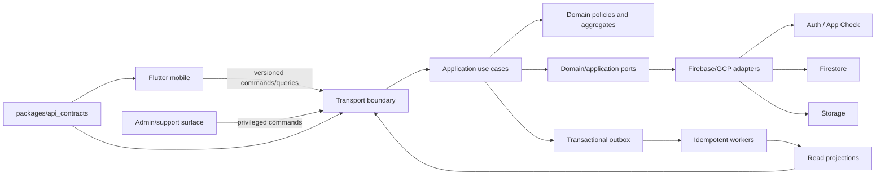

# Recharge Backend — Master Specification and Initial Architecture Audit

- ID: **BCK-01**
- Version: **0.4.42**
- Date: **2026-08-27**
- Spec status: **Review — owner evidence recorded; approval pending**
- Runtime status: **Local R0 tooling scaffold Present; product/cloud runtime Absent**
- Accountable owner: **Platform Architecture owner**
- Review coordinator: **RechargeN / Product owner**
- Markets: **Latvia first; Estonia and Lithuania prepared but disabled independently**
- Runtime effect of this revision: **none**
- Canonical repository path: `docs/product/RECHARGE_BACKEND_MASTER_SPEC.md`
- Link base: all relative links resolve from repository directory
  `docs/product/`, even when a review copy is distributed through Downloads

## 0. Changelog

### v0.4.42 — 2026-08-27

- registered BCK09-API-DEC-01 v0.1 and BCK09-API-CORR-01 v0.1 as the
  Product-selected API target and separately gated contract-correction plan;
- reconciled BCK-09 v1.5, ECL-03C v1.3, coverage v1.4, API review v0.2 and
  specialist package v0.4 without recording any named specialist signature;
- kept command-schema correction, ECL03-D12, API-DEC-01/03, parity evidence,
  Firebase, deployment and production runtime blocked;
- advanced BCK-02 factual traceability to v2.4.46.

### v0.4.41 — 2026-08-26

- registered BCK09-API-REV-01 v0.1 and BCK09-REV-01 v0.3 as the first
  specialist-phase evidence without recording a named signature;
- recorded API technical Hold for the command-schema/DTO divergence, missing
  atomic request-attempt binding, API-DEC-01/03, request-ID format decision and
  absent TypeScript/query parity;
- kept BCK-09/ECL-03C Review, all nine specialist signatures Pending and every
  product/Firebase/deployment/production gate blocked;
- advanced BCK-02 factual traceability to v2.4.45.

### v0.4.40 — 2026-08-26

- registered BCK-09 v1.4, ECL-03C v1.2, BCK-09-PRE v1.2 and specialist
  review package v0.2 after resolving TR-09..11;
- replaced unspecified duplicate-active evidence with one deterministic atomic
  active key, reconciled BCK-19 repair ownership and made disabled outbox
  obligations permanently non-replayable;
- kept all nine specialist signatures Pending, BCK-09/ECL-03C Review and every
  Firebase/product-runtime/production/deployment gate blocked;
- advanced BCK-02 traceability to v2.4.44.

### v0.4.39 — 2026-08-26

- recorded BCK09-DEC-01 v0.2: the Product owner accepted
  `BCK09-A1-STAGED-FREE-BOOKING-v1` with controls;
- registered BCK-09 v1.3 and BCK-09-PRE v1.1 with six bounded Accepted design
  dispositions and four Deferred/Open decisions;
- kept BCK-09 Review, ECL-03C Review and all specialist, Firebase, product
  runtime, production-data, deployment and activation gates blocked;
- advanced BCK-02 traceability to v2.4.43.

### v0.4.38 — 2026-08-26

- registered reconciled BCK-09 v1.2 and BCK-09-PRE v1.0 as Review/Present with
  runtime Absent and 22/22 mandatory coverage;
- preserved Booking v1 wire semantics, exact ECL-03C record names and the
  bounded ECL-03C versus conditional ECL-03D–H stage boundary;
- reconciled Content, Discover, Notifications, Operations and Admin single
  writers around Booking without promoting Draft/Review dependencies;
- kept all ten BCK09 decisions, OD-09/OD-11, Firebase, product runtime,
  deployment and `main` merge authority blocked;
- advanced BCK-02 traceability to v2.4.42.

### v0.4.37 — 2026-08-26

- registered BCK-21 v0.2 and BCK-21-PRE v0.2 as Review/Present with runtime
  Absent;
- separated product analytics from BCK-05 telemetry, domain/audit facts and
  BCK-22 enforcement authority;
- recorded current 66 emitted literal names versus 27 catalog definitions,
  unresolved owners and unsafe identifier debt as migration blockers;
- kept OD-05, destination, retention/DSR, contracts, IAM and runtime blocked;
- advanced BCK-02 traceability to v2.4.41.

### v0.4.36 — 2026-08-26

- registered BCK-12 v0.2 and BCK-12-PRE v0.2 as Review/Present with runtime
  Absent;
- preserved User Library and Reviews as separate bounded aggregates;
- fixed the explicit Visit History, typed Favorite, review source and
  rebuildable rating-projection boundaries;
- kept BCK-22 cases, Firebase, migration and runtime blocked;
- advanced BCK-02 traceability to v2.4.40.

### v0.4.35 — 2026-08-26

- added BCK-19 v0.2 Review and its v0.2 22/22 coverage evidence as the
  single-writer Admin/Support case, privileged-read-audit and repair-workflow
  contract;
- preserved Identity/IAM, owning-domain, Privacy, T&S, Notifications and
  Platform Operations authority and made direct data editing/impersonation
  explicitly fail-closed;
- advanced traceability to BCK-02 v2.4.39 while ten BCK19 decisions, domain
  repair commands, staff access, RUN-03, Firebase and runtime remain absent.

### v0.4.34 — 2026-08-25

- added BCK-13 v0.2 Review and its v0.2 22/22 coverage evidence as the
  single-writer inbox/preferences/push-registration/delivery contract;
- separated source lifecycle, inbox/read state and channel attempt, made push
  a privacy-minimized query hint and kept email disabled while OD-02 is Open;
- advanced traceability to BCK-02 v2.4.38 while OD-02/09/10, ten BCK13
  decisions, contracts, FCM/email, migration, Firebase and runtime remain
  unresolved.

### v0.4.33 — 2026-08-25

- added BCK-08 v0.2 Review and its v0.2 22/22 coverage evidence as the one-writer
  Catalog/Search/Feed/Map/Details/public-availability projection contract;
- made shared query fingerprint, compatible projection-set revision, typed
  map/feed membership reconciliation and data freshness normative;
- advanced traceability to BCK-02 v2.4.37 while OD-01/03, BCK-07 runtime,
  contracts, indexes, migration, Firebase and production remain unresolved.

### v0.4.32 — 2026-08-25

- added BCK-07 v0.2 Review and its v0.2 22/22 coverage evidence as the single
  Content publication lifecycle/current-revision authority;
- fixed the canonical ten-type registry around Scenario, left Quick Plan
  legacy-read/private only and separated source-domain, Media and Catalog writers;
- advanced traceability to BCK-02 v2.4.36 while OD-03/10/11, dependency
  Approval, contracts, migration, Firebase and runtime remain unresolved.

### v0.4.31 — 2026-08-25

- added BCK-14 v0.2 Review and its v0.2 22/22 coverage evidence as the
  single-writer Media asset/upload/object/variant/delivery contract;
- separated Media readiness from the still-absent BCK-07 content attachment
  and publication lifecycle, keeping integration fail-closed;
- advanced traceability to BCK-02 v2.4.35 while all Storage, contracts,
  workers, migration, provisioning, runtime and production gates remain absent.

### v0.4.30 — 2026-08-25

- added BCK-18 v0.2 Review and v0.2 coverage/reconciliation evidence as the
  typed mobile/backend seam and import-orchestration contract;
- recorded the BCK-03 split-key reconciliation, Mobile v3.1 AC-42 erratum and
  blocking M2 Money prerequisite without changing mobile runtime;
- advanced traceability to BCK-02 v2.4.34 while OD-04/08/10, BCK-18 Approval,
  contracts, adapters, Firebase, migration and all R3 gates remain unresolved.

### v0.4.29 — 2026-08-25

- added BCK-06 v0.2 Review and its v0.3 22/22 coverage/reconciliation evidence
  as the first D2 authority specification;
- preserved OD-08/OD-11, session, verification, capability, retention,
  Legal/Privacy, BCK-18 and every executable R2 gate as unresolved;
- advanced traceability to BCK-02 v2.4.33 without Firebase, product backend,
  mobile runtime, deployment, push or `main` merge authority.

### v0.4.28 — 2026-08-25

- recorded BCK05-OD-07 Accepted at `BCK05-REL-A1-DUAL-PROV-v1` with controls
  through exact BCK05-OD07-DEC-01 v0.2 owner evidence;
- retained BCK-04/BCK-05 Draft, complete D1/G1, separately Approved release
  R0/R1 and every executable/cloud/product-runtime gate;
- advanced traceability to BCK-02 v2.4.32, BCK-04 v0.4.16 and BCK-05 v0.2.23
  without workflow, repository/cloud mutation, deployment or `main` merge
  authority.

### v0.4.27 — 2026-08-25

- added decision-ready BCK05-OD-07 release/provenance candidate
  `BCK05-REL-A1-DUAL-PROV-v1` and its unsigned owner-decision contract;
- retained BCK05-OD-07 Proposed plus BCK-04/BCK-05 Draft, complete D1/G1,
  exact R0/R1 authorization and all executable/cloud/product-runtime gates;
- advanced traceability to BCK-02 v2.4.31, BCK-04 v0.4.15 and BCK-05 v0.2.22
  without workflow, repository/cloud mutation, deployment or `main` merge
  authority.

### v0.4.26 — 2026-08-24

- recorded BCK05-OD-02 Accepted at `BCK05-IAM-A1-ENV-WIF-v1` with controls
  through the exact BCK05-OD02-DEC-01 v0.2 owner verdict;
- retained BCK-04/BCK-05 Draft, complete D1/G1, exact R1 authorization and all
  executable IAM/secret/product-runtime evidence gates;
- advanced traceability to BCK-02 v2.4.30, BCK-04 v0.4.14 and BCK-05 v0.2.21
  without provisioning or `main` merge authority.

### v0.4.25 — 2026-08-24

- added decision-ready IAM/workload-identity candidate
  `BCK05-IAM-A1-ENV-WIF-v1` and unsigned BCK05-OD02-DEC-01 owner contract;
- preserved BCK05-OD-02 Proposed, BCK-04/BCK-05 Draft, D1/G1/R1 and every
  GitHub/GCP/IAM/secret/product-runtime gate;
- advanced traceability to BCK-02 v2.4.29, BCK-04 v0.4.13 and BCK-05 v0.2.20
  without provisioning or `main` merge authority.

### v0.4.24 — 2026-08-24

- recorded OD-07 Accepted at `OD07-A1-EU-MR-v1` with controls through the
  exact OD07-DEC-01 v0.2 owner verdict and evidence v0.6;
- retained BCK-04/BCK-05 Draft, qualified production Legal/Privacy review,
  complete D1/G1, exact R1 approval and all cloud/product runtime gates;
- advanced traceability to BCK-02 v2.4.28, BCK-04 v0.4.12 and BCK-05 v0.2.19
  without provisioning or merge authority.

### v0.4.23 — 2026-08-24

- added review-ready `OD07-A1-EU-MR-v1` evidence and unsigned OD07-DEC-01,
  including exact per-resource locations, Standard/Enterprise rationale,
  global/US-service disclosure, thresholds and replacement/rollback boundary;
- retained OD-07 Proposed, qualified production Legal/Privacy review, complete
  D1/G1, R1 and all cloud/product runtime as blocked or absent;
- advanced traceability to BCK-02 v2.4.27, BCK-04 v0.4.11 and BCK-05 v0.2.18.

### v0.4.22 — 2026-08-24

- recorded `BCK05-OD-01` Accepted at baseline v0.3.3 with controls through the
  exact `BCK05-OD01-DEC-01 v0.2` owner verdict;
- retained BCK-05 Draft, other operations decisions, complete D1/G1, R1 and
  product/cloud runtime as blocked or unchanged;
- D1 traceability updated to BCK-02 v2.4.26 and BCK-05 v0.2.17; BCK-01
  remains Review.

### v0.4.21 — 2026-08-24

- reconciled bounded R0 Pass across the current D1 review, sign-off and owner
  workbook instead of preserving the pre-execution snapshot as current fact;
- added `BCK05-OD01-DEC-01` as a Review owner-decision candidate without
  accepting OD-01 or opening G1/R1;
- D1 traceability updated to BCK-02 v2.4.25 and BCK-05 v0.2.16; BCK-01
  remains Review and product/cloud runtime remains Absent.

### v0.4.20 — 2026-08-24

- recorded bounded R0 Pass after explicit owner acceptance of
  `BCK-R0-TCH-ADV-01` with expiring demo-only/no-cloud controls;
- retained BCK05-OD-01 as Proposed, BCK-05 as Draft and product/cloud runtime,
  R1/G1, credentials, provisioning and deployment as absent/blocked;
- D1 traceability updated to BCK-02 v2.4.24 and BCK-05 v0.2.15; BCK-01
  remains Review.

### v0.4.19 — 2026-08-24

- recorded successful hosted R0 parity on `ubuntu-24.04` and `windows-2025`
  without claiming product/backend or cloud runtime;
- retained the Moderate-advisory disposition as the remaining R0 Pass blocker;
- D1 traceability updated to BCK-02 v2.4.23 and BCK-05 v0.2.14; BCK-01
  remains Review.

### v0.4.18 — 2026-08-24

- reconciled the Approved and locally executed R0 tooling scaffold without
  claiming product/backend or cloud runtime;
- linked exact local build/emulator/Rules/Terraform/reproducibility evidence
  and preserved hosted parity plus Moderate-advisory disposition as blockers;
- D1 traceability updated to BCK-02 v2.4.22 and BCK-05 v0.2.13; BCK-01
  remains Review.

### v0.4.17 — 2026-08-23

- added exact R0 full-SHA Action, runner and signed-archive Terraform evidence
  plus the formal unsigned approval decision record;
- rejected the unsigned reviewed Terraform Action without expanding scope;
- D1 traceability updated to BCK-02 v2.4.21 and BCK-05 v0.2.12; BCK-01
  remains Review and runtime remains Absent.

### v0.4.16 — 2026-08-23

- added BCK05-OD01-TCH-REV-01 technical pre-review and BCK-R0-TCH-01 exact
  local toolchain/emulator slice plan;
- recorded proposed exact SDK/JDK/lint/test candidates without converting
  technical pre-review into owner/security sign-off or R0 authorization;
- D1 traceability updated to BCK-02 v2.4.20 and BCK-05 v0.2.11; BCK-01 remains
  Review and runtime remains Absent.

### v0.4.15 — 2026-08-21

- added BCK05-OD01-TCH-01 as the dated Node.js 22, TypeScript/npm, Firebase
  CLI and Terraform candidate with deterministic build/emulator/IaC contracts;
- BCK05-OD-01 advances from Open to Proposed, while exact remaining pins,
  compatibility, owner/security and executable R0 evidence remain blocked;
- D1 traceability updated to BCK-02 v2.4.19 and BCK-05 v0.2.10; BCK-01 remains
  Review and runtime remains Absent.

### v0.4.14 — 2026-08-21

- added BCK05-OD02-IAM-01 and BCK05-OD07-REL-01 as complete Draft evidence for
  keyless workload identity, least privilege, provenance, promotion and
  component-aware rollback;
- BCK05-OD-02/07 advance from Open to Proposed, while exact claims/roles,
  toolchain/attestor, specialist and executable evidence remain blocked;
- D1 traceability updated to BCK-02 v2.4.18 and BCK-05 v0.2.9; BCK-01 remains
  Review and runtime remains Absent.

### v0.4.13 — 2026-08-21

- recorded the bounded Product-owner disposition for SLO v0.1, Cost v0.2 and
  Recovery v0.1 as stage-validation baselines;
- kept Operations/Security evidence conditions and Inconclusive Finance/Legal
  scopes explicit; no broader D1 specialist signature is inferred;
- D1 traceability updated to BCK-02 v2.4.17 and BCK-05 v0.2.8; OD-03/04/05
  remain Proposed, BCK-01 remains Review and runtime remains Absent.

### v0.4.12 — 2026-08-21

- added BCK05-NUM-REV-01 exact-version owner-review evidence for SLO, cost and
  recovery proposals;
- corrected recovery-retention cost amplification and exposed L3 budget,
  same-project recovery, representative RTO and Legal/Finance evidence gates;
- D1 traceability updated to BCK-02 v2.4.16 and BCK-05 v0.2.7; OD-03/04/05
  remain Proposed, BCK-01 remains Review and runtime remains Absent.

### v0.4.11 — 2026-08-21

- added independent `BCK05-OD03-SLO-01` and `BCK05-OD05-REC-01` evidence with
  numerical user-journey SLO/error budgets and record-family RPO/RTO/restore
  contracts;
- `BCK05-OD-03` and `BCK05-OD-05` advance from Open to Proposed; owner verdicts,
  representative stage/restore evidence, executable controls and runtime remain
  absent;
- D1 traceability updated to BCK-02 v2.4.15 and BCK-05 v0.2.6; BCK-01 remains
  Review and runtime remains Absent.

### v0.4.10 — 2026-08-21

- added BCK05-OD04-COST-01 with dated price anchors, reproducible workload/cost
  formulas, directional estimates and proposed EUR budget controls;
- `BCK05-OD-04` advances from Open to Proposed, while OD-07, owner/Finance/
  Operations verdict, EUR SKU/stage evidence, provisioning and runtime remain
  blocked;
- D1 traceability updated to BCK-02 v2.4.14 and BCK-05 v0.2.5;
- BCK-01 remains Review and runtime remains Absent.

### v0.4.9 — 2026-08-20

- added the ready-but-unexecuted incident tabletop exercise package with an
  honest blank execution/result record and 30 AC;
- `BCK04-OD-09`/`BCK05-OD-08` remain Proposed; no tabletop, owner, Legal,
  executable-route or runtime gate is closed by preparation alone;
- D1 traceability updated to BCK-02 v2.4.13, BCK-04 v0.4.10 and BCK-05 v0.2.4;
- BCK-01 remains Review and runtime remains Absent.

### v0.4.8 — 2026-08-20

- added shared Draft security/privacy incident-response evidence preserving the
  canonical SEV-1/2/3 vocabulary;
- BCK04-OD-09 and BCK05-OD-08 advance from Open to Proposed; owner, qualified
  Legal/Privacy, route/tabletop and runtime evidence remain absent;
- D1 traceability updated to BCK-02 v2.4.12, BCK-04 v0.4.9 and BCK-05 v0.2.3;
- BCK-01 remains Review and runtime remains Absent.

### v0.4.7 — 2026-08-20

- added full Draft threat-model evidence `BCK04-OD01-TM-01`;
- `BCK04-OD-01` is now Proposed, while owner verdict, independent review,
  BCK-04 Approval and runtime remain blocked;
- D1 traceability updated to BCK-02 v2.4.11 and BCK-04 v0.4.8;
- all other BCK/OD statuses and runtime authority are unchanged.

### v0.4.6 — 2026-08-20

- recorded the explicit combined-owner assignment for all D1 review roles;
- disclosed self-review/concentration risk and retained Pending verdicts plus
  the qualified Legal/Privacy evidence boundary;
- D1 traceability updated to BCK-02 v2.4.10, BCK-03 v0.3.3,
  BCK-04 v0.4.7, BCK-05 v0.2.2 and BCK-20 v0.2.2;
- BCK-01 remains Review, D1 exit remains blocked and runtime remains Absent.

### v0.4.5 — 2026-08-20

- completed D1-C technical pre-review and added the explicit
  [owner sign-off ledger](BACKEND_PLATFORM_D1_OWNER_SIGNOFF_LEDGER.md);
- removed the BCK-03/BCK-18 sequencing cycle and the OD-07
  evidence/provisioning cycle without weakening either gate;
- D1 traceability updated to BCK-02 v2.4.9, BCK-03 v0.3.2,
  BCK-04 v0.4.6, BCK-05 v0.2.1 and BCK-20 v0.2.1;
- every specialist remains unassigned/pending, so BCK-01 remains Review, D1
  exit remains blocked and runtime remains Absent.

### v0.4.4 — 2026-08-20

- added the D1 review evidence package and separate OD-07/09/10/11 evidence
  artifacts without changing their decision statuses;
- reconciled OD-11 consistently as Open: candidate constraints and Latvia's
  consent-law evidence do not select a Recharge account/feature age;
- D1 traceability updated to BCK-02 v2.4.8, BCK-03 v0.3.1,
  BCK-04 v0.4.5, BCK-05 v0.2 and BCK-20 v0.2;
- BCK-01 remains Review, D1 exit remains blocked and runtime remains Absent.

### v0.4.3 — 2026-08-20

- added accepted [D1 split-key reconciliation](BACKEND_PLATFORM_D1_DECISION_PACKAGE.md)
  and aligned ECL-03/BCK-09 with committed Booking v1 fixtures;
- D1 traceability updated to BCK-02 v2.4.7, BCK-03 v0.3,
  BCK-04 v0.4.4, BCK-05 v0.1.1 and BCK-20 v0.1.1;
- OD-07/09/10 remain Proposed, OD-11 remains Open, and D1 exit is still
  blocked by specialist/decision evidence;
- architecture, Review status and runtime authority are unchanged.

### v0.4.2 — 2026-08-20

- BCK-05 Operations v0.1 and BCK-20 Reference Data v0.1 are now tracked
  Draft/Present documents with runtime Absent;
- current-state and next-package text now reflects their real presence and
  remaining Review/Approval blockers;
- D1 traceability updated to BCK-02 v2.4.6, BCK-03 v0.2.4 and BCK-04 v0.4.3;
- target architecture, Review status and runtime semantics are unchanged.

### v0.4.1 — 2026-08-20

- entered `Review` after the Product owner assigned `RechargeN / Product
  owner` as the interim review coordinator across the required perspectives;
  combined review is sufficient only for Review entry and does not replace
  independent Security/Privacy, Legal or Operations approval before G1;
- current-state audit reconciled with tracked BCK-02 v2.4.5, BCK-03 v0.2.3,
  BCK-04 v0.4.2 and their exact spec/runtime evidence;
- non-Booking language-neutral schema paths are now explicitly conditional on
  Accepted `API-DEC-05`, matching BCK-03 instead of implying authorization;
- next package describes the actual Review sequence rather than asking to
  create BCK-03/BCK-04 again;
- added formal [BCK-01 reconciliation report](BACKEND_MASTER_RECONCILIATION_REPORT.md);
- architecture/runtime semantics remain unchanged; runtime effect is none.

### v0.4 — 2026-08-16

- reconciled internal §8/§17 gap: `Privacy Orchestration`, already owned by
  BCK-04 in bounded-module and authoritative-ownership tables, is now present
  in the target `modules/privacy_orchestration/` map;
- target root transport explicitly includes common middleware;
- documentation/runtime effect remains none.

### v0.3 — 2026-08-14

- повторно проверено фактическое состояние repository: BCK-02 v2.4 существует
  и Approved, Latvia/Baltics roadmap существует как Draft BCK-02-A1, BCK-09
  существует как Review v1.0; runtime всех трёх документов остаётся none/Absent;
- полезные уточнения промежуточной v0.2 перенесены без её ошибочных заявлений
  об отсутствующих документах: добавлены AGENTS/LAUNCH_STATUS, ADR 0016–0018 и
  фактическое local/mock Identity/Event groundwork;
- source priority заменён scope-aware reconciliation contract: repository
  instructions, architecture decisions, implementation status и delivery
  coordination больше не образуют ложную единую лестницу;
- authoritative ownership дополнен import, privacy orchestration, server flags,
  provider, AI и условным Payments authority;
- target `packages/api_contracts` сохраняет фактический `schema/<domain>/vN`
  layout; необоснованная миграция `schema/` → `schemas/` запрещена;
- gated AI/provider directories исключены из initial scaffold, а Payments
  directory запрещён до отдельного Accepted ADR и Approved slice;
- version-specific формулировки DoD/AC/unimplemented list исправлены на v0.3
  или `current revision`; добавлены AC-46–AC-52;
- runtime effect остаётся none; application/Firebase/backend runtime не создан.

### v0.2 — 2026-08-14 — rejected review copy

- не являлась канонической repository revision;
- ошибочно объявляла существующие BCK-02 v2.4, BCK-02-A1 и BCK-09
  отсутствующими и поэтому не принимается как источник истины;
- полезные изменения перенесены выборочно в v0.3 после повторной проверки.

### v0.1 — 2026-08-14

- выполнен первичный аудит repository/backend readiness;
- зафиксирована модель одного логического backend Recharge без создания
  монолитного domain-модуля;
- определены обязательные архитектурные слои, bounded modules и направления
  зависимостей;
- описаны target file map, authoritative ownership, data/projection boundaries,
  cross-cutting invariants и документационные пакеты;
- отделены принятые решения от открытых OD и от будущего runtime;
- сформированы Definition of Ready, Definition of Done и последовательные AC.

## 1. Verdict

Recharge нужен **один backend продукта**, но его нельзя реализовывать как один
неразделённый файл, одну Cloud Function, одну коллекцию или один универсальный
service.

Целевая модель:

```text
одна backend-платформа Recharge
  + одна identity/capability authority
  + один PublisherRef contract
  + один API/error/idempotency standard
  + один environment/security/operations baseline
  + один writer для каждого authoritative record type
  + изолированные bounded domain modules
  + отдельно построенные read projections
  + independently gated entrypoints/workers
```

На начальном масштабе Латвии и подготовке Балтии это должен быть **модульный
backend application на Firebase/GCP**, а не набор преждевременно выделенных
микросервисов. Модули разделяются контрактами, ownership и CI boundaries;
transport entrypoints и workers могут развёртываться независимо. Выделение
модуля в отдельный сервис допускается позднее только по измеримым причинам:
отдельный scaling profile, security boundary, availability objective,
ownership или cost profile — и только через новый Accepted ADR.

Нужен также не один гигантский документ, а система документации:

1. этот BCK-01 задаёт общую конструкцию и инварианты;
2. BCK-03–BCK-22 детализируют cross-cutting и domain-контракты;
3. RUN-01–RUN-06 описывают эксплуатацию фактически реализованной topology;
4. bounded executable slice разрешает конкретный runtime-код;
5. gates отдельно разрешают Emulator, staging, production cohort и GA.

## 2. Назначение и результат

BCK-01 отвечает на пять вопросов:

1. что именно считается единым backend Recharge;
2. из каких слоёв и bounded modules он состоит;
3. кто является authority и единственным writer каждого типа данных;
4. какие документы и решения обязательны до физической реализации;
5. как последовательно перейти от local/mock приложения к Latvia production и
   подготовить EE/LT без параллельных моделей.

После Approval документа команда должна иметь возможность проектировать
BCK-03, BCK-04, BCK-05 и BCK-20 независимо, не расходясь в module boundaries,
identity, IDs, time, money, market, API и ownership semantics.

### 2.1. Измеримый результат BCK-01

- у каждой capability есть ровно один owning module;
- у каждого authoritative record type есть ровно один writer;
- mobile, backend и shared-contract boundaries однозначны;
- Firebase остаётся infrastructure detail за ports, а не domain model;
- LV/EE/LT используют одну модель account/content, но независимые market gates;
- каждый будущий BCK-spec может ссылаться на конкретный раздел и AC этого
  документа;
- никакой runtime не считается разрешённым только из-за существования BCK-01.

## 3. Источники истины и разрешение конфликтов

Источники имеют разные области владения; их нельзя сводить к одной лестнице,
где status-документ случайно меняет архитектуру или coordination map — domain
инвариант.

1. Accepted ADR побеждает при архитектурном конфликте.
2. Approved spec текущего domain/runtime slice побеждает внутри своего bounded
   scope, если не противоречит Accepted ADR.
3. [Architecture Baseline](../architecture/ARCHITECTURE_BASELINE.md) и
   cross-cutting policies владеют module/layer boundaries.
4. [LAUNCH_STATUS](../architecture/LAUNCH_STATUS.md) владеет фактическим
   implementation/runtime status, но не переписывает target architecture.
5. [BCK-02 Backend Delivery Map](RECHARGE_BACKEND_DELIVERY_MAP.md) владеет
   registry, accountable owners, dependencies, waves, OD/risks и gates.
6. Этот BCK-01 владеет shared backend target, layers, module boundaries и
   cross-domain invariants, которых нет в более высоком источнике.
7. Product vision и Draft/Review proposals не переопределяют пункты выше.

[AGENTS.md](../../AGENTS.md) является канонической repository-level
инструкцией для выполнения работы: он определяет активный slice, разрешённые
изменения и обязательные проверки. Это execution authority для coding-agent,
а не параллельный product/architecture spec.

BCK-01 не supersede и не копирует domain flows. Конфликт между BCK-01 и BCK-02
разрешается по ownership: architecture/shared invariants принадлежат BCK-01,
coordination/status sequencing — BCK-02; нерешаемое пересечение блокирует
Approval и требует reconciliation либо Accepted ADR.

### 3.1. Канонические anchors

| Область | Источник | Обязательство BCK-01 |
|---|---|---|
| Repository execution | [AGENTS.md](../../AGENTS.md) | Не расширять активный slice и не считать documentation runtime-разрешением |
| Monorepo и layers | [Architecture Baseline](../architecture/ARCHITECTURE_BASELINE.md) | Сохранить frozen boundaries; backend target создаётся только разрешённым slice |
| Implementation status | [LAUNCH_STATUS](../architecture/LAUNCH_STATUS.md) | Различать target, docs/contracts, implemented, deployed и enabled evidence |
| Technology defaults | [ADR 0012](../adr/0012-tech-stack-defaults.md) | Не вводить параллельный mobile stack; backend deviations документировать |
| Domain/security policy | [ADR 0013](../adr/0013-domain-policy-baseline.md) | Сохранить IDs, lifecycle, UTC/IANA, privacy, audit с учётом superseding ADR |
| Identity/Publisher | [ADR 0015](../adr/0015-authenticated-viewer-verified-creator-professional-page.md) | Mandatory Auth, verified Creator, exact-page capabilities, PublisherRef |
| Bounded local Identity/workspace | [ADR 0016](../adr/0016-bounded-identity-workspace-during-stabilization.md), [ADR 0017](../adr/0017-admin-experience-preview-and-user-created-pages.md) | Не выдавать local/mock access snapshot, ManagedPage или Admin preview за production authority |
| AI boundary | [ADR 0018](../adr/0018-provider-neutral-ai-assistance-capability.md) | Сохранить horizontal provider-neutral facade; production proxy/provider остаётся gated |
| Booking authority | [ADR 0019](../adr/0019-authoritative-internal-booking-ledger.md) | Trusted commands, ledger, online authority, separate aggregates |
| Backend sequencing | [BCK-02 v2.4.32](RECHARGE_BACKEND_DELIVERY_MAP.md) | Сохранить registry, owners, OD, risks, D/R waves и G0–G7; v2.4 остаётся Approved semantic baseline, v2.4.1–2.4.32 — traceability amendments |
| Baltic rollout | [Latvia/Baltics roadmap](RECHARGE_BACKEND_LATVIA_IMPLEMENTATION_ROADMAP.md) | Latvia-first, EE/LT prepared and disabled independently |
| Firebase target | [Firebase Architecture](../architecture/FIREBASE_ARCHITECTURE.md) | Использовать как Proposed infrastructure input, не как runtime evidence |
| Shared contracts | [API Contracts Workflow](../api/API_CONTRACTS_WORKFLOW.md) | Language-neutral source, fixtures, generated/verified consumers |
| Event/Booking | [Event Classification v2.2.3](EVENT_CLASSIFICATION_SPEC.md), [BCK-09](EVENT_BOOKING_BACKEND_FIREBASE_FULL_SPEC.md), [ECL-03C plan](EVENT_CLASSIFICATION_ECL_03C_TRANSACTION_CORE_SLICE_SPEC.md) | Не создавать вторую Event/Booking модель; BCK-09 до Approval reconciles с exact ECL-03B/C groundwork |
| Scenario | [Scenario Builder](SCENARIO_BUILDER_SPEC.md) | Scenario не равен Route или Quick Plan |
| Route | [Route Builder](ROUTE_BUILDER_SPEC.md) | Route остаётся continuous track/GPX aggregate |

Mobile- и backend-дорожные карты имеют независимые namespaces. Например,
mobile M8 adapter preparation не равен backend R8. Ссылка всегда содержит
префикс документа/track, а не только номер этапа.

## 4. Первичный аудит текущего состояния

Дата снимка: **2026-08-20**.

| Область | Текущее evidence | Gap | Вывод |
|---|---|---|---|
| Mobile app | Flutter layered features and local/mock datasources; BCK-18 v0.2 Review/Present defines the 22/22 typed ports/adapters/cache/import/cutover seam | Нет production remote authority; M2 Money, OD-04/08/10, contract generation, mock-exclusion and executable adapters remain blocked | Не считать mock/provider HTTP production backend; BCK-18 Approval and per-domain slices precede cutover |
| Shared contracts | `packages/api_contracts`, Booking schemas/fixtures/DTO; BCK-03 v0.3.3 Draft/Present | Split-key conflict closed; combined owner assigned, verdicts pending | Расширять один workflow; non-Booking schemas запрещены до Accepted API-DEC-05 |
| Backend application | локальный R0 scaffold существует в `apps/backend` | Есть только non-product probe, default-deny Rules, emulator tests, backendless Terraform и CI contract; нет доменных handlers/repositories/deployment authority | Tooling **Present locally**; product/cloud runtime **Absent** |
| Firebase projects | `OD07-A1-EU-MR-v1` is Accepted with controls through evidence v0.6 and OD07-DEC-01 v0.2; no provider project/config/resource exists | Revalidation, G1, exact R1 approval and every remaining platform/security/legal gate are absent | Accepted topology does not authorize provisioning |
| Identity | Target принят ADR 0015; BCK-06 v0.2 Review/Present defines the 22/22 account/session/access/verification/page/membership/publisher/consent authority contract; ADR 0016/0017 разрешили только bounded local/mock behavior | Нет production Auth/capability/revocation authority; OD-08/OD-11, exact session/capability/retention decisions and executable evidence remain blocked | BCK-06 and BCK-18 Approval до product migration; сохранить compatibility без переноса mock grants |
| Content/Create | Ten-type local/config-driven Create Hub; BCK-07 v0.2 Review/Present defines the 22/22 publication/revision/provenance contract | No backend authority; OD-03/10/11, missing type/source contracts, Money, Media, Identity and migration gates remain | BCK-07 Approval, then BCK-08; Quick Plan remains outside catalog |
| Discover | Mock/local query/feed/map/details; BCK-08 v0.2 Review/Present defines 22/22 rebuildable catalog/search/parity/availability boundaries | No source/runtime/index; OD-01/03, typed ten-type projections, Money, quality/cost and migration remain blocked | BCK-08 Approval/G3 after BCK-07 runtime and accepted decisions |
| Event Booking | ADR 0019 Accepted; BCK-09 v1.5 and BCK-09-PRE v1.4 Review/Present with 22/22 coverage; BCK09-A1 accepted and BCK09-API-DEC-01 Product-selected with controls; BCK09-REV-01 v0.4 / API review v0.2 narrowed Hold; all nine named signatures Pending; ECL-03B contracts/domain Done; ECL-03C v1.3 exact nine-record/47-AC plan Review | Command schema/DTO correction, ECL03-D12, named API-DEC-01/03, TypeScript/query parity, OD-09/11, Identity, Event projection, notification/repair seams and production evidence remain blocked; no authoritative runtime | Approve/execute BCK09-API-CORR-01 and parent amendment, obtain named API verdicts, then complete remaining reviews/dependencies; only afterwards may a separately Approved ECL-03C runtime slice be considered |
| Media | Local/mobile foundations; BCK-14 v0.2.1 Review/Present defines 22/22 upload/session/blob/variant/protected-delivery/deletion boundaries | No Media runtime; BCK-07 Approval/runtime handoff and ten BCK14 owner decisions remain unresolved | BCK-14 and BCK-07 Approval before Media runtime |
| Notifications | Local secure-storage inbox/mark-read/string routes; BCK-13 v0.2 Review/Present defines 22/22 inbox/preferences/registration/delivery boundaries | No server inbox, FCM/email, token registry or worker; OD-02/09/10 and ten BCK13 decisions unresolved | BCK-13 Approval and R4 gate; push stays a hint and email stays disabled |
| Admin/Support | Local mock Admin experience preview and Route moderation/safety UI; BCK-19 v0.2 Review/Present defines 22/22 case/read-audit/propose-approve-execute boundaries | No dedicated staff identity, server case, reveal audit, repair registry/command, RUN-03 or privileged runtime | BCK-19 Approval; implement bounded domain commands, then build/drill RUN-03 before persistent stage |
| Library/Reviews/T&S | Visit History local-first; reviews backend absent | Нет sync, rating aggregate, report/block/enforcement | BCK-12/22 |
| Planning/Route | Mature local-first capability | Нет cloud sync/publication contracts | BCK-10/11 |
| Operations | BCK-05 v0.2.23 и coverage matrix v0.2.23 Draft/Present | Bounded R0 is Pass; BCK05-OD-01/02/07 and cross-domain OD-07 are Accepted; OD-03/04/05/08 and executable IAM/release/specialist/stage/restore/EUR/product-cloud evidence remain unresolved | Plan a separately Approved release R0; re-audit before R1 |
| Privacy | BCK-04 v0.4.16 и coverage matrix v0.3.16 Draft/Present | OD-07 topology, BCK05-OD-02 IAM and BCK05-OD-07 release provenance policies are Accepted while EU-resource/global-service boundaries, threat/incident models and tabletop package remain explicit; owner/independent/qualified Legal verdicts, executable IAM and DSR runtime remain absent | Закрыть BCK-04 blockers; architecture policy Acceptance не является Legal approval/runtime evidence |
| Baltic markets | BCK-20 v0.2.2 и coverage matrix v0.2.2 Draft/Present | Combined owner assigned; OD-10 remains Proposed and executable parity/distribution runtime remain absent | Закрыть BCK-20/OD-10 blockers без country forks |

### 4.1. Главный gap

Проблема не в отсутствии ещё одного общего описания Firebase. Главный gap —
отсутствие согласованного **platform contract**, связывающего product domains,
authority, transport, persistence, projections, security, operations и mobile
migration. BCK-01 закрывает этот gap на уровне архитектуры, но не закрывает
runtime gaps из таблицы.

## 5. Scope

### 5.1. Входит

- единая platform boundary для LV/EE/LT;
- слои backend и правила зависимостей;
- bounded modules и их responsibility;
- authoritative ownership и projection ownership;
- shared contracts, IDs, time, money, market и revision semantics;
- baseline для commands, queries, events, idempotency и typed failures;
- security/privacy/operations requirements на уровне master contract;
- target repository map;
- документационные и runtime gates;
- migration/cutover principles;
- acceptance criteria BCK-01.

### 5.2. Не входит

- создание `apps/backend`, Firebase project или cloud resources;
- Functions, Firestore Rules, indexes, Storage Rules или deployment;
- secrets, credentials, production data или real-user processing;
- точные JSON Schemas/API fields отдельных domains;
- UI/mobile runtime changes;
- выбор Search vendor, email provider, analytics destination или resource
  location до соответствующего OD;
- Payments runtime: он требует отдельного Accepted ADR;
- production AI/provider integration;
- подмена BCK-03–BCK-22 этим master-документом.

## 6. Целевая системная граница



Mobile не знает Firestore schema и не пишет authoritative collections
напрямую. Backend domain не знает Firebase SDK. Infrastructure реализует ports,
а transport переводит wire contracts в application commands/queries.

## 7. Обязательные архитектурные слои

| Слой | Ответственность | Может зависеть от | Не содержит |
|---|---|---|---|
| Contract/schema | Language-neutral request/response/event schemas, fixtures, compatibility | Только schema tooling | Firebase records, UI models, domain execution |
| Transport/interface | Auth/App Check context, decoding, version negotiation, rate envelope, response mapping | Application, contracts, shared technical adapters | Business policy и direct Firestore mutation |
| Application | Orchestration, use cases, command/query handlers, transaction intent, ports | Domain, contracts | Firebase documents/SDK и presentation logic |
| Domain | Aggregates, value objects, invariants, policies, typed domain outcomes | Pure shared primitives only | Network, Firebase, clocks without port, logging SDK |
| Infrastructure/data | Repository implementations, Firestore/Auth/Storage/provider adapters, transaction runner | Application/domain ports, SDKs | Product decisions, обход use cases |
| Projection/read model | Rebuildable catalog/feed/map/search/availability/inbox views | Accepted domain events/source readers | Authority над source aggregates |
| Effects/workers | Outbox consumption, notifications, expiry, cleanup, projection rebuild/replay | Application commands, accepted event contract | Unbounded retries, direct foreign aggregate writes |
| Platform/operations | Bootstrap, config, flags, IAM, deploy, observability, backups, budgets | Cross-cutting standards | Domain-specific shortcuts |

### 7.1. Dependency rules

1. Dependencies point inward: transport/infrastructure → application → domain.
2. Domain code is deterministic and infrastructure-free.
3. One domain never imports another domain's persistence model.
4. Cross-domain mutations use a typed command owned by the target domain.
5. Cross-domain asynchronous effects use the accepted outbox/event envelope.
6. A projection may compose sources, but cannot mutate or redefine them.
7. Shared code contains primitives and technical policy, not hidden product
   workflows.
8. Firebase document shape never becomes a mobile or domain public contract.
9. Unknown/newer schema or policy revision fails closed when authority,
   money, privacy, eligibility or capacity can be affected.

## 8. Bounded module map

| Module | Owns | Does not own | Detailed spec |
|---|---|---|---|
| Platform foundation | bootstrap, environment config, flags, common telemetry, task/event infrastructure | Product aggregates | BCK-03/04/05 |
| Identity & Publisher | account/session/access snapshot, Creator verification, ManagedPage membership/capabilities, PublisherRef eligibility | Content lifecycle | BCK-06 |
| Reference Data | MarketConfig, taxonomy/region/currency/locale revisions | User content | BCK-20 |
| Privacy Orchestration | DSR/export/deletion request coordination and completion evidence | Silent direct deletion of foreign domain records | BCK-04 |
| Mobile Integration | import sessions, checkpoints, local-to-permanent ID mapping and adapter compatibility | Direct writes to owning aggregates | BCK-18 |
| Content Publication | drafts/import, trusted publish lifecycle, 10 Create-type records, publisher/provenance refs | Search index, Booking ledger | BCK-07 |
| Discover & Catalog | feed/map/search/catalog projections, ranking, freshness, availability composition | Source aggregates and Booking decision | BCK-08 |
| Booking | Booking, hold, inventory ledger, usage, audit, idempotency, Booking outbox | Event content and payment ledger | BCK-09 |
| Planning | Scenario and separate Quick Plan sync/collaboration/publication | Route track | BCK-10 |
| Route | Route/GPX aggregate, track metadata and publication handoff | Scenario/Quick Plan | BCK-11 |
| User Library & Reviews | favorites, explicit Visit History, reviews and rating aggregates | Report/sanction cases | BCK-12 |
| Notifications | inbox/preferences/tokens/delivery attempts | Source domain state | BCK-13 |
| Media | upload/finalize metadata, blob ownership, transforms, protected delivery, cleanup | Content lifecycle | BCK-14 |
| Admin & Support | cases, privileged reads, propose/approve/execute repair workflow | Silent direct record editing | BCK-19 |
| Trust & Safety | reports, block/mute, sanctions, appeals, enforcement evidence | Content storage ownership | BCK-22 |
| Analytics | governed product-event ingestion and datasets | Operational alert source | BCK-21 |
| AI | provider-neutral proxy, redaction, quota and eval metadata | Product aggregate authority | BCK-15, gated |
| Provider Integration | provider adapters, provenance, cache/live-check/handoff | Internal Booking ledger | BCK-16, gated |
| Payments | payment intent/ledger/webhooks/refunds/disputes | Booking inventory ledger | BCK-17, new ADR required |

## 9. Authoritative ownership contract

Основное правило: **один authoritative record type — один writer**.

| Record family | Writer | Разрешённые consumers |
|---|---|---|
| Account/session/access/verification/page membership | Identity | Все modules читают bounded access decisions |
| Market/taxonomy/locale/reference revisions | Reference Data | Все modules хранят stable IDs/revisions |
| Personal Create drafts/import mapping and published content lifecycle | Content Publication | Mobile syncs through port; Discover, Booking config reader, Media links, T&S commands consume bounded projections |
| Search/feed/map/catalog projections | Discover | Mobile queries; source modules не пишут projection напрямую |
| Booking/hold/inventory/usage/idempotency/audit | Booking | Authorized mobile/admin projections, Discover availability reader |
| Provider availability and external booking reference/provenance | Provider Integration | Discover composes honest source/freshness; mobile performs approved handoff/live-check |
| Scenario/Quick Plan | Planning | Content/Discover только через published projection |
| Route/track references | Route | Media stores blobs; Discover reads published projection |
| Favorites/visits/reviews/ratings | User Library & Reviews | Discover reads rating projection |
| Notification delivery state | Notifications | Source domains append accepted outbox only |
| Media metadata/blob lifecycle | Media | Owning domains store protected reference |
| Import session/checkpoint/source-to-permanent-ID mapping | Mobile Integration | Owning domain validates and writes each aggregate through command |
| Reports/sanctions/appeals | Trust & Safety | Domains accept typed enforcement commands |
| Repair cases/execution audit | Admin & Support | Owning domain executes approved repair command |
| Privacy request/deletion orchestration | Privacy Orchestration | Domain-owned handlers execute scoped export/deletion work |
| Server flags/kill switches | Platform Operations | Domains read current server decision before mutation |
| Operational metrics/logs | Platform Operations | Operators and alerts |
| Product analytics records | Analytics | Governed analytics consumers |
| AI request/quota/evaluation metadata | AI Platform | Product domains consume provider-neutral facade only after BCK-15 gate |
| Payment intent/ledger/webhook/refund/dispute state | Payments | Conditional authority only after new Accepted ADR, BCK-17 and Approved executable slice |

Никакой consumer не получает write authority только потому, что ему удобно
денормализовать данные. Денормализация создаёт rebuildable projection с
отдельным revision/freshness, а не второй источник истины.

## 10. Commands, queries, events и errors

### 10.1. Commands

Каждая mutation:

- проходит trusted backend boundary;
- содержит actor/session context, immutable request ID и contract version;
- проверяет capability, scope, market policy и current resource revision;
- исполняется owning application use case;
- возвращает typed outcome и authoritative server timestamp;
- не сообщает успех до durable commit;
- при неизвестном результате допускает повтор только с тем же idempotency key.

### 10.2. Queries

Query contract содержит достаточный context: actor visibility, market/service
area, filters, cursor, projection revision и freshness. Cursor opaque и
привязан к query/version. Query не выдаёт private/protected fields через public
projection.

Discover feed/map/search одного логического query используют общую query
revision/freshness contract. Допустимые различия — viewport, clustering,
ranking window и pagination. Несогласованность обозначается typed
`stale/inconsistent_projection`, а не скрывается как нормальный результат.

### 10.3. Events/outbox

Cross-domain event:

- создаётся после/вместе с authoritative transition согласно transaction
  contract;
- имеет stable event ID, type, schema version, aggregate ID/revision,
  occurredAt, correlation/causation и minimized payload;
- доставляется at-least-once, поэтому consumer обязан deduplicate;
- допускает bounded replay и poison-message handling;
- не является разрешением чужому module напрямую менять source aggregate.

Точный envelope, ordering и retention закрывает OD-09/BCK-03/BCK-05.

### 10.4. Typed outcomes

Обязательные cross-cutting категории:

```text
success
cancelled
invalid_argument
unauthenticated
permission_denied
not_found
conflict
idempotency_conflict
failed_precondition
rate_limited
unavailable
deadline_exceeded
unsupported_client
unsupported_schema
stale_revision
internal
```

`cancelled` — отдельный non-success outcome, а не infrastructure failure.
Domain specs добавляют коды, но не меняют семантику общих категорий. Raw SDK
exceptions и stack traces не пересекают API boundary.

### 10.5. Contract evolution и minimum client

- каждый request, response, event и persisted policy имеет явную version или
  revision;
- additive optional field допустим только при доказанной backward/forward
  compatibility;
- удаление, переименование, изменение типа или семантики поля требует новой
  major contract version и migration window;
- enum имеет documented unknown-value behavior; для authority/security/money/
  eligibility/capacity неизвестное значение fail-closed;
- server публикует minimum supported client/build policy и typed
  `unsupported_client`, а не ломает старый client неструктурированной ошибкой;
- deprecation содержит owner, announce date, last-supported date, telemetry и
  rollback;
- source schemas и compatibility fixtures предшествуют generated/verified Dart
  и TypeScript consumers;
- persisted schema migration и public API evolution — разные процессы и не
  получают общий version counter автоматически;
- exact envelope, compatibility window и codegen mechanics принадлежат BCK-03.

## 11. Shared data semantics

### 11.1. IDs и references

- persistent entities используют immutable ULID/UUID;
- `loc_*` допустим только для несохранённого local draft;
- authoritative create/import выдаёт permanent ID и explicit mapping;
- связи выполняются по ID, никогда по display name;
- PublisherRef имеет форму `{type: user | page, id}`;
- event occurrence, inventory pool, media и policy revision имеют собственные
  stable IDs.

### 11.2. Time

- authoritative timestamps — UTC instant с backend time;
- локальная календарная семантика хранит IANA timezone объекта/occurrence;
- timezone устройства не меняет persisted business date;
- Visit History date интерпретируется в IANA-зоне Place;
- DST overlap/gap имеет явную validation policy в domain spec.

### 11.3. Money

- wire/persistence money — integer minor units + ISO 4217 currency;
- floating-point `double` запрещён на authoritative границах;
- currency не выводится из market, даже когда LV/EE/LT используют EUR;
- rounding и maximum bounds задаются versioned policy;
- mobile Money migration должна завершиться до production remote adapter,
  чтобы boundary не выполнял тихую double-конверсию.

### 11.4. Market и localization

`market`, `country`, `locale`, `currency`, `environment` и `timezone` — разные
понятия. Target использует versioned MarketConfig и reference revisions.

| Market | Currency | Initial locales | Default IANA zone | Initial activation |
|---|---|---|---|---|
| Latvia | EUR | `lv-LV`, `en`, `ru` | `Europe/Riga` | First cohort/GA |
| Estonia | EUR | `et-EE`, `en`; `ru` by approved policy | `Europe/Tallinn` | Prepared, server-disabled |
| Lithuania | EUR | `lt-LT`, `en`; additions by policy | `Europe/Vilnius` | Prepared, server-disabled |

Точные LocalizedText/fallback/revision semantics принадлежат BCK-20/OD-10.

## 12. Data classes и projections

Каждый BCK-spec классифицирует record/field до schema approval:

| Class | Примеры | Базовое обращение |
|---|---|---|
| Public | Published title, public geo/category, approved publisher snapshot | Только через sanitized public projection |
| Protected | User Booking, private Scenario, page membership, precise private location | Actor/scope authorization required |
| Sensitive | Verification evidence, access code, support evidence, abuse report | Minimized, encrypted/service-restricted, never public |
| Operational | Idempotency, lease, outbox, job state, audit | Backend-only except bounded admin projection |
| Derived | Search index, availability/rating counters, feed/map projection | Rebuildable, revisioned, freshness-labelled |

Для каждого record family BCK-04 и owning spec фиксируют purpose, legal basis,
access, retention, export/deletion behavior, backup treatment и log/analytics
exclusions. Наличие Firestore collection не является data inventory.

## 13. Security, privacy и abuse baseline

1. Firebase Auth подтверждает session identity, но capability решает backend.
2. Creator verification, page membership и grants server-owned и revocable.
3. App Check — дополнительный signal, не замена AuthZ/rate/abuse controls.
4. Firestore/Storage Rules deny direct authoritative writes и cross-user/scope
   reads.
5. Privileged operations используют least-privilege service identities.
6. Production secrets живут только в approved secret manager/CI context.
7. Logs, analytics, events и errors проходят redaction/minimization.
8. Rate limits учитывают actor, device/app signal, command risk и global abuse
   protection; exact thresholds принадлежат domain/security specs.
9. Admin access audited; repair использует propose/approve/execute и не обходит
   owning domain invariant.
10. Account deletion/DSR координируется BCK-04, а domain handlers удаляют или
    анонимизируют только собственные records согласно approved policy.
11. OD-11-gated minors/age-sensitive functions остаются server-disabled и
    fail-closed до Accepted market-specific policy.
12. Client guards улучшают UX, но не дают authority.

### 13.1. Master authorization matrix

| Principal/context | Базово разрешено | Всегда требуется дополнительно | Запрещено |
|---|---|---|---|
| No valid session | Auth bootstrap only | Approved provider flow | Product queries, profile, mutation |
| Authenticated active User | Authorized consumer reads; own library/profile commands | Exact actor/resource checks | Creator/page/admin authority |
| Verified Creator personal context | Personal create/submit/publish where capability exists | Active account, verification, type/action capability, lifecycle | Page publication without membership |
| ManagedPage member | Exact-page actions in granted scope | Active membership, exact page ID, page capability, market eligibility | Cross-page access or global grant |
| Admin/support principal | Explicit tool/case action only | Dedicated capability, reason/case, audit; two-person repair where required | Publisher/workspace impersonation and silent direct writes |
| Service identity/worker | Exact scheduled/event task | Least-privilege IAM, accepted event/lease/idempotency contract | General user/domain access outside task |

Revocation applies fail-closed. Every authoritative mutation evaluates current
server-owned access; a stale mobile role/workspace snapshot never authorizes
the command. Long-running/retry work records initiating actor and policy
revision, but re-evaluates the revocation rules defined by the owning spec
before any new privileged effect. Session, verification, membership, capability
or market suspension invalidates affected cached access and produces a typed
outcome without leaking whether an inaccessible resource exists.

## 14. Persistence и transaction boundaries

- Firestore — target durable store, но collection/index topology фиксируется
  owning spec и BCK-05 после OD-07;
- aggregate transaction принадлежит одному module;
- multi-record invariant изменяется атомарно либо через documented saga с
  compensating/reconciliation contract;
- direct cross-module Firestore writes запрещены;
- large blobs принадлежат Storage, Firestore хранит governed metadata/ref;
- counters являются authority только если owning domain прямо определил
  transaction invariant; иначе это derived projection;
- audit immutable и append-only в пределах retention policy;
- every retryable worker lease-protected, idempotent и bounded;
- backups не заменяют domain reconciliation и restore tests.

Booking сохраняет более строгие правила ADR 0019: ledger, usage, hold,
idempotency, audit и outbox обновляются в принятой authoritative transaction;
last-write-wins недопустим.

## 15. Offline, cache и degraded states

Client state типизирован как минимум:

```text
local | cache | server | stale | unavailable | unsupported
```

- local draft не является published server record;
- cached projection показывает source revision/fetchedAt/expiresAt, где это
  влияет на решение пользователя;
- offline mutation не создаёт authoritative Booking/payment/publication result;
- network timeout mutation означает unknown/recoverable outcome; retry сохраняет
  request ID;
- newer/unknown critical contract не silently downgrades;
- server feature flag определяет доступность authoritative action;
- degraded mode сохраняет cancellation/release/safety paths, определённые
  owning spec, и блокирует рискованные новые mutations.

## 16. Migration local/mock → backend

Migration выполняется по capability/domain, не одним bulk upload:

1. инвентаризация local schemas и owner namespaces;
2. классификация `importable | local-only | demo-seed | stale | corrupt`;
3. принятие OD-04/OD-08 и owning import contract;
4. dry-run identity/publisher/ID/schema mapping;
5. explicit user disclosure/consent, когда требуется;
6. import session с checkpoint, source revision и idempotency key;
7. каждый record проходит command owning domain;
8. conflict/duplicate возвращает typed result;
9. partial failure resumable;
10. rollback затрагивает только imported mutable state, не стирая lawful audit;
11. demo/mock records никогда не становятся production user claims;
12. mobile adapter переключается feature-by-feature с server kill switch и
    обратимым fallback там, где fallback не создаёт ложную authority.

Production mobile presentation/application/domain не импортируют Firebase SDK
или Firestore schemas. BCK-18 определяет adapters и cutover evidence.

## 17. Target repository map

Следующая структура является **target plan**, а не разрешением создать файлы:

```text
apps/backend/
  firebase.json
  .firebaserc.example
  firestore.rules
  firestore.indexes.json
  storage.rules
  functions/
    package.json
    tsconfig.json
    src/
      bootstrap/
        app.ts
        config.ts
        composition_root.ts
      shared/
        auth/
        contracts/
        errors/
        ids/
        money/
        time/
        transactions/
        observability/
        flags/
      modules/
        identity/
        privacy_orchestration/
        reference_data/
        content/
        discover/
        booking/
        planning/
        route/
        library_reviews/
        notifications/
        media/
        admin_support/
        trust_safety/
        analytics/
      transport/
        middleware/
        callable/
        http/
      workers/
        outbox/
        schedules/
        projections/
        cleanup/
      generated/
    test/
      unit/
      contract/
      emulator/
      rules/
      integration/
      load/
      reconciliation/

packages/api_contracts/
  schema/
    booking/
      v1/
        *.schema.json
        fixtures/
    <domain>/                    # conditional after Accepted API-DEC-05
      vN/
        *.schema.json
        fixtures/
  lib/
    src/
      contracts/
      dto/{request,response}/
      serializers/
      clients/
      generated/
  test/
```

Внутри каждого `modules/<name>/` target pattern:

```text
domain/
application/
infrastructure/
transport/
```

Модуль может опустить неприменимый слой, но не смешать его ответственность с
другим. `generated/` редактируется только генератором. Exact files, runtime
versions, dependency pins, Firebase project IDs, regions and deploy identities
принадлежат Approved BCK-03/04/05 и executable slice.

`packages/api_contracts/schema/booking/v1` уже существует и является
compatibility anchor. BCK-03 сохраняет target pattern `schema/<domain>/vN`, но
любая non-Booking language-neutral namespace остаётся запрещённой до Accepted
`API-DEC-05`. После такого решения расширение не переименовывает `schema/` в
`schemas/`, не переносит существующие fixtures и не создаёт второй contract
source без отдельного Approved migration plan.

Initial scaffold не создаёт пустые `ai/`, `providers/` или `payments/`
directories «на будущее». AI/provider modules появляются только в собственном
Approved executable slice после BCK-15/BCK-16. Payments module и любая его
physical directory дополнительно требуют новый Accepted Payments ADR и
Approved BCK-17 slice. Отсутствие директории является корректным fail-closed
состоянием, а не architecture gap.

Root `transport/` содержит только общий endpoint registry, middleware и
composition. `modules/<name>/transport/` содержит принадлежащие модулю wire ↔
application mappers/handlers. Ни один из них не содержит domain policy или
direct persistence shortcut.

## 18. Environments, deployment и operations

Target environments: `dev`, `stage`, `prod`, с отдельными credentials и
fail-closed mapping. Local Emulator не является четвёртым production
environment.

До provisioning BCK-05 обязан определить:

- project/resource separation и blast radius;
- Firestore edition и immutable/semimmutable resource locations через OD-07;
- workload/service identities и IAM matrix;
- secret lifecycle and rotation;
- CI/CD provenance, approvals and artifact promotion;
- server-owned flags с default-off risky mutations;
- SLO/SLI, alerts, on-call and incident severity;
- cost budgets, quota alarms and automatic containment;
- backup/export, accepted RPO/RTO and restore drill;
- deployment and data rollback distinctions;
- event/task topology после OD-09.

Operational logs/metrics принадлежат BCK-05. Product analytics принадлежат
BCK-21. Они могут использовать общий correlation ID, но не смешивают purpose,
access и retention.

## 19. Test and evidence baseline

| Test family | Что доказывает | Первый обязательный gate |
|---|---|---|
| Unit | Pure domain/application invariants | R0/executable slice |
| Schema/contract | Backward/forward compatibility, unknown values | BCK-03/R0 |
| Shared fixtures | Dart/TypeScript semantic parity | R0 |
| Emulator integration | Auth/Functions/Firestore/Storage behavior | R1 |
| Rules/IAM negative | Direct/cross-user/cross-page denial | R1/R2 |
| Idempotency/retry/fault | Safe duplicate, timeout and partial failure | Per mutation module |
| Projection replay | Rebuildability and revision/freshness | R3 |
| Migration/dry-run | No loss, duplication or wrong owner | Before domain cutover |
| Concurrency/contention | No oversell/lost updates | Booking R5 |
| Reconciliation/repair | Drift detection and safe correction | Before persistent staging |
| Security/abuse | Rate/App Check/AuthZ/privilege controls | Before cohort |
| Privacy DSR/deletion | Complete governed data handling | Before personal-data production |
| Load/soak/cost | SLO, capacity and budget behavior | Before cohort/GA |
| Backup/restore/DR | Accepted RPO/RTO with actual restore | Before source-of-truth production |
| Market isolation | Disabled markets and policy revisions fail closed | Every LV/EE/LT activation |

Каждый evidence artifact содержит date, commit/build ID, environment, command,
result, owner и known limitations. Timeout, skipped test или ручной happy path
— `inconclusive`, не `pass`.

## 20. Документационный комплект

### 20.1. Один backend, несколько specifications

| Wave | Documents | Зачем |
|---|---|---|
| D0 | BCK-02 | Registry, ownership, sequence, decisions, risks, gates |
| D1 | BCK-01, затем BCK-03/04/05/20 | Platform, API, Security/Privacy, Operations, Reference Data |
| D2 | BCK-06, BCK-18, затем BCK-07/08 | Authority, mobile seam, publication, catalog |
| D3 | BCK-13/14/19/21; reconcile BCK-09; BCK-12/22 | User effects, media, ops, analytics, Booking, safety |
| D4 | BCK-10/11 | Planning and Route cloud contracts |
| D5 | BCK-15/16; BCK-17 only after ADR | Optional AI/providers/payments |
| D6 | RUN-01–06 from actual topology | Incident, rollback, repair, privacy, DR, security/abuse |

The D1 decision/review/evidence annexes (`BCK-D1-DEC-01`, `BCK-D1-REV-01`,
`BCK-D1-SIG-01`, `BCK-D1-OD07/09/10/11`) are traceability records for these specifications, not
new backend systems or additional BCK specifications.

Итого baseline BCK-02: **22 BCK specs + 6 production runbooks**. Это не 28
backend systems: это 28 контролируемых документов для одного backend.

### 20.2. Что BCK-01 фиксирует, а что делегирует

| BCK-01 фиксирует | Детализируется ниже |
|---|---|
| One backend / bounded modules | Exact module APIs in domain BCK specs |
| Layer directions | Exact commands and data schemas in BCK-03/domain specs |
| One writer per record | Exact collections/indexes in owning spec/BCK-05 |
| Mandatory Auth/capability/PublisherRef | Identity lifecycle in BCK-06 |
| Contract-first, typed errors, idempotency | Exact envelope/version window in BCK-03 |
| LV-first and independent Baltic flags | MarketConfig wire format in BCK-20 |
| Security/privacy/ops are gates | Exact controls/retention/SLO in BCK-04/05 |
| Mobile never becomes backend authority | Adapter/import contract in BCK-18 |

## 21. Open decisions and fail-closed defaults

BCK-01 не закрывает OD доказательствами, которых ещё нет.

| Decision | Owner document | Пока не Accepted |
|---|---|---|
| OD-01 Search/geo engine | BCK-08 + BCK-05 | Search runtime не активируется |
| OD-02 Transactional email | BCK-13 | Email channel отсутствует/disabled |
| OD-03 Cold-start catalog source | BCK-07/08 | Seed не становится production authority |
| OD-04 Local-to-cloud import | BCK-18 | Production import запрещён |
| OD-05 Analytics destination | BCK-21 | Не отправлять production product analytics |
| OD-06 T&S enforcement | BCK-22 | UGC cohort blocked where controls required |
| OD-07 Firebase topology/edition/locations | BCK-04/05 | Не создавать location-bound resources |
| OD-08 Account linking/recovery/mapping | BCK-06/18 | Production identity migration blocked |
| OD-09 Event/outbox contract | BCK-03/05/13 | Cross-domain effects/workers disabled |
| OD-10 LocalizedText/reference revisions | BCK-20/03 | Publication contract Approval blocked |
| OD-11 Minors/age policy | BCK-04/06/07/09/22 | Applicable functions server-disabled |

`TBD` без owner, decision document, gate и safe default блокирует Approval.

## 22. Rollout, rollback и activation

Documentation approval, code completion and feature activation — разные
состояния:

```text
Draft/Review/Approved spec
  != Runtime Absent/Scaffolded/Implemented/Deployed
  != Disabled/Internal/Cohort/Enabled product state
```

Runtime sequence управляется BCK-02 R0–R12 и Latvia/Baltics roadmap. Минимум:

1. D1 platform set Approved и G1;
2. отдельный Approved executable slice;
3. Emulator/toolchain evidence без production resources;
4. environment/IAM scaffold с mutations default-off;
5. production Identity and mobile boundary;
6. domain-by-domain implementation and import;
7. persistent staging only after reconciliation/repair/operations readiness;
8. bounded Latvia cohort;
9. observation window and G7 before Latvia GA;
10. EE/LT activated independently with market/legal/locale evidence.

Rollback имеет три разных уровня:

- **feature rollback:** server flag blocks new mutations, safe exits remain;
- **deployment rollback:** previous verified artifact/config restored;
- **data reconciliation:** owning domain detects/proposes/executes repair with
  immutable audit; blind database restore не заменяет reconciliation.

## 23. Risks and prohibited designs

Запрещено:

1. один `backend_service.ts` со всей business logic;
2. direct mobile writes в authoritative collections;
3. Firestore documents как public API contract;
4. два writers одного record/counter/projection;
5. Booking/holds/participants inside Event;
6. Route, Scenario и Quick Plan в одном aggregate;
7. global `Pro` role вместо verified Creator + page-scoped capability;
8. client-granted role, verification, membership или admin authority;
9. provider Booking/internal Booking/Payments в одном ledger;
10. raw SDK errors и unversioned dynamic maps на boundary;
11. float money, device-authoritative time или display-name references;
12. unbounded array/document, worker, retry или query;
13. silent last-write-wins для capacity/ownership/publication;
14. projection без source revision/freshness/rebuild path;
15. analytics/logging как скрытое sensitive-data storage;
16. global market enable, автоматически включающий EE/LT вместе с LV;
17. создание Firebase resources до OD-07 и Approved executable slice;
18. runbook, описывающий вымышленную, ещё не реализованную topology;
19. status `Done` без reproducible evidence;
20. microservice split без Accepted ADR и измеримой необходимости.

## 24. Definition of Ready для физического backend

Создание `apps/backend` не Ready, пока одновременно не выполнено:

- активный STABILIZATION slice из `AGENTS.md` завершён либо применимый новый
  Accepted ADR и Approved slice явно разрешают exact backend exception;
- BCK-01, BCK-03, BCK-04, BCK-05 и BCK-20 Approved/reconciled;
- G1 passed;
- OD-07 и OD-10 Accepted;
- OD-09 и OD-11 имеют требуемый BCK-02 status;
- выбран exact bounded executable slice и перечислены exact files;
- определены runtime/toolchain pins и local Emulator path;
- initial server flags default-off;
- написаны rollback и evidence plan;
- подтверждено отсутствие production credentials/data в first scaffold;
- получено отдельное post-stabilization authorization, если его требует
  Architecture Baseline/ADR/domain gate.

Для ECL-03 Booking дополнительно действуют ADR 0019, BCK-09 и ECL-03 gates.

## 25. Definition of Done BCK-01 v0.4.28

BCK-01 перешёл из Draft в Review после выполнения следующих условий:

- все anchors существуют и ссылки валидны;
- BCK-02 registry отражает фактический
  `Review v0.4.28/Present, local R0 tooling Present, product/cloud runtime Absent`,
  а ownership reconciliation не содержит
  двойных writers;
- target layers/modules не создают второго writer;
- LV/EE/LT boundary согласована с roadmap;
- open decisions не представлены как принятые;
- review owners Platform, API, Security/Privacy, Operations, Identity, Mobile
  Architecture и ключевых domains назначены;
- conflicts записаны явно;
- repository diff содержит только documentation changes;
- product/cloud runtime status остаётся `Absent`; bounded R0 tooling не
  считается product/backend runtime.

Approval требует reconciliation report и sign-off владельцев, но не требует
создания backend runtime.

## 26. Acceptance criteria

1. **BCK-01-AC-01:** документ определяет один logical Recharge backend.
2. **BCK-01-AC-02:** один backend не интерпретируется как один monolithic module.
3. **BCK-01-AC-03:** initial topology использует modular application с bounded
   modules и independently gated entrypoints/workers.
4. **BCK-01-AC-04:** microservice split требует measured need и Accepted ADR.
5. **BCK-01-AC-05:** contract, transport, application, domain, infrastructure,
   projection, effects и operations responsibilities разделены.
6. **BCK-01-AC-06:** domain не зависит от Firebase/transport/framework.
7. **BCK-01-AC-07:** mobile не знает Firestore schema и не пишет authority
   напрямую.
8. **BCK-01-AC-08:** каждый authoritative record type имеет одного writer.
9. **BCK-01-AC-09:** cross-domain mutation вызывает owning command.
10. **BCK-01-AC-10:** projections rebuildable, revisioned и freshness-labelled.
11. **BCK-01-AC-11:** Discover feed/map/search одного query имеют общий
    revision/freshness reconciliation contract.
12. **BCK-01-AC-12:** mandatory Auth и server-owned capability authority
    соответствуют ADR 0015.
13. **BCK-01-AC-13:** PublisherRef ID-based; Personal/Page scopes различимы.
14. **BCK-01-AC-14:** Booking boundaries соответствуют ADR 0019/BCK-09.
15. **BCK-01-AC-15:** Scenario, Quick Plan и Route не смешаны.
16. **BCK-01-AC-16:** provider, internal Booking и Payments authority разделены.
17. **BCK-01-AC-17:** mutations versioned, idempotent и возвращают typed result.
18. **BCK-01-AC-18:** `cancelled` — typed non-success outcome.
19. **BCK-01-AC-19:** unknown critical version/revision fails closed.
20. **BCK-01-AC-20:** IDs immutable ULID/UUID; references ID-based.
21. **BCK-01-AC-21:** authoritative timestamps UTC; local semantics use object
    IANA timezone.
22. **BCK-01-AC-22:** Visit History date uses Place IANA timezone.
23. **BCK-01-AC-23:** Money uses integer minor units + ISO currency.
24. **BCK-01-AC-24:** market, locale, country, currency, environment and timezone
    are distinct.
25. **BCK-01-AC-25:** Latvia activates first; EE/LT remain independently gated.
26. **BCK-01-AC-26:** every data family receives class, retention and
    export/deletion treatment before schema Approval.
27. **BCK-01-AC-27:** App Check supplements but never replaces AuthZ/rate/abuse
    controls.
28. **BCK-01-AC-28:** admin repair cannot bypass owning domain invariants.
29. **BCK-01-AC-29:** offline/cache/server/unknown outcome states are honest and
    typed.
30. **BCK-01-AC-30:** local-to-cloud migration is explicit, checkpointed,
    idempotent and domain-owned.
31. **BCK-01-AC-31:** demo/mock records never become production authority.
32. **BCK-01-AC-32:** target file map keeps one `apps/backend` application and
    module-level layers.
33. **BCK-01-AC-33:** `packages/api_contracts` remains the shared contract
    source/workflow.
34. **BCK-01-AC-34:** environments, credentials, IAM, flags and resource
    locations are fail-closed until BCK-04/05 and OD-07.
35. **BCK-01-AC-35:** operational telemetry and product analytics remain
    purpose-separated.
36. **BCK-01-AC-36:** test evidence is reproducible; timeout/skip is not pass.
37. **BCK-01-AC-37:** BCK-01 does not replace BCK-03–22 or RUN-01–06.
38. **BCK-01-AC-38:** open decisions retain owner, gate and disabled default.
39. **BCK-01-AC-39:** documentation Approval does not imply runtime permission.
40. **BCK-01-AC-40:** physical backend waits for G1 and a separate Approved
    executable slice.
41. **BCK-01-AC-41:** no `apps/backend`, Firebase config/resource, credential,
    deployment, production schema or application code is created by current
    documentation revision.
42. **BCK-01-AC-42:** runtime status after acceptance remains `Absent` until
    independently evidenced.
43. **BCK-01-AC-43:** schema/API/event evolution и minimum-client policy имеют
    versioning, compatibility fixtures, deprecation и typed rejection.
44. **BCK-01-AC-44:** authoritative authorization re-evaluates current
    server-owned grants and revocation; cached client state не даёт authority.
45. **BCK-01-AC-45:** root transport registry и module transport handlers имеют
    разные ответственности и не содержат domain/persistence shortcuts.
46. **BCK-01-AC-46:** BCK-02 v2.4.46 (Approved v2.4 semantics), BCK-02-A1
    Draft v1.0 и BCK-09 Review v1.5 представлены с их фактическими
    status/evidence и не объявлены отсутствующими.
47. **BCK-01-AC-47:** source reconciliation различает execution instructions,
    architecture authority, implementation status и delivery coordination.
48. **BCK-01-AC-48:** ownership matrix покрывает import, privacy orchestration,
    server flags, provider, AI и conditional Payments records.
49. **BCK-01-AC-49:** shared contracts продолжают фактический
    `schema/<domain>/vN` layout без необоснованного rename/duplicate source.
50. **BCK-01-AC-50:** gated AI/provider directories не создаются initial
    scaffold; Payments directory невозможна до Accepted ADR и Approved slice.
51. **BCK-01-AC-51:** BCK-02 отражает фактический spec/runtime status BCK-01 до
    перевода BCK-01 в Review.
52. **BCK-01-AC-52:** distributed review copy явно указывает canonical
    repository path/link base и не переопределяет repository anchors.

Номера AC этой ревизии стабильны: новые criteria добавляются в конец. Удаление
или изменение смысла существующего AC требует новой version и migration note
для ссылок.

## 27. Unimplemented list

На дату v0.4.28 не реализованы:

- product/domain `apps/backend` application beyond the local R0 tooling probe;
- Firebase projects/resources/configuration;
- backend command/query/event runtime;
- production Firestore/Storage Rules and indexes beyond R0 default-deny/empty
  scaffolding;
- production Auth/capability/Publisher authority;
- content publication/catalog/search backend;
- authoritative Event Booking transaction core;
- media/notification/library/review/T&S/admin backend;
- Scenario/Quick Plan/Route cloud backend;
- privacy deletion/export orchestration;
- monitoring/SLO/budgets/backups/restore;
- production AI/provider integrations/Payments;
- production migrations and market activation.

Existing local/mock capability and docs/contracts do not change this list.

## 28. Следующий пакет

Следующий formal step остаётся документационным:

1. провести named-owner review по
   [BCK-D1-REV-01](BACKEND_PLATFORM_D1_REVIEW_EVIDENCE_PACKAGE.md) для
   BCK-03/BCK-04/BCK-05/BCK-20 и записать evidence-based verdicts поверх уже
   зафиксированных combined-role assignments в
   [BCK-D1-SIG-01](BACKEND_PLATFORM_D1_OWNER_SIGNOFF_LEDGER.md);
2. принять или потребовать amendments к evidence packages
   [OD-07](BACKEND_OD_07_INFRASTRUCTURE_EVIDENCE.md),
   [BCK05-OD03-SLO-01](BACKEND_SERVICE_RELIABILITY_SLO_MODEL.md),
   [BCK05-OD04-COST-01](BACKEND_INFRASTRUCTURE_COST_MODEL.md),
   [BCK05-OD05-REC-01](BACKEND_BACKUP_RECOVERY_MODEL.md),
   [BCK05-NUM-REV-01](BACKEND_OPERATIONS_NUMERIC_OWNER_REVIEW.md),
   [BCK05-OD01-TCH-01](BACKEND_RUNTIME_TOOLCHAIN_STANDARD.md),
   [BCK05-OD01-TCH-REV-01](BACKEND_RUNTIME_TOOLCHAIN_TECHNICAL_REVIEW.md),
   [BCK-R0-TCH-01](BACKEND_R0_TOOLCHAIN_EMULATOR_SLICE_SPEC.md),
   [BCK05-OD02-IAM-01](BACKEND_IAM_WORKLOAD_IDENTITY_MODEL.md),
   [BCK05-OD07-REL-01](BACKEND_RELEASE_PROVENANCE_PROMOTION_MODEL.md),
   [OD-09](BACKEND_OD_09_EVENT_DELIVERY_EVIDENCE.md),
   [OD-10](BACKEND_OD_10_LOCALIZATION_EVIDENCE.md) and
   [OD-11](BACKEND_OD_11_AGE_POLICY_LEGAL_BRIEF.md), не повышая статус по
   одному факту существования документов;
3. завершить D1 sign-off поверх принятого BCK-D1-DEC-01 без runtime changes;
4. получить независимые specialist approvals до BCK-01 Approval/G1 там, где
   interim совмещение ролей недостаточно.

До завершения этого пакета и отдельного разрешения backend code, Firebase
provisioning, credentials, deployments и production data processing не
начинаются.

## 29. Итог

Recharge строит **один backend**, разделённый на архитектурные слои и bounded
product modules. Общие правила и authority едины; domain logic, persistence,
projections и operational effects не смешиваются. BCK-01 является первичным
master-контрактом для дальнейшего проектирования, а не попыткой вместить весь
backend в один файл и не разрешением на физическую реализацию.
