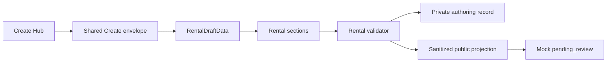
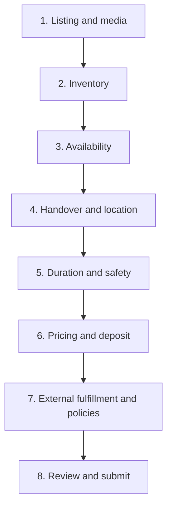
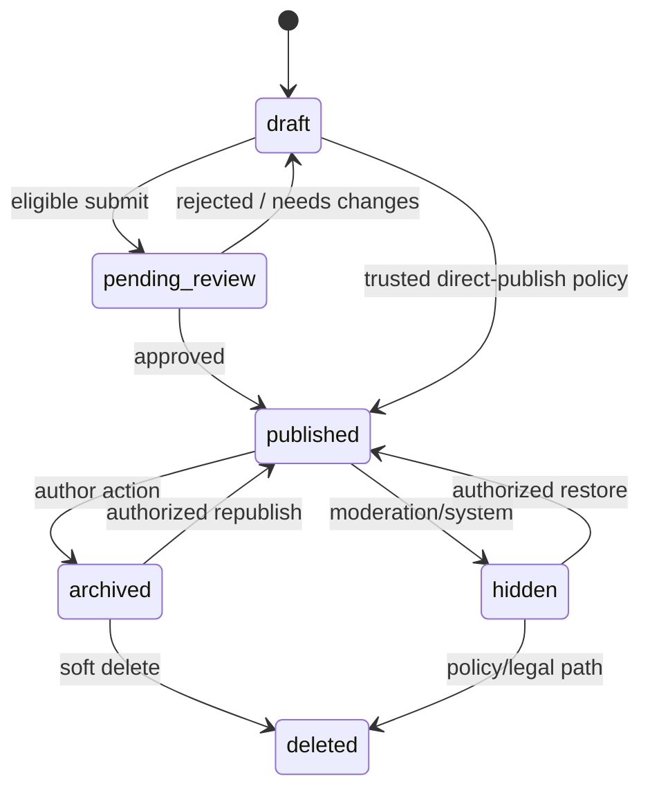

# RECHARGE — Rental / Equipment Create Block Spec — V1

- Статус: **Approved** — Approved slice spec (утверждено product owner
  2026-08-21); заменяет предыдущий статус Draft for review
- Версия: **1.0 (V1)**
- Дата: **2026-08-20** (approved: **2026-08-21**)
- Канонический type id: `rental`
- Create type: `CreateObjectType.rental`
- Content type: `ContentType.rental`
- Имя implementation slice: `RNT-CRT-01`
- Runtime effect этого документа: **none** — сам документ ничего не меняет в
  runtime; implementation slice `RNT-CRT-01` реализуется отдельными PR/коммитами
  с собственными `flutter analyze`/`flutter test`/boundary проверками

Этот документ фиксирует рекомендуемую продуктовую, доменную и UX-модель
Create → Rental / Equipment и является Approved slice spec для `RNT-CRT-01` по
правилу AGENTS.md о специализированных секциях уже принятых 10 типов Create
Hub. Он не разрешает Firebase, production Booking, Payments, удержание
залога, проверку документов, публикацию production-данных или что-либо за
пределами local/mock scope §2. Реализация ведётся с трассировкой до AC §20;
отклонения от контракта требуют новой revision этого документа, а не тихого
расхождения кода со спекой.

## Текущая фактическая реализация на 2026-08-20

`rental` уже присутствует среди десяти типов Create Hub и открывается через
общий config-driven runtime. В коде заданы:

- `defaultCategoryId = 'sport'`;
- `defaultSubcategoryId = 'cycling'`;
- `requiresStartDateTime = false`;
- `locationLabel = 'Pickup place'`;
- `priceLabel = 'Rental price'`;
- generic-поля `NameDescription`, `Media`, `Location`, `Pricing`, `Capacity`;
- `CreateAvailabilityKind.openingHours` как допустимая generic-availability;
- legacy `review_as_rental` banner для явного решения по старым `offer` drafts.

Не реализованы: typed `RentalDraftData`, Rental whitelist в runtime picker,
`RentalInventorySection`, manual availability calendar, private/public location
projection, Rental pricing policy, `create.rental`/submit/publish guards,
Rental templates, Rental Discover projection и Rental-specific tests.

Имя `InventorySection` в существующем Event-коде относится к admission pools.
Rental обязана использовать отдельное имя `RentalInventorySection` и отдельную
модель. Event inventory не переиспользуется как Rental inventory.

## Источники истины и приоритет

При конфликте действует порядок из `AGENTS.md`:

1. Accepted ADR;
2. Approved spec активного slice;
3. `docs/architecture/LAUNCH_STATUS.md`;
4. product vision;
5. этот Draft.

Связанные канонические документы:

- [VISION.md](VISION.md) — десять Create-типов и общий form engine;
- [CATEGORY_SYSTEM.md](CATEGORY_SYSTEM.md) — `rental` и собственный whitelist;
- [IDENTITY_PUBLISHER_SLICE_SPEC.md](IDENTITY_PUBLISHER_SLICE_SPEC.md) —
  authenticated Viewer, Creator eligibility, capabilities и `PublisherRef`;
- [CREATE_TEMPLATES_SLICE_SPEC.md](CREATE_TEMPLATES_SLICE_SPEC.md) —
  local-first template materialization и sanitization;
- [S3_CRT_01_CREATE_SPEC.md](S3_CRT_01_CREATE_SPEC.md) — общий Create pipeline;
- [BACKEND_API_CONTRACT_STANDARD.md](BACKEND_API_CONTRACT_STANDARD.md) —
  Money, stable metadata, idempotency и concurrency;
- [ADR 0013](../adr/0013-domain-policy-baseline.md) — lifecycle, moderation,
  offline, IDs, privacy, abuse и audit;
- [ADR 0015](../adr/0015-authenticated-viewer-verified-creator-professional-page.md) —
  mandatory auth, verified Creator и canonical Publisher.

ADR 0019 — Event Booking precedent. Он не является Rental Booking contract и
не разрешает перенос Event ledger/inventory semantics в Rental.

## На один экран

| Вопрос | V1 |
|---|---|
| Что создаётся | Публичная карточка временной аренды физической вещи или взаимозаменяемой группы вещей с обязательным возвратом |
| Что не является Rental | Услуга, урок, тур, место, Event, продажа, подписка или долгосрочный lease |
| Авторство | Authenticated Viewer может подготовить local pre-verification draft; submit/publish требуют verified Creator и operation-specific capability |
| Publisher | Canonical `{type: user | page, id}`; page требует active membership и page-scoped capability |
| Availability | Ручные timezone-aware интервалы, подтверждённый горизонт и статус `declared_available | unavailable | unknown`; не live Booking |
| Цена | Один детерминированный rate plan на listing; Money в integer minor units + explicit ISO currency |
| Залог | Явная policy, включая `0`; только информация, Recharge деньги не удерживает |
| Fulfillment | V1 — только validated `externalBookingUrl`; встроенного Rental Booking/chat нет |
| Location privacy | Personal publisher по умолчанию показывает approximate area; exact address не входит в public projection |
| Форма | 8 содержательных шагов внутри общего form engine; preflight не считается шагом |
| Typical duration | Рекомендуемый диапазон 1 час – 3 дня; submit-bound V1 — от 1 часа до 90 дней |
| Runtime status | Только generic Create fallback; Rental-specific target ещё не реализован |

## 1. Продуктовый инвариант

Rental / Equipment — это предложение временно получить физическую вещь из
конечного инвентаря, пользоваться ею ограниченный срок и вернуть владельцу.

Обязательные признаки:

1. существует физическая вещь или группа взаимозаменяемых вещей;
2. инвентарь конечен;
3. есть срок начала и окончания конкретной аренды;
4. возврат обязателен;
5. цена и deposit policy описаны отдельно;
6. передача, договор и фактическое подтверждение происходят вне Recharge V1;
7. availability в Recharge поддерживает Creator вручную и она не является
   гарантией бронирования.

Залог может быть равен нулю. Поэтому залоговая **policy** обязательна, а
ненулевая сумма — нет.

### 1.1 Границы соседних aggregates

| Предложение | Правильный тип |
|---|---|
| Аренда велосипеда без сопровождающего | Rental |
| Аренда каяка без гида | Rental |
| Каяк-тур с гидом и временем начала | Event / Class / Session по каноническим правилам типа |
| Фотосессия фотографа | Bookable Session, даже если оборудование включено |
| Посещение прокатного пункта как места | Place; Rental listings принадлежат Publisher, но Place не становится Publisher |
| Продажа велосипеда | Вне scope Recharge |
| Месячный/годовой lease с иным юридическим режимом | Вне Rental V1 |

Оборудование, выдаваемое как amenity другого предложения, не создаёт Rental
автоматически. `equipment_provided = rental_onsite` остаётся facet Event,
Session или Class, если главным предметом предложения является занятие/услуга.

## 2. Scope

### 2.1 В scope целевого local/mock slice

- typed Rental draft и versioned mapper;
- собственный Rental category/subcategory policy;
- inventory groups конечной вместимости;
- ручной interval-based availability calendar;
- explicit availability coverage/freshness;
- approximate/public location projection и private handover data;
- pickup schedule `opening_hours | by_arrangement`;
- опциональная delivery policy;
- bounded duration и safety requirements;
- deterministic rate plan и декларативная deposit policy;
- validated external fulfillment URL;
- full preview, validation и mock submit to `pending_review`;
- sanitized templates и duplicate materialization;
- local/mock public projection для тестов и preview;
- accessibility, localization-ready copy keys и privacy-safe analytics.

### 2.2 Вне scope

- Firebase, remote datasource, production API и deployment;
- internal Rental Booking, reservation holds, waitlist или capacity ledger;
- Payments, payout, taxes, fees, refunds или card deposit hold;
- автоматическая синхронизация availability с внешним provider;
- встроенный чат, phone exposure или contact-host workflow;
- проверка паспорта, водительских прав, собственности или лицензии;
- страховой/protection продукт Recharge;
- GPS/telemetry tracking арендованной вещи;
- serial number, license plate или verification evidence в public listing;
- multi-branch aggregate;
- multi-currency listing или currency conversion;
- recurring availability blocks;
- production ranking или production publication.

Любое внутреннее Rental Booking требует отдельного Approved contract/slice.
Event Booking primitives могут быть изучены как технический precedent, но не
задаются Rental-документом и не копируются молча.

## 3. Термины

| Термин | Значение |
|---|---|
| `RentalDraftData` | Typed authoring payload внутри общего Create envelope |
| `RentalListing` | Public projection опубликованного Rental content |
| `RentalInventoryGroup` | Взаимозаменяемые единицы с одной моделью, ценой, условиями, состоянием и вариантом |
| Unique item | Inventory group с `quantity = 1` |
| `RentalAvailabilityBlock` | Ручной интервал недоступности N единиц одной группы |
| Availability coverage | Интервал, который Creator явно проверил и подтвердил |
| Declared availability | Creator-maintained projection; не authoritative reservation |
| Pickup area | Публичная область получения без обязательного раскрытия exact address |
| Handover data | Private точный адрес/инструкции, не входящие в public projection по умолчанию |
| Rate plan | Один billing unit и ступени unit price по длительности |
| Deposit policy | Явная сумма/способ/условия; `0` означает «залог не требуется» |
| External fulfillment | Переход на HTTPS URL владельца/provider для фактического подтверждения |
| `loc_*` | Временный ID только для ещё не сохранённого in-memory draft |

## 4. Identity, capabilities и Publisher

### 4.1 Authentication

Unauthenticated Guest в целевой модели отсутствует. Cold start, logout,
expired session и safe public deep link сначала открывают Auth, сохраняя
intended destination.

Открытие формы не обещает права submit/publish.

### 4.2 Operation matrix

| Operation | Personal publisher | Page publisher |
|---|---|---|
| Открыть форму и подготовить local pre-verification draft | Authenticated Viewer policy | Authenticated member с разрешённым local draft access |
| Сохранить local pre-verification draft | Authenticated Viewer; без submit/publish | То же, без page authority claim |
| Создать publisher-bound durable draft | Verified Creator + `create.rental` | То же + active exact-page membership + page-scoped create |
| Submit to moderation | Verified Creator + `submit.rental` | То же + active membership + page-scoped submit |
| Direct publish | Только explicit `publish.rental.direct` и trusted policy | То же + active membership + page-scoped direct publish |
| Edit/archive | Ownership + operation capability + valid lifecycle | Active membership + exact-page capability + valid lifecycle |
| Manage Professional Page | Не применимо | `manage_page` для exact page; не заменяет Rental create/submit/publish capabilities |

Роль `Creator`, `manage_page`, активный workspace или видимая кнопка сами по
себе не авторизуют mutation. Application use case проверяет все условия;
production backend впоследствии обязан повторить проверку.

### 4.3 Publisher rules

Canonical contract:

```text
PublisherRef {
  type: user | page
  id: StableId
}
```

- новый draft получает только **default** PublisherRef из active workspace;
- существующий draft хранит свой PublisherRef;
- workspace switch никогда молча не переписывает существующий draft;
- если eligible publisher больше одного, показывается `Publish as`;
- display name, avatar, Place name и business name не являются authority;
- page verification, Creator verification и membership — разные факты;
- revoked membership сохраняет draft readable, но page submit/publish fail
  closed до явного выбора другого eligible publisher.

## 5. Категории и Rental policy

Canonical top-level whitelist из `CATEGORY_SYSTEM.md`:

- `sport`;
- `water_activities`;
- `winter_seasonal`;
- `adrenaline_entertainment`;
- `auto_moto`.

Whitelist принадлежит versioned `RentalCreatePolicy`, который использует
stable category IDs из общей taxonomy. Он не меняет Category System и не
создаёт параллельный каталог.

Top-level group не означает, что Rental разрешает любую его subcategory.
Subtype должен описывать физическую rentable вещь. Tour, lesson, service,
competition и guided experience остаются соседними Create-типами.

| Group | Rental examples | Adaptive authoring policy |
|---|---|---|
| `sport` | велосипеды, самокаты, ракетки | size/variant для size-dependent items; checklist состояния |
| `water_activities` | SUP, каяк без гида | safety notice; included flotation equipment; market eligibility |
| `winter_seasonal` | лыжи, snowboard, snowshoes | рост/размер; комплектность; seasonal availability |
| `adrenaline_entertainment` | только явно разрешённый физический инвентарь | age/safety обязательны; unsupported subtype fail closed |
| `auto_moto` | только market-policy-enabled vehicle subtype | age/ID requirement; legal/insurance gate; никакого document storage |

Adaptive defaults — редактируемые предложения. Они не являются AI authority,
не доказывают compliance и ничего не публикуют автоматически.

`sport/cycling` остаётся runtime default, но до publish Creator обязан явно
подтвердить category/subcategory. Default не считается осознанным выбором.

Для высокорисковой категории policy может разрешать local draft, но возвращать
`market_policy_unsupported` на submit. Отсутствие policy данных — `unknown` и
fail closed, а не автоматическое разрешение.

Legacy `offer` всегда остаётся мигрированным в `session` с optional
`review_as_rental`. Явное действие Creator создаёт новый Rental draft; старый
aggregate не меняет тип in place и данные не теряются.

## 6. Архитектурный контракт

Rental использует общий Create form engine:



Разрешены type-specific sections внутри engine:

- `RentalInventorySection`;
- `RentalAvailabilitySection`;
- `RentalHandoverSection`;
- `RentalTermsSection`;
- `RentalPricingSection`;
- `RentalExternalFulfillmentSection`.

Не разрешены отдельный Rental navigator, отдельная draft lifecycle system,
параллельный template store или UI business logic.

Presentation только отображает state и dispatches intents. Нормализация,
availability arithmetic, privacy projection, pricing estimate, capabilities и
validation живут в application/domain layers.

## 7. Domain contract

Точные Dart-имена утверждает implementation slice; смысл полей V1 нормативен.

### 7.1 Shared envelope

```text
CreateContentEnvelope<RentalDraftData> {
  id: StableId
  objectType: rental
  createdByUserId: StableId
  publisherRef: PublisherRef

  marketId: String
  countryCode: ISO_3166_1_alpha2
  timeZoneId: IANA_TimeZone

  lifecycle: draft | pending_review | published | archived | hidden | deleted
  moderationStatus: none | pending | approved | rejected
  visibility: public

  revision: int
  schemaVersion: int
  createdAtUtc: Instant
  updatedAtUtc: Instant
  publishedAtUtc: Instant?
  deletedAtUtc: Instant?

  payload: RentalDraftData
}
```

`StableId` принимает canonical client-generated ULID/UUID form. Связи идут
только по ID.

### 7.2 Rental payload

```text
RentalDraftData {
  title: String
  shortDescription: String
  fullDescription: String
  categoryId: String
  subcategoryId: String
  brandModel: String?
  mediaRefs: List<MediaRef>

  inventoryGroups: List<RentalInventoryGroup>
  availability: RentalAvailabilityCalendar
  handover: RentalHandoverDraft
  terms: RentalTerms
  pricing: RentalPricingPolicy
  fulfillment: RentalExternalFulfillment
  attestation: RentalPublisherAttestation
}

RentalInventoryGroup {
  id: StableId
  label: String
  quantity: int
  condition: new | like_new | good | worn
  sizeOrVariant: String?
  includedAccessories: List<String>
  photoRefs: List<MediaRef>
  status: available | paused | retired
}
```

Одна group содержит взаимозаменяемые единицы с одной общей listing-level
моделью, rate plan и условиями. Разная модель, цена, deposit policy или
handover location требует отдельного listing через sanitized Duplicate.

Уникальная вещь моделируется `quantity = 1`. V1 не хранит serial numbers и не
пытается назначить конкретную единицу конкретному внешнему renter.

### 7.3 Private authoring extension

```text
RentalPrivateAuthoringData {
  exactPickupAddress: String?
  exactPickupGeo: GeoPoint?
  handoverInstructions: String?
  inventoryNotesByGroupId: Map<StableId, String>
  availabilityNotesByBlockId: Map<StableId, String>
}
```

Private extension:

- не входит в `RentalListing` public projection;
- не индексируется Discover;
- не попадает в analytics, logs, errors, template public snapshot или share;
- остаётся local-only в `RNT-CRT-01`;
- не становится обещанием будущей передачи renter без отдельного secure
  Booking/contact contract.

## 8. Availability V1

### 8.1 Почему date-only недостаточно

Rental допускает почасовую аренду, Latvia использует timezone/DST, а интервалы
могут пересекать границы суток. Поэтому `LocalDate start/end` не является
нормативной моделью.

V1 хранит half-open UTC intervals `[startsAtUtc, endsAtUtc)` и IANA timezone
для authoring/display. Соседние интервалы, где `end == next.start`, не
пересекаются.

```text
RentalAvailabilityCalendar {
  timeZoneId: IANA_TimeZone
  coverage: RentalAvailabilityCoverage
  blocks: List<RentalAvailabilityBlock>
}

RentalAvailabilityCoverage {
  startsAtUtc: Instant
  endsAtUtc: Instant
  confirmedAtUtc: Instant
}

RentalAvailabilityBlock {
  id: StableId
  groupId: StableId
  startsAtUtc: Instant
  endsAtUtc: Instant
  unitsBlocked: int
  source: manual_external_rental | maintenance | owner_unavailable | other
  status: active | cancelled
  revision: int
  createdByUserId: StableId
  createdAtUtc: Instant
  updatedAtUtc: Instant
}
```

`source` публично не отображается. Private note хранится отдельно.

### 8.2 Capacity invariant

Для каждой group `G` и любого момента `t`:

```text
sum(activeBlock.unitsBlocked where block overlaps t) <= G.quantity
```

Для requested interval `Q` declared available units вычисляются как:

```text
G.quantity - max_t_in_Q(concurrentBlockedUnits(G, t))
```

Расчёт применяется только к `group.status == available`.

Уменьшение quantity, изменение interval или восстановление cancelled block
проверяет инвариант атомарно. Невалидная mutation отклоняется целиком.

### 8.3 Coverage, freshness и tri-state

Пустой список blocks сам по себе **не означает availability**.

| Result | Условие |
|---|---|
| `declared_available` | Query целиком внутри fresh confirmed coverage и хотя бы одна active group имеет capacity |
| `unavailable` | Query внутри fresh coverage и все active groups имеют 0 capacity либо listing paused |
| `unknown` | Query вне coverage, coverage stale/missing, policy unknown или расчёт невозможен |

Freshness threshold приходит из versioned market policy. Рекомендуемый V1
default — 7 дней с последнего explicit confirmation; это Draft-рекомендация,
не Accepted market policy.

UI всегда говорит `Creator-confirmed availability` и показывает
`confirmedAt`. Запрещены формулировки `live`, `guaranteed`, `reserved` или
`instant booking`.

All-day UI selection преобразуется в точные границы локального дня через
`timeZoneId`, а затем сохраняется в UTC. DST edge cases тестируются отдельно.

`turnaround buffer` не хранится отдельным неработающим полем V1. Creator
включает cleaning/inspection time в effective block. Автоматический buffer
появится только вместе с authoritative Booking semantics.

## 9. Handover, location и privacy

```text
RentalHandoverDraft {
  pickupPlaceName: String
  publicAreaLabel: String
  publicAddress: String?
  publicGeo: GeoPoint
  publicGeoPrecisionMeters: int

  disclosure: approximate_area | public_business_address
  scheduleMode: opening_hours | by_arrangement
  openingHours: List<OpeningHoursRule>

  deliveryAvailable: bool
  deliveryRadiusKm: Decimal?
  deliveryFee: Money?
  deliveryTerms: String?
}
```

Rules:

1. Personal publisher default — `approximate_area`.
2. `public_business_address` разрешён только для адреса, который Publisher
   вправе сделать публичным, и после explicit confirmation; он требует
   `publicAddress`.
3. Exact personal/home address и exact private pin не входят в public
   projection.
4. `approximate_area` требует `publicAddress = null`; public projection
   физически coarsens/centers geo по
   approved precision policy; exact private point не переиспользуется с одной
   лишь подписью «approximate».
5. Public distance считается до intentionally disclosed/coarsened `publicGeo`;
   UI не называет её точкой точной передачи при approximate mode.
6. `opening_hours` требует хотя бы одно валидное правило.
7. `by_arrangement` не требует fake opening hours и явно отображается как
   `Pickup time arranged on provider site`.
8. `deliveryAvailable = false` очищает radius, fee и terms.
9. `deliveryAvailable = true` требует radius и explicit fee, включая zero.
10. Pickup и возврат используют одну handover policy V1. Иные one-way/drop-off
   flows вне scope.

Один Rental listing имеет одну public handover area. Несколько филиалов —
отдельные listings с тем же eligible PublisherRef; они не связываются по
названию.

## 10. Duration, pricing и deposit

### 10.1 Duration policy

```text
RentalCreatePolicy {
  defaultOfferedMinMinutes: int
  defaultOfferedMaxMinutes: int
  absoluteMinMinutes: int
  absoluteMaxMinutes: int
}
```

Recommended V1 defaults:

- default offered range: `60..4320` минут (1 час – 3 дня);
- absolute submit bounds: `60..129600` минут (1 час – 90 дней).

Каждый listing хранит `terms.offeredMinMinutes` и
`terms.offeredMaxMinutes` внутри этих platform bounds. Это реальные
декларируемые границы предложения, а не гарантия внешнего provider. Defaults
помогают UX/Discover; absolute bounds защищают contract от ошибок и превращения
Rental в долгосрочный lease. Policy values не хардкодятся в widgets.

### 10.2 Deterministic rate plan

```text
RentalPricingPolicy {
  currencyCode: ISO_4217
  billingUnitMinutes: 60 | 1440 | 10080
  rateSteps: List<RentalRateStep>
  billingRounding: started_unit

  deposit: RentalDepositPolicy
  damagePolicy: String
  lateReturnPolicy: String?
  cancellationPolicyId: String
  cancellationPolicyNote: String?
}

RentalRateStep {
  minUnits: int
  unitPrice: Money
}

Money {
  minorUnits: int
  currencyCode: ISO_4217
}
```

Rate rules:

1. один listing имеет один billing unit;
2. `billingUnitMinutes <= terms.offeredMinMinutes`, чтобы минимальная аренда не
   обещала меньший период, чем минимально тарифицируемый unit;
3. первая step имеет `minUnits = 1`;
4. `minUnits` строго возрастают и не дублируются;
5. unit price не возрастает с большей duration step;
6. все Money используют одну explicit listing currency;
7. currency инициализируется runtime config, но не выводится из `marketId`;
8. fractional Money и `double` запрещены;
9. billable units = `ceil(requestedMinutes / billingUnitMinutes)`;
10. применяется step с максимальным `minUnits <= billableUnits`;
11. estimate = `billableUnits * unitPrice` с checked integer arithmetic;
12. estimate является информационным; final external amount может отличаться
    и показывается только provider site.

Так V1 не смешивает несопоставимые hour/day/week prices и второй discount
ladder. UX может показывать `per hour/day/week` и автоматически вычислять
процент экономии следующей step только как presentation.

### 10.3 Deposit policy

```text
RentalDepositPolicy {
  amount: Money
  collectionMethod: none | at_handover | external_provider | other
  terms: String?
}
```

- `amount.minorUnits = 0` — явное `No deposit`;
- zero amount требует `collectionMethod = none`; nonzero amount запрещает
  `none` и требует bounded `terms`;
- отсутствующая policy не равна нулю и блокирует submit;
- currency совпадает с rate plan;
- Recharge не удерживает, не списывает и не возвращает deposit;
- `external_provider` не означает, что Recharge проверила provider;
- UI не использует `we hold`, `protected by Recharge` или аналогичное обещание.

Tax, fee, refund и enforceability policy остаются внешними. V1 не вычисляет
total payable и не утверждает, что текст Creator является юридической
гарантией платформы.

## 11. Terms и trust inputs

```text
RentalTerms {
  offeredMinMinutes: int
  offeredMaxMinutes: int
  minRenterAge: int?
  idRequiredAtHandover: bool
  usageRestrictions: String?
  safetyNotice: String?
  includedAccessoriesConfirmation: bool
}

RentalPublisherAttestation {
  policyVersion: String
  acceptedAtUtc: Instant
  acceptedByUserId: StableId
  hasRightToOffer: bool
  listingAccurate: bool
  prohibitedItemsAcknowledged: bool
}
```

Attestation не заменяет verification и не доказывает право собственности.
Документы, license numbers и sensitive evidence в Rental payload не
сохраняются.

Market/category policy определяет, когда age, ID requirement и safety notice
обязательны. Unknown policy fail closed on submit.

Prohibited items, weapons, hazardous/illegal goods, regulated medical devices
и иные запрещённые предложения регулируются общей content policy. Rental UI
не поддерживает обход taxonomy через свободные tags.

## 12. External fulfillment V1

```text
RentalExternalFulfillment {
  mode: external_link
  externalBookingUrl: HttpsUrl
}
```

V1 не содержит `contact_host`, `phone` или фиктивный `in_app_message`.

Rules:

- только normalized `https` URL;
- credentials, fragments с secrets, `javascript:`, `data:`, custom schemes и
  malformed/overlong URLs запрещены;
- URL повторно проверяется при submit/update;
- UI выводит destination host, производный только от normalized URL, и
  предупреждение о выходе из Recharge; Creator не задаёт доверенный label;
- URL не копируется в template/duplicate materialization;
- analytics хранит только разрешённый normalized host/hash policy, но не full
  path/query;
- Recharge не заявляет, что внешний provider безопасен, доступен или завершил
  booking/payment;
- CTA: `Check availability on provider site`, а не `Instant book`.

Если Publisher не имеет подходящего URL, он может сохранить draft, но не
submit Rental V1. Встроенная коммуникация требует отдельного продукта и
privacy/abuse contract.

## 13. Create flow

Preflight выполняется до progress indicator:

1. mandatory Auth/session restore;
2. access snapshot и market policy;
3. local pre-verification/Creator eligibility state;
4. eligible Publisher candidates и default из workspace;
5. active draft restore имеет приоритет над template;
6. optional explicit `Start blank | Use template`.

Содержательная форма имеет 8 шагов:



### 13.1 Step 1 — Listing and media

- title, short/full description;
- explicit category/subcategory confirmation;
- shared brand/model;
- cover + gallery;
- category-aware photo checklist as non-blocking guidance;
- media rights confirmation occurs in final attestation.

### 13.2 Step 2 — Inventory

- one or more groups;
- quantity, condition, size/variant, accessories, photos, status;
- duplicate group creates new child ID;
- different price/model/location prompts `Create separate listing`;
- private inventory note never appears in preview.

### 13.3 Step 3 — Availability

- explicit coverage interval;
- timezone-aware blocks by group;
- all-day or date/time authoring UI;
- capacity preview and overlap validation;
- explicit `Confirm calendar` updates `confirmedAtUtc`;
- UI explains that availability must be confirmed externally.

### 13.4 Step 4 — Handover and location

- public area and deliberately chosen precision;
- private exact details where needed for authoring;
- public-business-address opt-in;
- opening hours or by arrangement;
- optional delivery radius/fee/terms.

### 13.5 Step 5 — Duration and safety

- offered min/max duration within platform absolute bounds;
- category policy requirements;
- age/ID/safety/usage restrictions;
- no verification-document upload.

### 13.6 Step 6 — Pricing and deposit

- one billing unit;
- rate steps with immediate deterministic examples;
- explicit currency from runtime defaults, editable only where market policy
  permits;
- explicit deposit including zero;
- damage, late return and cancellation text.

### 13.7 Step 7 — External fulfillment and policies

- external HTTPS URL;
- destination preview and warning copy;
- public/private projection preview;
- policy and attestation summary.

### 13.8 Step 8 — Review and submit

- public preview exactly matches public projection;
- separate `Private — not public` review block;
- validation summary links to exact step/field;
- PublisherRef/`Publish as` visible;
- explicit versioned attestation;
- Viewer sees `Save draft · Complete Creator verification`;
- eligible Creator sees `Submit for review`;
- direct publish appears only when policy and capability authorize it.

Author не выбирает moderation result. Application policy возвращает
`pending_review` или trusted direct `published`.

### 13.9 Responsive behavior

- phone: preview открывается как отдельный action/sheet, не сжимает form;
- wide layout: sticky companion preview разрешён;
- backward navigation и exit доступны всегда;
- forward navigation блокируется только структурно невалидным текущим полем,
  но incomplete draft можно сохранить и закрыть;
- full submit validation выполняется на Step 8 и authoritative boundary;
- focus/announcement ведёт к первой ошибке без потери введённых данных.

## 14. Validation contract

Limits ниже — Recommended V1 `RentalCreatePolicy`, а не widget constants.

| Area | Submit invariant |
|---|---|
| Identity | Auth active; account active; verified Creator; exact operation capability; eligible PublisherRef |
| Publisher | Page membership/capability fresh; draft PublisherRef not silently rewritten |
| IDs | Нет `loc_*`; все entity/child refs valid и unique |
| Text | title 3–80; short description 20–240; full description 50–4000 Unicode characters |
| Taxonomy | Explicit confirmed category/subcategory enabled by Rental market policy |
| Media | Valid cover; media references authorized; no pending/failed required asset |
| Inventory | 1–50 groups; quantity 1–999; total checked; at least one `available` group |
| Group semantics | Одна listing model/rate/location policy; size required where policy says so |
| Availability | Valid timezone; fresh coverage; intervals ordered; groups exist; concurrent blocked units never exceed quantity |
| Location | Valid geo bounds; disclosure/address/precision policy; exact private address absent from public projection |
| Schedule | opening-hours valid or explicit by-arrangement mode |
| Delivery | Disabled clears children; enabled requires bounded radius, explicit Money and terms |
| Duration | `absoluteMin <= offeredMin <= offeredMax <= absoluteMax`; billing unit does not exceed offered minimum; V1 max 90 days |
| Safety | Required age/ID/safety fields present; market policy known |
| Rate plan | Allowed billing unit; first step 1; thresholds strict; prices nonnegative/nonincreasing; checked arithmetic |
| Currency | Valid explicit ISO 4217; all listing Money same currency; never inferred from market |
| Deposit | Explicit amount including zero; zero ↔ `none`; nonzero requires collection method and bounded terms |
| Policies | Damage and cancellation required; late-return optional; bounded lengths |
| Fulfillment | Normalized HTTPS URL passes common external-link safety policy |
| Attestation | Current policy version accepted by acting user; no stale copied acceptance |
| Privacy | Public projection contains no exact private location, private note, document or direct contact |
| Lifecycle | Operation legal for current lifecycle/revision; idempotency key valid |

Draft save preserves incomplete/temporarily invalid fields where safe. Submit,
update and public projection use the same domain validator; UI checks are only
early feedback.

Unknown schema, policy, capability, currency, timezone or category values fail
closed for submit and remain recoverable for draft editing/migration.

## 15. Drafts, IDs, templates и Duplicate

### 15.1 ID lifecycle

1. New unsaved in-memory draft/children may use `loc_*`.
2. First durable local autosave allocates permanent client-generated stable
   IDs for the envelope and children.
3. Template snapshot has its own permanent template ID and does not reuse
   listing IDs.
4. Materialization starts with new temporary IDs and receives permanent IDs on
   its first durable save.
5. Submit asserts that no `loc_*` remains.
6. Repeated submit uses one idempotency key for the same payload hash.

### 15.2 Autosave

- debounced local save plus save on step exit/app background;
- versioned deterministic serialization;
- private authoring data stored separately from public projection;
- corrupt/unknown future record never destroys the previous readable draft;
- optimistic `revision` prevents silent lost update;
- local pre-verification draft remains user-owned and cannot enter moderation.

`RNT-CRT-01` may simulate submit locally, but UI/test data must label the result
as mock `pending_review`; it is not production publication. Production submit
later requires online authoritative confirmation. Offline authoring remains
available.

### 15.3 Template sanitization

Rental extends CRT-TPL-01; it does not create another template store.

May copy:

- taxonomy, descriptions and brand/model;
- inventory structure without child IDs or private notes;
- public handover configuration and reusable opening hours;
- duration, safety, rate/deposit and policy structure.

Must reset/strip:

- envelope/child IDs, revision and timestamps;
- PublisherRef, lifecycle, moderation and publication metadata;
- media;
- availability coverage, blocks, confirmation time and notes;
- exact private address/geo/instructions;
- external URL;
- attestation/acceptance;
- unknown/unsupported fields and access secrets.

Current active draft always wins over automatic template use. A template is
applied only after explicit user action.

### 15.4 Duplicate

`Duplicate listing` invokes the same typed sanitizing materializer directly.
It does **not** create a hidden/persisted template as a side effect. The new
draft is independent, receives fresh IDs, uses current runtime defaults and
requires fresh URL, media, availability confirmation, Publisher eligibility
and attestation.

## 16. Lifecycle, submit и moderation

Rental uses the common six-state lifecycle:



- `pending_review` отсутствует в Discover;
- `published` попадает в Discover только при active inventory и valid public
  projection;
- all groups paused/retired исключают listing из results, но authorized public
  details может показать `Currently unavailable`;
- `hidden` управляется moderation/system;
- `archived` восстанавливаем;
- `deleted` следует общей 30-day soft-delete policy, если legal policy не
  требует иного.

### 16.1 Publish pipeline

1. auth/session/account validation;
2. fresh verification/capability/membership resolution;
3. PublisherRef eligibility and operation resolution;
4. current market/category/safety policy resolution;
5. schema migration and normalization;
6. full Rental validation;
7. private/public projection boundary;
8. external-link safety and content/moderation screening;
9. duplicate/rate-limit checks;
10. stable-ID and optimistic revision checks;
11. idempotent mutation;
12. policy-selected `pending_review | published` result;
13. local state update only after confirmed result;
14. privacy-safe analytics and immutable audit event.

Timeout/unknown result must not create a second listing on retry. Same key with
different payload hash returns typed idempotency conflict.

## 17. Public projection, Discover и Details

### 17.1 Public projection

`RentalListing` contains only fields approved for public display:

- canonical IDs and PublisherRef;
- listing copy/taxonomy/media;
- public inventory groups without private notes;
- declared availability projection without block reason/note;
- public pickup area/precision and public schedule;
- delivery policy;
- duration/safety/rate/deposit/policy display;
- external fulfillment CTA;
- freshness and lifecycle projection.

Exact private address, exact private pin, handover instructions, direct contact,
attestation evidence and operational notes are absent.

### 17.2 Discover filters

| Filter | Rental semantics |
|---|---|
| Text/category | Public title/description/brand and enabled Rental taxonomy |
| Distance | To intentionally disclosed public geo, respecting its precision |
| Requested interval | Tri-state availability; only fresh in-coverage `declared_available` satisfies an availability-only filter |
| Duration/price | Deterministic informational estimate for requested duration; without duration UI shows base rate and unit, not a false comparable total |
| Deposit | Explicit `no deposit` or declared deposit range |
| Delivery | Declared delivery radius/fee; does not change pickup-distance meaning |

Manual availability never becomes an implicit booking guarantee. `unknown`
must remain distinguishable from `unavailable` and `declared_available`.

Ranking does not use external clicks as completed rentals and does not infer
conversion, availability or quality from missing data.

### 17.3 Results card

- `Rental` badge, cover, title, category and Publisher;
- base rate with exact unit and currency;
- public area/distance precision;
- deposit badge;
- `Availability confirmed <date>` or `Availability needs confirmation`;
- requested-interval declared capacity only when fresh and computable;
- `Currently unavailable` when no active group.

Без requested interval card показывает `N units listed`, а не `N available`.

### 17.4 Details order

1. Hero, Rental badge, save/share/report.
2. What is rented: inventory groups, condition, variants, accessories.
3. Creator-declared availability with coverage/freshness disclaimer.
4. Rate plan and informational duration example.
5. Deposit, damage, late-return and cancellation policies.
6. Public pickup area/schedule and delivery.
7. Duration, ID/age/safety/usage conditions.
8. Publisher projection and verification badges with correct semantics.
9. External CTA with destination warning.

### 17.5 CTA matrix

| State | CTA |
|---|---|
| Fresh declared availability | `Check availability on provider site` |
| Availability unknown/stale | `Confirm on provider site` |
| Requested interval unavailable | Disabled primary CTA + optional `Check other dates` |
| All groups paused/retired | `Currently unavailable`, no external CTA |
| Hidden/archived/deleted | No public CTA |

Все product users уже authenticated; Guest-row в матрице нет.

## 18. Privacy, security, abuse и analytics

### 18.1 Privacy

- exact private pickup data не публикуется и не индексируется;
- no passport/license/ownership documents in Rental payload;
- no phone/email/direct contact field in public model;
- availability reasons/notes private;
- logs/errors do not include descriptions, policies, URLs, notes or addresses;
- share/deep link resolves only sanitized public projection;
- delete/export follows common account/content policy.

### 18.2 Security and abuse

- capability checks repeat at application and future backend boundaries;
- URL validation and off-platform warning are mandatory;
- content policy screens prohibited/unsafe items;
- suspicious duplicate/publish velocity uses shared moderation pipeline;
- report/block is available on Details;
- high-risk market policy fails closed;
- Client UI never claims authoritative verification or insurance coverage.

### 18.3 Analytics allowlist

Allowed examples:

- `rental_create_started` — object type, source, policy version;
- `rental_step_completed` — step ID, validation issue codes/count;
- `rental_availability_confirmed` — horizon bucket, block count bucket;
- `rental_submit_result` — typed result code, publisher type, category ID;
- `rental_external_cta_opened` — destination host class/hash according to
  approved link analytics policy.

Forbidden analytics payload:

- title/description/policy free text;
- exact/public address or coordinates;
- full URL/path/query;
- inventory/private notes;
- verification/attestation evidence;
- direct contact or document identifiers.

## 19. Localization and accessibility

Target locales remain `en/ru/lv`, but repository localization runtime is not
configured. `RNT-CRT-01` must not pretend this target is already delivered.

Domain stores stable enum/policy IDs, ISO currency and IANA timezone. Human
copy, date/time, distance, number, currency and pluralization belong to
presentation/localization resources when that platform slice is available.

Minimum UX gates:

- 360 dp width and 150% text scale without clipped required actions;
- screen-reader labels for progress, money units, availability state and
  private/public distinction;
- keyboard/focus order and error focus;
- color is not the only signal;
- touch targets and contrast follow design system;
- date/time authoring announces timezone and DST ambiguity;
- external navigation warning is accessible and dismissible;
- private data is visually and semantically marked `Not public`.

## 20. RNT-CRT-01 acceptance criteria

Эти AC обязательны для implementation slice `RNT-CRT-01` начиная с
approval 2026-08-21.

1. Rental has typed `RentalDraftData`; generic `sectionData` is compatibility
   input only.
2. `RentalInventorySection` is separate from Event admission inventory.
3. Runtime picker implements the canonical Rental whitelist and explicit
   subcategory policy.
4. Viewer can prepare/autosave local draft but cannot submit/publish.
5. `create.rental`, `submit.rental`, `publish.rental.direct` and exact-page
   scopes are tested fail closed.
6. Publisher default/non-rewrite/`Publish as` follows Identity spec.
7. First durable save replaces all `loc_*`; submit rejects remaining temporary
   IDs.
8. Availability uses half-open UTC intervals plus IANA timezone.
9. Concurrent blocked capacity cannot exceed group quantity under add/edit,
   cancel/restore or quantity reduction.
10. Empty/stale/out-of-coverage calendar returns `unknown`, never available.
11. Fresh declared availability shows confirmation timestamp and disclaimer.
12. Private exact pickup and notes do not appear in public projection,
    Discover, share, logs or analytics.
13. Personal publisher defaults to approximate public area.
14. Opening-hours/by-arrangement and delivery conditional validation work.
15. Duration uses versioned 1-hour/90-day bounds.
16. Rate plan calculation, thresholds, rounding, overflow and currency
    invariants are unit-tested.
17. Currency is explicit ISO 4217 and is not inferred from market.
18. Deposit zero/unknown distinction and off-platform disclaimer are tested.
19. V1 has only external HTTPS fulfillment; contact/chat/phone are absent.
20. URL safety policy, destination warning and sanitized analytics pass.
21. Template materialization strips all sensitive/stale/authority fields and
    creates fresh IDs.
22. Duplicate uses the same sanitizer without persisting a hidden template.
23. Active draft restore is never overwritten automatically by a template.
24. Full validation is shared by preview, submit and update.
25. Mock submit is explicitly non-production and idempotently returns
    `pending_review` unless trusted test policy authorizes direct publish.
26. Discover interval/price/deposit filters follow V1 semantics and preserve
    tri-state availability.
27. 360 dp/150% text scale, semantics, focus and error navigation pass widget
    tests.
28. No Firebase, network, Payments, internal Booking, provider SDK or paid
    service is added.
29. Targeted unit/widget/integration tests are green.
30. Full `flutter analyze`, full `flutter test`, boundary gate and
    `git diff --check` are green.
31. `LAUNCH_STATUS.md` and `AGENTS.md` are updated only to the verified
    implementation fact, not merely because this Draft exists.

## 21. Migration and rollback

### 21.1 Migration

- legacy `offer → session` remains unchanged;
- `review_as_rental` only suggests explicit creation of a new Rental draft;
- generic Rental drafts without typed payload remain readable through a
  versioned compatibility mapper;
- missing/unknown typed fields are preserved where safe but block submit;
- migration never invents inventory, deposit, availability, PublisherRef or
  exact location;
- schema upgrade is idempotent and keeps a recoverable prior record.

### 21.2 Rollback

- feature flag hides Rental-specific sections and returns to generic read-only
  compatibility without deleting drafts;
- typed data remains stored/versioned for forward recovery;
- template collection can be disabled without changing active drafts;
- public mock projection can be rebuilt from validated draft data;
- rollback does not rewrite PublisherRef or silently convert Rental to Session;
- no remote side effects exist in local/mock slice.

## 22. V1 recommended product decisions

V1 закрывает прежние открытые вопросы как **Draft recommendations**:

| Decision | V1 recommendation |
|---|---|
| Separate Rental verification | Не вводить новую global role. Использовать common Creator verification + operation/category/market policy; high-risk unknown blocks submit |
| Whitelist owner | Versioned RentalCreatePolicy over canonical Category IDs; не отдельный taxonomy/catalog |
| Damage/cancellation policy | Stable policy ID + bounded Creator explanation; локальная static registry допустима в approved local slice |
| Long-term anti-abuse | Absolute submit maximum 90 days; longer contracts outside V1 |
| Multi-currency | One explicit ISO currency per listing; defaults from config but never inferred from market; no conversion |
| Contact host | Не входит в V1 без secure messaging/privacy/abuse contract |
| Location disclosure | Approximate by default for personal Publisher; exact public business address only explicit and policy-valid |
| Availability truth | Fresh Creator-declared tri-state, never authoritative booking |

Approval документа 2026-08-21 принимает решения этой таблицы как обязательные
для `RNT-CRT-01`, включая отсутствие `contact_host` в §12 — то есть personal
Publisher без собственного внешнего booking-URL сможет только сохранить draft,
но не сможет submit в V1. Это осознанный trade-off ради безопасности (не
плодить in-app контакт без privacy/abuse-контура), явно подтверждённый при
approval, а не забытый сценарий. Изменение любого решения таблицы требует
новой явной revision, а не тихой правки кода.

## 23. Non-normative industry references

Turo и Fat Llama используются только как inspiration для progressive
authoring, finite inventory, availability maintenance и честного risk display.
Recharge не копирует их workflow, legal model, insurance, protection, pricing
или verification contract.

Внешние источники меняются; дата последней проверки ссылок — 2026-08-20:

- [Turo official host protection document](https://support-resources.turo.com/policies/Host%20PDS%20-%20Turo%20Travels.pdf);
- [Fat Llama official Lender Item Guarantee](https://s3-eu-west-1.amazonaws.com/fat-lama-assets/lender-item-guarantee.pdf).

Эти ссылки подтверждают только существование соответствующих внешних risk /
protection contexts. Они не являются доказательством точного Create wizard и
не задают требования Recharge.

## 24. Changelog

- **Approved (2026-08-21)** — product owner утвердил V1 / 1.0 как Approved
  slice spec для `RNT-CRT-01` без изменения содержания §1–§23; статус
  переведён из Draft for review в Approved, §20 AC стали обязательными,
  решения §22 приняты как есть, включая явно подтверждённое отсутствие
  `contact_host` в V1 fulfillment (§12). Runtime effect документа остаётся
  none — сама implementation ведётся отдельными коммитами slice `RNT-CRT-01`.
- **V1 / 1.0 (2026-08-20)** — первая цельная кандидатная спецификация:
  - выровнены mandatory Auth, Viewer local draft, Creator verification,
    operation capabilities и PublisherRef;
  - разделены current runtime и target model;
  - date-only calendar заменён timezone-aware intervals, coverage/freshness и
    tri-state declared availability;
  - разделены private authoring data и public projection;
  - введены deterministic rate plan, explicit currency и bounded 90-day scope;
  - убраны unsupported contact/chat и ложные Booking/Payment promises;
  - исправлены ID, template и Duplicate semantics;
  - добавлены trust/safety, validation, accessibility, analytics, migration,
    rollback и proposed implementation AC;
  - отраслевые продукты оставлены non-normative inspiration с dated sources.
